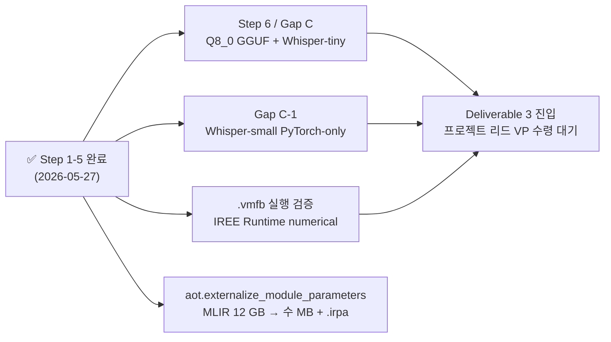

# Development Status — Torch-MLIR Model Zoo for target NPU Compiler Stack

> 
> 본 문서는 PDF 의 **
> Last updated: **2026-05-27** (commit `0d62acc`, branch `torch-mlir-zoo`)

---

## 1. 

PDF 의 target NPU compiler stack 다이어그램 중 **최상단 3 박스가 frontend layer으로 묶여 있음**:

```
┌──────────────────────────────────────────────────┐  ━━━ 
│  ┌──────────────────────────────────────────┐    │
│  │  PyTorch Model Zoo            (빨강 박스) │    │ ← To Implement
│  └──────────────────────────────────────────┘    │
│  ┌────────────┐                                  │
│  │ Torch-MLIR │                  (파랑 박스)     │ ← To Modify
│  └────────────┘                                  │
│  ┌──────────────────────────────────────────┐    │
│  │  Torch-MLIR Compiler          (파랑 박스) │    │ ← To Modify
│  └──────────────────────────────────────────┘    │
└──────────────────────────────────────────────────┘
       ↓
┌──────────────────────────────────────────────────┐  점선 밖 (프로젝트 리드 / 외부)
│  IREE Compiler / Runtime / HAL Driver / VM        │
│  ────────────────────────────────────────────     │
│  target NPU Library / Runtime / Driver / HW           │
└──────────────────────────────────────────────────┘
```

→ **본 repo (`torch-mlir-zoo` 브랜치) 가 

---

## 2. 6-step roadmap ↔ 본 repo 산출물 1:1 매핑

| Step | PDF 내용 (요약) | 본 repo 의 산출물 | 상태 |
|:---:|---|---|:---:|
| **1** | **Follow-ups** — Torch-MLIR / IREE / AMD-SHARK-AI / HF Transformers framework 이해 | [`docs/SHARK_AI_ANALYSIS.md`](docs/SHARK_AI_ANALYSIS.md), [`README.md`](README.md), [`docs/ARCHITECTURE.md`](docs/ARCHITECTURE.md) | ✅ |
| **2** | **문제 상황 인식** — Torch-MLIR 은 PyTorch 만 받음, HF transformers 는 PyTorch only 가 아님 → 자체 PyTorch-only LLM 모델링 필요 | (내부 문서) §1-2, (내부 문서) §"AMD-SHARK-AI" | ✅ |
| **3** | **AMD-SHARK-AI 분석** — `nod-ai/amd-shark-ai/amdsharktank` 가 Torch-MLIR lowering 성공 사례, On-Device 포팅 시 PagedAttention 제거 등 분석 | (내부 문서), [`docs/SHARK_AI_ANALYSIS.md`](docs/SHARK_AI_ANALYSIS.md) | ✅ |
| **4** | **PyTorch 기반 LLM 부분 모델링** — Attention / RMSNorm / MLP / Top-K 단위 op 구현 + Torch-MLIR 적용 | [`src/torch_mlir_zoo/ops/attention.py`](src/torch_mlir_zoo/ops/attention.py), [`rmsnorm.py`](src/torch_mlir_zoo/ops/rmsnorm.py), [`mlp.py`](src/torch_mlir_zoo/ops/mlp.py), [`topk.py`](src/torch_mlir_zoo/ops/topk.py) + [`tests/test_zoo_ops.py`](tests/test_zoo_ops.py), [`tests/test_iree_turbine_export.py`](tests/test_iree_turbine_export.py) | ✅ |
| **5** | **PyTorch 기반 LLM E2E 모델링** — `meta-llama/Llama-3.2-1B-Instruct` 를 PyTorch 로 작성, MLIR 결과 IR dumping 분석 | [`src/torch_mlir_zoo/models/llama_on_device.py`](src/torch_mlir_zoo/models/llama_on_device.py) (171 LoC) + [`scripts/run_llama_export.py`](scripts/run_llama_export.py) + [`configs/zoo/llama_on_device_iree_turbine.yaml`](configs/zoo/llama_on_device_iree_turbine.yaml) + `.vmfb` 6.0 GB · (내부 문서) | ✅ |
| **6** | **Torch-MLIR Model Zoo 확장** — Llama-3.2-1B INT8 Quantized (`unsloth/.../Q8_0` GGUF), Whisper-tiny-INT8 (`rhasspy/faster-whisper-tiny-int8`) | (없음) | ✗ |

**진행률**: **5 / 6 step ✅** (83 %).
남은 Step 6 의 양자화는 메모리 가드 *"양자화는 MLIR lowering 후 마지막"* 원칙으로 의도적 보류 → 본 turn 의 budget 위반 (peak RAM 12.3 GB ≫ 2 GB) 가 *측정 기반 정당화 근거* 로 확보됨.

---

## 3. Deliverable 매핑 (별도 축 — PDF 와 직교)

PDF 의 6 step 이 *"PyTorch → MLIR → vmfb"* 의 *세로 축* 이라면, 설계 검토 §2-§4 의 Deliverable 1/2/3 는 *가로 축* (application 통합):

| Deliverable | 정의 | Branch | 상태 |
|:---:|---|---|:---:|
| **1** | Naive Application Code (Python + PyTorch) on GPU Server — STT → LLM → TTS 한 turn | [`voice-app`](https://github.com/bhseo98/ssl-npu-harness-framework/tree/voice-app) | ✅ ((내부 문서)) |
| **2** | PyTorch Model to MLIR FRAMEWORK for target application — LLM/STT/TTS 의 *세 모델 모두* lowering | [`torch-mlir-zoo`](https://github.com/bhseo98/ssl-npu-harness-framework/tree/torch-mlir-zoo) | ⚠ 부분 |
| **3** | CPU-based Target Application on SoC Model (Virtual Platform) — 외부 (compiler stack) 제공 VP 위에서 STT+LLM+TTS CPU only 동작 | 미정 (다음 phase) | ✗ |

### Deliverable 2 의 세부 부합도 (target application = voice)

| 모달리티 | application 모델 (voice-app default) | 본 repo lowering 진행 | 부합 |
|---|---|---|:---:|
| LLM | `Qwen/Qwen2.5-0.5B-Instruct` ⚠ vs lowering 대상 `Llama-3.2-1B` | ✅ Llama Step 5 완료. Qwen lowering 별도 추가 가능 ((내부 문서) Q1) | ⚠ |
| STT | `faster-whisper small` | ✗ — Whisper PyTorch-only 재구현 미진 (Gap C-1) | ✗ |
| TTS | `espnet_kss` (JETS) | ✗ — TTS lowering 후보 ((내부 문서) Q2) 미정 | ✗ |

→ Deliverable 2 의 "for target application" 측면 = **1 / 3** (LLM 만, 그것도 다른 모델).

---

## 4. 

### 4.1 PyTorch Model Zoo (빨강 박스 · To Implement)

| 항목 | 내용 |
|---|---|
| **책임** | PyTorch nn.Module 로 LLM (그리고 후속 STT/TTS) 모델을 작성, Torch-MLIR 의 입력으로 사용 가능한 형태로 유지 |
| **본 turn 완료** | [`LlamaOnDevice`](src/torch_mlir_zoo/models/llama_on_device.py) (171 LoC) — RMSNorm + GQA + SwiGLU + RoPE, KV cache 미포함, real HF gated weights 로딩 (`load_hf_weights`) |
| **검증** | `server_side_op_hits = {}` (paged_attention, kv_cache, vllm 종속 0) · `has_dynamic_dim = false` (정적 shape) |
| **미진** | Llama-3.2-1B Q8_0 GGUF · Whisper-tiny PyTorch-only · TTS 후보 |

### 4.2 Torch-MLIR (파랑 박스 · To Modify)

| 항목 | 내용 |
|---|---|
| **책임** | PyTorch FX graph → top-level torch dialect MLIR 트레이싱 (frontend) |
| **본 turn 완료** | `iree.turbine.aot.export` 통한 우회 path — `FxProgramsBuilder` + `@export_program` + `aot.export` (AMD-SHARK-AI 의 export pipeline 만 사용, transformer 정의 차용 X) |
| **alt path** | `torch_mlir.compile(model, args, output_type=TORCH)` direct path (`exporters/torch_mlir_export.py`) — 별도 backend 로 공존 |
| **검증** | TINY Llama (2-layer) 810 lines · real Llama (16-layer) 6 218 lines · 정합 1:1 (RMSNorm 33, bmm 32, softmax 16, silu 16) |

### 4.3 Torch-MLIR Compiler (파랑 박스 · To Modify)

| 항목 | 내용 |
|---|---|
| **책임** | torch dialect MLIR → linalg / arith / ... → IREE 가 받아들일 수 있는 form |
| **본 turn 완료** | `iree-compile --iree-hal-target-backends=llvm-cpu` 가 torch dialect 를 받아 lowering 후 `.vmfb` 생성. 첫 fail pass 0건, 36.86 s, exit 0 |
| **남은 작업** | `--iree-llvmcpu-target-cpu=host` 명시로 generic CPU warning 해소 · 향후 target NPU target backend 가 외부 (compiler stack) 측에서 정의되면 swap |

---

## 5. 점선 밖 (외부 stack / IREE / OS / HW — 본 repo 책임 외)

| Layer | 박스 | 본 repo 진입점 | 상태 |
|---|---|---|:---:|
| IREE Compiler | `compiler/api.h` | `iree-compile` (3.11.0rc20260316) 호출 | — |
| IREE Runtime | `runtime/api.h` | `.vmfb` 가 입력 | 다음 turn (실행 검증) |
| IREE HAL Driver | `hal/drivers/halapi.h` | `llvm-cpu` HAL backend 사용 중 | — |
| IREE VM | `vm/api.h` | `.vmfb` 의 VM bytecode 영역 | — |
| target NPU Library | (To Implement) | 외부 (compiler stack) 측 | — |
| target NPU Runtime | (To Implement) | 외부 (compiler stack) 측 | — |
| Standard C Library / Linux Syscall | (기존) | — | — |
| target NPU Driver | (To Implement) | 외부 (compiler stack) 측 | — |
| target NPU HW | (To Implement) | 외부 (compiler stack) 측 | — |

→ 본 repo 의 산출물 `.vmfb` 가 점선 밖 IREE Runtime/HAL 까지는 *형식적* 호환 (CPU target). 실제 target NPU HW 까지의 통합은 외부 (compiler stack) 의 VP / driver / SoC 모델 수령 후 ((내부 문서), Deliverable 3 phase).

---

## 6. 다음 마일스톤 — 우선순위



| 우선순위 | 작업 | 근거 | 예상 turn 수 |
|:---:|---|---|:---:|
| **High** | **Step 6 (a) — Q8_0 GGUF** (`unsloth/Llama-3.2-1B-Instruct-GGUF`) lowering | 본 turn budget 위반 12.3 GB ≫ 2 GB 정량 정당화 | 1-2 |
| **High** | **Step 6 (b) — Whisper-tiny-INT8** (`rhasspy/faster-whisper-tiny-int8`) lowering | Step 6 명시 + Deliverable 2 의 STT 부합도 0 → 1 | 2-3 |
| **High** | **Gap C-1 — Whisper-small PyTorch-only 재구현** | voice-app default STT 와 정합. Step 6 (b) 와 한 묶음 가능 | 2-3 |
| **Medium** | `.vmfb` runtime 실행 + PyTorch eager numerical 비교 | 설계 §3 *"유의미한 결과"* 의 다음 깊이 (실제로 *돌아간다* 입증) | 1 |
| **Medium** | `aot.externalize_module_parameters` → weights `.irpa` 분리 + MLIR 슬림화 | MLIR 12 GB → 수 MB (git 관리 가능 크기). 협업 향상 | 1 |
| **Medium** | Qwen-0.5B lowering 추가 (`open-questions.md` Q1 결정 후) | Deliverable 2 의 "target application" 정합 — voice-app default LLM 과 동일 모델 | 1 |
| **Low** | `--iree-llvmcpu-target-cpu=host` 재컴파일 + 성능 비교 | iree-compile generic CPU warning 해소 | 0.5 |
| **Low** | TTS lowering (Gap C-2) | `open-questions.md` Q2 설계 검토 답변 후 | 2-3 |
| **Blocked** | **Deliverable 3 (VP 진입)** | 프로젝트 리드 VP / driver / SoC 모델 수령 대기 ((내부 문서)) | — |

---

## 7. 검증 — 본 status 가 사실임을 확인하는 명령

```bash
# Step 1-3 (문서)
ls docs/SHARK_AI_ANALYSIS.md docs/ARCHITECTURE.md
ls (내부 문서) (내부 문서) (내부 문서)

# Step 4 (단위 op)
ls src/torch_mlir_zoo/ops/{attention,rmsnorm,mlp,topk}.py
/home/bohyun/venv-shark/bin/pytest tests/test_zoo_ops.py tests/test_iree_turbine_export.py -v

# Step 5 (Llama E2E)
ls src/torch_mlir_zoo/models/llama_on_device.py
ls artifacts/llama-3.2-1b-on-device-iree-turbine.{mlir,vmfb,summary.json}   # .gitignore 로 untracked
cat artifacts/llama-3.2-1b-on-device-iree-turbine.summary.json | jq .server_side_op_hits  # → {}
/home/bohyun/venv-shark/bin/iree-compile --version | head -3                # 3.11.0rc...

# Step 6 (미진 확인)
grep -r "unsloth" src/ scripts/ configs/   # 검색 결과 0이어야 정상 (아직 진행 안 함)
grep -r "faster-whisper-tiny" src/ scripts/ configs/   # 0이어야 정상

# Framework core invariant (Design D4)
git diff main HEAD -- src/npu_harness_framework/   # empty
```

---

## 8. 진행 요약 한 줄

> **PDF 의 
