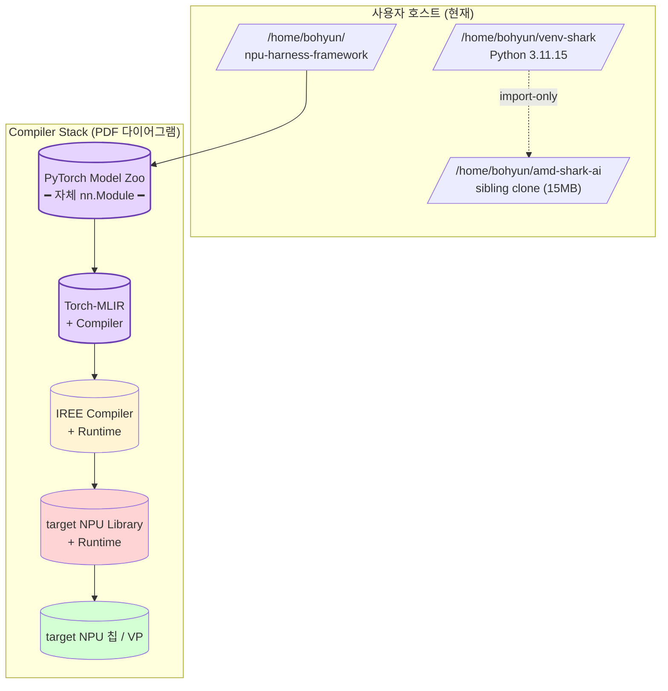
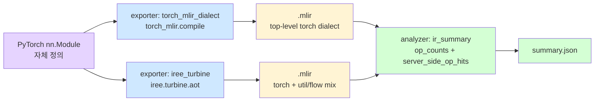
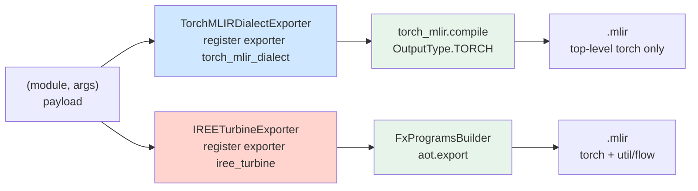
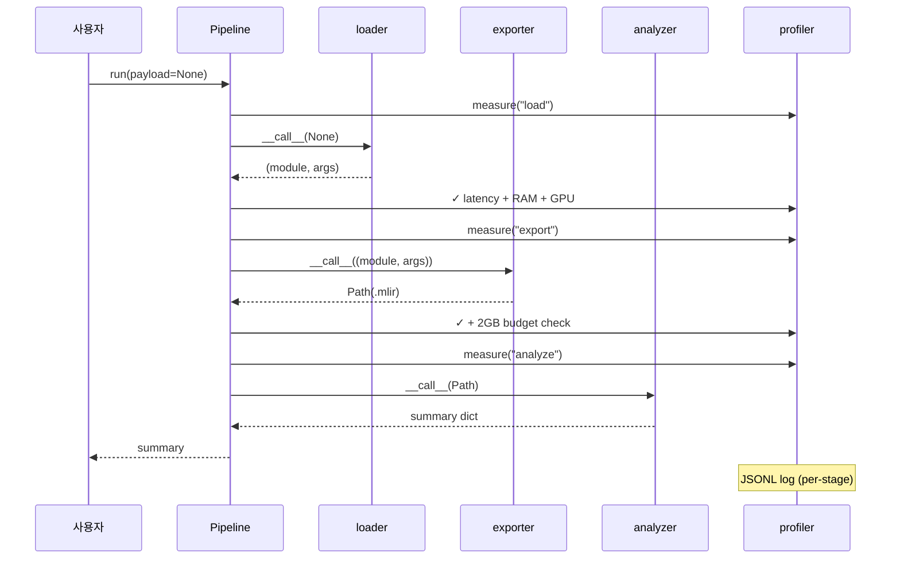
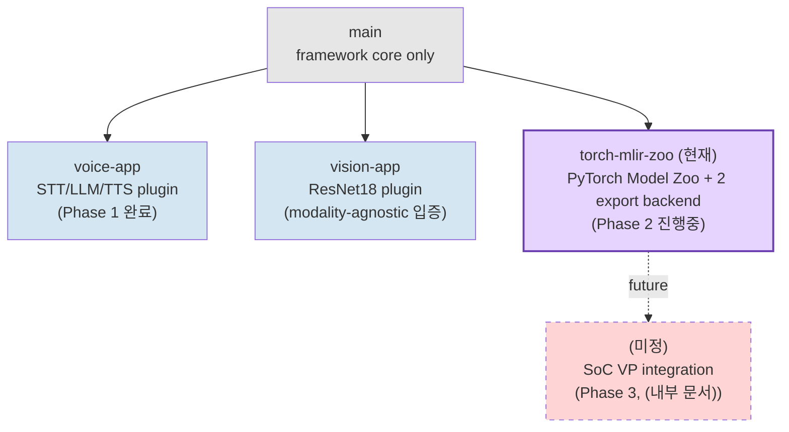

# Architecture — NPU Harness Framework (`torch-mlir-zoo`)

> 본 문서는 외부 NPU compiler 측 ((내부 문서)) +
> PDF `internal-design-spec` + 사용자(서보현) 의 2026-05-26 지시를
> 함께 만족하는 본 repo (`torch-mlir-zoo` branch) 의 **설계 의도** 를
> 정리한다. 코드에서 자동 도출되는 정보 (모듈 트리, 함수 시그니처) 는
> 최소로, **왜 이렇게 설계했는가** 와 **어떤 trade-off 를 받아들였는가**
> 를 우선한다.
>
> 다이어그램은 Mermaid (GitHub web / mermaid-capable 뷰어 지원).
> (내부 문서) 9 spec + (내부 문서) 가 단계별 deliverable 의
> source-of-truth. 본 문서는 그 위의 *통합 architectural view*.

---

## 1. Overview — 본 repo 의 한 줄 정의

> 설계 §1: *"지능을 갖고 대화를 할 수 있는 작은 엣지에서 임베디드 시스템"* 을
> 목표로 한, **3 가지 deliverable 을 한 application 으로 묶는** modality-agnostic
> framework + PyTorch Model Zoo + MLIR lowering 통합.

### 1.1 3-deliverable 매핑

| # | Deliverable | Branch | 상태 |
|---|---|---|---|
| 1 | Naive Application Code (Python + PyTorch) on GPU Server | `voice-app` | ✅ 완료 ((내부 문서)) |
| 2 | **PyTorch Model → MLIR FRAMEWORK for target application** | **`torch-mlir-zoo` (현재)** | ⚠ 진행중 — Gap G (iree.turbine backend) 완료. real Llama 후속. |
| 3 | CPU-based Target Application on SoC Model (VP) | (미정) | ✗ 미진입 — (내부 문서) spec 만 |

### 1.2 PDF `internal-design-spec` 6 단계 매핑

PDF 의 "최상단 frontend layer" = `PyTorch Model Zoo` + `Torch-MLIR` + `Torch-MLIR Compiler` 세 박스. 본 repo (`torch-mlir-zoo`) 가 이 영역을 채운다.

| Step | 본 repo 매핑 | 상태 |
|---|---|---|
| Step 1 (Follow-ups) | `docs/SHARK_AI_ANALYSIS.md` + 본 문서 | ✅ |
| Step 2 (PyTorch only) | `LlamaOnDevice` + `ops/*` 가 표준 nn.Module 만 | ✅ |
| Step 3 (SHARK-AI 분석) | `docs/SHARK_AI_ANALYSIS.md` §2-4 + (내부 문서) §4.2 | ✅ |
| Step 4 (단위 op) | 4 단위 op (`ops/attention,rmsnorm,mlp,topk`) + 2 backend export | ✅ |
| Step 5 (LLM E2E, Llama-3.2-1B) | TINY `LlamaOnDevice` E2E (자체 + iree.turbine). real Llama HF_TOKEN 필요 | ⚠ 부분 |
| Step 6 (확장: Q8_0, Whisper) | 본 PR scope 외 | ✗ |

---

## 2. System Topology — 전체 배포



**frontend layer** = PDF 의 "최상단" — 본 repo 의 책임 영역.
**노란색 / 빨간색 / 녹색** = 후속 단계 (IREE / target NPU / 칩) — 본 repo scope 외.

---

## 3. Compiler Stack — 본 repo 의 위치



**핵심 결정 (2026-05-26)**: 두 export backend 가 **공존**. 같은 `(module, args)` payload 에 대해 두 가지 MLIR 산출물 + 분석 가능 → 프로젝트 리드 PDF §5 *"MLIR 결과를 IR dumping을 통해 분석"* 충족.

---

## 4. Framework Core Invariant

```
src/npu_harness_framework/
├── interfaces.py    # BaseStage(ABC)   ─ 단일 메서드 __call__
├── registry.py      # @register, build  ─ composition root
├── pipeline.py      # Pipeline           ─ linear chain + per-stage profile
└── profiler.py      # measure            ─ latency + RAM + GPU + 2GB budget
```

### 4.1 4 primitive (변경 금지)

| Symbol | 책임 | Why |
|---|---|---|
| `BaseStage.__call__(payload) -> Any` | stage 추상 단일 메서드 | Ousterhout *Deep modules, narrow interfaces*. `torch.export` 트레이싱 진입점 단순화. |
| `@register(stage_type, name)` | YAML config 의 `type: <name>` 으로 자동 dispatch | Stable Dependencies Principle. **모델 swap 의 단일 진입점**. |
| `Pipeline(stages, log_path, budget_mb)` | linear stage chain + per-stage `measure(...)` 자동 적용 | profiler 가 cross-cutting concern. |
| `measure(stage, log_path, budget_mb)` | latency + RAM(RSS) + GPU peak + 2GB budget 경고 | 설계 §2 의 "2GB 넘지 않는 모델" 을 코드에 박은 enforcement. |

### 4.2 불변량 검증 명령

```bash
git diff main torch-mlir-zoo -- src/npu_harness_framework/    # empty
git diff main vision-app    -- src/npu_harness_framework/    # empty
```

→ 모든 application branch 가 framework core 한 줄도 안 바꾸고 plugin 만 추가. voice-app 만 historical 예외 (이미 Gap B 로 호환, (내부 문서)).

---

## 5. PyTorch Model Zoo — 자체 nn.Module

본 zoo (`src/torch_mlir_zoo/`) 의 *모든 transformer 정의* 는 PyTorch 표준 `nn.Module` + `nn.Parameter` 만 사용 (사용자 2026-05-26 지시: *"amd-shark 의 transformer 는 안 씀"*).

### 5.1 디렉토리

```
src/torch_mlir_zoo/
├── ops/                # 단위 op (Step 4)
│   ├── attention.py    # ScaledDotProductAttention (no paging, no KV cache)
│   ├── rmsnorm.py      # RMSNorm (dtype-stable rsqrt)
│   ├── mlp.py          # SwiGLU (gated FFN)
│   └── topk.py         # TopK (forward-only, no autoregressive loop)
├── models/             # E2E (Step 5)
│   └── llama_on_device.py  # LlamaOnDevice + LlamaConfig + load_hf_weights
├── exporters/          # 2 backend (sibling modules)
│   ├── torch_mlir_export.py    # torch_mlir.compile(..., OutputType.TORCH)
│   └── iree_turbine_export.py  # iree.turbine.aot.FxProgramsBuilder + aot.export
├── analysis/           # IR summary
│   └── ir_summary.py   # op_counts + server_side_op_hits metric
└── stages.py           # @register("loader/exporter/analyzer/tokenizer/model", ...)
```

### 5.2 amdsharktank 와의 분리 (사용자 지시 충족)

| 영역 | amdsharktank | 본 zoo |
|---|---|---|
| **transformer 정의** | `layers/paged_attention.py`, `models/llm/llm.py::PagedLlmModelV1`, `ThetaLayer`, `Theta/Dataset` | **import 0** — 자체 `ops/*` + `LlamaOnDevice` 으로 대체 |
| **export pipeline** | `iree.turbine.aot` 내부 사용 | **사용** — sibling helper `exporters/iree_turbine_export.py` |

→ PDF §4 *"AMD-SHARK-AI에서 미리 만든 것이 있다면 이를 사용해도 됨"* 와 사용자 지시 *"transformer 는 안 씀"* 의 교집합 = **export pipeline 만 격리 사용**.

### 5.3 의도적 absent (`LlamaOnDevice` vs `PagedLlmModelV1`)

| 항목 | 자체 | amdsharktank |
|---|---|---|
| KV cache | 없음 (forward only) | `PagedKVCache` |
| prefill / decode split | 단일 forward | 2 func (`prefill_bs4` + `decode_bs4`) |
| sampling | 없음 (logits raw) | `ServicePagedLlmModelV1.prefill()` 내부 |
| RoPE | precomputed cos/sin buffer + standard ops | `rope_select_concat_*` custom util.func |
| DeviceAffinity | 없음 (single NPU) | `iree.turbine.aot.DeviceAffinity` |
| dtype 안정 | RMSNorm 내부 float32 cast | 동일 |

→ IR 수준 정량 검증: toy 3-block 비교 시 amdsharktank path **4859 lines** vs 자체 path **810 lines** (2-block) + `paged_attention_kv_cache_gather` 7회 출현 vs 0회. (내부 문서) §4-5.

---

## 6. Export Backends — 두 path 공존

### 6.1 sibling 구조 (additive)



### 6.2 swap matrix (config 한 줄)

```yaml
# 기존 path
- name: export
  stage: exporter
  config: { type: torch_mlir_dialect, out_path: artifacts/zoo/<op>.mlir }

# 새 path (additive)
- name: export
  stage: exporter
  config: { type: iree_turbine, out_path: artifacts/zoo-iree/<op>.mlir }
```

→ application 코드 / Pipeline / analyzer / test 변경 0. **모델 swap 의 원칙이 export backend swap 에도 그대로 적용** (설계 §3 의 *"모델을 갈아 끼우면서 테스트"*).

### 6.3 backend 별 IR 특성

| 항목 | `torch_mlir_dialect` | `iree_turbine` |
|---|---|---|
| Dialect | top-level torch only (`torch.aten.*`) | torch + `util.global` + `torch_c.from_builtin_tensor` + `func.func` mix |
| Weight | `torch.aten.linear` 인자 | `util.global.load @__auto.<name>` |
| File size (attention, FP32) | 작음 (weights 미내장) | 큼 (inline `dense_resource`) |
| Server-side op hits | 0 (자체 ops) | 0 (자체 ops) |
| 다음 단계 friendly | target NPU compiler 직접 | IREE compile → vmfb 직접 |

---

## 7. Pipeline Pattern — 4-stage application



각 stage 가 자체 `__call__(payload)` 하나만 책임. `Pipeline.run()` 이 chain 을 돌리고 profiler 가 cross-cutting concern 자동 부착. 같은 패턴이 4 단위 op + LlamaOnDevice E2E + 향후 Whisper 까지 일관.

---

## 8. Branch Topology



세 application branch 모두 framework core 한 줄도 안 바꿈 (`git diff main <branch> -- src/npu_harness_framework/` empty). voice-app 의 Gap B 가 마지막 historical 예외를 해소했음 ((내부 문서) 참고).

---

## 9. Quantitative Verification (Gap G 결과)

### 9.1 5 모델 `iree.turbine` 산출 (2026-05-26)

| 모델 | n_lines | server_side_op_hits | 주요 op |
|---|---:|---|---|
| `rmsnorm` (1×32×512) | 31 | `{}` | pow, mean, add, rsqrt, mul |
| `topk` (1×32000) | 10 | `{}` | topk |
| `mlp` (SwiGLU, 1×32×512) | 65 | `{}` | transpose, view, mm, silu, mul |
| `attention` (SDPA+GQA, 1×32×512) | 204 | `{}` | view, transpose, mm, bmm, softmax, where, triu |
| `LlamaOnDevice` (TINY, 2-layer) | 810 | `{}` | embedding, view, transpose, mul, mm, add, expand, clone, bmm, silu |

### 9.2 amdsharktank 모델 path 와의 대비

| 항목 | amdsharktank `PagedLlmModelV1` (toy 3-block) | 자체 `LlamaOnDevice` (TINY 2-block) |
|---|---|---|
| MLIR lines | **4859** | **810** |
| `paged_attention_kv_cache_gather` | **7회 출현** | **0회** |
| `rope_select_concat_*` | 출현 | 0회 (standard `torch.aten.*` 분해) |
| Entry func | `prefill_bs4` + `decode_bs4` 2개 | `forward` 1개 |

→ **on-device 친화성의 정량 입증**. 프로젝트 리드 PDF §3 의 *"server-side LLM → on-device porting"* 가설이 IR 수준 검증.

### 9.3 test 결과

```
pytest tests/test_iree_turbine_export.py -v   →  6 passed
pytest tests/                                 →  21 passed, 3 skipped (torch_mlir 미설치 자동 skip)
```

framework core 변경 0, 기존 path regression 0.

---

## 10. 설계 검토 §1-§5 매핑

| 미팅 § | 핵심 인용 | 본 repo 위치 |
|---|---|---|
| §1 시스템 목적 | *"지능을 갖고 대화 ... 임베디드 시스템"* | (내부 문서) + voice-app demo |
| §2 1번 (Application) | *"PyTorch ... GPU 서버 ... 2GB ... advanced 자제"* | `voice-app` Phase 1 완료 |
| §3 2번 (MLIR Framework) | *"이미 파이토치 모델 ... 컴파일러까지 ... MLIR로 뽑아내는 프레임워크"* + *"빨리 되는 형태"* + *"모델 갈아끼우기"* | **본 branch (`torch-mlir-zoo`) 의 §5-7** |
| §4 3번 (VP / llama.cpp + STT/TTS) | *"CPU만 ... llama.cpp ... stt랑 tts까지"* | (내부 문서) (미진입) |
| §5 사용자 역할 | *"상위 레벨 ... 모든 작업이 하나로 묶여서 스무스하게"* | 3 branch 동일 `BaseStage` + `Pipeline` 패턴 |

---

## 11. 의도적 confine (Anti-features)

| 빈자리 | Why |
|---|---|
| Batch 입력 | 음성 1턴이 자연 단위. 의미 약함. |
| Streaming | 별도 ABC (`BaseStreamingSTT`) 도입 시점에 추가. |
| async/await | embedded 단일 스레드 우선. |
| KV cache (자체 LlamaOnDevice) | forward-only trace 단순화. dynamic shape 회피. |
| sampling control flow | `torch.export` 트레이싱과 충돌. logits raw 반환. |
| INT8/INT4 직접 quantization | 설계 §2 *"advanced 기법 자제"*. Step 6 의 Q8_0 GGUF 는 budget fit 목적 예외. |
| HF Transformers transformer 클래스 | PDF §2 *"PyTorch만 사용"*. tokenizer 만 import. |
| amdsharktank transformer layer | 사용자 2026-05-26 *"transformer 안 씀"*. |
| Latest SOTA LLM (Llama-70B, Mixtral 등) | 2GB DRAM budget 위반. |

이 confine 들은 **모두 의도된** 빈자리. 추후 해제 시 새 ABC / config option / 별도 branch 로 진입.

---

## 12. Next Milestones

| 항목 | 우선순위 | PDF 매핑 | 의존성 |
|---|---|---|---|
| real Llama-3.2-1B HF download + `LlamaOnDevice.load_hf_weights` + iree.turbine E2E | High | Step 5 | HF_TOKEN 필요 |
| `dense_resource` inline → `flow.parameter.named` external (artifact size 절감) | Medium | Step 5 후속 | 위 완료 후 |
| Q8_0 GGUF (`unsloth/Llama-3.2-1B-Instruct-GGUF`) 와 자체 path 비교 | Medium | Step 6 | — |
| Whisper-tiny 자체 PyTorch 구현 (`models/whisper_on_device.py`) + 2 backend export | Medium | Step 6 + Gap C-1 | Q1/Q2 설계 검토 답변 |
| `iree-compile` → `.vmfb` + IREE runtime 실행 검증 | Medium | PDF IREE 박스 | — |
| TTS lowering 후보 결정 (Piper / VITS-lite / ESPnet 유지) | Low | — | (내부 문서) Q2 |
| SoC VP 통합 ((내부 문서)) | Future | Phase 3 | 프로젝트 리드 VP 모델 + Q3 답변 |
| target NPU 전용 dialect / RISC-V 컴파일러 통합 | Future | — | 프로젝트 리드 compiler stack |

---

## 13. 핵심 참고 문서

- (내부 문서) — 설계 노트 원문 (source-of-truth)
- `(내부 문서){mission,constraints,deliverables,framework,design,model-zoo,roadmap,open-questions,vp}.md` — 9 sub-agent spec
- `docs/SHARK_AI_ANALYSIS.md` — AMD-SHARK-AI 의 server-side LLM 분석 + 본 zoo 의 매핑 + 2026-05-26 setup 절차
- (내부 문서) — Phase 2 1차 milestone (자체 path)
- (내부 문서) — Gap G (iree.turbine backend) 정량 비교 보고
- `internal-design-spec` — 프로젝트 리드 PDF (6 단계 spec)

---

## 14. 정리

본 repo (`torch-mlir-zoo`) 는 프로젝트 리드 PDF 의 "최상단 frontend layer" (`PyTorch Model
Zoo` + `Torch-MLIR Compiler`) 영역을 채운다. 자체 PyTorch nn.Module 으로
transformer 를 정의 (사용자 *"transformer 는 안 씀"* 충족), 두 export backend
(`torch_mlir.compile` + `iree.turbine.aot`) 가 공존하여 같은 모델을 두 dialect
형태로 dump 가능 (프로젝트 리드 *"MLIR 결과 IR dumping 분석"* 충족), 모든 작업이
framework core (`BaseStage` / `Pipeline` / `register` / `profiler`) 변경 없이
plug-in 으로만 추가됨 (프로젝트 리드 *"한번 만들어놓고 모델만 갈아끼우기"* 충족).

다음 단계는 real Llama-3.2-1B (HF_TOKEN) 로의 확장과 IREE compile → vmfb 검증.
Phase 3 (VP) 진입 조건은 프로젝트 리드 VP 모델 + Q1-Q5 답변 수령 후.
