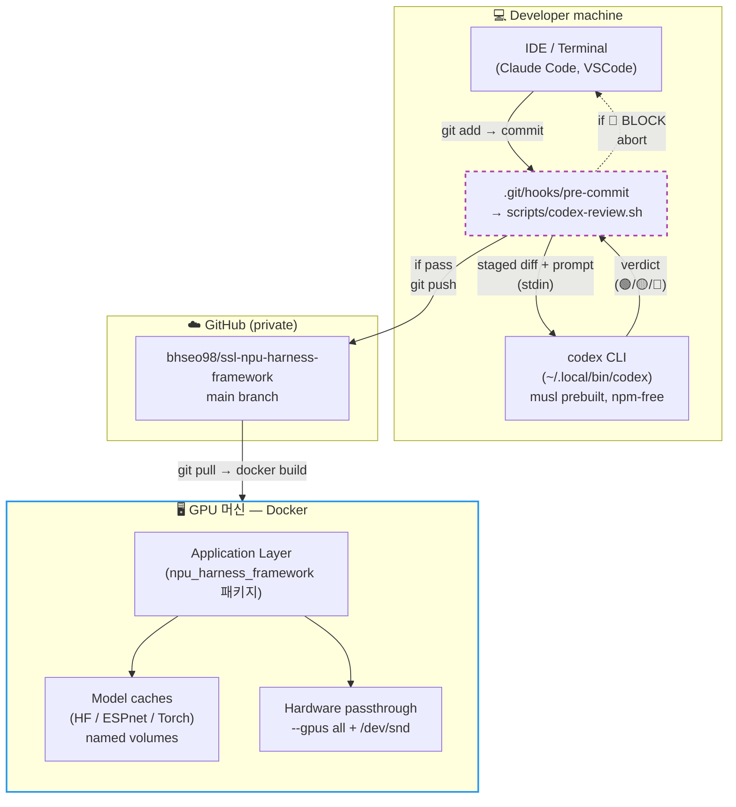
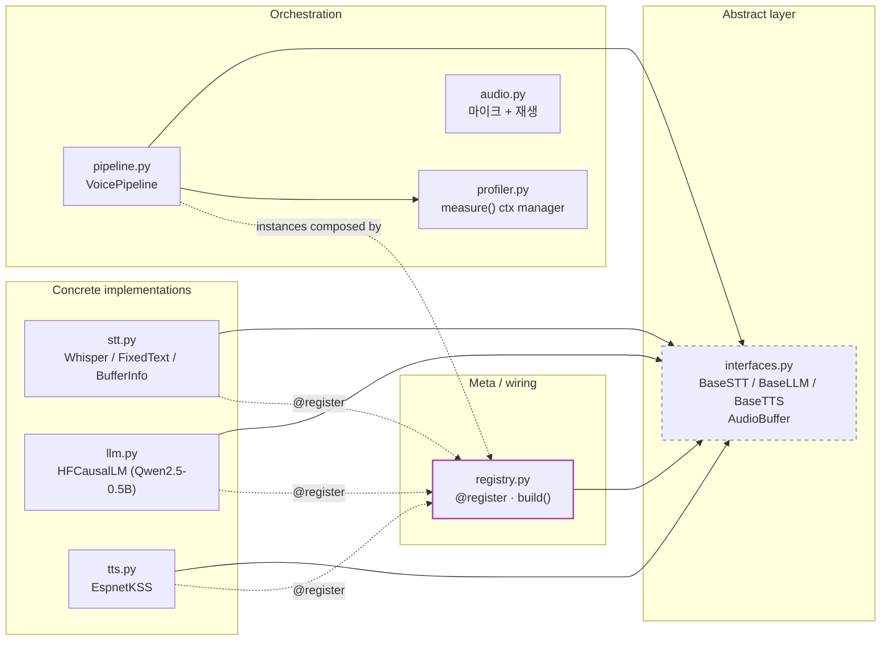
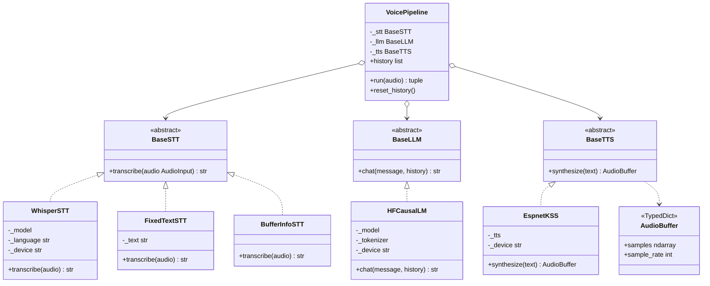
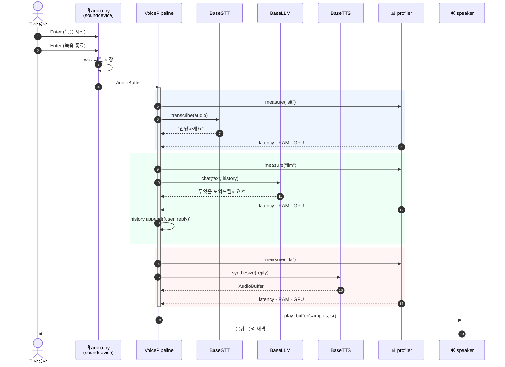
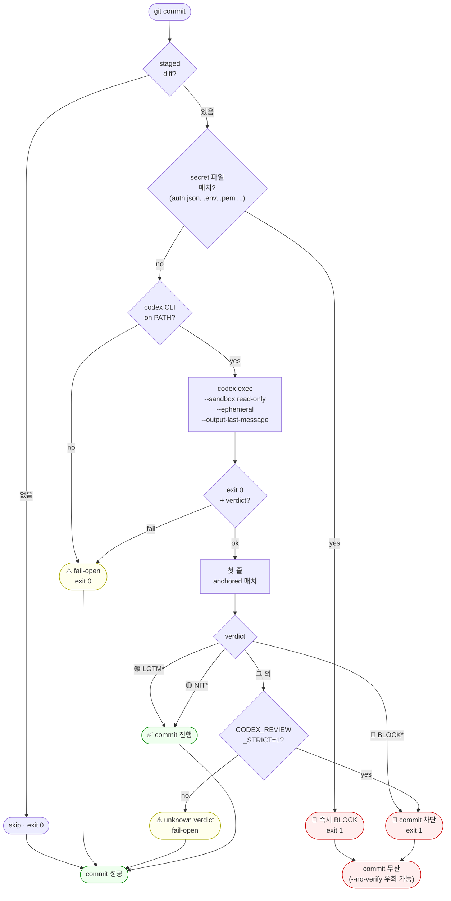
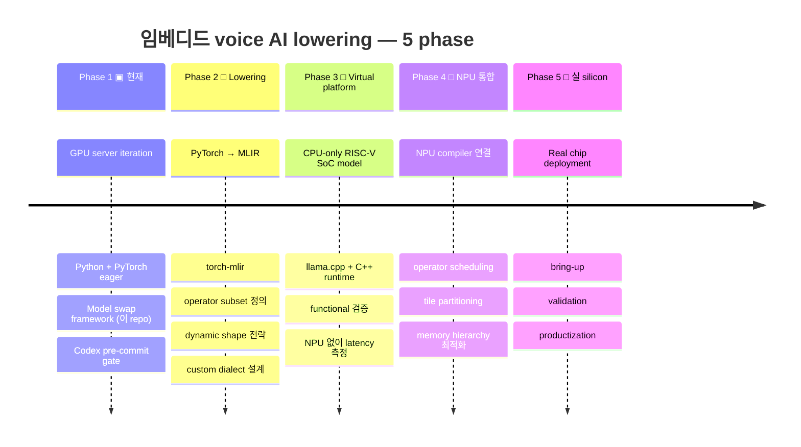
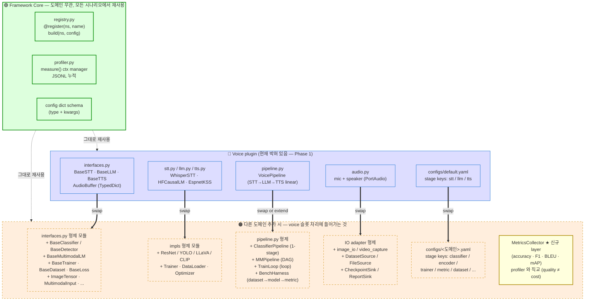
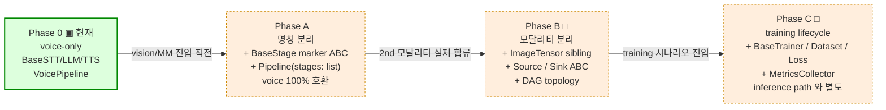

# Architecture — Project #1 (NPU Harness Framework Code Framework)

> 본 문서는 임베디드 voice AI를 향한 evaluation harness의 **설계 의도** 를
> 풀스택 SWE 관점에서 정리한다. 코드 자체에서 자동 도출되는 정보
> (모듈 트리, 함수 시그니처) 는 최소로 줄이고, **왜 이렇게 설계했는가**
> 와 **어떤 trade-off 를 의식적으로 받아들였는가** 를 우선한다.
>
> 다이어그램은 모두 [Mermaid](https://mermaid.js.org/) 로 작성되어 있어
> GitHub web 또는 mermaid 지원 IDE/뷰어에서 직접 렌더링된다.

> **⚠ branch 안내 (`vision-app`)** — 이 branch 는 framework core 위의 *second
> application* 예시 (§10.2 Vision-classification row 의 실제 구현). main 의
> `BaseStage` · `Pipeline` · `registry` · `profiler` 를 한 줄도 안 고치고 그대로
> 사용하며, plugin 은 `src/vision_app/stages.py` 의 4개 `BaseStage` 자식
> (LoadImage / PreprocessImagenet / ResNet18Classifier / TopK). **새 ABC 0개,
> framework primitive 0개** — 정확히 §10 의 "Phase A 일반화 + voice 슬롯이 다른
> 도메인 형제 모듈로 치환" 구도를 코드로 입증한다.
>
> 자매 branch: [`main`](https://github.com/bhseo98/ssl-npu-harness-framework/tree/main)
> (framework core only) · [`voice-app`](https://github.com/bhseo98/ssl-npu-harness-framework/tree/voice-app)
> (first application — STT/LLM/TTS).

---

## 1. System Context — 전체 배포 토폴로지

개발 머신에서 코드가 작성되고, pre-commit gate를 통과한 commit만이
GitHub `bhseo98/ssl-npu-harness-framework` 로 push 된다. 실행은 별도 GPU 머신에서
Docker 컨테이너로 일어나며, 모델 가중치는 named volume 캐시에 적재돼
재실행 시 재사용된다.



**핵심 의도**
- 개발 머신과 실행 머신이 **물리적으로 분리** 될 수 있다 (실제로 RTX Pro 6000은 보통 다른 서버에 있음). 그래서 Docker 컨테이너가 reproducibility 의 한 단위로 기능한다.
- Pre-commit gate는 **로컬에서 발화** — 서버 사이드 CI가 아닌 이유는 (a) 즉시 피드백 + (b) GitHub Actions 무료 runner에 GPU 없음 + (c) 사용자가 npm 회피 요구라 typical CI 패키지 다수 사용 어려움.
- 모델 캐시는 **컨테이너 외부 named volume** — 이미지 슬림, 첫 실행 후 오프라인 가능.

---

## 2. Module Decomposition — 정적 구조와 의존성 방향

`src/npu_harness_framework/` 내부는 **추상(interfaces) ← 구체(impls) ← 조율(pipeline)** 순으로
의존성이 한 방향만 흐르도록 짜여 있다. 의존성 화살표가 모두 같은 방향
(추상 쪽) 으로 향하는 것이 핵심 — *Stable Dependencies Principle*.



**왜 이렇게 잘랐는가**
- `pipeline.py` 는 구체 클래스 (`WhisperSTT`, `HFCausalLM` ...) 를 **모른다**.
  오직 `BaseSTT / BaseLLM / BaseTTS` 만 안다. → 모델 교체가 pipeline 코드를
  안 건드린다.
- `registry.py` 는 *composition root* 의 역할만 한다. "어떤 구현체를 쓸 것인가" 라는
  결정 한 곳에 격리.
- `profiler.py` 는 *cross-cutting concern* — 어떤 stage든 동일한 context manager로
  계측. profiler 자체는 stage가 무엇인지 모름.
- `audio.py` 는 외부 세계 (마이크 / 스피커) 와의 단일 adapter. PortAudio
  바인딩 노출 지점이 여기 한 곳뿐이라 추후 IO 백엔드 교체 (예: PulseAudio,
  ALSA direct) 시 영향 범위가 좁다.

> 이 분리 방식은 Ousterhout (*A Philosophy of Software Design*) 의 **"deep
> modules, narrow interfaces"** 와 같은 결을 따른다 — 추상은 좁게 (한 abstract
> method), 구현체는 충분히 깊게 (모델 로딩 · 디바이스 관리 · 토크나이저 캐시 등)
> 둔다. Phase 2 lowering 시 좁은 추상이 진입점 trace 단순화에 그대로 재활용된다.

---

## 3. Contract — 추상 계약과 그 구현체들

ABC 3개는 **단 하나의 메서드** 만 강제한다. 추가하기 좋은 자리 (batch
처리, streaming, async) 는 의도적으로 비워 놓았다.



**계약이 보장하는 것**
- 메서드는 **순수 함수에 가깝다** — side-effect는 logging만, 입력에 대해 결정적.
- **stateless** — 대화 history 는 *caller* (즉 `VoicePipeline`) 가 보관한다.
  모델 객체 자체는 보관하지 않는다 → thread-safe, 다중 인스턴스 가능.
- **type-explicit** — `AudioBuffer` 가 `TypedDict` 라 IDE 자동완성 + mypy
  검사가 가능하고, **추후 PyTorch → MLIR 트레이싱 시 tensor shape 명세가
  코드에 박혀 있다** (자유 변수가 적어 lowering 친화적).

**계약이 명시적으로 빠뜨린 것** (의도된 confine)
- batch 입력 — 음성 1턴이 자연 단위라 batch 의미 약함
- 스트리밍 — STT/TTS 모두 full-buffer 인터페이스. streaming은 별도 ABC
  (`BaseStreamingSTT`) 도입 시점에 추가 예정
- async/await — 임베디드 단일 스레드 우선, 추후 필요 시 별도 계약
- error 타입 — 일단 `Exception` 그대로 throw. 정상 path만 명세.
  Ousterhout 의 *define errors out of existence* 관점에서 보면 적극적 elimination
  이 부족하지만, **embedded 단일 사용자 동기 흐름에서는 부분 실패 복구의 의미가
  약하다** (마이크가 빈 wav 를 주면 그 turn 전체가 무효). 현 시점에서는 "throw +
  호출자가 turn 폐기" 가 가장 단순한 elimination 이라 판단했고, streaming 도입
  시 부분 실패가 의미를 갖게 되면 ABC-수준 error 계약을 재검토한다.

---

## 4. Runtime — 한 turn 의 데이터 흐름

마이크에서 시작해 스피커로 끝나는 단일 turn. 각 stage는 동일한
`profiler.measure(...)` context manager로 감싸져 있어 latency / RAM / GPU peak가
하나의 JSONL 라인으로 누적된다.



**Latency budget**

| 단계 | 기대 latency (GPU) | RAM Δ | 병목 |
| ---- | ------------------ | ----- | ---- |
| 마이크 캡처 | 0~10s (사용자 의존) | 320KB/s | 사용자 발화 길이 |
| STT (whisper-tiny) | 0.3 ~ 1.5s | ~80 MB GPU | 음성 길이 + model size |
| LLM (Qwen-0.5B) | 1 ~ 3s | ~1 GB GPU | `max_new_tokens` + kv-cache |
| TTS (FS2) | 0.5 ~ 1.5s | ~150 MB GPU | 출력 텍스트 길이 |
| 재생 | wav 길이 | - | - |
| **합계** | **~3~6s** | **~1.3 GB** | **end-to-end 목표 < 5s** |

`profiler.measure()` 가 budget (`pipeline.budget_mb = 2048`) 초과 시 stderr WARN을
띄우므로 CI/log 수집 단에서 grep으로 회귀를 자동 감지할 수 있다.

**상태 관리 요약**

| 수명 | 데이터 |
| ---- | ------ |
| 영구 (process 종료 후에도) | HF / ESPnet 캐시, recordings, profiler JSONL, `.codex-reviews/*.md` |
| Process 생명주기 | 모델 가중치 (`nn.Module` 인스턴스, GPU/CPU에 적재) |
| Turn 생명주기 | `AudioBuffer`, transcript, LLM history (in-memory) |
| Hot path | torch tensor, kv-cache (forward pass 동안만) |

`DB가 없다` 는 결정이 핵심 — 임베디드 타겟에 SQLite도 부담이고, 추론
자체는 stateless 이기 때문. 대화 history 영속화가 필요해지면
`VoicePipeline.history` 만 별도 어댑터로 빼서 파일/RAM 매트릭스를 입힐 수 있다.

---

## 5. Quality Gate — pre-commit Codex 교차검증

매 `git commit` 마다 staged diff 가 OpenAI Codex 로 흘러간다. Verdict 첫 줄을
엄격하게 anchored 파싱하여 🟢/🟡/🔴 만 인정, 그 외는 fail-open 처리한다.



**철학**
- **fail-open as default** — codex 가 없거나, 인증 만료거나, 네트워크가 죽었을 때
  commit 을 막지 않는다. 오프라인 개발자의 흐름을 끊지 않기 위함. 엄격
  모드(`CODEX_REVIEW_STRICT=1`)로 뒤집을 수 있다. **Linus 의 "don't break
  userspace"** 와 정신이 같다 — 검증 도구가 사용자(=커밋하려는 개발자)의 흐름을
  깨는 것은 거의 항상 잘못된 trade-off 다. 단, 시크릿 hard-block 만은 예외 —
  반대 방향 실패 (시크릿 유출) 의 비대칭 비용 때문에 정책이 뒤집힌다.
- **hard secret check 는 codex 호출 전** — 시크릿이 staged 됐다면 codex를
  부르기도 전에 즉시 BLOCK. 외부 LLM 에 시크릿이 노출될 위험 자체를 없앤다.
- **anchored 파싱** — `*BLOCK*` 가 아니라 `BLOCK*` 로 시작 위치 고정.
  "this is not BLOCKED" 같은 문장 본문이 verdict로 오인되지 않도록.
- **commit 단위에서 발화** — Claude Code 의 Stop hook 도 후보였지만,
  Stop은 turn 종료마다 발화해서 너무 잦음. commit 은 의미 있는 의도 단위.

**비용 모델**
- 이 검증은 사용자의 **OpenAI/ChatGPT 계정 quota** 로 청구된다 (Codex CLI의
  `~/.codex/auth.json` 기반). Claude / Anthropic 측 비용과는 **완전히 별도**.
- Sandbox 가 `read-only` + `ephemeral` 이므로 도구 실행 비용은 0, 오직 LLM
  응답 토큰만 차감.

---

## 6. Lowering Roadmap — 현재 결정이 미래에 어떻게 이어지는가

> *참고: Phase 1 의 STT/LLM/TTS 추상은 voice application 의 stage 추상이며, Phase 2 는 그보다 한 계층 위 — domain-agnostic compiler framework — 로 올라간다. Voice 는 Phase 1 의 first application 사례. 자세히는 (내부 문서) §5.2 참조.*



**현재 결정이 Phase 2 에 그대로 재활용되는 부분**
- ABC + registry → MLIR backend 등록 패턴 (`@register("backend", "mlir_whisper")`) 으로 자연 확장
- 단일 메서드 인터페이스 → `torch.export` 트레이싱 진입점 단순화
- `AudioBuffer` TypedDict → tensor shape 명세 코드에 박혀 있음 → dynamic shape
  핸들링 시 fixed dim 명확화 쉬움
- profiler per-stage → MLIR lowered 코드에서도 같은 계측 갈고리 재사용 (
  Python wrapper만 갈아끼우면 됨)

**Phase 2 진입 시 손봐야 할 부분** (지금은 알면서도 무리하지 않은 곳)
- HF generate() 의 내부 sampling — `torch.export` 가 모르는 control flow. 추후
  greedy/temperature scheduler를 traceable 형태로 별도 클래스로 분리
- ESPnet TTS 의 vocoder — 별도 PyTorch sub-module 로 lowering 단위 분리 필요
- LLM kv-cache — dynamic shape 의 대표 케이스. operator subset 정의 시 케이스
  스터디 1순위

---

## 7. 보조 시각화 — Test 피라미드, Observability, Security

### 7.1 Test 피라미드

```
                          비용 ↑ / 빈도 ↓
                              ▲
              ╱─────────────╲
             ╱   E2E real    ╲       4단계 round-trip
            ╱   (Whisper +    ╲      scripts/e2e_real.py (계획)
           ╱     Qwen + FS2)   ╲     수행: 사용자가 GPU서버에서
          ╱─────────────────────╲    빈도: 큰 변경 후 수동
         ╱  Integration         ╲    pipeline.run() 전 흐름
        ╱  (Dummy stages)        ╲   수행: pytest 자동
       ╱   tests/test_pipeline.py ╲   빈도: 매 commit (Dummy라 빠름)
      ╱────────────────────────────╲
     ╱   Unit                       ╲ registry decorator,
    ╱   (per-module contracts)      ╲ build() rejection,
   ╱   tests/test_pipeline.py        ╲ verdict parsing
  ╱______________________________________╲
                              ▼
                          비용 ↓ / 빈도 ↑
```

현재 위치: 하위 두 단계 (Unit + Integration with Dummy) 완료, **11/11 통과 in
0.15s**. 상위 (E2E real-model) 는 별개 plan.

### 7.2 Observability

| 채널 | 형태 | 보존 |
| ---- | ---- | ---- |
| stdout 실시간 | profiler 한 줄 / pipeline 진행 메시지 | session 내 |
| `logs/profile.jsonl` | append-only JSONL | 영구 |
| `.codex-reviews/*.md` | per-commit verdict | 영구 (gitignored) |
| `recordings/*.wav` | raw audio 입출력 | 영구 (gitignored) |

의식적으로 안 한 것 — structlog 같은 구조화 로깅 라이브러리, Prometheus/
OTel 같은 분산 트레이싱, ELK/Grafana. 단일 프로세스 임베디드라
JSONL append 한 줄로 충분.

### 7.3 Security 위협 모델

| 자산 | 위협 | 완화책 |
| ---- | ---- | ------ |
| GitHub PAT | git에 커밋 / transcript 노출 | `.gitignore`, secret 정규식 hard-block, rotate 권고 |
| Codex auth (`~/.codex/auth.json`) | 다른 사용자의 읽기 | 파일 권한 0600, gitignored |
| 사용자 음성 (`recordings/`) | 컨테이너 밖 유출 | 컨테이너는 외부 통신 없음 (HF 다운로드 외) |
| 공급망 (npm) | 악성 패키지 | **npm 완전 회피** — musl prebuilt + sigstore 가능 |
| LLM prompt injection | STT 결과를 LLM 에 그대로 | 현재 무시 (단일 사용자, 로컬) |

---

## 8. 의도적으로 **안 한** 결정들 (Anti-features)

소프트웨어 엔지니어링에서 *안 한 것* 이 *한 것* 만큼 중요하다. 아래 목록은 Linus 가
커널 유지에서 반복적으로 강조해 온 **avoid over-engineering** 의 적용 — 모두 "있으면
좋아 보이지만 없을 때 시스템이 더 단순해지는" 것들이다.

| 안 한 것 | 이유 |
| -------- | ---- |
| Web UI / REST API | 임베디드 voice assistant 는 마이크/스피커가 UI. HTTP 추상화 비용 > 가치 |
| Database | 추론 stateless. 임베디드 디스크 budget 작음. 영구 데이터는 filesystem 충분 |
| Message Queue (Redis/Kafka) | 단일 프로세스 single-turn. 비동기 큐는 cloud 패턴 |
| 마이크로서비스 분리 | STT/LLM/TTS 분리 컨테이너 → GPU 메모리 비효율 + IPC 오버헤드 |
| Quantization (INT8/INT4) | supervisor가 명시 배제. lowering 이후 NPU 컴파일러 책임 |
| GitHub Actions CI | GPU 없는 free runner에 의미 없음. self-hosted runner 갖춰지면 도입 |
| Secret manager (Vault, 1Password CLI) | MVP 규모 과함. .gitignore + envvar injection 으로 갈음 |
| Async / await | 단일 turn 동기 흐름이 자연. streaming STT 시점에 재검토 |
| Automatic OOM → CPU 폴백 | 명시적 사용자 결정으로 두고 RECIPES 에 가이드 |

---

## 9. Build & Packaging — Reproducibility

```
   pyproject.toml  (의존성 + 패키지 정의)
        │  pip install -e ".[dev]"
        ▼
   Dockerfile  (CUDA 13.2 base, fallback 12.x)
        │  docker build
        ▼
   npu-harness-framework:latest 이미지
        │  docker run --gpus all --device /dev/snd
        ▼
   container  (pytest / swap_demo / run_demo)
        │  모델 가중치는 named volume 으로 재사용
        ▼
   recordings/, logs/ 가 호스트 bind mount 로 살아남음
```

> 참고: HF / ESPnet 모델 캐시의 named volume (`hf-cache`, `espnet-cache` 등) 은
> `compose.yaml` 의 최상위 `volumes:` 블록에서 정의된다. Dockerfile 은 마운트
> 지점만 알면 되도록 책임이 단일 출처에 격리되어 있다.

**Reproducibility 가 깨질 수 있는 지점**
1. HF 모델 hash 변경 (드물지만 가능) → commit SHA pin 후보 (v2)
2. pip transitive 의존성 — `requirements.lock` 도입 후보
3. CUDA base image 의 minor 업데이트 — `13.2.0` 정확한 tag 명시로 mitigate

**Auxiliary surfaces** (operations & demonstration helpers — ARCHITECTURE 본문에는
명시 안 됐으나 repo 에 존재)

- `scripts/run_demo.py` / `scripts/swap_demo.py` — 컨테이너 기본 CMD 후보. 마이크/
  스피커 round-trip 및 model swap 시연.
- `scripts/web_demo.py` — FastAPI 기반 브라우저 UI (마이크 권한 OS 우회 용도,
  optional 진입점).
- `scripts/bench_stt.py` — STT 후보 모델 latency/RAM 비교 러너. `configs/bench/*.yaml`
  을 소비.
- `configs/variants/` — LLM 교체 예시 (HyperCLOVAX-1.5B ± Edge-TTS). §3 단일-메서드
  ABC 가 노린 model swap 의 실증.

---

## 10. Framework generalization — voice 너머

> 본 문서는 §1~§9 에서 voice 사례로 framework 의 패턴을 *예시* 했다. 그러나
> framework core (`registry` · `profiler` · `build`) 자체는 modality-agnostic
> 하며, 다른 도메인 (vision, multimodal, training, pure inference test) 진입 시
> **무엇이 그대로 살고 무엇이 swap 되는지** 가 이 섹션의 주제다.

### 10.1 무엇이 빠지고 무엇이 들어가는가



**그림 요지**
- **Core 3종 (registry / profiler / config schema) 은 그대로** — 시나리오 진입
  비용이 "새 ABC + 새 plugin 추가" 에 국한된다.
- **Voice plugin 슬롯 5개** (interfaces / impls / pipeline / IO / config) 는
  각각 다른 도메인에서 *형제 모듈* 로 치환된다. 기존 파일을 수정하지 않고
  새 파일이 추가되는 방식이라 voice 가 계속 동작한다.
- **★ MetricsCollector** 는 voice 단계에는 없던 신규 layer — profiler 는 cost
  (latency/RAM/GPU) 만 측정하지만, inference test 시나리오에서는 quality
  (accuracy / F1 / mAP) 도 필요하기 때문에 직교 채널로 추가된다.

### 10.2 시나리오별 swap matrix

| 시나리오 | 새 ABC | 새 buffer 타입 | Pipeline 토폴로지 | Source / Sink | metric layer |
|---------|--------|---------------|------------------|--------------|--------------|
| **Voice** (현재) | `BaseSTT/LLM/TTS` | `AudioBuffer` | linear 3-stage | mic, speaker | profiler 만 |
| **Vision — classification** | `BaseClassifier` | `ImageTensor` | 단일 stage | dataset / camera / file | + accuracy, top-k |
| **Vision — detection** | `BaseDetector` | `BBoxList + ImageTensor` | backbone + head (2-stage) | 위와 같음 | + mAP |
| **Multimodal — VQA / captioning** | `BaseMultimodalLM` 또는 `BaseLLM.chat` 일반화 | `MultimodalInput` (TypedDict) | **DAG** (img_enc + text_enc → LM) | dataset / 사용자 입력 | task 별 (BLEU 등) |
| **Training** | `BaseTrainer · Dataset · Loss · Optimizer` | (기존 + grad tensor) | **loop**: dataloader→forward→loss→backward→step→eval | dataset + checkpoint sink | loss / eval metric |
| **Pure inference test** | (기존 ABC 재사용) | (도메인별) | `dataset → model → MetricsCollector` | dataset loader (HF/file) | ★ MetricsCollector |

→ **가장 작은 변경**: pure inference test — `scripts/bench_stt.py` + `configs/bench/` 가 이미 부분 구현 (MetricsCollector 만 추가하면 완성).
→ **가장 큰 변경**: training — *lifecycle 자체가 다르므로* inference path 와 같은 ABC 를 강제하면 안 된다 (Ousterhout: *different layer, different abstraction*).

### 10.3 점진적 일반화 path — Just-in-time generality



> **원칙 (Linus *avoid over-engineering* 적용)**: 다음 도메인이 들어오기 *직전*
> 에만 일반화한다. Phase A 는 voice 단독에서도 가능하지만, **Phase B 는 두 번째
> 모달리티가 실제로 합류할 때까지 보류하는 것이 합리적** — 가설 추상은 코드와
> 어긋날 위험이 크고, lowering 친화성에도 마이너스다.

### 10.4 일반화 하지 *말아야* 할 지점 (경계선)

| 유혹 | 멈춰야 하는 이유 |
|------|----------------|
| 모든 stage 를 `Generic[I, O]` 로 type-parameterize | mypy 통과 비용 ↑, Phase 2 lowering 친화성과 무관 |
| Pipeline 을 처음부터 DAG 로 짜기 | linear 가 유일한 사례인 동안 사용되지 않는 코드 |
| voice 단독에서 미리 `Source`/`Sink` 도입 | `audio.py` 한 파일이 mic+speaker 다 하는 게 더 단순 |
| 모든 buffer 를 단일 `Tensor` 로 통일 | image/video/audio dtype·layout 이 너무 달라 *가짜* 통일이 됨 |
| Training ABC 를 미리 만들어 두기 | training 진입 *전* 에는 죽은 코드 |

### 10.5 §1~§9 가 받는 영향 (일반화가 일어났을 때)

| 섹션 | 영향 | 갱신 시점 |
|------|------|----------|
| §2 다이어그램 | `BaseSTT/LLM/TTS` 박스가 `BaseStage` 부모 + 자식 형태로 재배치 | Phase A |
| §3 contract — *stateless* 가정 | "**inference path 한정**" 으로 좁힘. training path 는 별도 contract 섹션 | Phase C |
| §4 sequence diagram | voice turn 외에 vision 단일-forward / training step 변형 추가 | Phase B/C |
| §6 lowering roadmap | Phase 2 (MLIR) 가 voice 외 모달리티도 다루는지 명시 | Phase B |
| §7.2 observability | MetricsCollector → 별도 JSONL 채널 추가 (`logs/metrics.jsonl`) | Phase C |

본 §10 은 framework 의 *generality 의지* 만 표명하며, 실제 코드는 위 시점에
다다랐을 때 갱신된다 — *living document* 원칙 그대로.

---

## 정리

이 시스템은 *임베디드 voice AI 를 빠르게 iterate 하기 위한 evaluation
harness* 다. 일반 풀스택 (frontend + backend + DB + queue) 와는 결정 축이
다르며, 모든 결정은 결국 **"2GB 임베디드 디바이스에 들어갈 코드 라고
가정했을 때 자연스러운가"** 를 기준으로 한다.

| 일반 풀스택 | 이 프로젝트 |
| --- | --- |
| 다중 사용자, 인증, 권한 | 단일 사용자 local, 인증 없음 |
| 영구 데이터 = DB | 영구 데이터 = filesystem |
| 횡적 확장 (k8s, autoscale) | 종적 단순 (1 process, GPU 한 대) |
| 마이크로서비스 | 단일 monolith (임베디드 = 한 프로세스) |
| 비동기 / queue | 동기 순차 (single turn 단위) |
| REST/GraphQL API | Python ABC + dict registry |
| OAuth/SSO | OS file perms (auth.json 0600) |
| ELK/Datadog | JSONL append + stdout |

대신 임베디드 lowering 친화성 이 축이다 — ABC + registry, AudioBuffer
TypedDict, single-method 인터페이스, per-stage profiler 가 모두 Phase 2 의
MLIR lowering 단계에서 그대로 재활용될 수 있는 형태로 짜여 있다.

---

*본 문서는 living document — Phase 2 (MLIR) 진입 시 동일 위치에서 갱신된다.*
