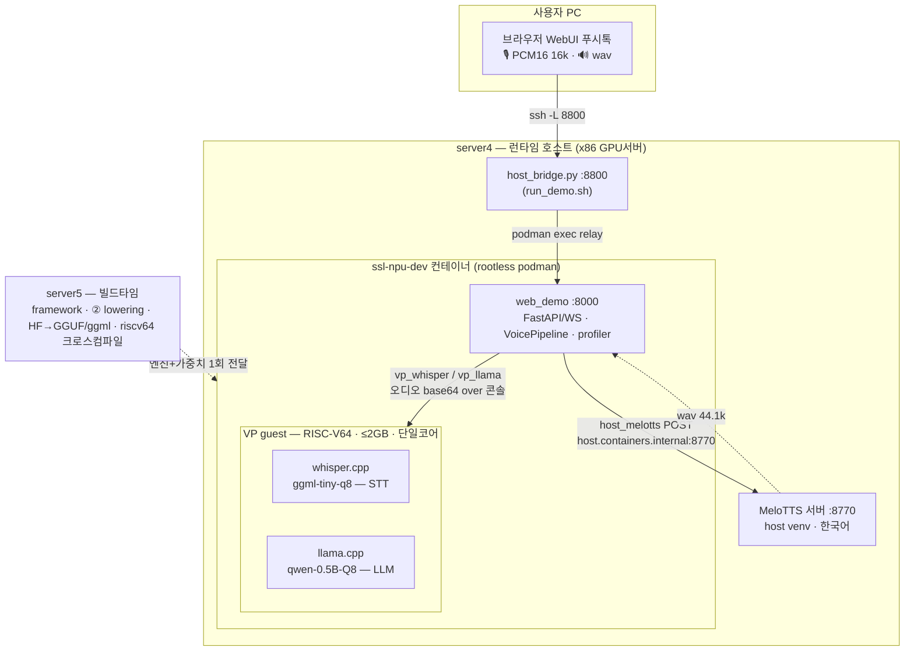
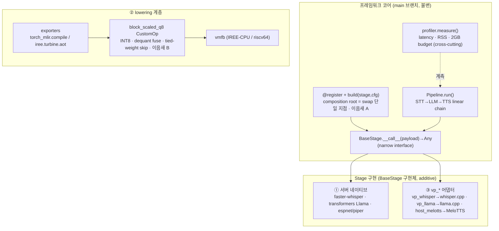
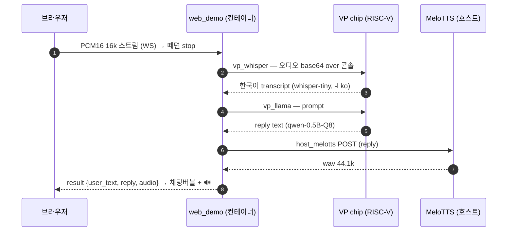

# 시스템 아키텍처 (현행)

> "지능을 갖고 대화하는 작은 엣지 임베디드 시스템" — 음성 1턴(마이크→STT→LLM→TTS→스피커)을 **CPU-only RISC-V VP** 위에서 **2GB DRAM·한국어·모델 swap** 제약 안에 흐르게 하는 시스템의 소프트웨어 아키텍처.
>
> 다이어그램은 아래 **mermaid 로 인라인**(GitHub/VS Code 에서 바로 렌더). 편집용 draw.io 원본: [diagrams/system-architecture.drawio](diagrams/system-architecture.drawio)(구버전 — 본 문서가 현행).
> 현황 단일 소스: [status.md](status.md) · 재현: [recipes/vp.md](recipes/vp.md) · 결정 인덱스: [decisions-qa.md](decisions-qa.md) · 구버전: [archive/architecture.md](archive/architecture.md).
> Last refresh: **2026-06-19** (WebUI 풀 음성 루프 + 온칩 LLM 결론 반영).

---

## 1. 컨텍스트 (왜 이 구조인가)

3개 deliverable이 **하나의 결과**로 묶여야 한다(따로 동작하면 실패):

| # | Deliverable | 본질 | 산출 |
|---|---|---|---|
| ① | naive speech app | Python+PyTorch, GPU/CPU 서버에서 STT→LLM→TTS 1턴 | 프레임워크 코어 + 서버 stage |
| ② | PyTorch→MLIR lowering | target 모델을 IR로 내리는 "컴파일러"(+ INT8 커널) | exporters · block_scaled_q8 · vmfb |
| ③ | VP 포팅 (CPU 실행) | SoC VP(RISC-V) 위 CPU-only 1턴 | native 엔진 + vp_* 어댑터 |

**핵심 아키텍처 동인(quality attributes):**

- **QA1 풋프린트 ≤2GB DDR3** — 모든 컴포넌트 선택의 1차 제약. stage 순차 load로 peak 관리. *부팅 천장*도 별도 제약(§6 A3).
- **QA2 모델 swap-ability** — "한 번 만들고 모델만 교체". config 한 줄로 구현 교체(이음새 A).
- **QA3 백엔드 portability** — 같은 모델 정의가 표준 커널 ↔ SSLNPU 커널로(이음새 B), 그리고 IREE ↔ native cpp 두 트랙으로.
- **QA4 branch 격리 불변량** — 새 app/backend는 plugin만 추가, 코어 0줄 변경(`git diff main <branch> -- src/npu_harness_framework/` = ∅).
- **QA5 실측 검증** — 모든 마일스톤은 실행 출력(rel/argmax/RSS/latency)으로 통과. string-match 금지.

---

## 2. 시스템 아키텍처 — 컨테이너·배포·런타임 토폴로지

런타임 경로에 **5번은 없다.** 5번=빌드타임, 호스트=4번, 추론=VP. **STT+LLM은 칩, TTS는 호스트**(하이브리드).

- **경계 넘는 것(5→4)**: riscv64 static 엔진 + GGUF 가중치(빌드 산출물 1회). **Python 프레임워크는 VP에 안 올라감**(크로스컴파일 불가) → 호스트 오케스트레이터로 잔류.
- **4→VP**: `podman exec`(TTY 금지) 콘솔 stdin 주입. 이 VP엔 **블록디바이스/NIC/virtio 없음 → 모델 볼륨(sdcard.img) 불가**. 모델은 initramfs(rootfs.cpio)에 bake, **오디오는 매 턴 콘솔 base64**(`stty -echo`)로 주입.
- **TTS 하이브리드**: 칩은 neural TTS 불가(2GB·riscv64 torch 없음·볼륨 없음 → OuteTTS는 2모델 tmpfs SIGBUS) → **호스트 venv MeloTTS**가 reply 텍스트→wav.
- **브라우저 접속**: rootless 컨테이너라 포트 미게시 → `host_bridge`(:8800 → podman exec relay → web_demo:8000) + `ssh -L`. 세션 런처 [`run_demo.sh`](recipes/vp.md#62-stt-한국어-수정--온칩-llm-확장-시도-전-과정-2026-06-16).
- **① 서버 디딤돌**: web_demo가 5번에서 추론까지 self-contained(VP 없이) — UI/파이프라인/KO 1턴 검증용(완료).

---

## 3. 소프트웨어 아키텍처 — 컴포넌트·이음새

### 3.1 코어 (main, 불변)
| 심볼 | 책임 | 설계근거 |
|---|---|---|
| `BaseStage.__call__(payload)->Any` | modality-무관 단일 메서드 | deep module / narrow interface (Ousterhout) |
| `@register` + `build(stage,cfg)` | composition root = swap 단일 지점 | stable dependencies (Martin) |
| `Pipeline.run()` | STT→LLM→TTS linear chain | batch/stream/async 의도적 confine |
| `profiler.measure()` | latency·RSS·2GB budget | cross-cutting (stage는 모름) |

### 3.2 두 개의 swap 이음새 (architecture seams)
- **이음새 A — 모델/구현 swap**: YAML `type:` 한 줄 → `build()`가 dispatch. app·Pipeline·test는 구체 클래스를 모른다. 새 모델 = `@register` 한 줄. (예: `tts: vp_silent → host_melotts` 한 줄로 TTS 교체.)
- **이음새 B — 마이크로커널 backend swap**: `MICROKERNEL_BACKEND = "standard" → "sslnpu"`. select(shape 계약)·dispatch·모델 클래스는 backend-무관 → **마이크로커널 본체(.mlir)만** SSLNPU IR로 교체.

### 3.3 Stage 구현 (현행)
- **① 서버 네이티브**(Python+PyTorch): faster-whisper · transformers Llama · espnet/piper. (검증 완료)
- **③ vp_* 어댑터**(✅ 동작): `vp_whisper→whisper.cpp`(칩, `-l ko` 강제) · `vp_llama→llama.cpp`(칩, qwen-0.5B-Q8) · **`host_melotts`→호스트 MeloTTS**(칩 neural TTS 불가라 호스트). 어댑터=콘솔 호출/HTTP + 출력 파싱. **코어/Pipeline 그대로, stage type만** → 이음새 A 그대로.

### 3.4 ② lowering 계층
exporters → `block_scaled_q8` CustomOp(INT8, dequant fuse, **tied-weight skip**) → vmfb(IREE-CPU/riscv64). WM3 검증: rel 0.61% / argmax 100% / vmfb 103MB. 상세 [kernel-design/04-int8-footprint.md](kernel-design/04-int8-footprint.md). **이 vmfb는 NPU 미래 트랙**(§5).

---

## 4. 런타임 시퀀스 — push-to-talk 1턴

- 전 과정 profiler가 stage별 latency/RSS를 JSONL로. stage 순차 → **LLM stage가 budget 피크**(peak ~950MB/2GB, 여유 ~1GB).
- 1턴 ≈ 오디오 ~26s + whisper ~112s + llama ~30s + TTS ~3s(에뮬·단일코어). 속도 천장=에뮬레이션(§6 A7).

---

## 5. 두 양자화 트랙 (혼동 주의)

| | GGUF Q-native 트랙 | block_scaled_q8 vmfb 트랙 |
|---|---|---|
| 엔진 | llama.cpp / whisper.cpp | IREE 런타임 |
| 포맷 | GGUF Q8_0/Q4_K_M/… , ggml | INT8 qs + per-block scale |
| 용도 | **VP 실배포(지금)** | IREE-CPU 검증 → **NPU(미래)** |
| 상태 | qwen-0.5B-Q8 칩 실행(풀 음성 루프) | WM3 통과(rel 0.61%) |

**같은 모델 정의, 다른 포맷·엔진.** VP에서 실제로 도는 음성 앱은 **GGUF native**. INT8 vmfb는 NPU가 붙을 미래 트랙(deliverable ② 산출).

---

## 6. 아키텍처 결정 기록 (ADR 요약)

| ADR | 결정 | 근거 |
|---|---|---|
| A1 | VP 런타임 = **native cpp(llama.cpp/whisper.cpp)**, Python harness 아님 | Python은 riscv64 크로스컴파일 불가 → 네이티브가 유일 경로 |
| A2 | 런타임 **호스트=4번**(VP와 co-located) | 오케스트레이터가 VP 콘솔을 로컬 `podman exec`로 구동(5번이면 브리지 추가·fragile) |
| A3 | 모델 전달 = **initramfs bake**, 오디오 = **콘솔 base64** (~~볼륨~~) | 이 VP엔 블록디바이스/NIC/virtio 없음 → sdcard.img 볼륨 불가. 호스트↔게스트=부트로더+시리얼 콘솔뿐 |
| A4 | **온칩 LLM = qwen-0.5B-Q8** (target은 Llama-3.2-1B였으나 칩 기각) | 2GB 부팅 천장(rootfs ~620MB)에 Llama-1B는 Q2_K만 fit → 한국어 깨짐. "작은 모델+Q8 > 큰 모델+극단양자화" |
| A5 | **TTS = 호스트 MeloTTS 하이브리드** (칩 아님) | 칩은 neural TTS 불가(2GB·riscv64 torch 없음·볼륨 없음). STT+LLM만 칩 |
| A6 | INT8 = **block_scaled_q8 + tied-weight skip** | vocab 이중 저장 → 125→103MB, rel 0.8→0.61% |
| A7 | 콘솔 자동화 = `podman exec`(**-it 금지**) + stdin 주입 + setsid | `-it`(TTY)는 VP 부팅을 깨뜨림(VFS mount root 패닉) |

---

## 7. 현 상태 · 다음 한 수

- ✅ 코어 / ① 서버 앱 · ② WM3(INT8 vmfb 실행) · VP 부팅+static 엔진.
- ✅ **VP-A/B/D + WebUI 풀 음성 루프**: 브라우저 푸시톡 → 칩 whisper(`-l ko`)+qwen → 호스트 MeloTTS → 음성 반환. 접속 `run_demo.sh`. 상세 [recipes/vp.md §6.1/§6.2](recipes/vp.md).
- ⏸ **더 나은 온칩 한국어**: ≤534MB 한국어특화 소형모델(미착수), 또는 부팅 2× 우회(native/no-copy initrd)로 Llama Q4 살리기(LEAD).
- ⏳ **NPU 트랙**: IREE HAL→SSLNPU 인계 후 vmfb 실칩 실행(이음새 B).
