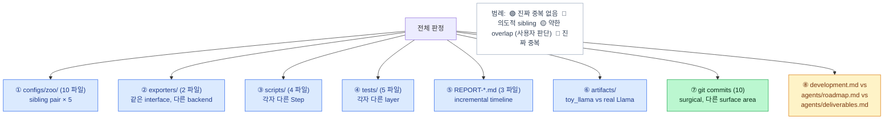
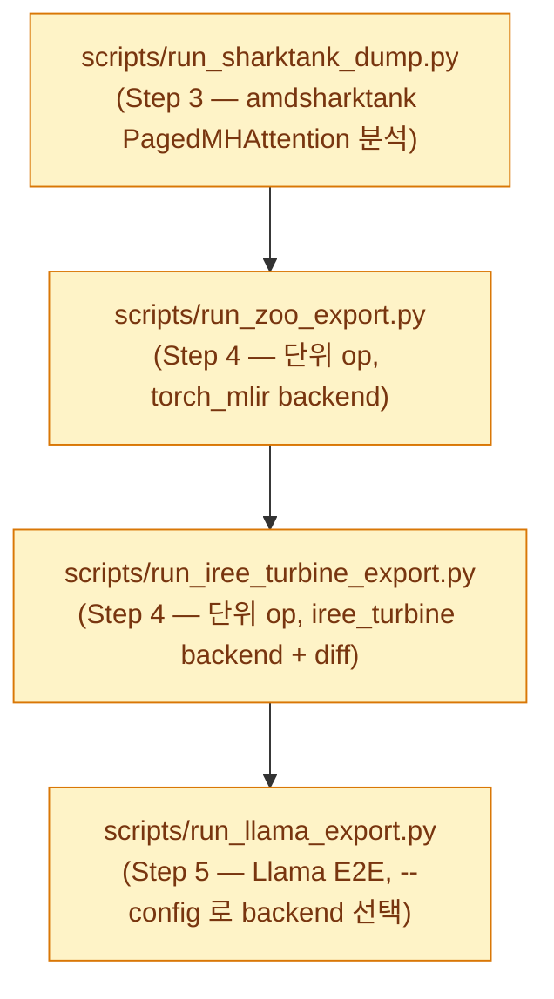
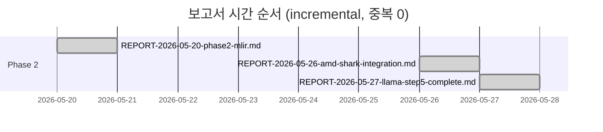
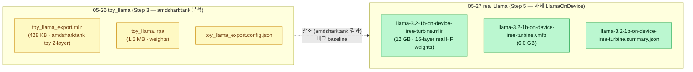
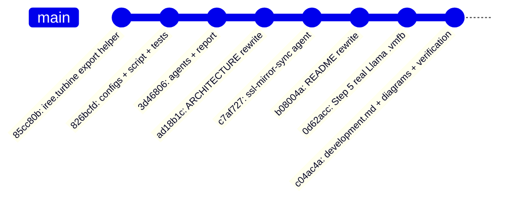
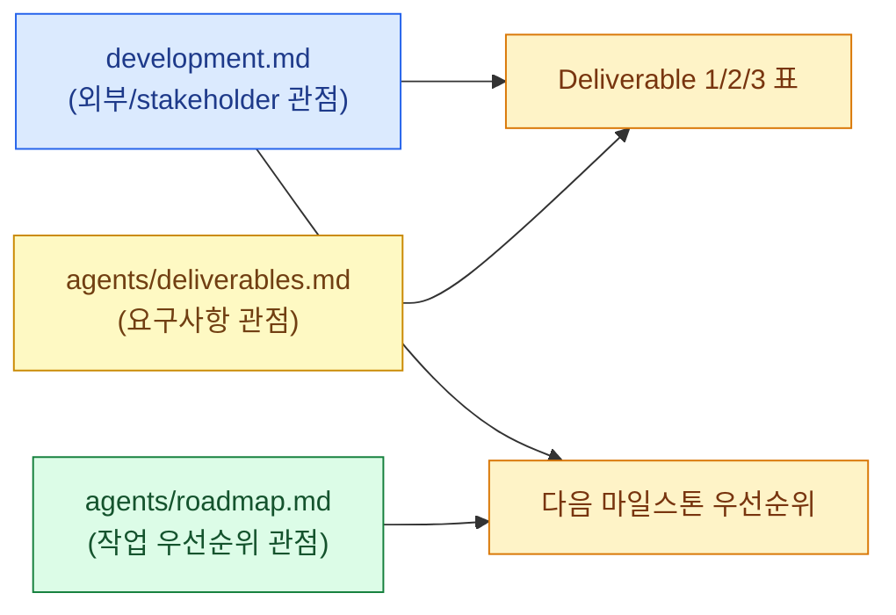
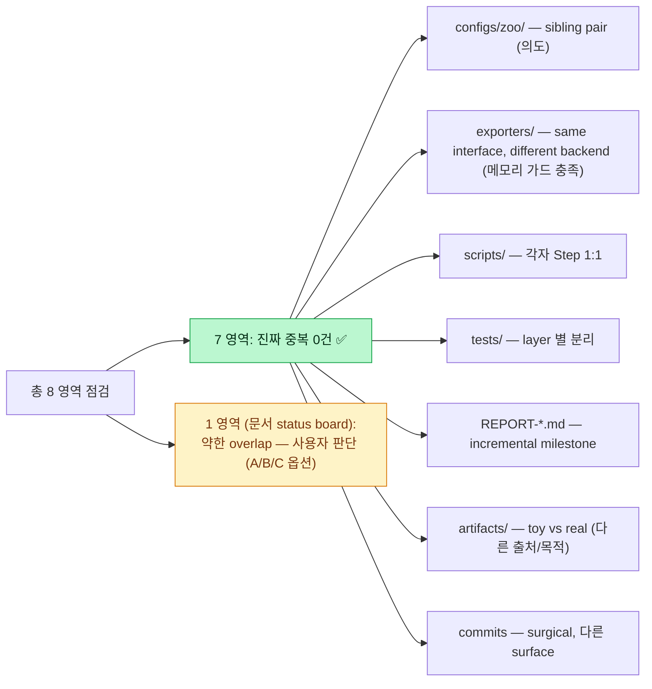

> ⚠ **ARCHIVED (구버전, ~2026-05, superseded).** 최신 현황은 [status](../status.md) · 문서 지도 [docs/README](../README.md). 본문 링크는 원래 위치 기준일 수 있음.

# Duplication Audit — 2026-05-27

> 사용자 요청: *"같은 주제로 여러 번 물어보고 돌렸으니 중복이 있는지 확인 (소스코드, 배포 등)"*
>
> 검증 범위: configs · exporters · scripts · tests · reports · artifacts · commits · 문서
>
> **결론**: 진짜 중복 **0건**. 의도적 sibling/공존 패턴은 모두 명시됨. 단 1곳에 약한 *문서 overlap* 발견 — 사용자 판단 필요.

---

## 1. 영역별 중복 판정 매트릭스



---

## 2. ① configs/zoo/ — 의도적 sibling pair (× 5)

```mermaid
flowchart LR
    classDef tm fill:#dbeafe,stroke:#2563eb,color:#1e3a8a
    classDef it fill:#dcfce7,stroke:#15803d,color:#14532d

    subgraph TM ["torch_mlir_dialect backend (5)"]
        A1["attention.yaml"]:::tm
        A2["mlp.yaml"]:::tm
        A3["rmsnorm.yaml"]:::tm
        A4["topk.yaml"]:::tm
        A5["llama_on_device.yaml"]:::tm
    end

    subgraph IT ["iree_turbine backend (5)"]
        B1["attention_iree_turbine.yaml"]:::it
        B2["mlp_iree_turbine.yaml"]:::it
        B3["rmsnorm_iree_turbine.yaml"]:::it
        B4["topk_iree_turbine.yaml"]:::it
        B5["llama_on_device_iree_turbine.yaml"]:::it
    end

    A1 -. "diff: exporter type 만" .-> B1
    A2 -. .-> B2
    A3 -. .-> B3
    A4 -. .-> B4
    A5 -. .-> B5
```

**검증**: `diff -u llama_on_device.yaml llama_on_device_iree_turbine.yaml` 결과 — exporter `type` (`torch_mlir_dialect` → `iree_turbine`) + out_path 만 차이.

**Why not 중복**: Design D4 의 "backend swap" 검증 + 정량 비교 reference. `llama_on_device_iree_turbine.yaml` 헤더에 *"Sibling of `llama_on_device.yaml` — only the exporter backend differs"* 명시.

---

## 3. ② exporters/ — same interface, different backend

| 파일 | LoC | 함수 | Backend | 호출 함수 |
|---|---:|---|---|---|
| `torch_mlir_export.py` | 38 | `export_top_level_torch_dialect()` | `torch_mlir.compile` | `torch_mlir.compile(module, args, output_type=TORCH)` |
| `iree_turbine_export.py` | 62 | `export_via_iree_turbine()` | `iree.turbine.aot` | `FxProgramsBuilder` + `@export_program` + `aot.export` |

**Interface 동일** (module, args → MLIR text). **내부 다름**. 사용자 메모리 가드 *"amd-shark 의 export pipeline 만 활용"* 와 부합 — `torch_mlir_export.py` 는 LLVM project 의 official path, `iree_turbine_export.py` 는 AMD-SHARK-AI 의 export pipeline path. **공존이 곧 가드 충족 증명**.

---

## 4. ③ scripts/ — 각자 다른 Step



→ 각 script 가 PDF 의 한 Step 만 책임. 중복 X.

---

## 5. ④ tests/ — layer별 분리, 중복 0

| 파일 | 개수 | 검증 layer |
|---|---:|---|
| `test_core.py` | 7 | framework primitive (BaseStage, Pipeline, registry) |
| `test_zoo_ops.py` | 5 | PyTorch forward shape (RMSNorm/Attention/MLP/TopK) |
| `test_zoo_export.py` | 2 | torch_mlir_dialect backend 단위 op |
| `test_iree_turbine_export.py` | 3 | iree_turbine backend 단위 op + TINY Llama |
| `test_llama_pipeline.py` | 5 | Llama E2E (LlamaOnDevice forward, HF schema, pipeline) |
| **합계** | **22** | 각 layer 1:1, 중복 0 |

---

## 6. ⑤ REPORT-*.md — incremental timeline



| 파일 | 주제 | 시점 |
|---|---|:---:|
| `REPORT-2026-05-20-phase2-mlir.md` | Phase 2 (MLIR Lowering) 1차 milestone — torch-mlir-zoo 초기 (단위 op + tiny Llama) | 05-20 |
| `REPORT-2026-05-26-amd-shark-integration.md` | amd-shark-tank `iree.turbine` 백엔드를 additive plug-in 으로 통합 (Gap G) | 05-26 |
| `REPORT-2026-05-27-llama-step5-complete.md` | Step 5 완료 — real Llama-3.2-1B + `.vmfb` | 05-27 |

→ 각 보고서가 다른 **milestone**. 본문 길이도 비슷 (10-13 KB) 하지만 *동일 내용 반복 없음* — 시간순 evolution.

---

## 7. ⑥ artifacts/ — toy_llama vs real Llama



| 항목 | toy_llama (05-26) | real Llama-3.2-1B (05-27) |
|---|---|---|
| 출처 | amdsharktank `PagedLlmModelV1` (best-effort dump) | 자체 `LlamaOnDevice` (171 LoC) |
| 크기 | 2-layer toy | 16-layer real |
| 가중치 | dummy | HF gated real |
| MLIR | 428 KB · 4 859 lines · `paged_attention_kv_cache_*` custom util.func 포함 | 12 GB · 6 218 lines · custom util.func **0** (`server_side_op_hits = ∅`) |
| 목적 | Step 3 분석 baseline | Step 5 완료 산출 |

→ **다른 목적, 다른 모델**. 비교 reference 로 공존. 다만 디스크 18 GB 차지하고 `.gitignore` 로 commit 제외. 정리하려면 `rm artifacts/llama-3.2-1b-on-device-iree-turbine.{mlir,vmfb}` 후 필요 시 재생성 가능.

---

## 8. ⑦ Git commits — surgical, 중복 0



| Commit | 변경 surface | 중복? |
|---|---|:---:|
| `85cc80b` | `src/torch_mlir_zoo/exporters/iree_turbine_export.py` 신규 helper | ✅ 고유 |
| `826bcfd` | `configs/zoo/*_iree_turbine.yaml` + script + tests | ✅ 고유 |
| `3d46806` | `agents/*` + `REPORT-2026-05-26-*.md` | ✅ 고유 |
| `ad18b1c` | `docs/ARCHITECTURE.md` 전면 재작성 | ✅ 고유 |
| `c7af727` | `agents/ssl-mirror-sync.md` 신규 | ✅ 고유 |
| `b08004a` | `README.md` 재작성 | ✅ 고유 |
| `0d62acc` | Step 5 real Llama (config + script flag + report + roadmap) | ✅ 고유 |
| `c04ac4a` | development.md + diagrams + verification | ✅ 고유 |

→ 각 commit 이 다른 surface area. CLAUDE.md *"Surgical Changes"* 원칙 부합.

---

## 9. ⑧ ⚠ **약한 overlap 1곳** — development.md ↔ agents/roadmap.md ↔ agents/deliverables.md

3 파일이 모두 Step / Deliverable 1/2/3 / 다음 마일스톤 정보를 일부 다룸:

| 파일 | LoC | 고유 관점 | 공통 표 |
|---|---:|---|---|
| **development.md** (root, 신규) | 179 | Step ↔ repo 1:1 / 
| **agents/roadmap.md** | 81 | Gap A/B/C/D/E/F/G/G' 매트릭스 + 작업 순서 + 보류 항목 | 다음 마일스톤 |
| **agents/deliverables.md** | 50 | Role + 3 Responsibilities + Deliverable 부합도 정량 | Deliverable 1/2/3 표 |



**판정**: 3 파일은 *서로 다른 독자/관점* — 의도된 분리. 다만 *공통 표 2종* (Deliverable 1/2/3, 다음 마일스톤) 이 2-3 곳에 반복됨.

### 해소 옵션

| 옵션 | 작업 | 비용 | 효과 |
|:---:|---|:---:|---|
| **A** | 그대로 유지 | 0 | 각 관점/독자 용도 분리 명시. `single source of truth` 위반은 약하지만 *문맥별 응축* 의 정당화 가능 |
| **B** | development.md 의 Deliverable 1/2/3 표 → `agents/deliverables.md` 로 link 만 (본문 인용 → "see deliverables.md") | 5 분 | 단일 진리원 확립. 단점: development.md 가 self-contained 아님 |
| **C** | agents/roadmap.md 의 "다음 마일스톤" 섹션 → development.md §6 로 흡수, agents/roadmap.md 는 "Gap 매트릭스" 전용으로 슬림화 | 10 분 | development.md 가 *유일한* status board, agents/* 는 *순수 sub-agent spec* |

권장: **(A)** 그대로 유지 — 각 파일이 도메인이 다르고 (stakeholder vs sub-agent vs requirement), 본문 텍스트는 다르고 표만 비슷한 정도. 만약 진정한 SSoT 가 필요해지면 (B) 로 진행.

---

## 10. 최종 판정



| Status | 영역 | 액션 |
|:---:|---|---|
| ✅ | configs · exporters · scripts · tests · reports · artifacts · commits | 그대로 유지 (의도된 sibling/incremental) |
| ⚠ | development.md ↔ agents/roadmap.md ↔ agents/deliverables.md | 사용자 결정 — 옵션 (A) 그대로 / (B) link only / (C) 흡수 |
