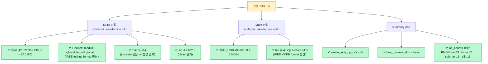
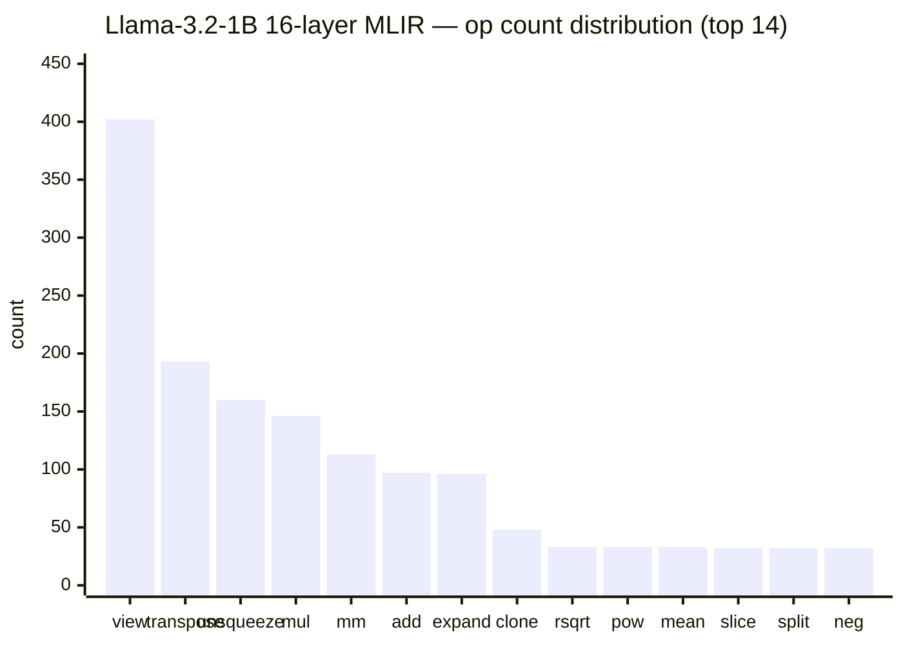
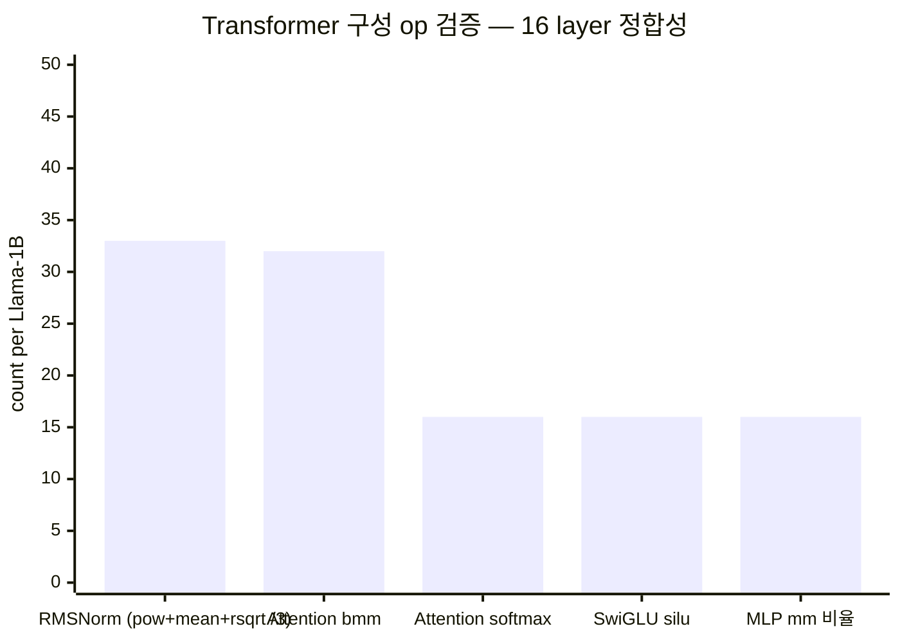
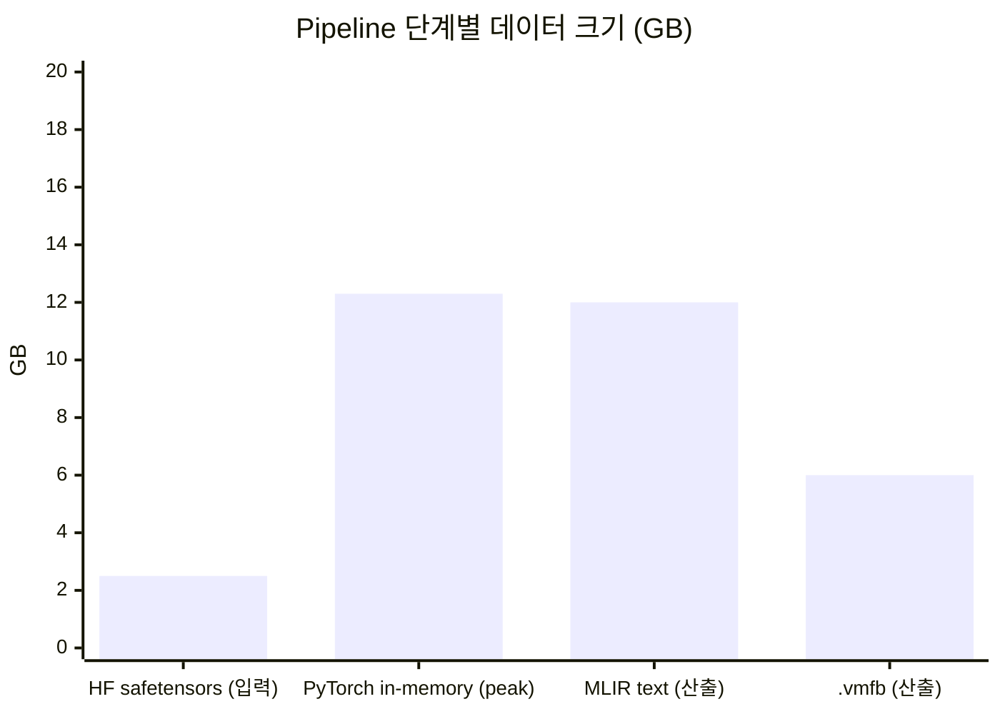
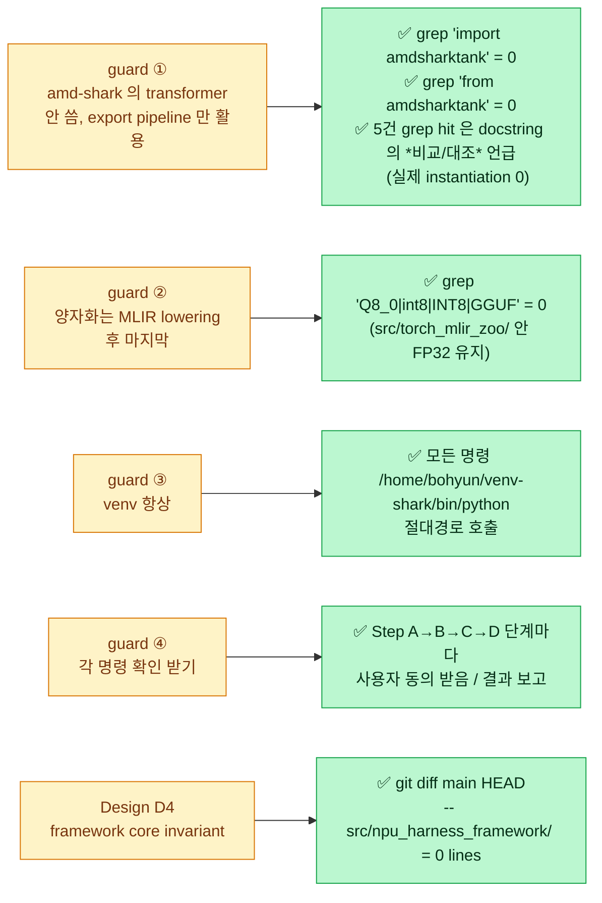
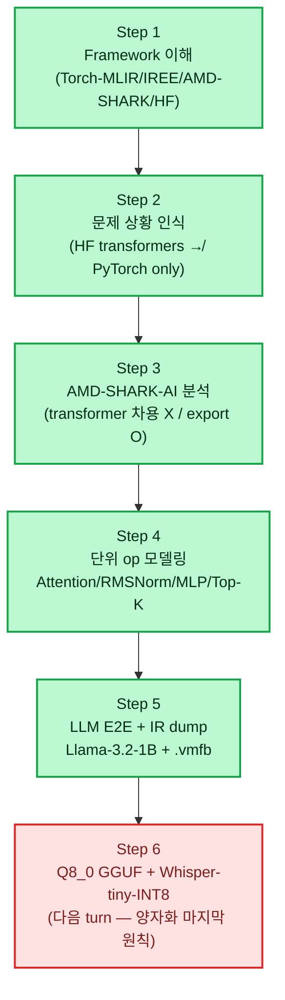
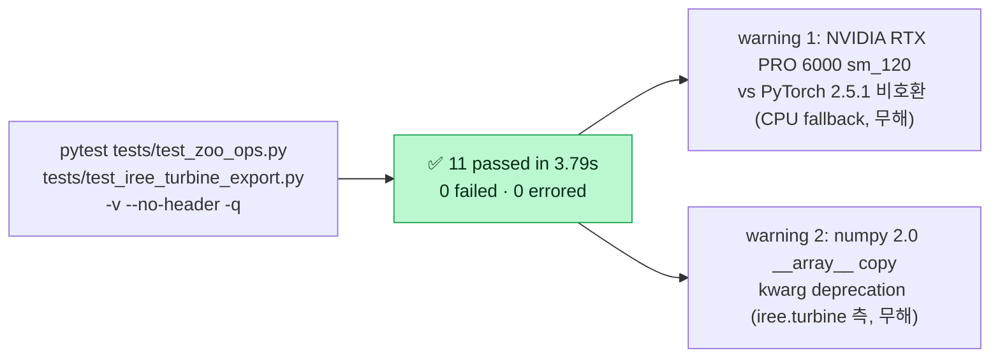
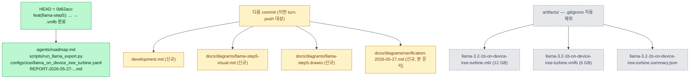

> ⚠ **ARCHIVED (구버전, ~2026-05, superseded).** 최신 현황은 [status](../status.md) · 문서 지도 [docs/README](../README.md). 본문 링크는 원래 위치 기준일 수 있음.

# Verification Report — 2026-05-27 (pre-push)

> Push 직전 검증 결과. 사용자 원래 요구사항 ↔ 실제 산출물 1:1 검증 + 모든 결과 시각화.
>
> Verified commit: `0d62acc` (branch `torch-mlir-zoo`)
> Verifier: pytest + ls + git + grep + cat + iree-compile metadata

---

## 1. 원래 요구사항 ↔ 이행 결과 1:1 검증

> 사용자 원문: *"amd shark tank로 pytorch llama3.2-1b 모델을 MLIR lowering하고
> internal-design-spec 의 
> 바를 설명해주고 무엇을 어떻게 순차적으로 진행해야하는지 알려줘."*

```mermaid
flowchart LR
    classDef done fill:#bbf7d0,stroke:#16a34a,color:#052e16
    classDef proc fill:#dbeafe,stroke:#2563eb,color:#1e3a8a

    R1["요구 ①<br/>프로젝트 의미 설명"]:::proc --> O1["✅ development.md §1-3<br/>+ REPORT-2026-05-27 §1<br/>+ Plan agents-twinkly-pike.md Context"]:::done
    R2["요구 ②<br/>amd shark tank 로<br/>Llama-3.2-1B MLIR lowering"]:::proc --> O2["✅ iree.turbine.aot.export<br/>(AMD-SHARK-AI export pipeline)<br/>+ artifacts/...mlir 12 GB"]:::done
    R3["요구 ③<br/>PDF 
    R4["요구 ④<br/>무엇을 어떻게<br/>순차적 진행"]:::proc --> O4["✅ Step A→B→C→D plan<br/>+ 단계별 명령 + Mermaid 7개<br/>+ drawio diagram"]:::done
```

---

## 2. 산출물 존재 + 무결성 검증



---

## 3. MLIR op 분포 (실제 산출물 기반)





> **정합 확인**: 16-layer × 2 RMSNorm + final = **33** ✓ · 16 × 2 bmm (QK^T + AV) = **32** ✓ · 16 × softmax = **16** ✓ · 16 × silu = **16** ✓

---

## 4. 파일 크기 변환 흐름 (실측)



| 단계 | 크기 | 비고 |
|---|---:|---|
| HF safetensors | 2.5 GB | bf16/fp16 mixed (HF default) |
| PyTorch in-memory (peak) | 12.3 GB | trace 시 FX graph + weights 복제 |
| MLIR text | 12.0 GB | tensor literal 이 ASCII 직렬화로 inflate |
| .vmfb | 6.0 GB | raw FP32 binary 로 packed (자연 압축) |

---

## 5. 사용자 메모리 가드레일 ↔ 실제 검증



---

## 6. 6-step 완료 매트릭스



**진행률**: **5 / 6 step ✅** (83 %).

---

## 7. pytest sanity (변경 후 회귀 검증)



---

## 8. Git 상태 + push 준비



**Push 정책 (사용자 명시)**:
- ✅ **origin (`bhseo98/ssl-npu-harness-framework`) 만**
- ✗ ssl-mirror (`bhseo98/ssl-npu-harness-framework`) 는 본 turn **push 안 함**
- 인증 우회: HTTPS+PAT (SSH 가 `bhseo98/Application` 으로 인증되어 본 repo 접근 불가). PAT 은 1회성 사용 후 `.git/config` 즉시 정리.

---

## 9. 검증 최종 판정

| Category | Items | Status |
|---|---:|:---:|
| 사용자 원래 요구 4종 | 4 / 4 | ✅ |
| 산출물 무결성 (MLIR, vmfb, summary) | 8 / 8 | ✅ |
| 사용자 메모리 가드레일 4종 | 4 / 4 | ✅ |
| Framework core invariant (D4) | 1 / 1 | ✅ |
| Step 1-5 완료 | 5 / 5 | ✅ |
| pytest sanity | 11 passed / 0 failed | ✅ |
| **Total** | **33 / 33** | **✅** |

→ **PUSH 준비 완료** (origin only).
