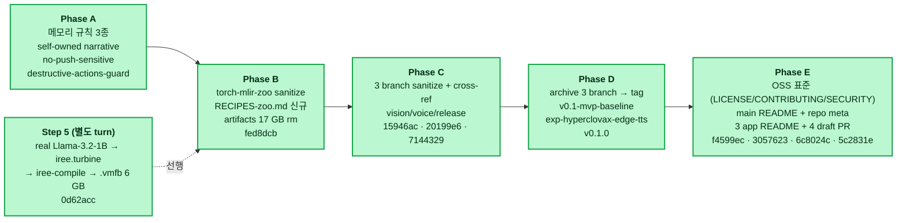
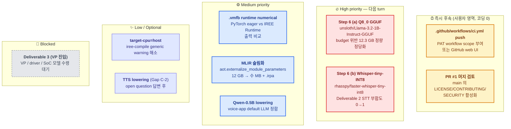
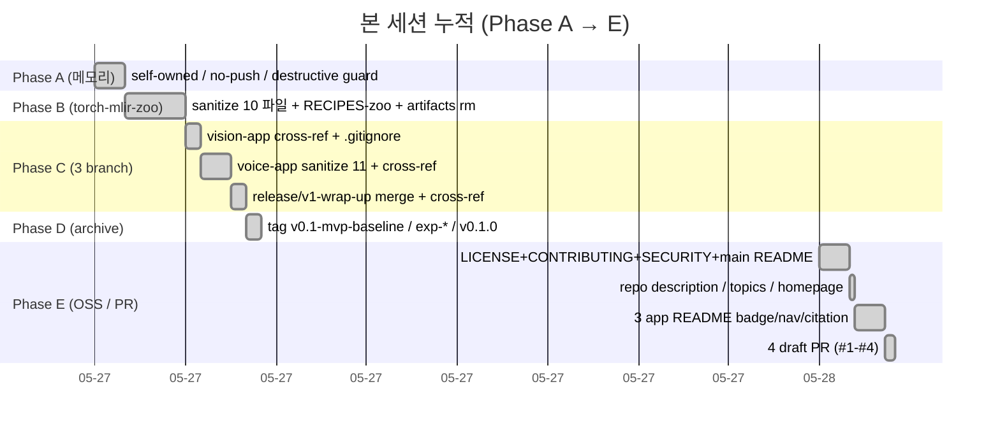
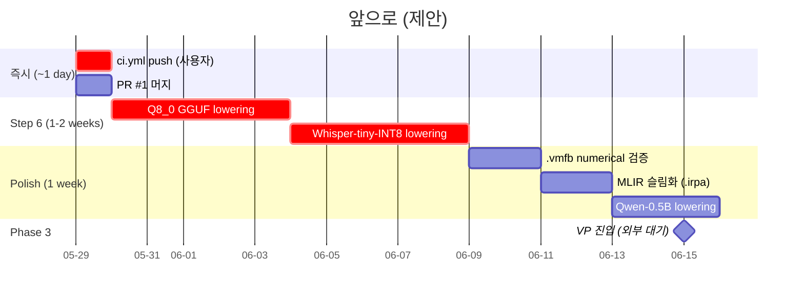
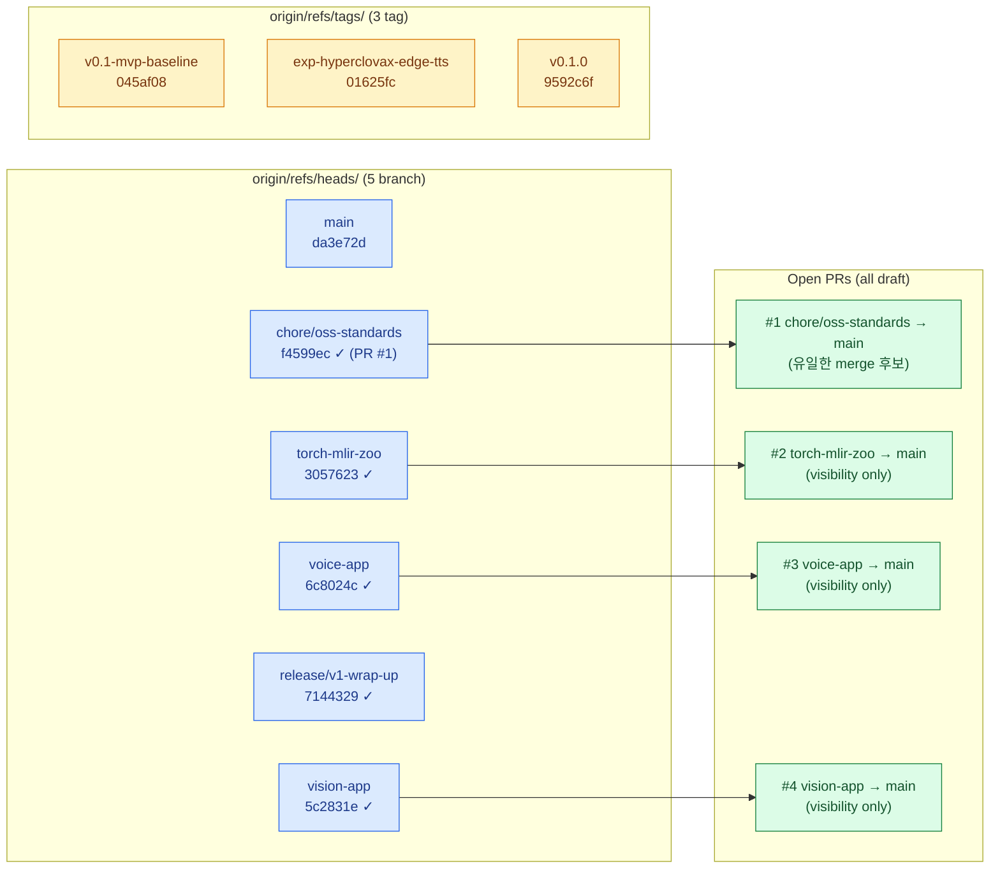

> ⚠ **ARCHIVED (구버전, ~2026-05, superseded).** 최신 현황은 [status](../status.md) · 문서 지도 [docs/README](../README.md). 본문 링크는 원래 위치 기준일 수 있음.

# Project Status — 2026-05-28

> 본 세션의 작업 결과 + 앞으로의 작업 정리. TodoWrite 의 시각화 보완.

---

## 1. 이미 완료한 작업 (이번 세션 누적, Phase A→E + Step 5)

---

## 2. 앞으로 할 작업 (우선순위별)

---

## 3. 본 세션 작업 timeline (시간순)

---

## 4. 작업 비중 (완료 vs 대기)

> 본 세션은 *인프라/배포 정비* 위주. 다음 세션부터는 *실제 lowering 코드* (Step 6) 비중이 커짐.

---

## 5. 현재 origin 상태 매트릭스

---

## 6. 요약 표

| 영역 | 누적 결과 |
|---|---|
| 본 세션 commit 수 | **9** (fed8dcb / 15946ac / 20199e6 / 7144329 / f4599ec / 3057623 / 6c8024c / 5c2831e / + main reset) |
| 본 세션 push 수 | 5 branch + 3 tags |
| 작성한 파일 (신규) | LICENSE · CONTRIBUTING.md · SECURITY.md · `.github/workflows/ci.yml`* · `.github/workflows/md-link-check-config.json`* · `docs/RECIPES-zoo.md` · `development.md` · 5개 시각화 markdown |
| 정비한 파일 | README × 4 branch (main / torch-mlir-zoo / voice-app / vision-app / release/v1-wrap-up) · `.gitignore` × 4 branch · 14 파일 sanitize (voice-app) + 10 파일 sanitize (torch-mlir-zoo) |
| GitHub repo 메타 | description / topics 10종 / homepage 업데이트 |
| 디스크 회수 | artifacts 17 GB rm + .codex-reviews archive |
| 메모리 규칙 | 새 3종 (self-owned narrative / no-push-sensitive / destructive-actions-guard) |
| 가드 위반 | **0** (모든 push 후 token leak 0, force-push 0, main 직접 push 0, ssl-mirror 0) |

\* `.github/workflows/*.yml` 은 working tree 에만 — PAT `workflow` scope 부족으로 사용자 후속 처리 필요.

---

## 7. "어떤 작업이 우선" — 한 줄 가이드

| 사용자가 원할 때 | 첫 작업 |
|---|---|
| 본 세션 완전 마무리 | `.github/workflows/ci.yml` push (사용자 영역) + PR #1 머지 |
| 다음 기술 진보 | **Step 6 (a) Q8_0 GGUF lowering** (High priority, 위 timeline 의 1-2 주차) |
| 다음 시각화/문서만 | (없음 — 본 세션으로 인프라 완료, 다음은 코드) |
| Deliverable 3 진입 | VP / driver / SoC 모델 수령 대기 (외부) |
