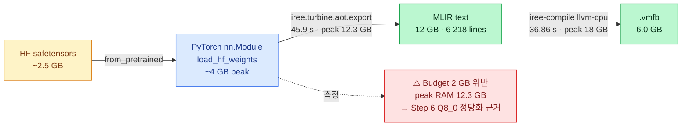
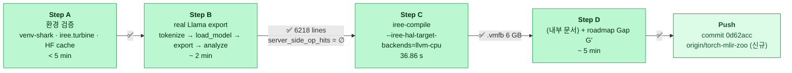
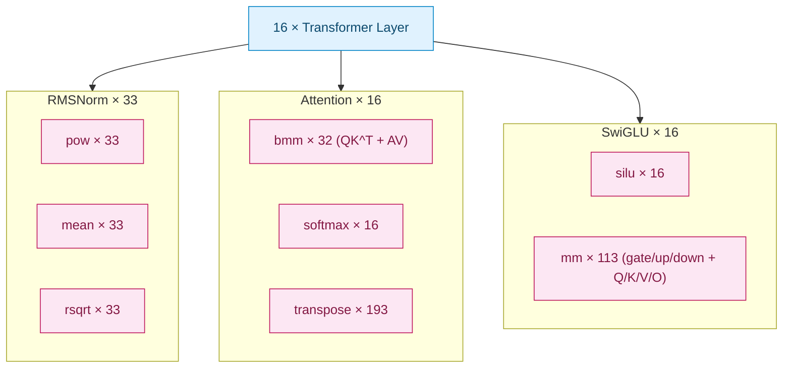
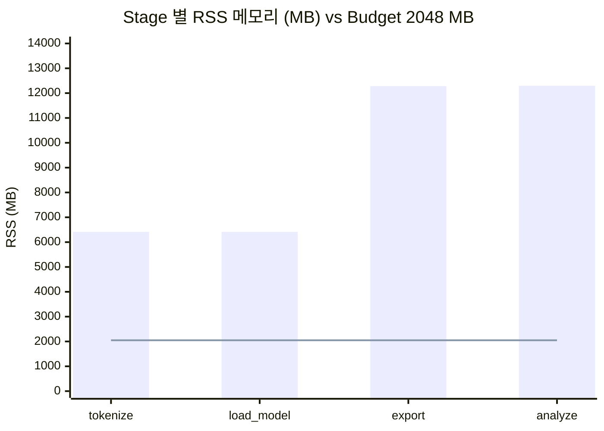
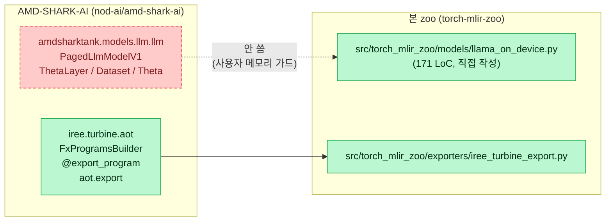
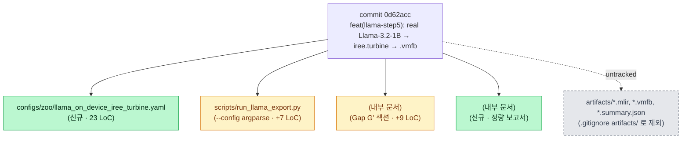

# Llama-3.2-1B Step 5 — 결과 시각화

> 2026-05-27 결과의 시각 자료. GitHub 에서 직접 렌더링 (Mermaid),
> draw.io 에서는 *Extras → Edit Diagram → Mermaid* 또는 *Insert → Advanced → Mermaid*
> 로 같은 코드 붙여넣기 가능. 별도 `.drawio` XML 은 [`llama-step5.drawio`](llama-step5.drawio).

---

## 1. PDF 의 

```mermaid
flowchart TD
    classDef done fill:#bbf7d0,stroke:#16a34a,stroke-width:2px,color:#052e16
    classDef purple fill:#ede9fe,stroke:#7c3aed,stroke-width:2px,color:#2e1065
    classDef next fill:#f1f5f9,stroke:#94a3b8,stroke-width:1px,color:#334155,stroke-dasharray: 5 3

    subgraph PURPLE ["━━ 
        direction TB
        PY["PyTorch Model Zoo<br/><b>LlamaOnDevice (171 LoC)</b><br/>RMSNorm · GQA · SwiGLU · RoPE<br/>16-layer FP32 + HF gated weights"]:::purple
        TM["Torch-MLIR / iree.turbine.aot.export<br/>FxProgramsBuilder + aot.export<br/>(AMD-SHARK-AI export pipeline)"]:::purple
        MLIR["<b>Top-level Torch dialect MLIR</b><br/>12 GB · 6 218 lines<br/>server_side_op_hits = ∅<br/>has_dynamic_dim = false"]:::done
        COMP["Torch-MLIR Compiler<br/><b>iree-compile --iree-hal-target-backends=llvm-cpu</b><br/>36.86 s · peak RSS 18 GB"]:::purple
        VMFB["<b>.vmfb (IREE bytecode)</b><br/>6.0 GB · Zip v4.5 · exit 0<br/>✅ 설계 §3 유의미한 결과 충족"]:::done
        PY --> TM --> MLIR --> COMP --> VMFB
    end

    subgraph NEXT ["다음 turn — IREE Runtime / target NPU stack (외부 (compiler stack) 측)"]
        direction TB
        IREE_C["IREE Compiler<br/>(compiler/api.h)"]:::next
        IREE_R["IREE Runtime<br/>(runtime/api.h)"]:::next
        IREE_HAL["IREE HAL Driver<br/>(hal/drivers/halapi.h)"]:::next
        IREE_VM["IREE VM<br/>(vm/api.h)"]:::next
        TGT_LIB["target NPU Library"]:::next
        TGT_RT["target NPU Runtime"]:::next
        TGT_DRV["target NPU Driver"]:::next
        TGT_HW["target NPU HW"]:::next
        IREE_C --> IREE_R
        IREE_R --> IREE_HAL
        IREE_R --> IREE_VM
        IREE_HAL --> TGT_LIB --> TGT_RT --> TGT_DRV --> TGT_HW
    end

    VMFB -."실행 검증<br/>(다음 turn)".-> IREE_R
```

---

## 2. Pipeline data flow + 정량 결과



---

## 3. 본 turn Step A-D 타임라인



---

## 4. op count 정합성 (16-layer Llama 분해 검증)



> **정합 검증**: 16 layer × 2 RMSNorm + final = **33** ✓, 16 layer × 2 bmm = **32** ✓,
> 16 layer × softmax/silu = **16** 각각 ✓ → PyTorch 정의가 ATen op 로 1:1 lower, 누락 0.

---

## 5. Budget enforce — embedded target 미충족 (정상 신호)



> 모든 stage 에서 RSS > budget. peak 12.3 GB → DRAM 2 GB embedded target 못 들어감.
> **이게 Step 6 (Q8_0 GGUF, Whisper-tiny-INT8) 양자화의 정당화 근거** —
> *사용자 메모리 "양자화는 MLIR lowering 후 마지막" 원칙 부합*.

---

## 6. AMD-SHARK-AI 통합 범위 (사용자 가드레일)



> **사용자 메모리 가드**: *"amd-shark 의 transformer 안 씀, export pipeline 만 활용"*.
> transformer 구현은 자체 작성 (171 LoC), export pipeline 만 차용.

---

## 7. Files changed (이번 commit `0d62acc`)


