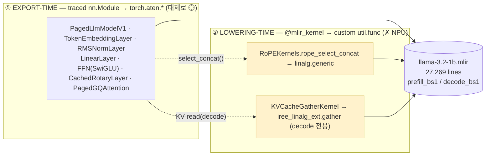

## 1. input dim (dynamic / static) — 모델 클래스가 아니라 **export 드라이버**가 만든다

### 1.1 핵심 — dim은 모델이 모른다


### 1.1.1 Dynamic Shape (동적 차원) 형태

Export 드라이버나 캐시 셋업 메서드에서 `torch.export.Dim`을 사용해 주입했을 때 나오는 형태

* **Python 레벨 타입:** PyTorch 표준 심볼릭 타입인 `torch.export.Dim`으로 존재하며, 특별한 서드파티 클래스가 아니다.
* **MLIR IR 레벨 형태:** 크기를 알 수 없는 가변 축이 **물음표(`?`)** 심볼로 표현
* **IR 흔적 예시:**
  ```mlir
  !torch.vtensor<[1,?], si64>
  !torch.tensor<[?,524288], f16>

* **이 경우 함수 어트리뷰트에 torch.assume_strict_symbolic_shapes가 함께 붙게됨**

### 1.1.2 Static Shape 형태

`dynamic_shape`arg를 따로 주지않고, 구체적인 input을 (`example_args`)데이터만 넣어서 trace했을 때 나오는 형태. 
MLIR IR-Level 형태 : `?`같은 심볼 없이 fixed된 숫자로 박힘
  ```mlir
  !torch.vtensor<[1, 32], si64>
```

| dynamic 축 | 만드는 곳 (클래스/함수) | 구문 | IR 흔적 |
|---|---|---|---|
| **seq_len** (`tokens[1]`, `seq_block_ids[1]`) | `examples/export_paged_llm_v1.py:65` `generate_batch_prefill` (드라이버 *함수*, 클래스 아님) | `torch.export.Dim("seq_len_blocks_dim", min=2, max=…)` → `* block_seq_stride` | `vtensor<[1,?],si64>` |
| **page count** (KV slab `[?,524288]`의 0축) | `ServicePagedLlmModelV1.setup_cache()` (`models/llm/export.py:151`) → 내부 `PagedKVCache.allocate()` | `torch.export.Dim("page")` | `tensor<[?,524288],f16>` |

두 `Dim`은 모두 `@fxb.export_program(dynamic_shapes={...})`(`iree.turbine.aot.FxProgramsBuilder`)의 `dynamic_shapes=` kwarg로 전달된다 (export_paged_llm_v1.py:74, 118/141/193).

```python
# export_paged_llm_v1.py:65 — seq_len dynamic dim 생성 (드라이버)
seq_len_blocks_dim = torch.export.Dim("seq_len_blocks_dim", min=2, max=block_dim_max)
seq_len_dim        = seq_len_blocks_dim * llama_config.block_seq_stride
cache, cache_dynamic_shapes, _ = model.setup_cache()    # ← page dim 은 여기서
dynamic_shapes = {
    "tokens":        {1: seq_len_dim},          # axis 1 dynamic
    "seq_lens":      {},                        # static
    "seq_block_ids": {1: seq_len_blocks_dim},   # axis 1 dynamic
    "cs":            cache_dynamic_shapes,       # page dim dynamic
}
```

```python
# models/llm/export.py:151 — ServicePagedLlmModelV1.setup_cache (page dim)
page_dim       = torch.export.Dim("page")
cache_state    = self.model.cache.allocate(page_count=device_block_count)  # PagedKVCache.allocate
dynamic_shapes = [{0: page_dim} for _ in range(len(cache_state.allocation))]
```

### 1.2 타입의 정체 + 형태

- **타입 = `torch.export.Dim`** — PyTorch 표준 심볼릭 dim. 모델이 모르는 *이상한 타입이 아니다*. (특별한 amdsharktank 클래스도 아님.)
- export 시 `import_symbolic_shape_expressions=True`(export_paged_llm_v1.py)로 심볼 식까지 IR에 박힌다 → 함수에 `torch.assume_strict_symbolic_shapes` attribute, 텐서에 `?` 축.
- **dynamic 형태**: `!torch.vtensor<[1,?],si64>`, `!torch.tensor<[?,524288],f16>` — IR 전체 `?` 4,530회.
- **static 형태**: `dynamic_shapes`를 *주지 않고* concrete `example_args`로 trace → `[1,32,…]`처럼 숫자로 고정.

```mlir
// dynamic (amdsharktank export) — ? 가 심볼 축
func.func @prefill_bs1(%arg0: !torch.vtensor<[1,?],si64> ...) -> !torch.vtensor<[1,?,128256],f16>
  attributes {torch.assume_strict_symbolic_shapes}

// static (OnDevice, fixed example_args) — 숫자로 고정
func.func @main(%arg0: !torch.vtensor<[1,32],si64>) -> !torch.vtensor<[1,32,128256],f16>
```

### 1.3 "dynamic이라 못 쓴다"는 *절반만* 맞음

- X `torch.export.Dim`이 NPU가 못 받는 exotic 타입이라서가 **아니다**.
- O **IR이 `?` 심볼 축을 들고 있으면**, static shape를 전제로 DMA/타일링/버퍼 크기를 잡는 NPU 백엔드가 스케줄을 못 짠다 → **specialize(고정) 필요**.
- 그래서 이건 *불가능*이 아니라 **제일 싼 제약**: easy3 #7 / [easy-sum](easy-sum.md) 표에서 O "드라이버 레벨" — `Dim`을 빼고 fixed `example_args`로 trace하면 끝. 백엔드가 dynamic shape를 받으면 그대로도 통과.

> **한 줄**: dynamic dim = export 드라이버(`generate_batch_*`)와 `setup_cache()`가 만든 `torch.export.Dim` → IR의 `?`. 모델 클래스 책임 아님. "dynamic이라 못 쓴다"가 아니라 "static을 요구하는 백엔드면 specialize하라"가 정확. 고치는 비용 최저(설정 1줄).

---

## 2. lowering 단계의 제약 kernel + "aten만이면 lowering 되나?"

### 2.1 제약 kernel = `@mlir_kernel` / `CustomOp.register` (trace 안 되고 raw MLIR splice)

이 함수들은 모델 forward에서 *호출*되지만 FX가 내부를 추적하지 않고 **손으로 짠 MLIR `util.func`를 IR에 그대로 박는다**(easy4-detail §3). 인프라: `kernels/mlir_kernel.py`. 소스 전체 grep으로 모은 **제약 kernel 카탈로그**:

| 그룹 | kernel (정의 위치) | 박히는 IR | default Llama-3.2-1B fp16 export에 등장? |
|---|---|---|---|
| **RoPE** | `RoPEKernels.rope_select_concat` (`layers/rotary_embedding_hf.py:29` `@mlir_kernel`) | `linalg.generic`+`arith.select` (interleave concat) | ✅ **64회** |
| **KV read** | `KVCacheGatherKernel` (`layers/paged_attention.py:68` `@mlir_kernel`) | `iree_linalg_ext.gather` | ✅ **decode 전용 32회** |
| *(불투명, kernel은 아님)* | `aten._scaled_dot_product_flash_attention_for_cpu` | 단일 블랙박스 op (softmax/bmm 안 보임) | ✅ 32회 |
| **quant matmul** | `mmt_block_scaled_q8` · `mmt_block_scaled_offset_q4` · `mmt_super_block_scaled_offset_q4` · `einsum_2args_q4` · `mmtfp` · `batch_matmul_transpose_b` · `gemm_fp4` · `gemm_fp4_asm` (`kernels/`) | custom util.func / asm | ❌ INT8/INT4 켤 때만 |
| **sampling** | `iree_topk` (`kernels/topk.py`) | `iree_linalg_ext.topk` | ❌ `--top-k` 켤 때만 |
| **attention 변종** | `kernels/attention.py`(×2 `@mlir_kernel`), `kernels/wave/attention.py`, `wave/extend_attention.py`, `wave/mxfp4_gemm.py` | wave/asm 커널 | ❌ 해당 kernel flag |
| **vision/기타** | `conv_2d_nchw_fchw` · `pooling_nchw_sum` · `bitcast_to_complex/real` · `kernels/rotary.py::apply_rotary_embedding`(비-HF rope 경로) | custom util.func | ❌ 경로별 |

> **쉽게**: 기본 Llama 경로에서 실제로 NPU/모델을 막는 lowering kernel은 딱 **RoPE concat + KV-gather 2개**(+ SDPA 블랙박스). 나머지(quant·topk·wave·conv·bitcast)는 *해당 기능을 켤 때만* 추가로 튀어나오는 **예비 제약 풀**이다. easy3는 #3(paged gather)·#4(rope) 둘로 요약했는데, 그게 곧 이 2개.

### 2.2 export 단계 `nn.Module`은 `torch.aten.*`만 하면 lowering 되나? — *거의* 맞지만 충분조건 아님

`nn.Module`이 전부 `torch.aten.*`(+`torch_c`,`util.global`)로 trace되면 torch-mlir 표준 파이프라인이 내린다. **하지만 "nn.Module이다"만으론 부족** — 세 가지 누수:

| # | 누수 | 무엇이 문제 | 회피 |
|---|---|---|---|
| 1 | **불투명 composite aten** | `F.scaled_dot_product_attention` → `aten._scaled_dot_product_flash_attention_for_cpu` 한 덩어리. `torch.aten.*`이긴 하나 softmax/bmm로 *분해 안 됨* → NPU/모델이 이 op을 알아야 통과 | `attn_implementation="eager"` 또는 decomposed SDPA로 풀어 씀 (easy4-detail 레버 ④) |
| 2 | **forward가 custom op 호출** | RoPE `select_concat`, `kv_cache_gather`, quant matmul 등 `@mlir_kernel`/`CustomOp`를 부르면 trace가 아니라 util.func splice → aten 아님 | forward가 *부르는 op이 전부 순수 aten*이어야 함 (custom kernel 회피) |
| 3 | **aten 밖으로 새는 패턴** | data-dependent shape(`.item()`, page_ids gather) · python 제어흐름 · external mutable buffer in-place(`index_put_` on cache arg) · `iree.abi.affinity` 메타 | stateless 재계산 forward + single device + static-ish shape |

```
"nn.Module이면 lowering" 의 정확한 충분조건 =
   (a) 순수 표준 aten으로만 구성        ← custom kernel 회피(2)
 + (b) 불투명 composite(SDPA) 분해       ← (1)
 + (c) data-dependent/external-state 없음 ← (3)
 + (d) static-ish shape (§1)
```

> **한 줄**: "nn.Module → aten → lowering"은 맞는 방향이지만, **불투명 SDPA 분해 + custom kernel 회피 + 비-aten 누수 제거 + (가능하면) static shape**가 같이 모여야 실제로 NPU까지 내려간다.


---
## 3. 모델 클래스 재작성 필요 클래스


---


## 3. *클래스가 어떻게 쓰이나* (export 호출 순서 = Stage A→E, 27종)

각 클래스가 Llama-3.2-1B lowering에서 *무슨 일을 하고 IR에 무엇을 남기는지*. 판정 범례: **◎ 표준 aten(통과)** · **🟨 @mlir_kernel 커스텀(막힘)** · **🟥 decode 전용 커스텀** · **🟪 불투명 SDPA** · **⚙ 설정/메타** · **📦 weight 외부화**. `#n` = [easy3 §5](easy3.md) 제약 번호.

| # | Stage | 클래스 / 함수 | 어떻게 쓰이나 (역할) | IR에 남기는 것 | 판정 |
|---|---|---|---|---|---|
| 1 | A | `import_hf_dataset` | HF safetensors+config → IRPA 변환 | — | ⚙ |
| 2 | A | `Theta` | weight를 *이름경로*(`theta("blk",0,"attn_q")`)로 접근 | `@__auto.*` symbol | 📦 |
| 3 | A | `Dataset` | IRPA `save`/`load` I/O | IRPA 파일 | 📦 |
| 4 | A | `DatasetMetadata` | IRPA key 스킴 = "fixed IRPA"의 실체 | properties | 📦 |
| 5 | A′ | `DefaultPrimitiveTensor` | tied embedding(`output.weight`) 복제 수선 | `output.weight` | 📦 #9 |
| 6 | B | `LlamaHParams` | 아키텍처 상수(block16/head32/kv8/ffn8192) | — | ⚙ |
| 7 | B | `LlamaModelConfig` | hp + **lowering 정책**(dtype·kv_cache_type·kernel) | #6,#7 default 결정 | ⚙ #6 |
| 8 | B | `ExportConfig` | export 행위(bs·top_k·logits_norm) | top_k시 topk op | ⚙ |
| 9 | B | `ParallelismConfig` | tp/pp 병렬도(=1 single device) | device map | ⚙ #5 |
| 10 | C | **`PagedLlmModelV1`** | 메인 모델. `forward` 아닌 **`prefill()`/`decode()` 2메서드** | 4-args 2-entry | **#2,#8** |
| 11 | C | **`DefaultPagedKVCache`** | KV slab `[?,524288]` allocate/read/write | cache arg | **#1** |
| 12 | C | `TokenEmbeddingLayer` | 토큰 → hidden | `aten.embedding` ×2 | ◎ |
| 13 | C | `CachedRotaryLayer`→`RotaryEmbeddingLayer` | RoPE: sincos table + cos/sin·mul·sub·add | `bmm/cos/sin` 각64 | ◎(수식) |
| 14 | C | `RMSNormLayer` | RMS norm (f32 cast) | `pow/mean/rsqrt` 66 | ◎ |
| 15 | C | `LinearLayer` | q/k/v/o proj + lm_head | `aten.mm` 226 | ◎ |
| 16 | C | `AttentionFFNBlock` ×16 | attn+ffn 묶음 | — | ◎ |
| 17 | C | **`PagedGQAttention`** | GQA(32/8) → write·read·SDPA | (아래 3조각) | 🟥🟪 #3 |
| 18 | C | `FFN` | SwiGLU `down(silu(gate)*up)` | `aten.silu` 32 | ◎ |
| 19 | C | `ThetaLayer`(base) | weight-by-name nn.Module 추상 | — | ◎ |
| 20 | D | `ServicePagedLlmModelV1` | export 래퍼 + sampling + affinity | — | ⚙ #5 |
| 21 | D | `CacheAllocation` | slab + DeviceAffinity 묶음 | — | #1,#5 |
| 22 | D | `DeviceAffinity` | "이 인자는 `@__device_0`" | `iree.abi.affinity` | 🟨 #5 |
| 23 | E | `FxProgramsBuilder` | 한 모듈에 **여러 entry** 등록 | 2 entry | #2 |
| 24 | E | `@fxb.export_program` / `torch.export.Dim` | FX trace + **dynamic dim 선언** | `vtensor<[1,?]>` | #7,#8 |
| 25 | E | `aot.export`/`save_mlir` | FX → MLIR 텍스트 | 27,269 lines | — |
| **26** | C내부 | **`KVCacheGatherKernel`**(`@mlir_kernel`) | decode KV read를 IREE op로 inject | `iree_linalg_ext.gather` | **🟥 #3** |
| **27** | C내부 | **`apply_rotary_embedding`/`RoPEKernels`**(`CustomOp`) | RoPE interleave-pack을 손수 MLIR로 | `@rope_select_concat`(linalg.generic) | **🟨 #4** |

> 핵심: 표 A에서 **막히는 건 #17(🟥🟪)·#22(🟨)·#26(🟥)·#27(🟨) 4줄**뿐. 나머지 23줄은 표준 aten(◎) 또는 설정/weight(⚙📦)라 NPU가 그대로 받는다.

* ** 노란부분은의 연산종류는 `util.call @rope_select_concat`(64개)
* ** 문제는 RoPE 특유의 앞뒤 꼬아서 합치는 기법(interleave-pack)방식을 사용할 때 shark 서버용 드라이버 개발자가 표준함수가 아닌 `mlir_kernel`라는 데코레이터를 써서 자체 제작한 커스텀 함수를 주입했기 때문이다.
* ** 표준 컴파일러 경로는 처음보는 커스텀 함수 `rope_select_concat`을 하드웨어 연산으로 어떻게 쪼개야 할 지 모름. (`lowering rule`)을 모름. 그래서 이 부분에서 컴파일이 reject됨.

---
## 4. export layer vs lowering layer 제약 (2-layer 재배열)

> 위 제약 9종 + SDPA를 **층(layer)** 축으로 다시 가른다. 모두 **Llama-3.2-1B server 경로 실측**(`llama-3.2-1b.mlir`, block16/kv-head8/head_dim64/vocab128256).
> 경계: **export layer** = trace되는 `nn.Module` → `torch.aten.*` 수준(graph 모양·구조·시그니처·dtype·불투명 composite). **lowering layer** = `@mlir_kernel`/`CustomOp`가 trace를 우회해 raw `util.func`(IREE/linalg) splice.

### (A) Export layer 제약 — traced nn.Module → `torch.export` → `torch.aten.*`

| # | 제약 | IR 흔적 | 출처 클래스 | 종류 | 고치는 법 |
|---|---|---|---|---|---|
| E1 (#1) | KV cache state가 **함수 인자** | mutable `tensor<[?,524288]>` arg | `DefaultPagedKVCache`·`CacheAllocation` | ❌ 구조 | forward stateless 재계산 |
| E2 (#2) | prefill/decode **2-entry 분리** | `@prefill_bs1`+`@decode_bs1` | `PagedLlmModelV1.prefill/decode`·`FxProgramsBuilder` | ❌ 구조 | 단일 entry 통합 |
| E3 (#8) | **multi-args** contract | 인자 4개(tokens/seq_lens/seq_block_ids/cache) | `PagedLlmModelV1` 시그니처 | ❌ 구조 | `(input_ids,)` 하나 |
| E4 (#7) | **dynamic dim** `?` | `vtensor<[1,?]>`·`[?,524288]` | `torch.export.Dim`(드라이버)·`setup_cache` | ✅ 드라이버 | fixed `example_args` |
| E5 (#6) | fp16 **mixed dtype** | activation/attn f16, norm f32 | `LlamaModelConfig` | ✅ 설정 | dtype 통일 |
| E6 (#5) | **device affinity** | `iree.abi.affinity=@__device_0` | `ServicePagedLlmModelV1`·`DeviceAffinity` | ✅ 설정 | `arg_device=` 제거 / tp=pp=1 |
| E7 | **SDPA 불투명 composite** | `aten._scaled_dot_product_flash_attention_for_cpu` (블랙박스, `_softmax` 0) | `PagedGQAttention.attention` | ⚠ 분해 | `attention_kernel="decomposed"` / eager |
| E8 (#9) | weight 외부참조 | `util.global @__auto.*` | `Theta`/`Dataset`/IRPA | 🟢 유지(이득) | IRPA 그대로 |

### (B) Lowering layer 제약 — `@mlir_kernel`/`CustomOp` → custom `util.func` (trace 안 됨)

| # | 제약 | IR 흔적 | 출처 클래스 | 왜 막나 | count | 고치는 법 |
|---|---|---|---|---|---:|---|
| L1 (#3) | paged **KV gather** | `@paged_attention_kv_cache_gather` → `iree_linalg_ext.gather` | `KVCacheGatherKernel`(`@mlir_kernel`) | IREE 확장 dialect + page_ids **data-dependent** | **32** (decode 전용) | 표준 `index_select` / 재계산 |
| L2 (#4) | **RoPE concat** | `@rope_select_concat` → `linalg.generic`+`arith.select` | `RoPEKernels.rope_select_concat`(`@mlir_kernel`) | 외부 register `util.func`, 표준 패스에 rule 없음 | **64** | 표준 `cos/sin·mul·cat` |
| 예비 | quant matmul | `mmt_block_scaled_q8` 등 | `CustomOp` | INT8/INT4 켤 때만 | — | 양자화는 마지막 |
| 예비 | topk sampling | `iree_linalg_ext.topk` | `iree_topk` | `--top-k` 켤 때만 | — | `argmax`/외부 sampling |
| 예비 | wave/conv/bitcast | custom `util.func` | 각 kernel | 해당 flag | — | 표준 op |

### 두 layer의 경계 인사이트

- **같은 KV cache 클래스가 두 layer로 쪼개짐**: `write`(`aten.index_put`)는 **export layer 표준 ◎**, `read`(gather)만 **lowering layer 커스텀 🟥**. → "PagedAttention" = *write(export 표준) + read(lowering 커스텀, decode) + SDPA(export 불투명)* 세 조각.
- **실질 막힘 4곳** = export layer 2 (E6 affinity · E7 SDPA) + lowering layer 2 (L1 gather · L2 RoPE). 나머지 export 제약은 compile reject가 아니라 *재작성/옵션* 문제.
- **해소 비용**: export layer = forward 재작성(구조 ❌) 또는 config(설정 ✅). lowering layer = 템플릿 교체(중) 또는 modelClass 재작성. 

---
## 5. 표 B — *어느 커널단에서 문제가 생기나* (NPU가 막는 4곳)

표 A의 4줄을 **커널단**으로 모은 정밀표. easy6 §2.1 카탈로그의 Llama 기본 경로 실현분.

| 막히는 커널 | 출처 클래스 | IR 표현 | 왜 NPU가 막나 | count(실측) | 푸는 레버 |
|---|---|---|---|---:|---|
| **① RoPE concat** | `RoPEKernels.rope_select_concat`(`@mlir_kernel`, rotary_embedding_hf.py:29) | `@rope_select_concat` → `linalg.generic`+`arith.select` | amdsharktank가 register한 **외부 util.func** → 표준 torch-mlir 패스에 lowering rule 없음 | **64** (p32+d32) | ③ 템플릿 교체 / ⑤ |
| **② KV gather** | `KVCacheGatherKernel`(`@mlir_kernel`, paged_attention.py:68) | `@paged_attention_kv_cache_gather` → `iree_linalg_ext.gather` | **IREE 전용 extension dialect** + page_ids **data-dependent gather**(정적 분석 비친화) | **32** (p0+**d32**, decode 전용) | ③ / ⑤ |
| **③ SDPA 불투명** | `PagedGQAttention.attention`(paged_attention.py:949) | `torch.operator aten._scaled_dot_product_flash_attention_for_cpu` | softmax/bmm로 **분해 안 된 블랙박스**(전 모듈 `_softmax` 0개) → NPU가 이 op 의미를 알아야 함 | **32** (p16+d16) | ④ `attention_kernel="decomposed"` / ⑤ |
| **④ device affinity** | `DeviceAffinity`/`setup_arg_devices`(export.py:137) | 모든 arg/result에 `iree.abi.affinity=#hal.device.promise<@__device_0>` | single-NPU엔 무의미한 device 라우팅 메타 | 전 arg | ② `tp=pp=1` |

> **비대칭 2가지(가장 중요)** —
> ⓐ **KV gather(②)는 decode 전용**(prefill 0 / decode 32): prefill은 K/V를 새로 계산해 *write만*, decode만 cache에서 *읽음(custom gather)*. → "PagedAttention"은 한 덩어리가 아니라 *write(표준 `index_put`) + read(커스텀 gather, decode) + SDPA(불투명)* 세 조각.
> ⓑ **SDPA(③)는 분해 안 된 블랙박스**: `bmm` 64개는 전부 RoPE 외적(attention 아님), attention의 softmax/matmul은 IR에 안 보임.

---

## 6. 표 C — 제약 9종 ↔ 클래스 ↔ 고칠 코드 ↔ 레버 (cross-link)

[easy-sum §3](easy-sum.md) + [easy4 §9](easy4.md) + [easy5-fig Fig 3](easy5-fig.md) 통합.

| 제약 | 운반 클래스 | 고칠 위치 | 종류 | 레버 |
|---|---|---|---|---|
| #1 KV cache state arg | `DefaultPagedKVCache`,`CacheAllocation` | llm.py:127/182 forward 재작성 | ❌ 구조 | ⑤ |
| #2 prefill/decode 분리 | `PagedLlmModelV1`,`FxProgramsBuilder` | export_paged_llm_v1.py:56/152 단일 entry | ❌ 구조 | ①/⑤ |
| #3 paged gather | `KVCacheGatherKernel`,`PagedGQAttention` | paged_attention.py:68 표준 slice | ⚠ 커널 | ③/⑤ |
| #4 RoPE concat | `apply_rotary_embedding`/`RoPEKernels` | rotary_embedding_hf.py:29 표준 concat | ⚠ 커널 | ③/⑤ |
| #5 device affinity | `DeviceAffinity`,`ParallelismConfig` | `arg_device=` 제거, tp=pp=1 | ✅ 설정 | ② |
| #6 fp16 mixed | `LlamaModelConfig` | llm_configs.py:562 dtype 통일 | ✅ 설정 | ② |
| #7 dynamic dim `?` | `torch.export.Dim`(드라이버) | example_args fixed shape | ✅ 드라이버 | ⑤+aot |
| #8 multi-args | `PagedLlmModelV1` 시그니처 | `(input_ids,)` 하나 | ❌ 구조 | ⑤ |
| #9 weight 외부참조 | `Theta`/`Dataset`/IRPA | — (유지가 이득) | 🟢 유지 | IRPA ✅ |

> #5·#6·#7(설정·드라이버) 3개는 옵션으로, #3·#4(커널) 2개는 템플릿 교체로 부분 해소되지만, **#1·#2·#8은 `PagedLlmModelV1` 구조 자체**라 modelClass 재작성(⑤)이 답. #9(IRPA)는 그대로 재사용.

---

## 7. easy5-fig 매핑 연동 — *count = 16블록 × 함수수* 가 클래스 구조를 증명

[easy5-fig Fig 2](easy5-fig.md)(prefill_bs1 1:1 매핑)와 **이 표가 같은 실측**이다. 각 IR op이 표 A의 어느 클래스에서 나왔는지 + 산술 분해(검증: §5 cheat sheet).

| IR op | 실측 합 | 분해 (prefill+decode) | 출처 클래스 (표 A #) | 판정 |
|---|---:|---|---|---|
| `aten.embedding` | 2 | 1×2함수 | `TokenEmbeddingLayer`(#12) | ◎ |
| `pow`/`mean`/`rsqrt` | 66 | (16×2+1)×2 | `RMSNormLayer`(#14) | ◎ |
| `aten.mm` | 226 | (16×7+1)×2 | `LinearLayer`/`FFN`(#15) | ◎ |
| `aten.bmm` | 64 | (16×2)×2 | RoPE 외적 `RotaryEmbeddingLayer`(#13) | ◎ |
| `cos`/`sin` | 64/64 | 〃 | `RotaryEmbeddingLayer`(#13) | ◎ |
| `util.call @rope_select_concat` | 64 | 32+32 | **`RoPEKernels`(#27)** | 🟨 |
| `aten.index_put` (KV write) | 64 | 32+32 | `DefaultPagedKVCache.write`(#11) | ◎(표준!) |
| `_sdpa_flash_attention_for_cpu` | 32 | 16+16 | **`PagedGQAttention`(#17)** | 🟪 |
| `util.call @paged_attention_kv_cache_gather` | 32 | **0+32** | **`KVCacheGatherKernel`(#26)** | 🟥 |
| `aten.silu` | 32 | 16×2 | `FFN`(#18) | ◎ |
| `util.global` (weights) | 147 | 16×9 + embed/norm | `Theta`/IRPA(#2~4) | 📦 |

> **연동 포인트**: 위 표의 🟨🟪🟥 3행(rope_select_concat 64 · SDPA 32 · gather 32)이 곧 §2 표 B의 막히는 커널 ①②③이고, easy5-fig **Fig 1의 우측 LOWERING-TIME 박스 + Fig 2의 색칠 노드**와 1:1 대응한다. `index_put`(KV write)이 ◎ 표준인 점이 핵심 — 같은 cache 클래스라도 **write는 표준, read만 커스텀 gather**.

→ 그림으로: [easy5-fig Fig 0](easy5-fig.md)(두 계층 한 장) · [Fig 1](easy5-fig.md)(클래스 전체도) · [Fig 2](easy5-fig.md)(이 count 표) · [Fig 3](easy5-fig.md)(레버 5종). 원본 [`../diagrams/export-vs-lowering.drawio`](../diagrams/export-vs-lowering.drawio).

---
