# Easy 시리즈 (통합) — Torch-MLIR Lowering 학습 노트

> easy1~8 개인 학습 노트를 하나의 파일로 통합한 문서. 포멀 가이드라인([../guidelines.md](../guidelines.md)) · 재현 레시피([../recipes/](../recipes/))와 분리된 **학습 트랙**(결론에 이르는 탐색 과정).

## 목차

1. [Easy Series — Torch-MLIR Lowering 학습 노트](#sec-README) — `README.md`
2. [Easy Series 요약 (easy-sum) — 한 장으로 보는 결론](#sec-easy-sum) — `easy-sum.md`
3. [Easy Guide — AMD-SHARK-AI 로 HF Llama-3.2-1B MLIR 뽑기](#sec-easy) — `easy.md`
4. [Easy Guide 2 — Llama 가 아닌 다른 유명 HF 모델도 MLIR 로 뽑을 수 있나?](#sec-easy2) — `easy2.md`
5. [Easy Guide 3 — AMD-SHARK-AI 깊이 분해 + 임의 모델 lowering 제약 (PDF Step 3 빡세게)](#sec-easy3) — `easy3.md`
6. [Easy Guide 4 — amdsharktank 로 Llama-3.2-1B-Instruct 를 export/lowering 할 때 *쓴 클래스/코드* 해부](#sec-easy4) — `easy4.md`
7. [Easy Guide 4-detail — export 에 쓰는 클래스 vs MLIR lowering 에 쓰는 클래스, 그리고 실측 IR 1:1 매핑](#sec-easy4-detail) — `easy4-detail.md`
8. [Easy Guide 5 (그림판) — amdsharktank Llama-3.2-1B export/lowering 을 *그림으로*](#sec-easy5-fig) — `easy5-fig.md`
9. [Easy Guide 6 — input dim(dynamic/static)은 *어느 클래스*가 만드나 + lowering kernel 제약 카탈로그 + "aten만이면 lowering 되나?" 충분조건](#sec-easy6) — `easy6.md`
10. [Easy Guide 6-sum — Llama-3.2-1B lowering 종합: *어느 클래스가 어떻게 쓰이고, 어느 커널단에서 막히나*](#sec-easy6-sum) — `easy6-sum.md`
11. [Easy Guide 7 — Whisper-tiny export/lowering: 어떤 kernel이 막히고, 어떤 클래스로 성공했나 (encoder-decoder 확장)](#sec-easy7) — `easy7.md`
12. [Easy Guide 8 — amdsharktank는 *왜·어떻게* 커널을 우회했나 (RoPE concat · KV gather · q8 matmul · flash attention)](#sec-easy8) — `easy8.md`
13. [easy8-detail — AMD는 왜 커널을 *손으로* 짰을까](#sec-easy8-detail) — `easy8-detail.md`
14. [easy8-qna — easy8 후속 질문 모음](#sec-easy8-qna) — `easy8-qna.md`


---

<a id="sec-README"></a>

## Easy Series — Torch-MLIR Lowering 학습 노트

> 본인 학습용 노트 모음. PyTorch/HF 모델을 우리 NPU compiler stack 의 최상단
> "PyTorch Model Zoo" 로 lowering 할 때 *무엇이 되고 무엇이 막히는지* 를
> 실측 기반으로 풀어쓴 시리즈.

| 문서 | 한 줄 요약 |
|---|---|
| [easy-sum.md](easy-sum.md) | **한 장 요약** — 두 계층 구조 + 제약 9종↔고칠 코드 + "결론: modelClass 교체가 6개 동시 제거" |
| [easy.md](easy.md) | 우리 `LlamaOnDevice` 에 real Llama-3.2-1B 가중치를 주입해 직접 MLIR → `.vmfb` 까지 뽑은 과정 (Step 5) |
| [easy2.md](easy2.md) | 유명 HF/PyTorch 모델 7종을 같은 export pipeline 에 태운 실측 — 4 통과 / 3 실패 + 근본 원인 (입고 기준) |
| [easy3.md](easy3.md) | amdsharktank 로 real Llama-3.2-1B 를 export 했을 때의 제약 9종 → 1개 근본원인, IRPA/RoPE/PagedAttention 정의, "fixed IRPA 만으론 부족" |
| [easy4.md](easy4.md) | easy3 의 짝 — pure Llama-3.2-1B 를 amdsharktank 로 export/lowering 할 때 *쓴 클래스/코드 27종* 을 HF→IRPA→MLIR 호출 순서대로 해부 (on-device 제외) |
| [easy4-detail.md](easy4-detail.md) | **정밀판** — *export 에 쓰는 클래스(traced nn.Module)* vs *lowering 에 쓰는 클래스(@mlir_kernel)* 두 계층 구분 + 실측 IR 27,269줄과 op count 1:1 매핑 검증 + 커스터마이징 5레버 |
| [easy5-fig.md](easy5-fig.md) | **그림판** — 위 내용을 도식으로. 원본 [../diagrams/export-vs-lowering.drawio](../diagrams/export-vs-lowering.drawio) (3페이지) + Mermaid 미리보기 |
| [easy6.md](easy6.md) | **후속 Q&A** — ①input dim(dynamic/static)은 *어느 클래스*가 만드나(모델 아님, export 드라이버 `torch.export.Dim`) + "dynamic이라 NPU 못 쓴다"는 절반만 ②lowering 제약 kernel 카탈로그(기본 경로 RoPE+gather 2개 / 예비 풀) + "nn.Module이 aten만이면 lowering?" 충분조건 4개 |
| [easy7.md](easy7.md) | **Whisper-tiny 확장(encoder-decoder)** — PDF Step 6 타깃. faster-whisper-int8은 CTranslate2라 입구컷 → PyTorch whisper-tiny FP32로 export. 문제 kernel=opaque SDPA 1개(Llama와 동일, eager로 해결), conv·cross-attn은 표준·RoPE 없음. 성공 클래스=`WhisperForwardOnly` 4-가드 wrapper(~10 LoC) |
| [easy6-sum.md](easy6-sum.md) | **Llama-3.2-1B 종합표** — 전권을 한 모델로 압축. 표 A(클래스 27종이 어떻게 쓰이나) + 표 B(막히는 커널 4곳: rope concat·KV gather·SDPA 불투명·affinity) + 표 C(제약9↔클래스↔레버) + easy5-fig Fig 1/2 count 매핑 연동 |
| [easy8.md](easy8.md) | **amd가 왜·어떻게 커널을 우회했나** — RoPE concat·KV gather·`mmt_block_scaled_q8`(INT8)·flash attention 4종을 실소스로 분석. 공통 동기=fusion/materialize 회피, 수법=`@mlir_kernel`로 linalg/iree_linalg_ext splice. INT8 q8 표준 재표현 스케치 포함 |
| [easy8-detail.md](easy8-detail.md) | **easy8 정독판(서술형)** — 같은 4커널을 소스 한 줄씩 따라가며 풀어쓴 노트 + verbatim 코드 + [kernel-bypass.drawio](../diagrams/kernel-bypass.drawio)/Mermaid 그림. "AMD가 손으로 한 fusion을 우리는 컴파일러에 떠넘긴다"로 마무리 |
| [easy8-qna.md](easy8-qna.md) | **easy8 후속 Q&A** — ④ softmax→LayerNorm 경량화 대체 가능한가(아니오: 축·의미·마스킹 차이, 게다가 막는 건 fused flash op) + ③ `CustomOp`/`mmt_block_scaled_q8` 동작 6문답(Python=컴파일시점 메타코드, `.mlir`=실제계산, import 등록→select→generate, `ops.matmul` 자동 디스패치) |
| → 다음 단계 | **SSLNPU 커널 *설계* 문서는 [../kernel-design/](../kernel-design/)로 졸업** — easy 시리즈는 lowering 분석(easy1~8)까지. 커널 직접 저작 가이드라인·계획은 [kernel-design/01-guideline-and-plan.md](../kernel-design/01-guideline-and-plan.md) |

### 그림

5페이지 다이어그램으로 전체 순서(두 경로 비교 / amdsharktank 순서 / LlamaOnDevice 순서 / 6단계 로드맵 / 임의 모델 입고 순서)를 정리:
[../diagrams/lowering-order.drawio](../diagrams/lowering-order.drawio) (draw.io / VS Code draw.io 확장에서 열기).

페이지별 SVG (인라인 렌더 — GitHub/VS Code/브라우저에서 바로 보임):

*두 경로 비교*
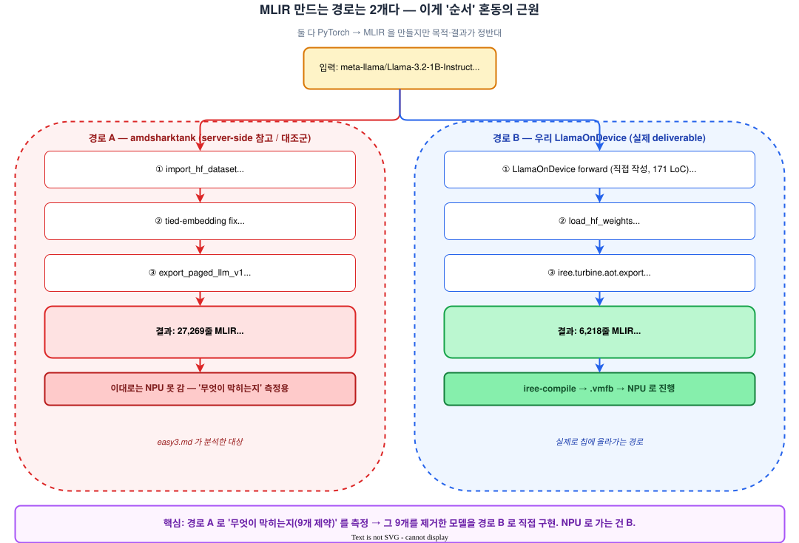

*경로 A (amdsharktank) 순서 + 9제약*
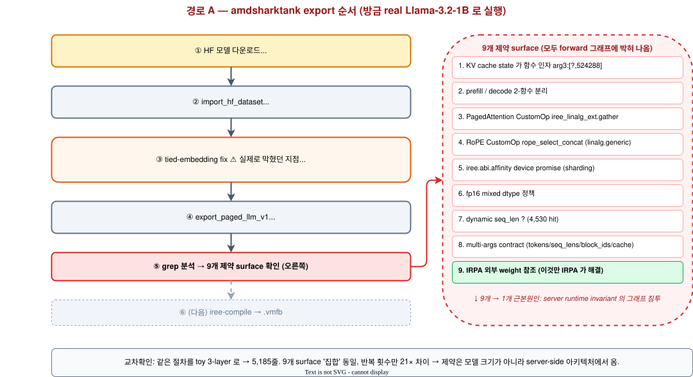

*경로 B (LlamaOnDevice) 4-stage*
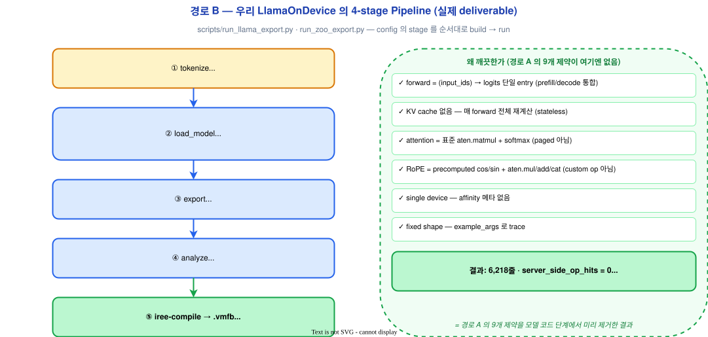

*임의 모델 입고 순서*
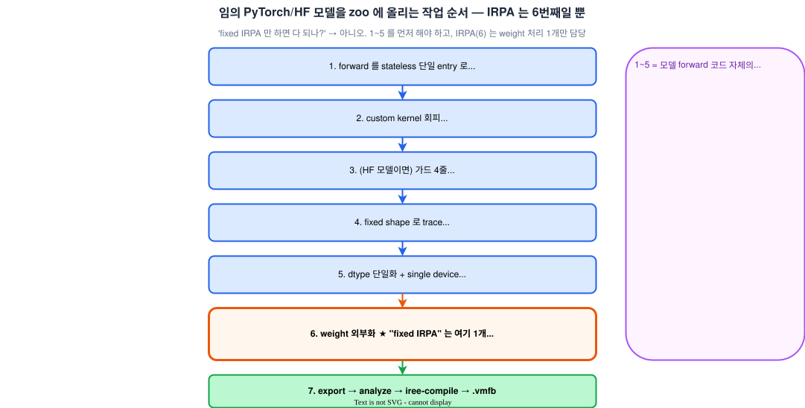

easy4-detail / easy5-fig 전용 (클래스↔IR):
- [../diagrams/export-vs-lowering.drawio](../diagrams/export-vs-lowering.drawio) — ①export-time vs lowering-time 클래스 ②prefill_bs1 1:1 매핑 ③커스터마이징 5레버

easy8 전용 (커널 우회):
- [../diagrams/kernel-bypass.drawio](../diagrams/kernel-bypass.drawio) — Page1 4커널 우회 한눈에(표준 aten→우회 IR→동기→NPU 판정) / Page2 ③ q8 INT8 dequant-fused matmul dataflow
- [../diagrams/fusion-concept.drawio](../diagrams/fusion-concept.drawio) — Page1 fusion 개념(A\*B+C, naive 6왕복 vs fusion 4왕복) / Page2 fusion은 누가 하나(AOTInductor vs iree-turbine/IREE, 공통 torch.export)

### 읽는 순서

easy.md (1개 모델 성공) → easy2.md (임의 모델은?) → easy3.md (server-side 는 왜 막히나) → easy4.md/easy4-detail.md (어떤 클래스로 그렇게 되나) → easy5-fig.md (그림으로).

### 관련 문서

- [../SHARK_AI_ANALYSIS.md](../SHARK_AI_ANALYSIS.md) — amdsharktank 사용 가드 (Step 3)
- [../../development.md](../../development.md) — 전체 status board
- [../../my.md](../../my.md) — transformer vs KV cache 해석 노트


---

<a id="sec-easy-sum"></a>

## Easy Series 요약 (easy-sum) — 한 장으로 보는 결론

> easy3 / easy4 / easy4-detail / easy5-fig 의 1페이지 압축판.
> 실측: `/tmp/llama32-irpa/llama-3.2-1b.mlir` (27,269 lines) + amdsharktank 소스 직접 대조.

---

### 0. 한 줄 결론

> **amdsharktank 파일을 부분 수정해서는 제약 9개가 다 안 빠진다. `aot.export` 에 넘기는 *최상위 모델 모듈* 을 stateless single-entry 로 교체하는 게 정답** — IRPA/export 파이프라인은 빌려 쓰고 transformer 정의만 우리 `forward` 로 대체. (= 우리 `LlamaOnDevice` 가 이미 한 일.)

---

### 1. export 에 쓰는 클래스는 두 계층

| | (A) export-time | (B) lowering-time |
|---|---|---|
| 정체 | trace 되는 `nn.Module` | `@mlir_kernel` (trace 안 됨) |
| 처리 | `torch.export` → FX 그래프 | 호출 지점에 손수 짠 MLIR `util.func` 삽입 |
| IR | `torch.aten.*` (NPU 친화 ◎) | `iree_linalg_ext.*` / `linalg.generic` (✗) |
| 예 | `PagedLlmModelV1`, `LinearLayer`, `RMSNormLayer`, `FFN`, `PagedGQAttention`, `CachedRotaryLayer` | `RoPEKernels.rope_select_concat`, `KVCacheGatherKernel` |

```
HF safetensors ─import_hf_dataset→ IRPA ─export_paged_llm_v1→ MLIR
  (A) PagedLlmModelV1 → torch.aten.*        ┐ 두 가지가
  (B) @mlir_kernel    → custom util.func    ┘ 섞인 IR
```

IR 에서 NPU 가 막히는 건 딱 4개: `@rope_select_concat`(B) · `@paged_attention_kv_cache_gather`(B, **decode 전용**) · `iree.abi.affinity` · `_scaled_dot_product_flash_attention_for_cpu`(분해 안 된 불투명 SDPA).

---

### 2. 실측이 클래스 구조를 증명 (op count = 16블록 × 함수수)

`aten.mm 226=(16·7+1)·2` · `RMSNorm 66=(16·2+1)·2` · `bmm 64`(RoPE 외적) · `silu 32` · `rope_select_concat 64` · `index_put 64` · `_sdpa 32` · **`gather 0(prefill)+32(decode)`** · `util.global 147`(weights).

핵심 비대칭 2가지:
- **gather(KV read)는 decode 전용** — prefill 은 K/V 새로 계산해 write 만, decode 만 cache 에서 custom gather 로 읽음.
- **SDPA 는 분해 안 된 블랙박스** (`_softmax` 0개).

---

### 3. 제약 9종 → 고칠 코드

| 제약 | 고칠 위치 | 수정 | 종류 |
|---|---|---|---|
| #6 fp16 mixed | `LlamaModelConfig`(llm_configs.py:579) / CLI | dtype 통일 | ✅ 설정 |
| #5 device affinity | `export_paged_llm_v1.py @fxb.export_program(arg_device=)` | `arg_device=` 제거 | ✅ 인자 |
| #7 dynamic seq_len | `export_paged_llm_v1.py:65/161` `torch.export.Dim` | 고정 shape | ✅ 드라이버 |
| #4 RoPE concat | `rotary_embedding_hf.py:390` `select_concat` | `torch.stack(...).flatten` | ⚠️ 커널교체 |
| #3 paged gather | `paged_attention.py:234-235` `kv_cache_gather` | 표준 index_select | ⚠️ 커널교체 |
| #1 KV cache arg | `llm.py:127/182` prefill/decode | cache 인자 제거·재계산 | ❌ forward 재작성 |
| #2 prefill/decode 분리 | `export_paged_llm_v1.py:56/152` | 단일 entry 통합 | ❌ 재작성 |
| #8 multi-args | 위 시그니처 | `(input_ids,)` 하나 | ❌ 재작성 |
| #9 weight 외부참조 | `Theta`/IRPA | — | 🟢 유지(이득) |

→ #3~#7(설정·커널) 5개는 부분 수정으로 빠지지만, **#1·#2·#8 은 `PagedLlmModelV1` 구조 자체**라 한 줄로 안 됨.

---

### 4. 가장 적은 코드로 가장 많이 없애는 한 수

`export_llm_v1(modelClass=PagedLlmModelV1)`(export_paged_llm_v1.py:43) 의 **modelClass 교체**:

```python
class MyOnDeviceLlama(nn.Module):
    def forward(self, input_ids):      # 단일 entry          ← #2,#8
        h = embed(input_ids)
        for blk in self.blocks:        # KV cache 없음(재계산) ← #1
            h = blk(h)                 # 표준 SDPA 분해        ← #3(gather 자체 없음)
        return lm_head(norm(h))        # 표준 cos/sin·mul·cat  ← #4
## example_args = (torch.zeros(1,T,dtype=long),)   ← #7 fixed shape
```

이 한 모듈이 **#1·#2·#3·#4·#7·#8 = 6개를 동시에** 제거. 남는 #5·#6 은 export 설정 2개, #9(IRPA) 는 그대로 재사용.

---

### 5. 우리 프로젝트의 정답 (이미 구현됨)

[`../../src/torch_mlir_zoo/models/llama_on_device.py`](../../src/torch_mlir_zoo/models/llama_on_device.py) 의 `LlamaOnDevice` 가 정확히 그 "교체 모듈". 결과: IR `server_side_op_hits = {}` ([`../../src/torch_mlir_zoo/analysis/ir_summary.py`](../../src/torch_mlir_zoo/analysis/ir_summary.py) 로 검증).

> **고칠 코드 = amdsharktank 파일이 아니라, `aot.export` 에 넘기는 최상위 모델 모듈.**
> amdsharktank 직접 패치는 위 표 ✅/⚠️ 5개가 현실적 한계, ❌ 3개는 어차피 modelClass 재작성이 답.

---

### 6. 문서 지도

| 단계 | 문서 | 한 줄 |
|---|---|---|
| 왜 막히나 | [easy3.md](easy3.md) | 제약 9종 → 1 근본원인 |
| 어떤 클래스로 | [easy4.md](easy4.md) | 클래스 27종 카탈로그 |
| 정밀 (2계층+실측) | [easy4-detail.md](easy4-detail.md) | export-time vs lowering-time + IR 1:1 |
| 그림 | [easy5-fig.md](easy5-fig.md) | [export-vs-lowering.drawio](../diagrams/export-vs-lowering.drawio) |
| 후속 Q&A | [easy6.md](easy6.md) | input dim(dynamic/static) 클래스 출처 + lowering kernel 카탈로그 + "aten만이면 lowering?" 충분조건 |
| Whisper 확장 | [easy7.md](easy7.md) | encoder-decoder. faster-whisper-int8(CT2) 입구컷 → whisper-tiny FP32 성공. 문제 kernel=opaque SDPA 1개, 성공=WhisperForwardOnly 4-가드 |
| **Llama 종합표** | [easy6-sum.md](easy6-sum.md) | 클래스 27종 사용표 + 막히는 커널 4곳 + 제약9↔클래스↔레버 + easy5-fig count 연동 |
| 커널 우회 분석 | [easy8.md](easy8.md) | amd가 왜·어떻게 우회했나 (RoPE concat·KV gather·q8 INT8·flash attn). 동기=fusion 회피, 수법=mlir_kernel splice |
| 커널 우회 정독(서술형) | [easy8-detail.md](easy8-detail.md) | easy8을 소스 한 줄씩 풀어쓴 노트 + verbatim 코드 + [kernel-bypass.drawio](../diagrams/kernel-bypass.drawio)/Mermaid 그림 |
| 커널 우회 후속 Q&A | [easy8-qna.md](easy8-qna.md) | ④ softmax→LayerNorm 대체(아니오) + ③ CustomOp/mmt_block_scaled_q8 동작 6문답 |
| SSLNPU 커널 설계 | [../kernel-design/](../kernel-design/) | 커널 *설계* 문서는 별도 폴더로 졸업 → [01-guideline-and-plan.md](../kernel-design/01-guideline-and-plan.md) (스택 담당 경계·합치는 지점·커널 구성 가이드·마이크로커널 시퀀싱·시간 임계경로) |
| 우리 성공 경로 | [easy.md](easy.md) / [easy2.md](easy2.md) | LlamaOnDevice export, 입고 기준 |
</content>


---

<a id="sec-easy"></a>

## Easy Guide — AMD-SHARK-AI 로 HF Llama-3.2-1B MLIR 뽑기

> 본인 학습용 노트. 풀어쓴 톤으로, 한 번 보면 흐름을 다시 떠올릴 수 있게.

---

### TL;DR (한 줄 요약)

> HuggingFace 의 Llama-3.2-1B 모델 (가중치 ~2.5 GB) 을 가져와서, **AMD-SHARK-AI 가 만든 export 도구** (`iree.turbine.aot.export`) 로 PyTorch → MLIR 텍스트 (~12 GB, 6 218 라인) 를 뽑고, 다시 `iree-compile` 로 `.vmfb` 라는 IREE 실행 파일 (~6 GB) 까지 만들었다. **36.86 초 만에 완료**, 도중에 paged-attention 같은 서버 전용 op 가 하나도 안 섞였다 (`server_side_op_hits = ∅`).

---

### 1. 큰 그림 — 왜 이걸 했나?

#### 1.1 풀어야 할 문제

작은 임베디드 NPU (예: 우리가 만들 target NPU) 에 LLM 을 올리려면 단계가 이렇다:

```
PyTorch 모델 (HF transformers)
      ↓  (?)
  MLIR (compiler 가 이해하는 중간 형식)
      ↓  (iree-compile 또는 우리 자체 compiler)
  실행 가능한 binary (.vmfb)
      ↓  (NPU runtime)
  실제 NPU 위에서 추론
```

문제는 첫 화살표(↓ (?)). PyTorch 모델을 *그대로* MLIR 로 뽑는 건 어렵다:

1. **HuggingFace transformers** 는 PyTorch 외에 자체 캐시·sampling·assist 로직이 섞여 있어서 `torch.export` 가 통과 못 한다.
2. **amdsharktank** 의 `PagedLlmModelV1` 는 `PagedAttention`/`KVCache`/`ThetaLayer` 같은 **서버 전용 primitives** 가 필수라서 그대로 가져오면 *우리 임베디드 NPU 에 못 들어가는* op 가 MLIR 안에 박힌다.

→ 그래서 *우리만의 PyTorch 모델* 을 직접 작성하고, *AMD-SHARK-AI 의 export 부분만* 빌려쓴다.

#### 1.2 AMD-SHARK-AI 가 무엇?

[`nod-ai/amd-shark-ai`](https://github.com/nod-ai/amd-shark-ai). AMD 의 오픈소스 ML 컴파일러 stack. 두 부분으로 나뉜다:

| 부분 | 역할 | 우리 사용? |
|---|---|:---:|
| `amdsharktank.layers/models/*` (PyTorch transformer 정의들) | server-side LLM 코드 | ❌ (안 씀 — Paged*/ThetaLayer 가 박힘) |
| `iree.turbine.aot.export` (PyTorch → MLIR export pipeline) | nn.Module 을 트레이싱해서 MLIR 텍스트로 dump | ✅ (이것만 활용) |

→ "amd-shark 의 transformer 는 안 쓰고, export pipeline 만 활용한다" — 이게 우리 프로젝트 가드.

#### 1.3 HF Llama-3.2-1B 는 무엇?

Meta 가 공개한 16-layer transformer LLM. ~1.24 B 파라미터, FP32 기준 ~4 GB. HuggingFace 의 [`meta-llama/Llama-3.2-1B-Instruct`](https://huggingface.co/meta-llama/Llama-3.2-1B-Instruct) 에서 받는다 (**gated** — access 요청 후 token 으로 다운로드).

#### 1.4 MLIR 이 무엇?

LLVM 프로젝트의 **중간 표현**. 컴파일러가 "Python 코드 모르고 CPU 명령어도 아닌, 그 중간 단계" 를 표현하는 텍스트.

PyTorch `model.forward()` 가 한 번 실행되면, 그 그래프가 MLIR 안에서는 이런 식으로 표현된다:

```mlir
module @module {
  util.global private @__auto.constant_128256_2048_torch.float32 =
      dense_resource<__auto.constant_128256_2048_torch.float32> : tensor<128256x2048xf32>
  ...
  func.func @main(%arg0: !torch.vtensor<[1,32],si64>) -> ... {
    %0 = torch.aten.embedding %weight, %arg0, ...   // 토크나이저 결과를 임베딩
    %1 = torch.aten.pow %0, %two                    // RMSNorm 의 x^2
    %2 = torch.aten.mean %1, ...                    // RMSNorm 의 평균
    ...
    %1234 = torch.aten.softmax %scores, ...         // Attention 의 softmax
    ...
    return %final : !torch.vtensor<[1,32,128256],f32>
  }
}
```

→ 사람이 읽을 수 있는 텍스트, 컴파일러가 다음 단계로 lower 할 수 있는 형식.

---

### 2. 어떻게 했나? — 한 번 따라하면 재현되는 절차

#### 2.1 환경 준비 (한 번만)

```bash
## Python 3.11 + 격리 가상환경
uv venv --python 3.11 ~/venv-shark
source ~/venv-shark/bin/activate

## 본 repo + [shark] extras (iree.turbine + iree-base-compiler/runtime)
uv pip install -e .[shark] --find-links https://iree.dev/pip-release-links.html

## HuggingFace gated 모델 accept (web 에서) + 토큰 캐시
huggingface-cli login   # 또는 이미 캐시된 토큰 사용
```

#### 2.2 PyTorch 자체 모델 (`LlamaOnDevice`)

[`src/torch_mlir_zoo/models/llama_on_device.py`](../../src/torch_mlir_zoo/models/llama_on_device.py) — 171 줄. Llama 의 핵심 4개 블록을 순수 PyTorch `nn.Module` 로 다시 짰다:

| 블록 | 의미 | 코드 위치 |
|---|---|---|
| **RMSNorm** | 정규화 (LayerNorm 의 variant) | `ops/rmsnorm.py` |
| **GQA (Grouped Query Attention)** | Self-attention with grouped KV heads | `ops/attention.py` |
| **SwiGLU** | Gated MLP, FFN block | `ops/mlp.py` |
| **RoPE** | Rotary position embedding (precomputed cos/sin) | `llama_on_device.py` 안 |

추가로 `load_hf_weights()` 함수가 HuggingFace `from_pretrained()` 의 state_dict 를 우리 모델 키에 맞게 매핑한다 (`model.layers.0.self_attn.q_proj.weight` → `layers.0.attn.q_proj.weight` 같은 prefix 정리).

**의도된 부재** (서버용 primitive 절대 안 박힘):
- ❌ KV cache (forward-only)
- ❌ paged attention
- ❌ sampling (그건 호출자 책임)
- ❌ batched generate
- ❌ vllm / flash-attn 의존

#### 2.3 Export 실행 (한 번 run)

```bash
mkdir -p artifacts logs
HF_TOKEN=$(cat ~/.cache/huggingface/token) \
  python scripts/run_llama_export.py \
    --config configs/zoo/llama_on_device_iree_turbine.yaml
```

이 한 줄이 다음 4 단계를 자동 실행한다:

```
stage 1: tokenize    → HuggingFace tokenizer 가 "Hello..." 같은 dummy 텍스트를
                       input_ids tensor (shape: (1, 32)) 로 변환
stage 2: load_model  → LlamaOnDevice 빌드 + HF 가중치 다운로드 + load_state_dict
                       (~2.5 GB safetensors 가 ~/.cache/huggingface 에 저장)
stage 3: export      → iree.turbine.aot.export(model, args) 호출
                       → MLIR 텍스트 생성 + artifacts/...mlir 에 저장
stage 4: analyze     → MLIR 안의 op_counts, dtypes, server_side_op_hits 계산
                       → ...summary.json 저장
```

소요: **~2 분** (네트워크 캐시 hit 시).

#### 2.4 IREE 컴파일 (또 한 줄)

```bash
iree-compile artifacts/llama-3.2-1b-on-device-iree-turbine.mlir \
    --iree-hal-target-backends=llvm-cpu \
    -o artifacts/llama-3.2-1b-on-device-iree-turbine.vmfb
```

소요: **36.86 초**, peak RAM ~18 GB. 결과는 `.vmfb` (IREE 의 bytecode 포맷, Zip 형식).

---

### 3. 입력 → 출력 — 실제로 무엇이 들어가고 무엇이 나오나

#### 3.1 데이터 흐름 (한 그림)

```
┌─────────────────────────────────────────────────────────────────────┐
│  INPUT                                                              │
│  ─────                                                              │
│  meta-llama/Llama-3.2-1B-Instruct                                   │
│  └── safetensors (~2.5 GB, bf16/fp16 혼합)                          │
│  └── tokenizer (~5 MB)                                              │
└─────────────────────────────────────────────────────────────────────┘
                 │
                 ▼  python scripts/run_llama_export.py
┌─────────────────────────────────────────────────────────────────────┐
│  STAGE 1 — tokenize                                                 │
│  더미 문장 "Hello, how are you?" → input_ids tensor (1, 32) int64    │
└─────────────────────────────────────────────────────────────────────┘
                 │
                 ▼
┌─────────────────────────────────────────────────────────────────────┐
│  STAGE 2 — load_model                                               │
│  LlamaOnDevice 인스턴스 + load_hf_weights(weight 다운로드/매핑)      │
│  메모리: ~4 GB (FP32 로 cast)                                       │
└─────────────────────────────────────────────────────────────────────┘
                 │
                 ▼
┌─────────────────────────────────────────────────────────────────────┐
│  STAGE 3 — export (iree.turbine.aot.export)                          │
│  FxProgramsBuilder 가 forward() 를 한 번 트레이싱                    │
│  → torch.fx.GraphModule                                              │
│  → MLIR (텍스트) 으로 직렬화                                          │
│  peak RAM 12.3 GB (그래프 + weights 복제)                            │
└─────────────────────────────────────────────────────────────────────┘
                 │
                 ▼
┌─────────────────────────────────────────────────────────────────────┐
│  OUTPUT 1 — .mlir (텍스트)                                           │
│  artifacts/llama-3.2-1b-on-device-iree-turbine.mlir                  │
│  ▸ 크기: 12.0 GB (12 021 952 245 bytes)                              │
│  ▸ 라인 수: 6 218                                                    │
│  ▸ 첫 줄: "module @module {"                                         │
│  ▸ 끝 줄: "} } #-}"  ← truncate 안 됨                                │
│  ▸ 안에 무엇:                                                        │
│    - util.global × 113 (weights 가 inline tensor literal 로 박힘)     │
│    - func.func @main (실제 forward 그래프)                            │
│    - torch.aten.* op 약 1 800 개 (16 layer 분해된 형태)               │
│                                                                     │
│  OUTPUT 2 — summary.json (메타데이터)                                │
│  artifacts/llama-3.2-1b-on-device-iree-turbine.summary.json          │
│  {                                                                  │
│    "n_lines": 6218,                                                 │
│    "op_counts": {                                                   │
│      "embedding": 1, "pow": 33, "mean": 33, "rsqrt": 33,            │
│      "transpose": 193, "view": 402, "mm": 113, "bmm": 32,           │
│      "softmax": 16, "silu": 16, ...                                 │
│    },                                                               │
│    "dtypes": { "f32": 3954, "si64": 2, "i1": 64 },                  │
│    "has_dynamic_dim": false,                                        │
│    "server_side_op_hits": {}     ← ★ 핵심: 서버 전용 op 0건            │
│  }                                                                  │
└─────────────────────────────────────────────────────────────────────┘
                 │
                 ▼  iree-compile --iree-hal-target-backends=llvm-cpu
┌─────────────────────────────────────────────────────────────────────┐
│  OUTPUT 3 — .vmfb (IREE bytecode)                                    │
│  artifacts/llama-3.2-1b-on-device-iree-turbine.vmfb                  │
│  ▸ 크기: 6.0 GB (6 010 785 023 bytes)                                │
│  ▸ 포맷: Zip archive v4.5 (file 명령으로 확인 가능)                   │
│  ▸ 안에 무엇:                                                        │
│    - 컴파일된 머신 코드 (CPU target)                                  │
│    - weights 가 raw FP32 binary 로 packed                             │
│    - IREE VM bytecode (제어 흐름)                                     │
│  ▸ 의미: 이 파일을 IREE Runtime API 로 load 하면 PyTorch 없이도        │
│         CPU 에서 Llama forward 한 번 실행 가능 (다음 turn 작업)       │
└─────────────────────────────────────────────────────────────────────┘
```

#### 3.2 사이즈가 왜 이렇게?

| 단계 | 크기 | 이유 |
|---|---|---|
| HF safetensors | 2.5 GB | bf16/fp16 혼합 압축 |
| PyTorch in-memory | 12 GB | FP32 로 캐스팅 + 그래프 트레이싱 시 중간 텐서 |
| MLIR 텍스트 | 12 GB | tensor literal 이 ASCII 십진수로 직렬화 → 매우 inflate |
| .vmfb | 6 GB | raw FP32 binary 로 packed → 자연 압축 |

> **포인트**: MLIR 텍스트의 12 GB 는 *대부분 weights 의 ASCII 표현* 이다. `aot.externalize_module_parameters` 를 적용하면 weights 를 별도 `.irpa` 파일로 분리하고 MLIR 은 수 MB 로 줄어든다. (다음 turn 후보)

---

### 4. 결과 해석 — MLIR 안에 뭐가 들어있나

#### 4.1 op count 정합성 (16-layer Llama 분해)

`summary.json` 의 op_counts 를 보면 transformer 구조가 그대로 보인다:

| op | 횟수 | 어디서 나왔나? |
|---|---:|---|
| `pow` / `mean` / `rsqrt` | 각 33 | RMSNorm × (16 layer × 2 + final) = **33** ✓ |
| `bmm` (batched matmul) | 32 | Attention 의 QK^T + AV = **16 × 2 = 32** ✓ |
| `softmax` | 16 | Attention 의 softmax = **16 layer ✓** |
| `silu` | 16 | SwiGLU 의 활성화 = **16 layer ✓** |
| `mm` (matmul) | 113 | Q/K/V/O × 4 + gate/up/down × 3 = layer 당 7개 × 16 + final lm_head 1 = **113** ✓ |
| `embedding` | 1 | 입구의 token embedding | ✓ |

→ **Llama 의 그래프가 1:1 로 ATen op 에 매핑됐다**. 누락 0건.

#### 4.2 `server_side_op_hits = ∅` 의 의미

`summary.json` 의 핵심 metric. analyzer 가 MLIR 텍스트에서 다음 서버 전용 패턴을 grep 한다:

- `paged_attention*`
- `kv_cache*`
- `vllm.*`
- `flash_attn*`

**0건**. 즉 우리 MLIR 은 *임베디드 NPU 가 직접 받을 수 있는 형식* — 서버 dependency 가 새지 않았다.

비교 대상: amdsharktank 의 `PagedLlmModelV1` 의 toy 3-layer 모델은 같은 export 거치면 4 859 라인 + `paged_attention_kv_cache_gather_*` 7회 출현. 우리는 16-layer 가 6 218 라인 + 0회. **on-device 친화 입증**.

#### 4.3 `has_dynamic_dim = false`

shape 가 모두 정적 — `(1, 32)` 같은 고정 차원. **컴파일러가 메모리 할당을 정확히 알 수 있어서 더 적극적으로 최적화 가능**. 동적 shape 면 IREE 가 fallback path 를 추가해서 코드가 커진다.

---

### 5. 장점 (이 방식의 좋은 점)

| 장점 | 설명 |
|---|---|
| **transformer 차용 0** | amdsharktank 의 PagedLlmModelV1 같은 서버 전용 코드를 import 안 했으니, 라이선스/dependency/잠재 보안 이슈 모두 회피 |
| **on-device 친화 IR** | `server_side_op_hits = ∅` 정량 입증. 우리 target NPU compiler 가 받아들일 수 있는 형식 |
| **두 backend 공존** | `torch_mlir.compile` (직접 path) + `iree.turbine.aot.export` (IREE-compile-ready) 둘 다 등록되어 있어 비교/검증 가능 |
| **정적 shape** | 컴파일러 최적화에 유리 |
| **재현 가능** | config + script 한 줄로 한 번에 재현. branch 의 framework core 는 1 byte도 안 건드림 (Design D4) |
| **iree-compile 가 통과** | `.vmfb` 가 진짜 생성됨 → 단순히 IR dump 가 아니라 *실행 가능한 binary* 까지 도달 |

---

### 6. 단점 / 한계 (솔직하게)

| 단점 | 설명 | 해소 plan |
|---|---|---|
| **MLIR 12 GB 거대** | tensor literal 이 ASCII 직렬화로 inflate. git 관리 불가, 협업 어려움. | `aot.externalize_module_parameters` → 별도 `.irpa` 파일, MLIR 본체는 수 MB |
| **FP32 라 budget 초과** | peak RAM 12.3 GB ≫ 임베디드 2 GB 한계 | Step 6 의 Q8_0 GGUF 양자화 (1.24 B × 1 byte ≈ 1.2 GB) |
| **KV cache 없음** | 매 token 마다 전체 sequence 재계산 → autoregressive 추론 느림 | Phase 3 (NPU runtime) 단계에서 KV cache 추가 — *지금은 의도된 부재* |
| **gated repo** | HF token 필요, accept 받아야 함 | unsloth 의 mirror (Q8_0) 가 자동 alternative |
| **.vmfb 실행 미검증** | binary 생성은 됐지만 실제로 IREE Runtime 으로 load 해서 forward 한 적 없음 | 다음 turn 의 numerical 비교 작업 |
| **generic CPU 경고** | `iree-compile` 가 "어떤 CPU 인지 명시 안 됨" 경고 (성능만 영향, 컴파일 자체는 성공) | `--iree-llvmcpu-target-cpu=host` 추가 |
| **sm_120 비호환** | RTX PRO 6000 Blackwell 이 현 PyTorch 와 안 맞아서 CPU fallback | export 시점에는 영향 없음 (어차피 단일 trace) |

---

### 7. 그래서 다음에 뭘 할 수 있나?

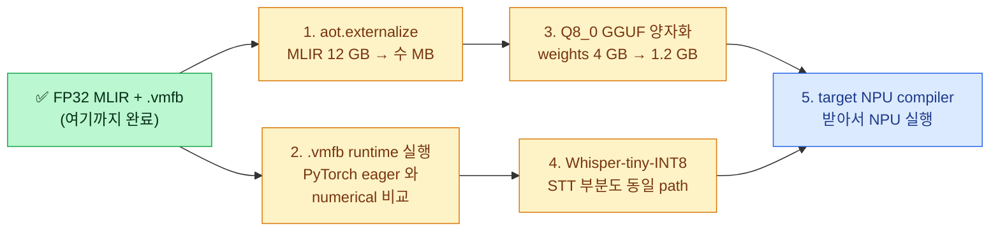

가장 가까운 거: **(1) MLIR 슬림화** (5 분 코드 추가) → **(2) numerical 검증** (~30 분) → **(3) Q8_0** (1-2 day).

---

### 8. 한 번에 따라하기 (cheat sheet)

```bash
## 1. 환경 (한 번만)
source ~/venv-shark/bin/activate

## 2. 실행
mkdir -p artifacts logs
HF_TOKEN=$(cat ~/.cache/huggingface/token) \
  python scripts/run_llama_export.py \
    --config configs/zoo/llama_on_device_iree_turbine.yaml

## 3. IREE 컴파일
iree-compile artifacts/llama-3.2-1b-on-device-iree-turbine.mlir \
    --iree-hal-target-backends=llvm-cpu \
    -o artifacts/llama-3.2-1b-on-device-iree-turbine.vmfb

## 4. 결과 확인
ls -la artifacts/llama-3.2-1b-on-device-iree-turbine.*
cat artifacts/llama-3.2-1b-on-device-iree-turbine.summary.json | python -m json.tool
file artifacts/llama-3.2-1b-on-device-iree-turbine.vmfb
```

소요: 다운로드 캐시 hit 시 **~3 분**, 첫 다운로드 시 **~10 분 + 모델 크기**.

---

### 9. 참고 문서 (더 깊이)

- 정량 결과 보고서 — [`REPORT-2026-05-27-llama-step5-complete.md`](../../REPORT-2026-05-27-llama-step5-complete.md)
- 전체 status board — [`development.md`](../../development.md)
- 다른 lowering recipe — [`docs/RECIPES-zoo.md`](../RECIPES-zoo.md)
- AMD-SHARK-AI 분석 — [`docs/SHARK_AI_ANALYSIS.md`](../SHARK_AI_ANALYSIS.md)
- 통합 보고서 — [`REPORT-2026-05-26-amd-shark-integration.md`](../../REPORT-2026-05-26-amd-shark-integration.md)

---

### 10. 한 줄 mental model (다음에 까먹었을 때 떠올리는 그림)

> **"HF Llama 가중치를 다운로드 → 우리가 짠 PyTorch Llama 에 끼워 넣기 → AMD-SHARK 의 export 도구가 한 번 forward 트레이싱 → 결과를 MLIR 텍스트로 dump → iree-compile 이 그 MLIR 을 받아서 CPU 용 .vmfb 로 컴파일."**
>
> 핵심 검증: MLIR 안에 `paged_attention` 같은 서버 전용 op 가 하나도 안 박혀 있어야 한다 (`server_side_op_hits = ∅`).


---

<a id="sec-easy2"></a>

## Easy Guide 2 — Llama 가 아닌 다른 유명 HF 모델도 MLIR 로 뽑을 수 있나?

> 본인 학습용 노트 — [`easy.md`](easy.md) 의 후속편. easy.md 가 *"우리가 직접 짠 LlamaOnDevice 를 MLIR 로 뽑았다"* 면, 이 문서는 *"그럼 HuggingFace 에서 가져온 다른 모델들도 똑같이 되는가?"* 의 실험 보고서다.

---

### TL;DR (한 줄 요약)

> 7개 유명 HF/PyTorch 모델 (distilgpt2 / gpt2 / opt-125m / pythia-160m / qwen2.5-0.5b / tinyllama-1.1b / bert-base) 을 같은 `iree.turbine.aot.export` pipeline 으로 돌렸더니, **4 개는 그대로 통과, 3 개는 export 실패**. 통과한 모델은 전부 `server_side_op_hits = 0` (paged_attention 같은 opaque op 0 개) — clean. **실패의 근본 원인은 두 가지** — (1) HF Llama 계열이 forward 에서 `self.layers[:N]` slicing 하는 부분이 torch.fx ModuleStackTracer 와 충돌, (2) HF OPT 가 LayerNorm 에서 FakeTensor device mismatch. **결론: "임의 HF 모델 = 곧바로 통과" 는 거짓**. 그래서 easy.md 의 *우리가 직접 짠 LlamaOnDevice* 가 필요한 거였다.

---

### 0. 이게 PDF 의 어느 박스 이야기인가? — "PyTorch Model Zoo" (보라색 점선 최상단)

이 문서는 PDF (`torch_mlir_model_zoo.pdf`) 다이어그램에서 **보라색 점선으로 묶인 최상단 영역**, 그중에서도 맨 위의 **`PyTorch Model Zoo` 박스** 한 칸에 대한 이야기다.

```
┌─ 보라색 점선 (compiler stack 최상단 frontend) ────────────────────┐
│  ┌────────────────────────────────────────────────────────┐     │
│  │  📦 PyTorch Model Zoo   ← 이 문서 (빨강: To Implement)   │     │  ← 최상단
│  └────────────────────────────────────────────────────────┘     │
│  ┌──────────────┐                                                │
│  │  Torch-MLIR  │           (파랑: To Modify)                    │
│  └──────────────┘                                                │
│  ┌────────────────────────────────────────────────────────┐     │
│  │  Torch-MLIR Compiler    (파랑: To Modify)                │     │
│  └────────────────────────────────────────────────────────┘     │
└──────────────────────────────────────────────────────────────────┘
            ↓  (여기부터는 외부 / 프로젝트 리드 담당)
   IREE Compiler → Runtime → HAL → target NPU HW
```

#### 0.1 이 박스의 임무 (PDF "목적 / 개요" 그대로)

> - "Torch-MLIR 의 **Input (PyTorch) Model Zoo** 구축"
> - "PyTorch Model Zoo 를 구축함으로써 **구현한 모델에 대한 MLIR 생성을 자동화**"
> - "Model Zoo 를 확장해가며 **여러 LLM 아키텍처에 대한 구현·수정을 용이**하게"

세 줄을 한 문장으로: **"여러 PyTorch 모델을 모아두고, 각각을 버튼 한 번에 MLIR 로 떨궈주는 입력 창고(zoo)를 만든다."**

- `Torch-MLIR` / `Torch-MLIR Compiler` (아래 두 파랑 박스) 는 *남이 만든 것을 우리가 약간 고쳐 쓰는* 부분.
- `PyTorch Model Zoo` (맨 위 빨강 박스) 는 *우리가 처음부터 만드는* 부분 — 그래서 "To Implement".

→ easy.md 가 이 박스에 **모델 1개 (Llama)** 를 넣어본 것이고, **이 문서 (easy2) 는 "이 창고에 아무 PyTorch 모델이나 넣을 수 있나? 제약이 뭔가?" 를 실측한 것**이다.

#### 0.2 핵심 질문 = "창고 입고 기준"

PDF 는 "Model Zoo 를 확장" 한다고만 적혀 있지, *어떤 모델이 들어갈 수 있는지* 입고 기준은 안 적혀 있다. 그 기준을 실험으로 채우는 게 이 문서의 목적:

| 질문 | 답 (이 문서) |
|---|---|
| 아무 PyTorch 모델이나 zoo 에 넣으면 MLIR 가 자동 생성되나? | **아니다.** 모델 forward 코드의 *작성 방식* 에 따라 통과/실패가 갈린다 (§5). |
| 그럼 무엇이 통과하나? | "가드 4 줄 + forward 가 깨끗한 모델" (§7.3). GPT-2 / Pythia / BERT 류 (§4). |
| 무엇이 막히나? | HF Llama 계열 (slicing 한 줄), OPT (device mismatch), MoE (routing) (§7.2). |
| 막히면 어떻게 zoo 에 넣나? | easy.md 처럼 *forward-only 사본* 을 직접 써서 넣는다 (§5.1). |

→ **즉 "PyTorch Model Zoo 박스" 의 제약 조건 = 이 문서 §5 (왜 막히나) + §7 (입고 기준)** 이다.

---

### 1. 큰 그림 — 무엇을 확인하려 했나?

easy.md 1.1 에서 본 문제: HuggingFace 의 Llama 를 *그대로* MLIR 로 뽑는 건 어렵다고 했다. 그래서 우리는 *우리만의 PyTorch 모델* (`LlamaOnDevice`) 을 짰다.

자연스러운 후속 질문:

> *"HF Llama 가 어려운 건 알겠는데, 다른 모델들 (GPT-2, BERT, OPT…) 은? 그건 그대로 들어가나? 아니면 모든 HF 모델마다 우리가 직접 다시 써야 하나?"*

이 문서는 그 질문에 대한 **실험 답변**.

#### 1.1 가설 (실험 전)

| 가설 | 예상 |
|---|---|
| 모든 HF 모델은 그대로 통과한다 | 통과 — `attn_implementation="eager"` 만 주면 OK |
| 일부만 통과한다 | 통과 — 어떤 게 막히고 어떤 게 되는지 자체가 정보 |
| 다 막힌다 | 통과 — 그럼 LlamaOnDevice 같은 hand-write 가 항상 필요 |

→ 결과는 가운데 가설이 맞았다. 단순한 transformer (GPT-2 / BERT / Pythia) 는 통과, Llama 가족 모델들은 막힘.

---

### 2. 후보 — 어떤 모델들로 비교했나?

전부 small + ungated (HF_TOKEN 없이 다운로드 가능). 비교 목적상 *분류군마다* 한두 개씩 골랐다.

| 별명 | HF id | 패밀리 | 파라미터 | 비고 |
|---|---|---|---:|---|
| `distilgpt2` | `distilgpt2` | gpt2 | 82 M | 가장 작은 decoder, distillation |
| `gpt2-small` | `gpt2` | gpt2 | 124 M | 고전 decoder (LayerNorm + GELU) |
| `opt-125m` | `facebook/opt-125m` | opt | 125 M | Meta pre-Llama, learned positional emb |
| `pythia-160m` | `EleutherAI/pythia-160m` | gpt-neox | 162 M | RoPE, parallel attention/MLP |
| `qwen2.5-0.5b` | `Qwen/Qwen2.5-0.5B-Instruct` | **llama** | 494 M | Llama-family (RMSNorm/SwiGLU/RoPE/GQA) |
| `tinyllama-1.1b` | `TinyLlama/TinyLlama-1.1B-Chat-v1.0` | **llama** | 1.1 B | Llama-arch 22-layer |
| `bert-base` | `bert-base-uncased` | bert | 110 M | encoder-only 대조군 |

reference: 본 zoo 의 [`LlamaOnDevice`](../../src/torch_mlir_zoo/models/llama_on_device.py) (Llama-3.2-1B-Instruct 가중치 로드) — easy.md 에서 export 완료된 것 (~1.24 B 파라미터).

---

### 3. 실험 절차 — 한 번 따라하면 재현됨

전부 [`scripts/run_hf_models_export.py`](../../scripts/run_hf_models_export.py) 한 스크립트로 묶었다. 모델별 절차는 동일:

```python
## 1) load — eager attention 강제 (SDPA fused op 차단)
m = AutoModelForCausalLM.from_pretrained(
    hf_id, torch_dtype=torch.float32, attn_implementation="eager"
).eval()

## 2) wrap — forward(input_ids) -> tensor 로 정형화 (HF 의 ModelOutput dict 제거)
class CausalLMWrapper(nn.Module):
    def __init__(self, m): super().__init__(); self.model = m
    def forward(self, input_ids):
        return self.model(input_ids, use_cache=False, return_dict=False)[0]
wrapped = CausalLMWrapper(m)

## 3) export — easy.md 와 같은 진입점
mlir_text = export_via_iree_turbine(
    wrapped, (torch.zeros(1, 32, dtype=torch.long),), func_name="forward"
)

## 4) analyze — 우리 ir_summary
summary = summarize(mlir_text)
```

세 가지 핵심 가드:

- **`attn_implementation="eager"`** — 없으면 transformers 가 `F.scaled_dot_product_attention` 으로 내려가서 `_scaled_dot_product_flash_attention_for_cpu` opaque op 가 박힌다 (이전 turn `arbitrary_model` 실험에서 확인됨).
- **`use_cache=False` + `return_dict=False`** — KV cache 분기 / 사전 객체 unwrap 제거.
- **fixed-shape input** — `(1, 32)` int64. dynamic dim 비활성.

실행:
```bash
source ~/venv-shark/bin/activate
HF_TOKEN=$(cat ~/.cache/huggingface/token) \
  python scripts/run_hf_models_export.py
```

각 모델은 별도 subprocess 가 아니라 같은 프로세스에서 순차 실행 — 캐시 hit 이후엔 한 모델당 5-15 초.

---

### 4. 결과 — 4 통과 / 3 실패

전체 표 (`logs/hf-zoo/results.json` 와 동일):

| 모델 | 패밀리 | 상태 | params | MLIR lines | n_ops | unique | srv_hits | export |
|---|---|:---:|---:|---:|---:|---:|---:|---:|
| `distilgpt2` | gpt2 | ✅ ok | 81.9 M | 2,255 | 596 | 26 | **0** | 4.7 s |
| `gpt2-small` | gpt2 | ✅ ok | 124.4 M | 4,397 | 1,166 | 26 | **0** | 6.1 s |
| `opt-125m` | opt | ❌ **fail** | 125.2 M | — | — | — | — | — |
| `pythia-160m` | gpt-neox | ✅ ok | 162.3 M | 4,488 | 1,256 | 26 | **0** | 6.2 s |
| `qwen2.5-0.5b` | **llama** | ❌ **fail** | 494.0 M | — | — | — | — | — |
| `tinyllama-1.1b` | **llama** | ❌ **fail** | 1.1 B | — | — | — | — | — |
| `bert-base` | bert | ✅ ok | 109.5 M | 3,995 | 1,069 | 20 | **0** | 4.1 s |
| `LlamaOnDevice` (ref) | llama-hand | ✅ ok | 1.24 B | 6,218 | (n/a) | (n/a) | **0** | 5.3 s |

**Pattern**:
- ✅ 통과: GPT-2 계열, Pythia (GPT-NeoX), BERT
- ❌ 실패: **HF Llama 계열 두 개** (Qwen2.5, TinyLlama) — 같은 root cause
- ❌ 실패: OPT — 다른 root cause
- ✅ Llama 도 **우리가 직접 짜면** 통과 (reference)

`server_side_op_hits = 0` 가 통과 모델 전부에서 확인. 즉 통과한 4 개는 NPU 친화적인 깨끗한 IR. easy.md 의 가드(`paged_attention` 같은 게 박히면 NG)가 4 개 모두에서 충족.

---

### 5. 왜 실패하나? — 근본 원인 분석

#### 5.1 HF Llama 계열 (Qwen2.5, TinyLlama)

에러:
```
TypeError: _ModuleStackTracer.__init__.<locals>.AttrProxy.__init__()
           missing 1 required positional argument: 'path'

  File ".../transformers/models/llama/modeling_llama.py", in forward
    for decoder_layer in self.layers[: self.config.num_hidden_layers]:
                         ~~~~~~~~~~~^^^^^^^^^^^^^^^^^^^^^^^^^^^^^^^^^
  File ".../torch/nn/modules/container.py", in __getitem__
    return self.__class__(list(self._modules.values())[idx])
```

**원인**: HF Llama (그리고 Qwen 등 같은 modeling_llama 를 재사용하는 모델) 가 forward 안에서 `self.layers[: self.config.num_hidden_layers]` 식 slicing 을 한다. 이 slicing 은 `nn.ModuleList.__getitem__` 을 호출하고, slicing 결과는 **새로운 ModuleList 인스턴스** 를 만든다.

torch.fx 의 `ModuleStackTracer` 는 추적 도중 module 의 attribute access 를 `AttrProxy` 로 hook 하는데, 이 hook 은 *static module hierarchy* 를 가정한다. *forward 안에서 새로 생성된 ModuleList* 는 hierarchy 에 없으므로 `AttrProxy` 생성자 시그니처 (`path` 인자 필수) 가 어긋난다.

**우리 `LlamaOnDevice` 는 왜 통과하는가?**
[src/torch_mlir_zoo/models/llama_on_device.py](../../src/torch_mlir_zoo/models/llama_on_device.py):
```python
def forward(self, input_ids):
    x = self.embed_tokens(input_ids)
    for layer in self.layers:                # ← 그냥 iterate. slicing 없음.
        x = layer(x)
    return self.lm_head(self.norm(x))
```

→ **딱 한 줄 차이**. HF 는 `self.layers[: N]`, 우리는 `self.layers` 그대로 iterate. 이 한 줄이 export 통과/실패를 가른다.

**우회 방법** (HF 모델을 그대로 쓰고 싶다면):
- monkey-patch `LlamaModel.forward` 로 `self.layers[:N]` 을 `self.layers` (혹은 `list(self.layers)[:N]`) 로 교체
- 또는 `torch.export.export(..., strict=False)` — 일부 케이스에서 우회 (검증 안 함)
- 가장 안전: easy.md 처럼 **forward-only 사본을 직접 작성하고 HF 가중치만 load** (우리 zoo 의 길)

#### 5.2 OPT-125M

에러:
```
RuntimeError: Unhandled FakeTensor Device Propagation for
              aten.native_layer_norm.default,
              found two different devices meta, cpu
```

**원인**: torch.export 트레이싱은 `FakeTensor` (meta device) 로 dry-run 을 한다. OPT 의 LayerNorm 구현이 어디선가 *real cpu tensor* 와 *meta tensor* 를 같이 받는 path 를 만든다. `aten.native_layer_norm` 의 device propagation 이 `(meta, cpu)` 둘을 합쳐야 하는데 합치는 규칙이 정의 안 되어 reject.

이건 transformers 의 OPT 구현이 model attributes 를 forward 안에서 `to(device)` 하는 패턴 때문일 가능성 높음. transformers >= 4.50 에서 흔히 보고된 이슈.

**우회 방법**:
- 모델 전체를 명시적으로 `.to("meta")` 로 옮긴 뒤 export (실험 필요)
- 또는 위와 같이 forward 를 우리가 다시 작성 (시간 비용 큼)
- 또는 OPT 구버전 transformers (≤ 4.44) 로 다운그레이드

#### 5.3 통과 모델들은 왜 통과했나?

[modeling_gpt2.py](https://github.com/huggingface/transformers/blob/main/src/transformers/models/gpt2/modeling_gpt2.py), [modeling_bert.py](https://github.com/huggingface/transformers/blob/main/src/transformers/models/bert/modeling_bert.py), [modeling_gpt_neox.py](https://github.com/huggingface/transformers/blob/main/src/transformers/models/gpt_neox/modeling_gpt_neox.py) 모두:

```python
for i, block in enumerate(self.h):           # GPT-2
for layer_module in self.layer:              # BERT
for i, layer in enumerate(self.layers):      # GPT-NeoX (Pythia)
    ...
```

→ 전부 plain iteration. ModuleList slicing 없음. attribute mutation 없음. 그래서 ModuleStackTracer 가 깨끗하게 통과.

---

### 6. 통과한 모델들의 op 비교

ir_summary 가 dump 한 top-12 ops (각 모델별):

#### BERT-base (encoder)
```
264 view  · 195 mul · 160 add · 84 transpose · 72 mm · 49 expand · 49 clone
48 permute · 25 var_mean · 25 sub · 25 rsqrt · 24 bmm
```
- attention 은 `bmm` 으로 (`batch matmul`) — 한 줄
- `var_mean + rsqrt + sub` 트리플 = LayerNorm 의 fused 분해 (`aten.native_layer_norm` 단일 op 가 *아님*)

#### GPT-2 small (decoder)
```
209 view · 195 mul · 159 add · 120 slice · 61 transpose · 60 expand · 49 mm
49 clone · 25 var_mean · 25 unsqueeze · 25 sub · 25 rsqrt
```
- BERT 와 거의 같은 op set + `slice` (causal mask)
- `var_mean+rsqrt+sub` LayerNorm 동일

#### Pythia-160M (GPT-NeoX, RoPE)
```
209 mul · 198 view · 174 slice · 158 add · 86 transpose · 63 expand
52 unsqueeze · 49 mm · 49 clone · 49 cat · 25 var_mean · 25 sub
```
- `cat` 49 개 → RoPE 의 rotate-half (`cat([-x2, x1])`)
- `cos / sin` 도 IR 에 보임 (이전 cell 출력)
- 결국 RoPE 가 들어가도 *전부 표준 `aten.*` 로 분해됨* — easy.md 의 LlamaOnDevice RoPE 와 동등

#### distilGPT-2
```
107 view · 99 mul · 81 add · 60 slice · 31 transpose · 30 expand · 25 mm
25 clone · 13 var_mean · 13 unsqueeze · 13 sub · 13 rsqrt
```
- GPT-2 small 의 정확한 *반쪽* (layer 수가 6 vs 12) — 비례 일치, 좋은 sanity check.

#### 4 개 모델 공통 op set (서버 전용 0)
```
view · mul · add · transpose · mm · expand · clone · slice
var_mean · sub · rsqrt · embedding · softmax · permute · bmm
```
→ easy.md 의 Llama 통과 op set 과 거의 동일 (Llama 추가: `silu` / `repeat_interleave` / `triu`). **새로 등장한 server-side op 0 개**.

→ NPU 컴파일러가 이 17~20 개 op 만 lower 할 줄 알면 통과 4 + Llama(hand) = 5 개 모델 동시 커버.

---

### 7. 그래서 — 임의 HF 모델을 다 올릴 수 있나? ("PyTorch Model Zoo" 입고 기준)

**아니오, 그대로는 못 올린다.** 하지만 모든 모델이 망가지는 것도 아니다. 패턴이 명확하다. 아래가 §0 에서 말한 *"Model Zoo 박스의 입고 기준"* 의 실측 버전이다.

#### 7.1 통과하는 부류 (그대로 됨)

`transformers/models/<arch>/modeling_*.py` 의 forward 가:
- ModuleList 를 plain iterate (no slicing)
- module attribute mutation 없음 (`.to(device)`, `register_buffer` 등 forward 내 호출 없음)
- 외부 cuda 동기화 없음
- 자체 fused op (`F.scaled_dot_product_attention` 자동 사용 안 함; `attn_implementation="eager"` 로 가드 가능)

→ 해당하는 패밀리: **GPT-2 / GPT-NeoX(Pythia) / BERT / DistilBERT / RoBERTa (추정) / GPT-J (추정)**.

#### 7.2 막히는 부류 (수동 작업 필요)

- **Llama 계열** (Llama / Qwen / Mistral / TinyLlama / Yi / DeepSeek-V2) — 전부 modeling_llama 의 slicing 패턴 때문. 우회: easy.md 의 `LlamaOnDevice` 처럼 forward 만 다시 쓰고 weights 만 load.
- **OPT** — FakeTensor device mismatch (transformers ≥ 4.50). 우회: 다운그레이드 or 직접 작성.
- **MoE 모델** (Mixtral, Qwen-MoE, DeepSeek-MoE) — *expert routing 자체가 data-dependent control flow*. 추적 자체가 어려움 — 별도 연구.
- **vLLM 친화 모델** (paged attention 변종) — easy.md 1.1 에서 다룬 case.

#### 7.3 *항상* 적용해야 할 가드 4 줄

지금 통과 4 모델 모두에 들어간 boilerplate:

```python
from_pretrained(..., torch_dtype=torch.float32,
                     attn_implementation="eager")  # ① 흐름1: SDPA fused op 차단
m.eval()                                           # ② 흐름2: dropout 비활성, BN running stat 고정
class W(nn.Module):
    def __init__(self, m): super().__init__(); self.model = m
    def forward(self, x):
        return self.model(x, use_cache=False,      # ③ 흐름3: KV cache 분기 제거
                          return_dict=False)[0]    # ④ 흐름4: ModelOutput dict unwrap
```

4 줄 모두 lowering 통과 여부에 직접 영향. 누락 시 발생하는 증상:

| 빠진 가드 | 증상 |
|---|---|
| ① `attn_implementation="eager"` | `_scaled_dot_product_flash_attention_for_cpu` opaque op 등장, srv_hits ≥ 1 |
| ② `m.eval()` | dropout `aten.dropout` random branch 추적 실패 가능 |
| ③ `use_cache=False` | `past_key_values` Optional 분기로 인한 conditional, dynamic shape |
| ④ `return_dict=False` | `ModelOutput` dataclass 가 trace 결과 tuple 이 아니라 dict → wrapper layer 출력 형식 깨짐 |

---

### 8. 단순 mental model

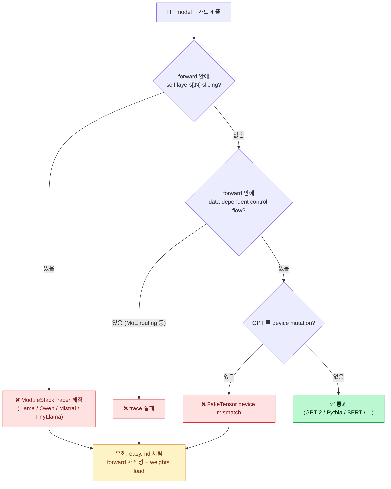

---

### 9. 다음 단계 (이 문서 범위 밖)

1. **Llama HF monkey-patch PoC** — `modeling_llama.LlamaModel.forward` 의 slicing 한 줄만 교체해서 그대로 export 되는지 확인. 성공하면 weights 재사용성 ↑.
2. **safetensors-only loader** — easy.md §1.1 에서 본 *transformers 의존성 제거* 와 연계. 통과 4 모델은 전부 `safetensors` 만으로 load 가능 (HF cache `model.safetensors` 사용).
3. **iree-compile → .vmfb** — 통과 4 모델 IR 을 easy.md 의 ${iree-compile}$ 단계로 실제 binary 생성. NPU backend 도착 가능성 검증.
4. **Pythia/BERT 의 IR 슬림화** (`aot.externalize_module_parameters`) — easy.md §7 의 12 GB → 수 MB 와 같은 작업.

---

### 10. 한 번에 따라하기 (cheat sheet)

```bash
## 1. 환경 (한 번만; easy.md 와 같은 venv)
source ~/venv-shark/bin/activate
pip install transformers              # tokenizer 없이도 OK; AutoModel*는 필요

## 2. 실험 실행
cd <torch-mlir-zoo worktree>
mkdir -p logs/hf-zoo
HF_TOKEN=$(cat ~/.cache/huggingface/token) \
  python scripts/run_hf_models_export.py

## 3. 결과 확인
cat logs/hf-zoo/results.json | python -m json.tool | head -120
ls -la logs/hf-zoo/*.mlir
## 통과 4 모델: distilgpt2 / gpt2-small / pythia-160m / bert-base
## 실패 3 모델: opt-125m / qwen2.5-0.5b / tinyllama-1.1b

## 4. 단일 모델만 다시
python scripts/run_hf_models_export.py gpt2-small
```

총 소요 (캐시 hit 후): 통과 4 + 실패 3 = **~ 1.5 분** (TinyLlama 다운로드 첫 회는 + 45 초).

---

### 11. 한 줄 요약 (다음에 까먹었을 때)

> **"HF 모델을 그대로 MLIR 로 뽑는 건 *가족에 따라* 된다 / 안 된다 — GPT-2 / Pythia / BERT 류는 가드 4 줄 (`eager attn` / `eval` / `use_cache=False` / `return_dict=False`) 만 채우면 통과, Llama 계열은 modeling_llama 의 `self.layers[:N]` slicing 한 줄 때문에 막힌다. 그래서 easy.md 의 LlamaOnDevice 같은 *forward-only 사본 + HF weights load* 패턴이 유지된다."**

→ "임의 HF 모델 = 자동 통과" 는 거짓. **"가드 4 줄 + forward 가 깨끗한 모델 = 자동 통과"** 가 맞다.

---

### 참고 문서

- [`easy.md`](easy.md) — Llama 직접 export (전편)
- [`my.md`](../../my.md) — transformer vs KV cache 해석
- [`REPORT-2026-05-27-llama-step5-complete.md`](../../REPORT-2026-05-27-llama-step5-complete.md) — Step 5 .vmfb 완료 보고
- [`docs/SHARK_AI_ANALYSIS.md`](../SHARK_AI_ANALYSIS.md) — amd-shark-ai 사용 가드
- [`scripts/run_hf_models_export.py`](../../scripts/run_hf_models_export.py) — 본 실험 스크립트


---

<a id="sec-easy3"></a>

## Easy Guide 3 — AMD-SHARK-AI 깊이 분해 + 임의 모델 lowering 제약 (PDF Step 3 빡세게)

> 본인 학습용 노트 — easy.md / easy2.md 의 후속편.
>
> 이 문서는 PDF "보라색 점선 최상단" 안의 **Step 3 (AMD-SHARK-AI 분석)** 을 다시 한 번, 이번엔 **실측 MLIR + amdsharktank 소스 코드 기준** 으로 빡세게 파헤친다. 결과를 손에 쥐고 "fixed IRPA 만 적용하면 임의 모델이 다 lowering 되는가?" 에 정직히 답한다.

---

### TL;DR (한 줄 요약)

> amdsharktank 의 `export_paged_llm_v1` 으로 **real `meta-llama/Llama-3.2-1B-Instruct`** (HF safetensors → IRPA 변환 후) 를 진짜 MLIR (`/tmp/llama32-irpa/llama-3.2-1b.mlir`, **27,269 lines, 2.4 MB**) 로 뽑아 surface 를 직접 셌다. 제약은 9개 — *KV cache state argument · prefill/decode 2-함수 split · paged_attention CustomOp (`iree_linalg_ext.gather`) · RoPE `apply_rotary_embedding` CustomOp (`linalg.generic` 템플릿) · `iree.abi.affinity` device promise · fp16 강제 dtype 정책 · dynamic seq_len `?` · 단계마다 다른 entry-point · IRPA 외부 weight 참조* — 인데, **밑에 깔린 1개 원인** 으로 묶인다: *"server-side runtime 의 *런타임 invariant* (KV slab 위치, sampling kernel, device assignment, weight archive 경로) 가 model 의 forward 그래프 안에 *함수 인자/custom op* 로 박혀 있다."* **fixed IRPA 적용은 9개 중 1개만 (weight 외부화)** 해결한다 — 나머지 8개는 별개 작업. 그래서 "fixed IRPA = 만능키" 는 거짓. (동일 9개 surface 가 toy 3-layer Llama 에서도 5,185-line 으로 재현됨 → 제약은 *모델 크기* 가 아니라 *아키텍처/runtime 가정* 의 문제임을 교차 확인.)

> 📊 **그림 요약**: 전체 순서(두 경로 / amdsharktank 순서 / LlamaOnDevice 순서 / 6단계 로드맵 / 임의 모델 입고 순서)는 [`docs/diagrams/lowering-order.drawio`](../diagrams/lowering-order.drawio) 5페이지 다이어그램 참조 (draw.io / VS Code draw.io 확장에서 열기).

---

### 0. 이 문서가 다루는 PDF 박스

[easy2.md §0](easy2.md) 의 그림에서 빨강 `PyTorch Model Zoo` 박스 — 그중에서도 *"server-side 사례를 분석해서 on-device 로 옮길 때 무엇이 막히는지"* 가 PDF §3 의 요구사항.

```
┌─ 보라색 점선 ──────────────────────────────────────┐
│  📦 PyTorch Model Zoo  ◀ easy2 = "어떤 모델이 들어갈 수 있나"  │
│                        ◀ easy3 = "amdsharktank server-side 를   │
│                                   on-device 로 옮길 때의 제약" │
│  Torch-MLIR / Torch-MLIR Compiler                              │
└────────────────────────────────────────────────────┘
```

- easy.md = 우리가 만든 `LlamaOnDevice` 1 모델 lowering 성공
- easy2 = HF 모델 7개 통과/실패 surface
- **easy3 = amdsharktank 서버 모델 lowering surface 측정 + 그 surface 를 만들어내는 unified principle 발견**

---

### 1. 실측 셋업 (반복 가능)

```bash
source /home/bohyun/venv-shark/bin/activate    # Python 3.11.15

## ── real Llama-3.2-1B-Instruct path (이 문서의 main ground truth) ──
SNAP=~/.cache/huggingface/hub/models--meta-llama--Llama-3.2-1B-Instruct/snapshots/*/

## 1) HF safetensors → IRPA 변환
python -m amdsharktank.tools.import_hf_dataset \
  --config-json ${SNAP}config.json \
  --params ${SNAP}model.safetensors \
  --output-irpa-file /tmp/llama32-irpa/llama-3.2-1b.irpa

## 1b) tied embedding fix — Llama-3.2-1B 은 tie_word_embeddings=True 라
##     import 결과에 lm_head(`output.weight`) 가 없음. token_embd.weight 를
##     output.weight 로 복제해 재저장 (안 하면 export 가 KeyError ['output']).
##     (코드: easy3 §2.4 snippet 참조)
##     → /tmp/llama32-irpa/llama-3.2-1b-tied.irpa

## 2) IRPA → MLIR export (amdsharktank 의 production entry-point)
python -m amdsharktank.examples.export_paged_llm_v1 \
  --irpa-file /tmp/llama32-irpa/llama-3.2-1b-tied.irpa \
  --output-mlir /tmp/llama32-irpa/llama-3.2-1b.mlir \
  --output-config /tmp/llama32-irpa/llama-3.2-1b.json \
  --bs-prefill 1 --bs-decode 1 \
  --activation-dtype float16 --attention-dtype float16

## ── (교차확인용) toy 3-layer Llama path — 같은 9개 surface 가 작게 재현 ──
python -m amdsharktank.models.llama.toy_llama -o /tmp/toy_llama.irpa
python -m amdsharktank.examples.export_paged_llm_v1 \
  --irpa-file /tmp/toy_llama.irpa --output-mlir /tmp/toy_llama.mlir \
  --output-config /tmp/toy_llama.json --bs-prefill 1 --bs-decode 1 \
  --activation-dtype float16 --attention-dtype float16
```

산출물 (real Llama-3.2-1B):
- `llama-3.2-1b.irpa` — 2.47 GB (HF import), tied fix 후 2.8 GB. weights + GGUF-style 하이퍼파라미터 메타
- `llama-3.2-1b.mlir` — 2.4 MB, **27,269 lines** ← 이 파일이 §3-§5 의 main ground truth
- `llama-3.2-1b.json` — export config (function signature 메타)

교차확인용 (toy 3-layer): `toy_llama.mlir` — 451 KB, **5,185 lines**. 같은 9개 surface, 5.3× 작음.

---

### 2. IRPA — 정확히 무엇인가?

#### 2.1 정의

**IRPA = IREE/SHARK Runtime Parameter Archive.** amdsharktank 의 자체 weight 직렬화 포맷. 파일 시그니처 / scheme:

```python
## amdsharktank/types/theta.py:434
@dataclass
class DatasetMetadata:
    """When saved to an IRPA file, it will be saved with multiple keys:
      * properties:        __AMD_SHARK_DATASET__
      * inference_tensors: __AMD_SHARK_INFERENCE_TENSORS__
      * optional(shard_ranks): __AMD_SHARK_SHARD_RANKS__
    """
```

직접 실측 (`Dataset.load("/tmp/llama32-irpa/llama-3.2-1b-tied.irpa")` — real Llama-3.2-1B):

```python
properties keys:
  'general.architecture', 'llama.attention.head_count',          # 32
  'llama.attention.head_count_kv',                               # 8 (GQA)
  'llama.attention.head_dim', 'llama.attention.layer_norm_rms_epsilon',
  'llama.block_count',                                           # 16
  'llama.context_length', 'llama.embedding_length',              # 2048
  'llama.feed_forward_length',                                   # 8192
  'llama.rope.dimension_count', 'llama.rope.freq_base',          # 500000
  'llama.rope.interleave_emb', 'llama.vocab_size',               # 128256
  # export 가 IRPA 에 도로 적어넣은 runtime 옵션들 (= "fixed IRPA" 의 실체):
  'activation_dtype', 'attention_dtype', 'attention_kernel',
  'block_seq_stride', 'kv_cache_type', 'fake_quant',
  'tensor_parallelism_size', 'parallelism_config', 'use_qk_norm',
  'AMD_SHARK_DATASET_VERSION'

root_theta tensors (sample):
  token_embd.weight           [128256, 2048]  bf16
  blk.0.attn_q.weight         [2048, 2048]    bf16
  blk.0.attn_k.weight         [512, 2048]     bf16   ← GQA: kv 차원 작음
  blk.0.attn_v.weight         [512, 2048]     bf16
  blk.0.attn_output.weight    [2048, 2048]    bf16
  blk.0.attn_norm.weight      [2048]          bf16
  blk.0.ffn_norm.weight       [2048]          bf16
  blk.0.ffn_gate.weight       [8192, 2048]    bf16
  blk.0.ffn_up.weight         [8192, 2048]    bf16
  blk.0.ffn_down.weight       [2048, 8192]    bf16
  output.weight               [128256, 2048]  bf16   ← §2.4 의 tied fix 로 추가
  ...
```

(toy 3-layer 는 같은 키 구조에 숫자만 작다: hidden 256, vocab 256, ffn 23. 또한 toy 는 `expert_count`/`expert_used_count` property 가 있지만 real 1B 는 비-MoE 라 없음.)

#### 2.2 IRPA 가 푸는 두 가지 문제

| 문제 | IRPA 해법 |
|---|---|
| **(1) MLIR 안에 weight 가 inline 으로 박히면 IR 가 무지막지하게 커진다** (easy.md §7 의 12 GB 문제) | weight 를 **IRPA 파일에 외부 저장**하고, MLIR 안에는 `util.global` + 이름만 참조 (`@__auto.token_embd.weight`) |
| **(2) 가중치 dtype/shape/quantization scheme 이 코드와 분리돼야 한다** | IRPA properties 에 hyperparameter, root_theta 에 named tensor — model code 는 "이름만 보고" 로드 |

MLIR 안에서 weight 참조는 이렇게 나옴 (real Llama-3.2-1B `llama-3.2-1b.mlir` 발췌):
```mlir
%__auto.token_embd.weight =
  util.global.load @__auto.token_embd.weight : tensor<128256x2048xf16>
%0 = torch_c.from_builtin_tensor %__auto.token_embd.weight
       : tensor<128256x2048xf16> -> !torch.vtensor<[128256,2048],f16>
```

→ 즉 IRPA 는 **weight ↔ MLIR 의 link table**. 런타임에 `iree-run-module --parameters=foo.irpa` 식으로 binding.

#### 2.3 "Fixed IRPA" 가 무엇을 뜻하나

amdsharktank 코드 안의 한 줄:

```python
## amdsharktank/examples/export_paged_llm_v1.py:281
## TODO: Remove this flag once we expect values are baked in irpa file
if args.use_hf:
    llama_config.hp.rope_interleave_emb = False
```

→ "fixed IRPA" = **하이퍼파라미터 값들이 IRPA properties 에 모두 *고정 저장* 된 상태**. CLI flag 로 매번 override 할 필요 없는 상태. 즉 **IRPA = 가중치 + 모델 메타 + (이상적으로는) 모든 사용 옵션 까지 한 파일**.

→ "fixed IRPA 만 만들어두면 export 가 그 IRPA 만 가지고 일관되게 돈다" — 라는 의미이지, **MLIR 생성 자체의 제약을 없애주는 것은 아니다** (§7 의 honest answer 참조).

#### 2.4 real Llama-3.2-1B IRPA 변환 시 실제로 막혔던 것 — tied embedding

real `meta-llama/Llama-3.2-1B-Instruct` 를 `import_hf_dataset` 으로 IRPA 변환하면 export 가 곧바로 깨진다:

```
KeyError: "Sub-theta ['output'] not found
           (of dict_keys(['token_embd', 'blk', 'output_norm']))"
```

원인: Llama-3.2-1B 은 `config.json` 의 **`tie_word_embeddings: True`** — lm_head 가 token embedding 과 weight 를 공유해서, HF safetensors 에 `lm_head.weight` 가 *물리적으로 없다*. 그런데 amdsharktank 의 `PagedLlmModelV1` 은 `theta("output")` (lm_head) 를 *필수* 로 찾는다. 해결:

```python
from amdsharktank.types.theta import Dataset, Theta
from amdsharktank.types.tensors import DefaultPrimitiveTensor

ds = Dataset.load("llama-3.2-1b.irpa")
flat = ds.root_theta.flatten()
te = flat["token_embd.weight"].as_torch()           # [128256, 2048] bf16
flat["output.weight"] = DefaultPrimitiveTensor(      # tied: 복제
    name="output.weight", data=te.clone())
Dataset(properties=ds.properties, root_theta=Theta(flat)).save("llama-3.2-1b-tied.irpa")
```

→ 이건 "fixed IRPA" 와 다른 *추가* 작업 (IRPA *내용물* 의 수선). 즉 IRPA 를 쓴다고 모든 게 자동이 아니라, **모델별 weight 구조(여기선 tied embedding)까지 IRPA 단계에서 맞춰줘야** 한다 — §7 honest answer 의 또 다른 근거.

---

### 3. RoPE — 무엇인가, 왜 *naive* 로 안 되는가

#### 3.1 RoPE (Rotary Position Embedding) 자체

위치 정보를 **(쿼리, 키) 벡터에 회전 행렬을 곱해서 주입**하는 기법. 본질은 이렇다:

```python
## pseudo
for token_idx t in [0..T]:
    angle = inv_freq * t          # (head_dim/2,)
    cos_t, sin_t = cos(angle), sin(angle)
    q[..., t, :] = rotate(q[..., t, :], cos_t, sin_t)
    k[..., t, :] = rotate(k[..., t, :], cos_t, sin_t)
```

`rotate(x, cos, sin)` 의 표준 표현은 두 가지:

- **half-rotation** (HF Llama / 우리 LlamaOnDevice):
  `out = x*cos + rotate_half(x)*sin` where `rotate_half([a,b]) = [-b,a]`
- **interleaved-pair**: `[r0, i0, r1, i1, ...]` → `[r0*cos - i0*sin, i0*cos + r0*sin, ...]`

→ 둘 다 **수학적으로는 같은 회전**, 데이터 레이아웃만 다름. amdsharktank toy IRPA 의 메타에 `llama.rope.interleave_emb: True` → interleaved 레이아웃.

#### 3.2 왜 amdsharktank 는 RoPE 를 *CustomOp* 로 만들었나

소스: [`amdsharktank/kernels/rotary.py`](https://github.com/nod-ai/amd-shark-ai/blob/main/amdsharktank/amdsharktank/kernels/rotary.py)

```python
@CustomOp.register(library=LIBRARY)
class apply_rotary_embedding(CustomOp):
    signature = "apply_rotary_embedding(Tensor input, Tensor table) -> (Tensor)"
    def generate(self, ksel, kb):
        template_file = "rotary_embedding.mlir"
        target_function_name = f"amdsharktank_rotary_embedding_{bs}_{sl}_{heads}_{dims}_{input_dtype}"
        ...
```

그리고 그 template 안 ([`kernels/templates/rotary_embedding.mlir`](https://github.com/nod-ai/amd-shark-ai/blob/main/amdsharktank/amdsharktank/kernels/templates/rotary_embedding.mlir)):

```mlir
util.func private @amdsharktank_rotary_embedding_..._f16(
    %input: tensor<...>, %table: tensor<...>) -> tensor<...> {
  %result = linalg.generic {indexing_maps=..., iterator_types=[parallel × 4]}
    ins(%table : ...) outs(%empty : ...) {
    ^bb0(%b0, %b1):
      %a_cosb = math.cos %b0
      %a_sinb = math.sin %b0
      %real_t2 = arith.subf (real*cosb) (imag*sinb)
      %imag_t2 = arith.addf (imag*cosb) (real*sinb)
      %val = arith.select %cmp, %real_t2, %imag_t2
      linalg.yield %val
  }
}
```

→ amdsharktank 의 RoPE 는 *손수 짠 `linalg.generic`* . GPU/NPU 가 이 `linalg.generic` 하나를 **fused tile** 로 컴파일하면 KV write + attention 과 한 번에 메모리 path 가 묶임 (성능 ↑).

#### 3.3 그래서 "RoPE 가 안 된다" 는 정확히 무슨 뜻인가

세 가지가 다 섞여 있는데 분리:

| 문장 | 사실 여부 | 무엇이 안 되는가 |
|---|---|---|
| "RoPE 가 PyTorch 에서 안 된다" | ❌ **거짓** | 우리 LlamaOnDevice 는 RoPE 잘 돈다 (`aten.mul / add / cat` 분해) |
| "RoPE 가 torch-mlir 로 lowering 안 된다" | ❌ **거짓** | precomputed cos/sin + `torch.aten.mul/add/cat` 로 쓰면 통과 (easy.md §3.2 의 산출물 증명) |
| "amdsharktank 의 RoPE CustomOp 가 torch-mlir 표준 dialect 로 안 풀린다" | ✅ **참** | `amdsharktank_rotary_embedding_*` 는 amdsharktank library 가 register 한 외부 op → 표준 torch-mlir 패스에 lowering rule 없음. **그 패스를 모르는 NPU 컴파일러는 unknown op 로 reject** |

→ 실측 (real Llama-3.2-1B `llama-3.2-1b.mlir` — 같은 custom util.func 가 65 곳에서 호출됨):
```
util.func private @rope_select_concat_BS_SL_HEADS_HALFDIM_f16_BS_SL_HEADS_HALFDIM_f16_BS_SL_HEADS_TWO_2_HALFDIM_f16(...)
```

이 함수가 IR 안에 그대로 박혀 있어서, 우리 NPU compiler 가 *이 함수 본문 (`linalg.generic` + `tensor.extract` + `math.cos`)* 까지 lower 할 수 있어야 통과. 즉:

- amdsharktank RoPE = **interleaved + custom util.func + 외부 표현** → on-device 적합도 ✗
- 우리 RoPE (LlamaOnDevice) = **half-rotation + standard `aten.*` + 한 forward 안에 인라인** → 적합도 ✓

→ 결론: "RoPE 가 안 된다" 라는 표현은 **server-side 표현 (CustomOp + linalg template) 이 안 된다** 의 줄임말. RoPE 알고리즘 자체는 가능.

---

### 4. Paged Attention — 무엇이고, 왜 못 쓰나

#### 4.1 PagedAttention 이 푸는 문제

vLLM 이 도입한 메모리 관리 기법. 핵심 아이디어:

- 일반 attention: 시퀀스마다 KV cache 를 *연속된 큰 텐서* 로 잡음 → max_seq_len 만큼 미리 할당 → **메모리 낭비** (실제로 안 쓴 자리도 OS 가 가져감)
- PagedAttention: KV cache 를 **고정 크기 페이지 (block_seq_stride=32 같은 작은 chunk)** 로 잘라 *page table* 로 indirect 하게 참조 → 가상메모리 paging 과 같은 원리 → 메모리 fragmentation 0, 동시 batch 를 빽빽하게 채울 수 있음

소스: [`amdsharktank/layers/paged_attention.py`](https://github.com/nod-ai/amd-shark-ai/blob/main/amdsharktank/amdsharktank/layers/paged_attention.py) (1000+ 줄).

#### 4.2 왜 lowering 이 막히는가 — 세 단계 분해

**(a) Custom MLIR kernel.** PagedAttention 의 KV gather 가 *손수 짠 `iree_linalg_ext.gather`* 로 inject 됨 (source `paged_attention.py:89` 의 `@mlir_kernel` 데코레이터). MLIR 출력 직접 확인:

```mlir
util.func private @paged_attention_kv_cache_gather_CACHE_SIZE_T_BLOCK_3_PART_2_HEAD_COUNT_KV_4_BLOCK_SEQ_STRIDE_32_ATTN_HEAD_DIM_32_f16_..._f16(
    %cache: !cache, %page_ids: !page_ids,
    %transformer_idx: !transformer_idx, %partition_idx: !partition_idx) -> !result {
  %cache_slice = tensor.extract_slice %cache [...] [...] [...]
  %result = iree_linalg_ext.gather dimension_map=[0]
            ins(%cache_slice, %page_ids : ...)
            outs(%empty : ...) -> !result
  util.return %result
}
```

→ `iree_linalg_ext.gather` 는 IREE 전용 extension dialect. **표준 MLIR 가 아님**. 우리 NPU 컴파일러가 `iree_linalg_ext.*` 를 모르면 거기서 stop.

**(b) 데이터 의존적 indirection.**
`page_table[page_ids]` 형태의 **data-dependent gather** — `page_ids` 텐서 값이 어느 페이지를 읽을지 결정. 정적 분석 친화적이지 않음 (NPU compiler 가 access pattern 을 정적으로 못 풀면 DMA 스케줄링 못 함).

**(c) 외부 state 입출력.**
`prefill_bs1` 의 `arg3: torch.tensor<[?,524288],f16>` ↔ `decode_bs1` 의 `arg4: torch.tensor<[?,524288],f16>` 가 바로 *KV cache slab* (real Llama-3.2-1B; toy 는 `[?,24576]`). **mutable buffer 가 함수 인자로 노출** — amdsharktank 의 runtime 이 매 step 마다 채워서 다시 넣어준다는 계약. 우리 forward-only 모델에는 없는 개념.

→ "PagedAttention 을 못 쓴다" = **위 (a) + (b) + (c) 셋 다 NPU compiler 가 받을 수 없는 형태**. 셋 중 하나만 막혀도 import fail.

#### 4.3 우리 on-device 대안

LlamaOnDevice = **KV cache 자체 없음** (forward 가 매번 전체 시퀀스 재계산). 작은 모델 + 짧은 컨텍스트 + 임베디드 시나리오에서는 prefill 마다 fresh 가 더 단순하고 메모리도 적게 든다. 이게 PDF §3 의 *"On-Device 로 바꿔서 porting 하기 위해서 어떤 변화가 필요할지"* 에 대한 답.

---

### 5. 9개 제약 surface — 실측 MLIR 에서 직접 셈

**real Llama-3.2-1B** (`/tmp/llama32-irpa/llama-3.2-1b.mlir`) 의 prefill_bs1 시그니처 한 줄에 거의 다 있다:

```mlir
func.func @prefill_bs1(
    %arg0: !torch.vtensor<[1,?],si64>      {iree.abi.affinity = #hal.device.promise<@__device_0>},
    %arg1: !torch.vtensor<[1],si64>        {iree.abi.affinity = #hal.device.promise<@__device_0>},
    %arg2: !torch.vtensor<[1,?],si64>      {iree.abi.affinity = #hal.device.promise<@__device_0>},
    %arg3: !torch.tensor<[?,524288],f16>   {iree.abi.affinity = #hal.device.promise<@__device_0>}
) -> !torch.vtensor<[1,?,128256],f16>
  attributes {torch.assume_strict_symbolic_shapes}
```

(toy 3-layer 는 같은 모양에 숫자만 작다: KV slab `[?,24576]`, vocab `256`.)

여기서 직접 떨어지는 제약 (real Llama-3.2-1B 실측 hit count 포함):

| # | 제약 surface | MLIR 에서의 흔적 (real Llama-3.2-1B) | 의미 |
|---|---|---|---|
| 1 | **KV cache state 가 함수 인자** | `arg3: !torch.tensor<[?,524288],f16>` (mutable, 동적 page count; 524288 = 16 layer × 2 part × 8 kv-head × 32 block-seq × 64 head-dim) — IR 전체 218 hit | forward 가 stateless 가 아니라 runtime buffer 와 강결합 |
| 2 | **prefill / decode 함수 분리** | `@prefill_bs1` (full seq) + `@decode_bs1` (single token) 두 entry | 한 forward 가 아니라 2-step contract — NPU runtime 이 어느 함수를 언제 부를지 알아야 함 |
| 3 | **PagedAttention CustomOp** | `util.func private @paged_attention_kv_cache_gather_*` + `iree_linalg_ext.gather` — 33 hit | §4 |
| 4 | **RoPE CustomOp** | `util.func private @rope_select_concat_*` — 65 hit | §3 |
| 5 | **iree.abi.affinity** | 모든 arg/result 에 `#hal.device.promise<@__device_0>` | 어느 device 에 할당될지 *MLIR 안에서* 결정됨 — single-NPU 환경에서는 무의미한 metadata |
| 6 | **fp16 강제 (mixed)** | activation/attention `f16`, norm weight `f32` | dtype policy 가 server-side 의 mixed-precision kernel 가정에 맞춰져 있음 |
| 7 | **dynamic seq_len `?`** | `vtensor<[1,?],si64>`, `tensor<[?,524288],f16>` — `?` 4,530 hit | NPU compiler 가 dynamic dim 을 못 다루면 specialization 필요 |
| 8 | **여러 entry-point + multi-args contract** | `@prefill_bs1` 의 args: `tokens / seq_lens / seq_block_ids / cache_state` 4개 | "forward(input_ids)" 식 단순 함수가 아님 |
| 9 | **IRPA 외부 weight 참조** | `util.global private @__auto.token_embd.weight = dense_resource<...>` (또는 external IRPA binding) | weight 자체는 export 단계에서 IRPA 또는 dense_resource 로 분리됨 — *이게 IRPA 가 해결한 것* |

#### 5.1 real Llama-3.2-1B vs toy 3-layer — 같은 surface, 다른 규모

| 지표 | toy 3-layer | **real Llama-3.2-1B** |
|---|---:|---:|
| MLIR lines | 5,185 | **27,269** (5.3×) |
| MLIR size | 451 KB | **2.4 MB** |
| IRPA size | 1.5 MB | **2.8 GB** (tied fix 후) |
| vocab (output dim) | 256 | **128,256** |
| KV cache slab | `[?,24576]` | `[?,524288]` (21×) |
| 9개 surface | 9/9 출현 | **9/9 출현** |
| `paged_attention_kv_cache_gather` | 1 def | 1 def (33 use) |
| `rope_select_concat` | 1 def | 1 def (65 use) |

→ **제약의 *종류* 는 toy 와 real 이 동일.** 모델을 키워도 9개 surface 의 *집합* 은 변하지 않고 *반복 횟수* 만 늘어난다. 즉 제약은 *스케일* 이 아니라 *amdsharktank 의 server-side 아키텍처/runtime 계약* 에서 온다 — §6 의 unified principle 을 real 모델에서 재확인.

이 9개 surface 가 *모두 함께* server-side runtime 의 가정을 노출.

---

### 6. 9개 제약을 하나로 묶는 원인 — *서버 invariant 의 graph 침투*

위 9개는 따로 보면 잡다하지만, **밑에 깔린 단 하나의 원인** 으로 묶인다:

> **amdsharktank 는 server-side 추론 runtime (vLLM 호환) 의 *런타임 invariant* 를 forward 그래프 안으로 그대로 끌고 들어온다.**

여기서 *server-side runtime invariant* = 추론 서버가 매번 보장해야 하는 외부 상태들:

| Runtime invariant | 어느 surface 로 침투하나 |
|---|---|
| "KV cache slab 은 server 가 page table 로 관리한다" | #1 (cache arg), #3 (paged_attn op), #8 (cache_state / page_ids args) |
| "prefill 과 decode 는 다른 호출 path 다 (batched vs autoregressive)" | #2 (두 entry), #8 (서로 다른 args 구조) |
| "각 layer 는 server 가 미리 짜둔 high-perf kernel 로 실행된다" | #3 (paged_attn), #4 (rope), #6 (fp16 mixed) |
| "여러 device 에 sharding 된 weight 가 다 device id 로 라우팅된다" | #5 (iree.abi.affinity) |
| "seq_len 은 request 마다 가변이고 padding 으로 보정한다" | #7 (dynamic `?`) |
| "weight 는 runtime 에 IRPA 파일에서 mmap 으로 갈아끼운다" | #9 (util.global + external) |

→ **즉 server 의 외부 런타임 책임 (page manager, scheduler, kernel router, sharder, parameter loader) 이 모델 그래프 안에 *함수 인자 + custom op + ABI 메타데이터* 형태로 침투**한 것이 9개 surface 의 근원.

**on-device 로 가려면** = 이 invariant 들을 *모델 그래프 밖으로 추방* 해야 함:
- KV cache → forward 안에서 재계산 또는 외부에서 단순 in/out buffer (mutable 아님)
- prefill/decode → 한 entry-point 로 통합 또는 두 모델로 분리해서 각각 export
- paged_attn / rope → 표준 `torch.aten.*` 로 직접 분해해서 NPU 가 일반 op 로 받음
- iree.abi.affinity → 단일 device 환경에서 제거
- fp16 mixed → NPU 가 지원하는 dtype 로 통일
- dynamic seq_len → fixed `[1, T]` 로 specialize
- 4-args contract → 1-arg `(input_ids,)` 로 정리
- weight → IRPA 그대로 활용 (이건 invariant 가 *유익한* 케이스 — 분리 자체가 NPU 에도 도움)

이 8가지 추방 작업이 바로 `LlamaOnDevice` 가 한 일 (한 줄 `for layer in self.layers: x = layer(x)` 안에 다 들어가도록 재작성).

---

### 7. 그래서 — fixed IRPA 만 적용하면 임의 모델 lowering 다 되는가?

**아니오.** IRPA 는 위 9개 중 **단 1개** (#9 weight 외부 참조) 만 해결한다.

| Surface | "fixed IRPA" 만으로 해결되는가? |
|---|---|
| #1 KV cache state arg | ❌ 모델 forward 자체를 stateless 로 재작성 필요 |
| #2 prefill/decode 분리 | ❌ |
| #3 paged_attention CustomOp | ❌ 표준 `aten.matmul + softmax` 로 재작성 필요 |
| #4 RoPE CustomOp | ❌ standard ops 로 재작성 |
| #5 iree.abi.affinity | ❌ export config 단계에서 single-device 명시 |
| #6 fp16 mixed | ⚠ IRPA 의 dtype 메타 + export flag 같이 조정 (일부 도움) |
| #7 dynamic `?` | ❌ example_args 에서 fixed shape 로 trace |
| #8 multi-args contract | ❌ wrapper module 필요 |
| #9 weight 외부 참조 | ✅ **IRPA 그대로** |

→ "fixed IRPA 만 있으면 임의 모델 다 된다" 는 **거짓**. fixed IRPA 는 *weight 와 모델 메타가 한 파일에 일관되게 잠긴 상태* 일 뿐이고, 나머지 8개 surface 는 **모델 코드 자체** 의 재구성이 필요.

**현실적인 임의 모델 lowering 체크리스트** (필요 조건 — 충분 조건 X):

| # | 항목 | 작업 분량 |
|---|---|---|
| A | forward = `(input_ids,)` → `logits` 단일 entry, stateless | 모델 wrapper 1-50줄 |
| B | KV cache, page table, prefill/decode 분리 모두 제거 | 모델 forward 재작성 (Llama: 100-200줄) |
| C | RoPE / PagedAttn / FlashAttn / vLLM 의 모든 custom kernel 회피 (표준 aten 만) | 위와 같이 forward 재작성에 포함 |
| D | `attn_implementation="eager"` + `use_cache=False` + `return_dict=False` + `eval()` | HF 모델일 때 가드 4줄 (easy2 §7.3) |
| E | example_args 로 fixed shape 강제 (`vtensor<[1,32,...]>`) | export 호출 시 인자 1개 |
| F | dtype 단일화 또는 NPU 가 받을 mixed-policy 명시 | export config |
| G | single-device — iree.abi.affinity 제거 또는 export config 에서 `single_device=True` | export config |
| H | weight 분리 (`aot.externalize_module_parameters`) | export call 보조 — 여기서 IRPA-style 결과 |
| I | (easy2 §5.1 의 `ModuleStackTracer` 이슈 등) torch.fx tracing 호환 | HF 모델별 monkey-patch 또는 재작성 |

→ A–G 7개를 *모두* 통과해야 lowering. **fixed IRPA (= H 한 줄)** 는 그중 1개. 나머지 8개는 모델별로 따로 작업해야 함.

#### 7.1 그럼 "Model Zoo" 의 입고 기준은 결국?

easy2 §0.2 의 표 + easy3 §6 의 unified principle 을 합치면:

> **PyTorch Model Zoo 에 들어갈 수 있는 모델 = "server runtime invariant 가 forward 그래프에 침투하지 않은 stateless single-entry PyTorch nn.Module"**.

들어갈 수 있는 형태로 *가져오는 작업* 의 일반화된 비용:
- 잘 짜진 raw nn.Module (ResNet, BERT, GPT-2): 거의 0 (easy2 §4)
- HF transformers Llama-family: 모델 forward 한 함수 재작성 (LlamaOnDevice 패턴, ~170 LoC)
- vLLM / amdsharktank server-side: **모델을 완전히 다시** 작성 (`LlamaOnDevice` 가 sharktank `PagedLlmModelV1` 의 *재구현* 인 이유)

---

### 8. 그리고 빠뜨린 게 더 있나? — 위 9개 외 잠재 surface

amdsharktank source 를 한 번 더 훑어 더 찾을 만한 것:

| 잠재 surface | source 위치 | toy MLIR 에 등장? |
|---|---|---|
| **TopK + temperature sampling** (`ServicePagedLlmModelV1` 의 sampling control flow) | `models/llm/export.py` | toy 셋업 (top_k 비활성) 이라 안 보임 — 켜면 control flow / `iree_linalg_ext.topk` 등장 |
| **Tensor Parallelism / Pipeline Parallelism** | `types/sharding.py`, `ParallelismConfig` | toy=single tensor 라 안 보임. 켜면 `flow.tensor.split / gather` + 여러 `@__device_N` |
| **Quantized layouts** (`mmt_block_scaled_q8`, `einsum_2args_q4`, GGUF Q8_0/Q4_K_M) | `kernels/mmt_*`, `types/layouts.py` | INT8/INT4 IRPA 쓸 때 quant-aware custom kernel 출현 (FP16 toy 라 0) |
| **Wave / ASM-shuffled matmul** | `kernels/wave/`, `kernels/gemm_fp4_asm.py` | `--matmul-kernel amdsharktank.wave` 켜면 raw asm 커널 |
| **MoE expert routing** (Mixtral / DeepSeek) | `models/llm/llm.py` MLA path | toy=non-MoE 라 0. 켜면 data-dependent gather/scatter (NPU 거의 reject) |
| **Logits normalization / softcap** (Gemma 등) | `ExportConfig.logits_normalization` | toy=off |
| **Continuous batching prefill (paged + chunked)** | `--use-extend-attention` | toy=off |

→ 즉 §5 의 9개는 *toy minimum* 에서 본 것. 실제 production IRPA (Llama-3.2-1B INT8, MoE, multi-device) 까지 가면 **추가로 6+개 surface 가 더 침투**. 다만 **§6 의 unified principle ("서버 runtime invariant 의 graph 침투") 는 그대로 적용** — 다 같은 뿌리.

---

### 9. 다음에 까먹었을 때 떠올리는 한 줄

> *"amdsharktank server LLM 을 그대로 lowering 하려고 하면 9+ 개의 surface 가 막힌다 — KV cache state arg / prefill·decode split / PagedAttn CustomOp / RoPE CustomOp / iree.abi.affinity / fp16 mixed / dynamic dim / multi-args contract / IRPA 외부 weight. 이 9개는 **server runtime 의 invariant 가 forward 그래프 안에 함수 인자 + custom op + ABI 메타로 침투** 한 결과다. fixed IRPA 는 그중 weight 외부화 1개만 풀어준다. 임의 모델 zoo 입고 = 8개를 *모델 코드 단계에서 모두 제거* 해서 'stateless single-entry standard-aten nn.Module' 로 만드는 것. 그게 `LlamaOnDevice` 가 한 일."*

---

### 10. cheat sheet (재현)

```bash
## 환경
source /home/bohyun/venv-shark/bin/activate

## (1) real Llama-3.2-1B: HF safetensors → IRPA
SNAP=~/.cache/huggingface/hub/models--meta-llama--Llama-3.2-1B-Instruct/snapshots/*/
python -m amdsharktank.tools.import_hf_dataset \
  --config-json ${SNAP}config.json --params ${SNAP}model.safetensors \
  --output-irpa-file /tmp/llama32-irpa/llama-3.2-1b.irpa
## (1b) tied embedding fix (§2.4 의 python snippet) → llama-3.2-1b-tied.irpa

## (2) amdsharktank export → MLIR + config
python -m amdsharktank.examples.export_paged_llm_v1 \
  --irpa-file /tmp/llama32-irpa/llama-3.2-1b-tied.irpa \
  --output-mlir /tmp/llama32-irpa/llama-3.2-1b.mlir \
  --output-config /tmp/llama32-irpa/llama-3.2-1b.json \
  --bs-prefill 1 --bs-decode 1 \
  --activation-dtype float16 --attention-dtype float16

## (3) 9개 surface 확인
M=/tmp/llama32-irpa/llama-3.2-1b.mlir
wc -l $M                                            # 27,269 lines
grep -oE "util\.func private @[a-zA-Z0-9_]+" $M | sed -E 's/_(CACHE_SIZE|BS|SL).*//' | sort -u
## → @paged_attention_kv_cache_gather, @rope_select_concat
grep -c "hal.device.promise" $M                     # iree.abi.affinity
grep -nE "func\.func.*@(prefill|decode)" $M         # 2개 entry
grep -c "iree_linalg_ext" $M                         # ≥ 1
grep -c "vtensor<\[1,\?" $M                           # dynamic dim

## (교차확인) toy 3-layer — 같은 9개 surface, 5,185 lines
python -m amdsharktank.models.llama.toy_llama -o /tmp/toy_llama.irpa
python -m amdsharktank.examples.export_paged_llm_v1 \
  --irpa-file /tmp/toy_llama.irpa --output-mlir /tmp/toy_llama.mlir \
  --output-config /tmp/toy_llama.json --bs-prefill 1 --bs-decode 1 \
  --activation-dtype float16 --attention-dtype float16
```

소요: real HF→IRPA 변환 ~40 초 + tied fix ~20 초 + export ~90 초 → 총 ~2.5 분 (toy 만 하면 ~30 초).

---

### 11. 참고

- 본 문서 = PDF `torch_mlir_model_zoo.pdf` §3 의 "빡센 버전"
- 사촌 문서: [`easy.md`](easy.md) (Llama 직접 export), [`easy2.md`](easy2.md) (HF 모델 zoo 입고 기준)
- amdsharktank source 분석 대상:
  - [`amdsharktank/types/theta.py`](https://github.com/nod-ai/amd-shark-ai/blob/main/amdsharktank/amdsharktank/types/theta.py) (IRPA, Dataset, DatasetMetadata)
  - [`amdsharktank/kernels/rotary.py`](https://github.com/nod-ai/amd-shark-ai/blob/main/amdsharktank/amdsharktank/kernels/rotary.py) + [`templates/rotary_embedding.mlir`](https://github.com/nod-ai/amd-shark-ai/blob/main/amdsharktank/amdsharktank/kernels/templates/rotary_embedding.mlir)
  - [`amdsharktank/layers/paged_attention.py`](https://github.com/nod-ai/amd-shark-ai/blob/main/amdsharktank/amdsharktank/layers/paged_attention.py) (`@mlir_kernel` + `iree_linalg_ext.gather`)
  - [`amdsharktank/examples/export_paged_llm_v1.py`](https://github.com/nod-ai/amd-shark-ai/blob/main/amdsharktank/amdsharktank/examples/export_paged_llm_v1.py)
  - [`amdsharktank/utils/cli.py`](https://github.com/nod-ai/amd-shark-ai/blob/main/amdsharktank/amdsharktank/utils/cli.py) (`--irpa-file`, dtype flags)
- 사전 정리: [`docs/SHARK_AI_ANALYSIS.md`](../SHARK_AI_ANALYSIS.md), [`REPORT-2026-05-26-amd-shark-integration.md`](../../REPORT-2026-05-26-amd-shark-integration.md)


---

<a id="sec-easy4"></a>

## Easy Guide 4 — amdsharktank 로 Llama-3.2-1B-Instruct 를 export/lowering 할 때 *쓴 클래스/코드* 해부

> 본인 학습용 노트 — easy3.md 의 짝.
>
> easy3 = "amdsharktank server-side Llama 를 lowering 하면 **무엇이 막히는가** (제약 9종 → 1 근본원인)". 결과(surface)를 셌다.
> **easy4 = 그 surface 를 *만들어내는 클래스/코드* 를, HF safetensors → IRPA → MLIR 로 가는 호출 순서 그대로 해부**. "어떤 클래스가 어떤 줄에서 무엇을 IR 에 박는가" 의 지도.

---

### 0. 범위 못 박기 (중요)

이 문서는 **순수 `meta-llama/Llama-3.2-1B-Instruct` 를 amdsharktank 의 production export 경로로 MLIR 까지 내린 *그 한 경로* 만** 다룬다.

- ✅ 다룸: `import_hf_dataset` → `export_paged_llm_v1` 가 부르는 amdsharktank 클래스 전부 (server-side 정의 그대로)
- ❌ 안 다룸: 우리 `LlamaOnDevice` / `ops/*` / `iree_turbine_export.py` 같은 **on-device 자체 경로** — 그건 easy.md / easy2.md / `REPORT-2026-05-26` 소관. 여기서는 비교/대조도 최소화.

> 즉 이 문서의 모든 클래스는 `/home/bohyun/amd-shark-ai/amdsharktank/amdsharktank/` (sibling clone) 의 **amdsharktank 원본**이다. 우리 레포 코드가 아님. 우리는 이걸 *import 하지 않고* (가드: [`docs/SHARK_AI_ANALYSIS.md`](../SHARK_AI_ANALYSIS.md) §5) 그저 CLI 로 돌려 MLIR 를 뽑아 *읽었다*.

재현 셋업 (easy3 §1 과 동일):

```bash
source /home/bohyun/venv-shark/bin/activate            # Python 3.11.15
SNAP=~/.cache/huggingface/hub/models--meta-llama--Llama-3.2-1B-Instruct/snapshots/*/

## (A) HF safetensors → IRPA
python -m amdsharktank.tools.import_hf_dataset \
  --config-json ${SNAP}config.json --params ${SNAP}model.safetensors \
  --output-irpa-file /tmp/llama32-irpa/llama-3.2-1b.irpa
## (A') tied embedding fix → llama-3.2-1b-tied.irpa  (§1.4)

## (B~E) IRPA → MLIR
python -m amdsharktank.examples.export_paged_llm_v1 \
  --irpa-file /tmp/llama32-irpa/llama-3.2-1b-tied.irpa \
  --output-mlir /tmp/llama32-irpa/llama-3.2-1b.mlir \
  --output-config /tmp/llama32-irpa/llama-3.2-1b.json \
  --bs-prefill 1 --bs-decode 1 \
  --activation-dtype float16 --attention-dtype float16
```

산출물: `llama-3.2-1b.mlir` (27,269 lines, 2.4 MB) — 이 IR 안의 모든 줄이 아래 클래스들이 남긴 흔적이다.

---

### 1. Stage A — HF safetensors → IRPA : *weight 를 그래프 밖으로 빼는* 클래스들

진입점은 도구 모듈 [`amdsharktank/tools/import_hf_dataset.py`](https://github.com/nod-ai/amd-shark-ai/blob/main/amdsharktank/amdsharktank/tools/import_hf_dataset.py). 얇은 CLI 껍데기이고, 실제 일은 `amdsharktank.utils.hf.import_hf_dataset()` 가 한다.

#### 1.1 핵심 타입 3종 — `Theta` / `Dataset` / `DatasetMetadata`

| 클래스 | 파일:line | 무엇인가 | export 에서의 의미 |
|---|---|---|---|
| `Theta` | [`types/theta.py:83`](https://github.com/nod-ai/amd-shark-ai/blob/main/amdsharktank/amdsharktank/types/theta.py) | named tensor 트리. `theta("blk", 0, "attn_q", "weight")` 처럼 **이름 경로**로 weight 접근 | 모델 코드가 weight 를 *위치*가 아니라 *이름*으로 집는다 → IR 에 `@__auto.blk.0.attn_q.weight` 같은 symbol 로 박힘 |
| `Dataset` | [`types/theta.py:372`](https://github.com/nod-ai/amd-shark-ai/blob/main/amdsharktank/amdsharktank/types/theta.py) | `root_theta`(텐서) + `properties`(하이퍼파라미터) 묶음. `.save()`/`.load()` 가 IRPA I/O | IRPA 파일 ⇄ 메모리. `Dataset.load(irpa)` 가 export 의 입력 |
| `DatasetMetadata` | [`types/theta.py:434`](https://github.com/nod-ai/amd-shark-ai/blob/main/amdsharktank/amdsharktank/types/theta.py) | IRPA 안의 key 스킴: `__AMD_SHARK_DATASET__` / `__AMD_SHARK_INFERENCE_TENSORS__` / `__AMD_SHARK_SHARD_RANKS__` | "fixed IRPA" 의 실체 = 이 properties 에 모든 runtime 옵션이 고정 저장 |

`Theta.__call__` ([theta.py:206](https://github.com/nod-ai/amd-shark-ai/blob/main/amdsharktank/amdsharktank/types/theta.py)) 가 sub-Theta 든 leaf tensor 든 이름으로 돌려주는 게 핵심 — 모델 `__init__` 이 전부 이걸로 weight 를 받는다 (§3).

#### 1.2 IRPA = IREE/SHARK Runtime Parameter Archive

- **무엇**: amdsharktank 자체 weight 직렬화 포맷. weight + GGUF-style 하이퍼파라미터 메타를 한 파일에.
- **왜**: (1) weight 를 IR 에 inline 하면 IR 가 GB 급으로 폭발 → 외부 파일로 빼고 IR 엔 `util.global` 이름참조만. (2) dtype/shape/quant scheme 을 코드와 분리.
- IR 에서의 모습 (실측):
  ```mlir
  %__auto.token_embd.weight =
    util.global.load @__auto.token_embd.weight : tensor<128256x2048xf16>
  %0 = torch_c.from_builtin_tensor %__auto.token_embd.weight
         : tensor<128256x2048xf16> -> !torch.vtensor<[128256,2048],f16>
  ```
- 런타임 binding: `iree-run-module --parameters=foo.irpa`. → **IRPA 는 weight ↔ MLIR 의 link table.**

#### 1.3 Llama-3.2-1B IRPA properties 실측 (= 이 모델의 "설계도")

```
general.architecture=llama,  block_count=16,  embedding_length=2048,
attention.head_count=32,  attention.head_count_kv=8 (GQA),  attn_head_dim=64,
feed_forward_length=8192,  vocab_size=128256,  context_length=2048,
rope.freq_base=500000,  rope.interleave_emb=True,
## export 가 도로 적어넣는 runtime 옵션 (fixed IRPA):
activation_dtype, attention_dtype, attention_kernel, block_seq_stride,
kv_cache_type, fake_quant, tensor_parallelism_size, parallelism_config, use_qk_norm
```

#### 1.4 변환 시 실제로 깨졌던 것 — tied embedding (`DefaultPrimitiveTensor`)

Llama-3.2-1B 은 `config.json` 의 `tie_word_embeddings: True` → safetensors 에 `lm_head.weight` 가 *물리적으로 없다*. 그런데 `PagedLlmModelV1.__init__` 은 `theta("output")` (lm_head) 를 **필수**로 찾는다 (§3.1) → `KeyError ['output']`.

수선에 쓴 클래스: [`DefaultPrimitiveTensor`](https://github.com/nod-ai/amd-shark-ai/blob/main/amdsharktank/amdsharktank/types/tensors.py) (= `InferenceTensor` 의 평범한 텐서 구현).

```python
from amdsharktank.types.theta import Dataset, Theta
from amdsharktank.types.tensors import DefaultPrimitiveTensor

ds = Dataset.load("llama-3.2-1b.irpa")
flat = ds.root_theta.flatten()                       # {이름: InferenceTensor}
te = flat["token_embd.weight"].as_torch()            # [128256,2048] bf16
flat["output.weight"] = DefaultPrimitiveTensor(      # tied: 복제해서 lm_head 채움
    name="output.weight", data=te.clone())
Dataset(properties=ds.properties, root_theta=Theta(flat)).save("llama-3.2-1b-tied.irpa")
```

→ `Theta.flatten()` ([theta.py:152](https://github.com/nod-ai/amd-shark-ai/blob/main/amdsharktank/amdsharktank/types/theta.py)) 로 트리를 평탄화 → dict 수선 → `Theta(flat)` 로 재조립. **IRPA 를 쓴다고 자동이 아님을 보여주는 클래스-레벨 증거.**

---

### 2. Stage B — IRPA → 설정 클래스 : *runtime 옵션을 코드로 굳히는* 클래스들

`export_paged_llm_v1.main()` ([export_paged_llm_v1.py:237](https://github.com/nod-ai/amd-shark-ai/blob/main/amdsharktank/amdsharktank/examples/export_paged_llm_v1.py)) 가 CLI flag + IRPA properties 를 합쳐 3개의 config 객체를 만든다.

| 클래스 | 파일:line | 역할 | 우리가 준 값 |
|---|---|---|---|
| `LlamaHParams` | [`layers/configs/llm_configs.py:56`](https://github.com/nod-ai/amd-shark-ai/blob/main/amdsharktank/amdsharktank/layers/configs/llm_configs.py) | 순수 아키텍처 하이퍼파라미터 (block_count, head_count, rope_freq_base …) | IRPA properties 에서 자동 로드 |
| `LlamaModelConfig` | [`llm_configs.py:562`](https://github.com/nod-ai/amd-shark-ai/blob/main/amdsharktank/amdsharktank/layers/configs/llm_configs.py) | hp + **lowering 정책** (`kv_cache_type="paged"`, `block_seq_stride=32`, `activation_dtype`, `attention_dtype`, `attention_kernel`, `matmul_kernel`, `tensor_parallelism_size`) | `--activation-dtype float16 --attention-dtype float16` |
| `ExportConfig` | [`models/llm/config.py:45`](https://github.com/nod-ai/amd-shark-ai/blob/main/amdsharktank/amdsharktank/models/llm/config.py) | export 행위 옵션 (`bs_prefill`, `bs_decode`, `top_k`, `logits_normalization`, `use_linalgext_topk`, `device_block_count=512`) | `--bs-prefill 1 --bs-decode 1` (나머지 default) |
| `ParallelismConfig` | [`layers/configs`](https://github.com/nod-ai/amd-shark-ai/blob/main/amdsharktank/amdsharktank/layers/configs/) | tensor/pipeline 병렬도 | `default_config(tp=1, pp=1)` → single device |

핵심 호출:
```python
dataset      = cli.get_input_dataset(args)            # = Dataset.load(irpa)
llama_config = LlamaModelConfig.from_dataset(dataset, attention_kernel=..., **dtype_flags)
export_config= ExportConfig(bs_prefill=[1], bs_decode=[1], ...)
```

`LlamaModelConfig.from_dataset` ([llm_configs.py:707](https://github.com/nod-ai/amd-shark-ai/blob/main/amdsharktank/amdsharktank/layers/configs/llm_configs.py)) 가 IRPA properties → 타입화된 config 로 굳히는 곳. **easy3 의 제약 #6(fp16 mixed), #7(dynamic dim), #8(multi-args) 이 다 여기 default 에서 결정**된다.

`if args.use_hf:` ([:281](https://github.com/nod-ai/amd-shark-ai/blob/main/amdsharktank/amdsharktank/examples/export_paged_llm_v1.py)) 의 `rope_interleave_emb=False` override 가 바로 easy3 §2.3 "fixed IRPA" TODO 의 그 한 줄.

---

### 3. Stage C — 모델 그래프 조립 : `PagedLlmModelV1` 과 그 서브모듈

`export_llm_v1()` ([export_paged_llm_v1.py:50](https://github.com/nod-ai/amd-shark-ai/blob/main/amdsharktank/amdsharktank/examples/export_paged_llm_v1.py)):
```python
model = PagedLlmModelV1(theta, llama_config)          # ← 진짜 모델
model = ServicePagedLlmModelV1(model=model, config=export_config)  # ← export 래퍼 (§4)
```

#### 3.1 `PagedLlmModelV1(BaseCausalLMModel)` — 메인 모델

[`models/llm/llm.py:33`](https://github.com/nod-ai/amd-shark-ai/blob/main/amdsharktank/amdsharktank/models/llm/llm.py). `__init__` 이 `theta(...)` 로 weight 를 집어 서브모듈을 짠다:

| 줄 | 서브모듈 (클래스) | weight 경로 | 역할 |
|---|---|---|---|
| llm.py:82 | `build_cache_from_config` → **`DefaultPagedKVCache`** | — | KV cache slab (§3.3) → 제약 #1 |
| llm.py:84 | **`TokenEmbeddingLayer`** | `theta("token_embd")` | 토큰 → hidden |
| llm.py:88 | `build_rotary_layer` → **`CachedRotaryLayer`** | — | RoPE (§3.2) → 제약 #4 |
| llm.py:101 | **`RMSNormLayer`** | `theta("output_norm")` | 최종 norm |
| llm.py:107 | **`LinearLayer`** | `theta("output")` | lm_head ← **tied 가 여기서 필요** (§1.4) |
| llm.py:114 | **`AttentionFFNBlock`** × 16 | `theta("blk", n)` | 트랜스포머 블록 |

`forward` 가 아니라 **`prefill()` ([:127](https://github.com/nod-ai/amd-shark-ai/blob/main/amdsharktank/amdsharktank/models/llm/llm.py)) 과 `decode()` ([:182](https://github.com/nod-ai/amd-shark-ai/blob/main/amdsharktank/amdsharktank/models/llm/llm.py)) 두 메서드**로 갈라져 있다 — 인자가 `tokens, seq_lens, seq_block_ids, cache_state, start_positions`. → **easy3 제약 #2(prefill/decode 분리) + #8(multi-args contract) 의 코드 출처가 정확히 이 두 시그니처.**

#### 3.2 RoPE 레이어 체인 — `CachedRotaryLayer` → `RotaryEmbeddingLayer` → `apply_rotary_embedding`

```
build_rotary_layer()  [rotary_embedding.py:72]
   └─ CachedRotaryLayer(BaseLayer)        [rotary_embedding.py:18]  ← sincos table 캐시
        └─ RotaryEmbeddingLayer           [rotary_embedding_hf.py:107]
             └─ (forward 시) apply_rotary_embedding  CustomOp  [kernels/rotary.py:15]  ← §6.2
```

`CachedRotaryLayer.forward` 는 position → sincos table 을 만들고 `RotaryEmbeddingLayer` 에 넘긴다. 이게 IR 에서 `rope_select_concat_*` custom util.func (65 hit) 으로 굳는다.

#### 3.3 KV cache — `DefaultPagedKVCache(PagedKVCache(KVCache))`

[`layers/paged_attention.py:148`](https://github.com/nod-ai/amd-shark-ai/blob/main/amdsharktank/amdsharktank/layers/paged_attention.py). `allocate(page_count)` 가 **2D slab** `[page_count, page_slab_flat_dims]` 을 만든다 — 6D 뷰(`[block, K/V, head, seq_stride, head_dim]`)를 flatten 한 것. Llama-3.2-1B 에서 `page_slab_flat_dims = 16×2×8×32×64 = 524288` → easy3 의 그 `[?,524288]` slab.

#### 3.4 Attention 블록 — `AttentionFFNBlock` → `create_paged_llama_attention_block` → GQA

`AttentionFFNBlock(ThetaLayer)` ([llm.py:244](https://github.com/nod-ai/amd-shark-ai/blob/main/amdsharktank/amdsharktank/models/llm/llm.py)) 가 attn + ffn 을 묶는다. attn 은 factory 로 만든다:

```
create_paged_llama_attention_block()  [paged_llama_attention_block.py:481]
   └─ attn_type_map["llama"] == "gqa"
        └─ PagedLlamaGQAttentionBlock          ← Llama-3.2-1B 은 GQA (head 32 / kv-head 8)
             └─ (내부) PagedGQAttention(PagedMHAttention)  [paged_attention.py:949]
                  └─ paged_attention() → kv_cache_gather (@mlir_kernel)  ← §6.1
```

FFN 쪽은 `n_dense_layers`/MoE 여부로 갈리는데 Llama-3.2-1B 은 비-MoE → **`FFN(ThetaLayer)`** ([ffn_block.py:23](https://github.com/nod-ai/amd-shark-ai/blob/main/amdsharktank/amdsharktank/layers/ffn_block.py), SwiGLU: `down(silu(gate(h))*up(h))`).

#### 3.5 공통 베이스 — `ThetaLayer(BaseLayer)`

[`layers/base.py:347`](https://github.com/nod-ai/amd-shark-ai/blob/main/amdsharktank/amdsharktank/layers/base.py). 위 `RMSNormLayer / LinearLayer / FFN / TokenEmbeddingLayer / AttentionFFNBlock / MoeBlock` 이 전부 `ThetaLayer` 상속 = **weight 를 `Theta` 이름경로로 받는 nn.Module**. 우리 on-device 가 `nn.Module` + `nn.Parameter` 로 *단순화*해 갈아치운 바로 그 추상화 ([SHARK_AI_ANALYSIS](../SHARK_AI_ANALYSIS.md) §2).

---

### 4. Stage D — 서비스 래핑 : `ServicePagedLlmModelV1`

[`models/llm/export.py:47`](https://github.com/nod-ai/amd-shark-ai/blob/main/amdsharktank/amdsharktank/models/llm/export.py). `PagedLlmModelV1` 을 감싸 **export 가능한 `torch.nn.Module`** 로 만든다. 책임:

| 메서드 | 하는 일 | IR 흔적 / 제약 |
|---|---|---|
| `prefill()` / `decode()` ([:57](https://github.com/nod-ai/amd-shark-ai/blob/main/amdsharktank/amdsharktank/models/llm/export.py)/[:100](https://github.com/nod-ai/amd-shark-ai/blob/main/amdsharktank/amdsharktank/models/llm/export.py)) | 모델 호출 후 `ops.unshard` + logits_normalization(softmax/log_softmax) + `top_k`/`argmax` 분기 | top_k 켜면 `iree_linalg_ext.topk` 등장 (easy3 §8) |
| `setup_cache()` ([:151](https://github.com/nod-ai/amd-shark-ai/blob/main/amdsharktank/amdsharktank/models/llm/export.py)) | `model.cache.allocate(512)` → cache slab + `page` dynamic dim + `device_affinities` | 제약 #1, #7 |
| `setup_arg_devices()` ([:137](https://github.com/nod-ai/amd-shark-ai/blob/main/amdsharktank/amdsharktank/models/llm/export.py)) | 각 인자에 `DeviceAffinity` 부여 | 제약 #5 (`iree.abi.affinity`) |

여기서 두 보조 클래스가 IR 에 ABI 메타를 박는다:

- **`CacheAllocation`** ([layers/kv_cache.py:16](https://github.com/nod-ai/amd-shark-ai/blob/main/amdsharktank/amdsharktank/layers/kv_cache.py)) — slab 텐서 리스트 + 각 텐서의 `DeviceAffinity` 묶음. `cache_state = CacheAllocation(allocation=cs)` 로 export 함수 안에서 재구성.
- **`DeviceAffinity`** (`iree.turbine.aot`) — "이 인자/결과는 `@__device_0` 에 산다"를 IR attribute 로. single-NPU 엔 무의미한 metadata → easy3 #5.

> `build_service_config()` ([export.py:169](https://github.com/nod-ai/amd-shark-ai/blob/main/amdsharktank/amdsharktank/models/llm/export.py)) 는 별도로 `ServiceConfig`/`KVCacheConfig` (shortfin 서버용 `config.json`) 를 만든다. MLIR 자체엔 안 들어가지만 "이 IR 를 서버가 어떻게 호출해야 하는가"의 계약서.

---

### 5. Stage E — export : `FxProgramsBuilder` + `aot.export`

여기가 **PyTorch → MLIR lowering 의 실제 엔진**. 전부 `iree.turbine.aot` (= amd-shark 의 export pipeline, 우리가 유일하게 *빌려 쓴* 부분).

```python
from iree.turbine.aot import *                          # export_paged_llm_v1.py:14
fxb = FxProgramsBuilder(model)                           # :54

@fxb.export_program(name="prefill_bs1",
    args=(tokens, seq_lens, seq_block_ids, cache),
    dynamic_shapes=dynamic_shapes, arg_device=arg_devices, strict=False)  # :138
def _(model, tokens, seq_lens, seq_block_ids, cs):
    cache_state = CacheAllocation(allocation=cs)
    return model.prefill(tokens, None, seq_lens, seq_block_ids, cache_state)

## decode_bs1 도 동일 패턴으로 등록 (:184)

output = export(fxb, import_symbolic_shape_expressions=True)  # :232
output.save_mlir(args.output_mlir)                            # :323
```

| 클래스/함수 | 역할 | 이 모델에서 만든 것 |
|---|---|---|
| `FxProgramsBuilder` | 한 nn.Module 에 **여러 entry-point** 를 등록하는 빌더 | `prefill_bs1` + `decode_bs1` 두 함수 → 제약 #2 |
| `@fxb.export_program` | `torch.export` 로 그 함수를 FX 그래프로 trace | 4-args 시그니처가 그대로 함수 인자로 → #8 |
| `torch.export.Dim` ([export_paged_llm_v1.py:65](https://github.com/nod-ai/amd-shark-ai/blob/main/amdsharktank/amdsharktank/examples/export_paged_llm_v1.py)) | dynamic 차원 선언 (`seq_len_blocks_dim`, `page`) | `vtensor<[1,?]>`, slab `[?,524288]` → #7 |
| `aot.export(...)` | FX 그래프 → MLIR (`ExportOutput`). `import_symbolic_shape_expressions=True` 로 symbolic shape 유지 | torch dialect + util/iree_linalg_ext mix |
| `ExportOutput.save_mlir` | IR 를 텍스트로 저장 | `llama-3.2-1b.mlir` (27,269 lines) |

> 우리 on-device 경로의 [`exporters/iree_turbine_export.py`](../../src/torch_mlir_zoo/exporters/iree_turbine_export.py) 가 쓰는 게 **바로 이 세 줄**(`FxProgramsBuilder`+`export_program`+`export`)의 최소판. 차이는 *어떤 module 을 태우느냐* 뿐 — amdsharktank 는 `ServicePagedLlmModelV1`(서버), 우리는 `LlamaOnDevice`(stateless).

---

### 6. lowering 시 IR 에 *박히는* custom kernel 2종 — 막힘의 코드 출처

표준 `torch.aten.*` 로 안 풀리고 amdsharktank 가 **손수 짠 MLIR 템플릿**을 IR 에 직접 삽입하는 두 지점. easy3 §3·§4 의 "왜 안 되나" 의 코드 원본.

#### 6.1 `KVCacheGatherKernel` (`@mlir_kernel`) → `iree_linalg_ext.gather`

[`layers/paged_attention.py:68`](https://github.com/nod-ai/amd-shark-ai/blob/main/amdsharktank/amdsharktank/layers/paged_attention.py). `@mlir_kernel` 데코레이터가 page_ids 기반 KV gather 를 IREE 확장 op 로 inject:

```mlir
util.func private @paged_attention_kv_cache_gather_..._f16(%cache, %page_ids, %t_id, %p_id) -> !result {
  %cache_slice = tensor.extract_slice %cache [...]              // 현재 block/partition
  %result = iree_linalg_ext.gather dimension_map=[0]           // ← 표준 MLIR 아님
            ins(%cache_slice, %page_ids) outs(%empty) -> !result
}
```

→ `iree_linalg_ext.gather` 는 **IREE 전용 extension dialect**. 우리 NPU 컴파일러가 이 dialect 의 lowering rule 을 모르면 거기서 stop. + page_ids data-dependent gather (정적 분석 비친화). real Llama 에서 33 hit.

#### 6.2 `apply_rotary_embedding` (`CustomOp`) → `linalg.generic`

[`kernels/rotary.py:15`](https://github.com/nod-ai/amd-shark-ai/blob/main/amdsharktank/amdsharktank/kernels/rotary.py). `CustomOp.register` 로 등록된 RoPE 커널. `generate()` 가 `templates/rotary_embedding.mlir` 를 specialize 해 `linalg.generic` (math.cos/sin + select) 손수 짠 tile 로 emit. IR 에서 `rope_select_concat_*` (65 hit).

```python
@CustomOp.register(library=LIBRARY)
class apply_rotary_embedding(CustomOp):
    signature = "apply_rotary_embedding(Tensor input, Tensor table) -> (Tensor)"
    def generate(self, ksel, kb):
        target_function_name = f"amdsharktank_rotary_embedding_{bs}_{sl}_{heads}_{dims}_{dtype}"
        inline_template_function(kb, "rotary_embedding.mlir", target_function_name, ...)
```

→ amdsharktank library 가 register 한 외부 op → 표준 torch-mlir 패스에 lowering rule 없음. **그 패스를 모르는 NPU 컴파일러는 unknown op 로 reject.** (RoPE *알고리즘*이 안 되는 게 아니라 *이 표현*이 안 되는 것 — easy3 §3.3.)

---

### 7. 클래스 전체 맵 (한 표)

호출 순서 = export 순서. "IR 흔적/제약" 의 #n 은 [easy3 §5](easy3.md) 의 제약 번호.

| # | 클래스 / 함수 | 파일:line | Stage | 역할 | IR 흔적 / 제약 |
|---|---|---|---|---|---|
| 1 | `import_hf_dataset` (tool) | tools/import_hf_dataset.py:31 | A | HF safetensors+config → IRPA | — |
| 2 | `Theta` | types/theta.py:83 | A | named tensor 트리 | `@__auto.*` symbol |
| 3 | `Dataset` | types/theta.py:372 | A | IRPA I/O (`save`/`load`) | IRPA 파일 |
| 4 | `DatasetMetadata` | types/theta.py:434 | A | IRPA key 스킴 | fixed IRPA properties |
| 5 | `DefaultPrimitiveTensor` | types/tensors.py | A' | tied embedding 복제 | `output.weight` #9 |
| 6 | `LlamaHParams` | configs/llm_configs.py:56 | B | 아키텍처 하이퍼파라미터 | — |
| 7 | `LlamaModelConfig` | configs/llm_configs.py:562 | B | hp + lowering 정책 | #6,#7 default |
| 8 | `ExportConfig` | models/llm/config.py:45 | B | export 행위 옵션 | bs/top_k |
| 9 | `ParallelismConfig` | configs/ | B | tp/pp 병렬도 | #5 device map |
| 10 | `PagedLlmModelV1` | models/llm/llm.py:33 | C | 메인 모델 (`prefill`/`decode`) | #2,#8 |
| 11 | `DefaultPagedKVCache` | layers/paged_attention.py:148 | C | KV slab `[?,524288]` | #1 |
| 12 | `TokenEmbeddingLayer` | layers/token_embedding.py:15 | C | 토큰 임베딩 | aten.* |
| 13 | `CachedRotaryLayer`→`RotaryEmbeddingLayer` | layers/rotary_embedding*.py | C | RoPE 레이어 | #4 |
| 14 | `RMSNormLayer` | layers/norm.py:15 | C | RMS norm | aten.* (f32 cast) |
| 15 | `LinearLayer` | layers/linear.py:19 | C | lm_head / proj | aten.mm |
| 16 | `AttentionFFNBlock` | models/llm/llm.py:244 | C | 블록 (attn+ffn) ×16 | — |
| 17 | `PagedLlamaGQAttentionBlock`→`PagedGQAttention` | layers/paged_attention.py:949 | C | GQA paged attention | #3 |
| 18 | `FFN` | layers/ffn_block.py:23 | C | SwiGLU MLP | aten.silu/mul |
| 19 | `ThetaLayer` (base) | layers/base.py:347 | C | weight-by-name nn.Module | — |
| 20 | `ServicePagedLlmModelV1` | models/llm/export.py:47 | D | export 래퍼 + sampling/affinity | #5, top_k |
| 21 | `CacheAllocation` | layers/kv_cache.py:16 | D | slab + device 묶음 | #1,#5 |
| 22 | `DeviceAffinity` | iree.turbine.aot | D | `iree.abi.affinity` attr | #5 |
| 23 | `FxProgramsBuilder` | iree.turbine.aot | E | 멀티 entry 빌더 | #2 |
| 24 | `@fxb.export_program` / `torch.export.Dim` | iree.turbine.aot / torch | E | FX trace + dynamic dim | #7,#8 |
| 25 | `aot.export` / `ExportOutput.save_mlir` | iree.turbine.aot | E | FX → MLIR 텍스트 | 27,269 lines |
| 26 | `KVCacheGatherKernel` (`@mlir_kernel`) | layers/paged_attention.py:68 | (C 내부) | `iree_linalg_ext.gather` inject | #3 (33 hit) |
| 27 | `apply_rotary_embedding` (`CustomOp`) | kernels/rotary.py:15 | (C 내부) | `linalg.generic` RoPE inject | #4 (65 hit) |

---

### 8. 클래스 의존 다이어그램

```
CLI (A) import_hf_dataset ──► Dataset/Theta/DatasetMetadata ──► *.irpa
                                       │  (+ DefaultPrimitiveTensor: tied fix)
                                       ▼
CLI (B) export_paged_llm_v1.main()
   ├─ Dataset.load(irpa)
   ├─ LlamaModelConfig.from_dataset(...)  ◄─ LlamaHParams, ParallelismConfig
   └─ ExportConfig(...)
                                       ▼
(C) PagedLlmModelV1(theta, config)            ── ThetaLayer 계열 ──┐
   ├─ DefaultPagedKVCache (slab[?,524288])                       │  weight: theta("...")
   ├─ TokenEmbeddingLayer                                        │
   ├─ CachedRotaryLayer ─► RotaryEmbeddingLayer ─► apply_rotary_embedding(CustomOp)
   ├─ RMSNormLayer, LinearLayer(lm_head)                         │
   └─ AttentionFFNBlock ×16                                      │
        ├─ PagedGQAttention ─► kv_cache_gather(@mlir_kernel ─► iree_linalg_ext.gather)
        └─ FFN (SwiGLU)                                          ┘
                                       ▼
(D) ServicePagedLlmModelV1(model, export_config)
        prefill()/decode() + logits_norm + top_k
        setup_cache() ─► CacheAllocation ─► DeviceAffinity(@__device_0)
                                       ▼
(E) FxProgramsBuilder(model)
        @fxb.export_program("prefill_bs1", dynamic_shapes=Dim)   ─┐ 두 entry
        @fxb.export_program("decode_bs1",  dynamic_shapes=Dim)   ─┘
        export(fxb) ─► ExportOutput.save_mlir() ─► llama-3.2-1b.mlir (27,269 lines)
```

---

### 9. 의미 한 줄 — 각 클래스는 *서버 invariant 의 운반체*

easy3 §6 의 결론을 **클래스 레벨로** 다시 쓰면:

> amdsharktank 의 export 클래스들은 *모델 수학*만이 아니라 *vLLM 호환 추론 서버의 런타임 계약*을 함께 그래프로 굳힌다.

| 서버 invariant | 운반하는 클래스 |
|---|---|
| "KV cache 는 서버가 page table 로 관리" | `DefaultPagedKVCache`, `CacheAllocation`, `KVCacheGatherKernel` (#1,#3) |
| "prefill 과 decode 는 다른 호출 path" | `PagedLlmModelV1.prefill/decode`, `FxProgramsBuilder` 두 entry (#2,#8) |
| "각 layer 는 미리 짠 high-perf kernel" | `apply_rotary_embedding`, `PagedGQAttention`, fp16 정책 (#3,#4,#6) |
| "weight 는 device id 로 라우팅" | `DeviceAffinity`, `ParallelismConfig` (#5) |
| "seq_len 은 request 마다 가변" | `torch.export.Dim` (#7) |
| "weight 는 IRPA 에서 mmap" | `Theta`/`Dataset`/IRPA (#9 — *유익한* invariant) |

→ on-device 로 옮기려면 이 클래스들을 *제거/단순화*해 `forward(input_ids)->logits` 한 entry 의 standard-aten `nn.Module` 로 만들어야 한다. 그게 우리 `LlamaOnDevice` 가 한 일 (= `PagedLlmModelV1` 의 *재구현*). **fixed IRPA (#9 = `Theta`/`Dataset`) 는 27개 클래스 중 weight 외부화 1개만 해결**한다.

---

### 10. cheat sheet (클래스 추적 재현)

```bash
source /home/bohyun/venv-shark/bin/activate
M=/tmp/llama32-irpa/llama-3.2-1b.mlir

## 어떤 클래스가 남긴 custom util.func 인가
grep -oE "util\.func private @[a-zA-Z0-9_]+" $M | sed -E 's/_(CACHE_SIZE|BS|SL).*//' | sort -u
##  → @paged_attention_kv_cache_gather  (= KVCacheGatherKernel, §6.1)
##  → @rope_select_concat               (= apply_rotary_embedding, §6.2)

grep -c "iree_linalg_ext" $M            # §6.1 gather  (IREE 확장 dialect)
grep -c "hal.device.promise" $M         # §4 DeviceAffinity (#5)
grep -nE "func\.func.*@(prefill|decode)" $M   # §3.1/§5 두 entry (#2)
grep -c "util.global" $M                # §1.2 IRPA weight 참조 (#9)

## amdsharktank 소스에서 클래스 정의 직접 열기 (sibling clone)
ASK=/home/bohyun/amd-shark-ai/amdsharktank/amdsharktank
sed -n '33,180p'  $ASK/models/llm/llm.py          # PagedLlmModelV1
sed -n '47,167p'  $ASK/models/llm/export.py        # ServicePagedLlmModelV1
sed -n '54,135p'  $ASK/layers/paged_attention.py   # KVCacheGatherKernel
sed -n '1,70p'    $ASK/kernels/rotary.py           # apply_rotary_embedding
sed -n '38,234p'  $ASK/examples/export_paged_llm_v1.py  # export 엔진
```

---

### 11. 참고

- 짝 문서: [easy.md](easy.md) (`LlamaOnDevice` 직접 export), [easy2.md](easy2.md) (임의 모델 입고 기준), [easy3.md](easy3.md) (제약 9종 분석 — **이 문서가 코드 근거를 제공**)
- 사전 가드: [`docs/SHARK_AI_ANALYSIS.md`](../SHARK_AI_ANALYSIS.md) (amdsharktank transformer 는 import 안 함), [`REPORT-2026-05-26-amd-shark-integration.md`](../../REPORT-2026-05-26-amd-shark-integration.md)
- amdsharktank source (분석 대상, Apache-2.0, **import 없이 읽기만**):
  - [examples/export_paged_llm_v1.py](https://github.com/nod-ai/amd-shark-ai/blob/main/amdsharktank/amdsharktank/examples/export_paged_llm_v1.py) — export 엔진
  - [models/llm/llm.py](https://github.com/nod-ai/amd-shark-ai/blob/main/amdsharktank/amdsharktank/models/llm/llm.py) — `PagedLlmModelV1`, `AttentionFFNBlock`
  - [models/llm/export.py](https://github.com/nod-ai/amd-shark-ai/blob/main/amdsharktank/amdsharktank/models/llm/export.py) — `ServicePagedLlmModelV1`
  - [models/llm/config.py](https://github.com/nod-ai/amd-shark-ai/blob/main/amdsharktank/amdsharktank/models/llm/config.py) — `ExportConfig`
  - [layers/configs/llm_configs.py](https://github.com/nod-ai/amd-shark-ai/blob/main/amdsharktank/amdsharktank/layers/configs/llm_configs.py) — `LlamaModelConfig`, `LlamaHParams`
  - [layers/paged_attention.py](https://github.com/nod-ai/amd-shark-ai/blob/main/amdsharktank/amdsharktank/layers/paged_attention.py) — `KVCacheGatherKernel`, `PagedGQAttention`, `DefaultPagedKVCache`
  - [layers/kv_cache.py](https://github.com/nod-ai/amd-shark-ai/blob/main/amdsharktank/amdsharktank/layers/kv_cache.py) — `CacheAllocation`, `KVCache`
  - [kernels/rotary.py](https://github.com/nod-ai/amd-shark-ai/blob/main/amdsharktank/amdsharktank/kernels/rotary.py) — `apply_rotary_embedding`
  - [types/theta.py](https://github.com/nod-ai/amd-shark-ai/blob/main/amdsharktank/amdsharktank/types/theta.py) — `Theta`, `Dataset`, `DatasetMetadata`
  - [tools/import_hf_dataset.py](https://github.com/nod-ai/amd-shark-ai/blob/main/amdsharktank/amdsharktank/tools/import_hf_dataset.py) — HF → IRPA
</content>


---

<a id="sec-easy4-detail"></a>

## Easy Guide 4-detail — export 에 쓰는 클래스 vs MLIR lowering 에 쓰는 클래스, 그리고 실측 IR 1:1 매핑

> [easy4.md](easy4.md)(클래스 27종 카탈로그) 의 정밀판. 이 문서는 **두 질문에 코드 레벨로 답**한다:
> 1. *export 할 때 어떤 클래스가 쓰이나* (= FX 그래프로 추적돼 `torch.aten.*` 가 되는 nn.Module)
> 2. *amdsharktank 가 MLIR lowering 할 때 어떤 클래스가 쓰이나* (= 추적되지 않고 손수 짠 MLIR `util.func` 를 IR 에 삽입하는 `@mlir_kernel`/`CustomOp`)
>
> 그리고 그 클래스들을 **실측 `llama-3.2-1b.mlir` (27,269 lines)** 의 op 와 1:1 로 맞춰 셈이 맞는지 검증한다. 그림판은 [easy5-fig.md](easy5-fig.md) + [`../diagrams/export-vs-lowering.drawio`](../diagrams/export-vs-lowering.drawio).

---

### 0. 범위 + ground truth

- 대상: 순수 `meta-llama/Llama-3.2-1B-Instruct` → `import_hf_dataset` → `export_paged_llm_v1` (easy3/easy4 와 동일 산출물). on-device 경로(`LlamaOnDevice`)는 §5 의 대조용으로만.
- ground truth 파일 (실재, 재현됨):
  - `/tmp/llama32-irpa/llama-3.2-1b.mlir` — **27,269 lines**, entry `@prefill_bs1`(line 151) + `@decode_bs1`(line 14154)
  - `/tmp/llama32-irpa/llama-3.2-1b.json` — `{block_count:16, attn_head_dim:64, head_count_kv:8, block_seq_stride:32, kv slab elem:524288, max_seq_len:131072, top_k:null, logits_normalization:"none"}`
- amdsharktank 소스: `/home/bohyun/amd-shark-ai/amdsharktank/amdsharktank/` (sibling clone, Apache-2.0, *import 안 하고 읽기만*).

---

### 1. 핵심 개념 — export 에 관여하는 클래스는 *두 계층*이다

amdsharktank export 는 한 종류의 클래스가 아니라, **성격이 다른 두 계층**이 협동한다. 이걸 구분하는 게 이 문서의 골자다.

| | (A) export-time 클래스 | (B) lowering-time 클래스 |
|---|---|---|
| 정체 | `torch.nn.Module` 서브클래스 (모델 정의) | `@mlir_kernel` / `CustomOp` 데코레이트 함수 |
| 처리 | `torch.export` 가 **FX 그래프로 trace** | trace 안 됨. 호출 지점에 **손수 짠 MLIR 템플릿을 직접 emit** |
| IR 결과 | `torch.aten.*` (+ `torch_c`, `util.global`) | 커스텀 `util.func` (`iree_linalg_ext.*`, `linalg.generic`) |
| 예 | `PagedLlmModelV1`, `LinearLayer`, `RMSNormLayer`, `FFN`, `PagedGQAttention`, `CachedRotaryLayer` | `RoPEKernels.rope_select_concat`, `KVCacheGatherKernel` |
| NPU 적합 | 대체로 ◎ (표준 op) | ✗ (NPU 가 모르는 dialect/template) |

> 즉 "export 에 쓰는 클래스"는 (A) 모델 그래프, "MLIR lowering 에 쓰는 클래스"는 (B) 커널 삽입기. **최종 IR 은 (A)의 torch.aten + (B)의 custom util.func 가 섞인 결과물.** NPU porting 의 난점은 거의 (B) 와, (A) 중 SDPA·affinity 같은 불투명 부분에서 온다.

---

### 2. (A) export-time 클래스 — 호출 체인 (코드 레벨)

진입점 `examples/export_paged_llm_v1.py`. 순서대로.

#### 2.1 설정 조립 — `main()` (export_paged_llm_v1.py:237)

```python
dataset      = cli.get_input_dataset(args)                       # = Dataset.load(irpa)  → Theta
export_config= ExportConfig(bs_prefill=[1], bs_decode=[1], ...)  # config.py:45
llama_config = LlamaModelConfig.from_dataset(dataset, **dtype_flags)  # llm_configs.py:707
parallelism_config = ParallelismConfig.default_config(tp=1, pp=1)    # single device
```
- `LlamaHParams`(llm_configs.py:56) = 아키텍처 상수 (block_count 16, head 32, kv-head 8, ffn 8192 …) — IRPA properties 에서 자동 로드.
- `LlamaModelConfig`(llm_configs.py:562) = hp + **lowering 정책** (`kv_cache_type="paged"`, `block_seq_stride=32`, `activation/attention_dtype=f16`, `attention_kernel`, `matmul_kernel`). → easy3 제약 #6/#7 의 default 가 여기서 결정.
- `ExportConfig`(config.py:45) = export 행위 (bs, top_k, logits_normalization, skip_prefill/decode).

#### 2.2 모델 그래프 조립 — `PagedLlmModelV1.__init__` (llm.py:68)

`theta(...)` 이름경로로 weight 를 집어 서브모듈 트리를 짠다:

```python
self.cache = build_cache_from_config(config)                       # → DefaultPagedKVCache
self.add_module("token_embedding", TokenEmbeddingLayer(theta("token_embd"), ...))
self.attention_embedding = build_rotary_layer(...)                  # → CachedRotaryLayer
self.add_module("output_norm",  RMSNormLayer(theta("output_norm"), ...))
self.add_module("output_lm_head", LinearLayer(theta("output"), ...))   # ← tied embedding 필요 (easy4 §1.4)
self.attn_blocks = nn.ModuleList([AttentionFFNBlock(theta("blk", n), ...) for n in range(16)])
```

`forward` 가 아니라 **`prefill()`(llm.py:127) / `decode()`(llm.py:182) 두 메서드**:
```python
def prefill(self, tokens, *, seq_lens, seq_block_ids, cache_state, start_positions=None):
    h = self.token_embedding(tokens)
    for block in self.attn_blocks:
        h = block(h, embedding=self.attention_embedding, start_positions=..., seq_lens=..., cache_state=..., seq_block_ids=...)
    h = self.output_norm(h); logits = self.output_lm_head(h)
    return logits.to(torch.float16)
```
→ 인자 `tokens, seq_lens, seq_block_ids, cache_state` 가 그대로 `@prefill_bs1` 함수 인자가 됨 (제약 #2/#8 의 코드 출처).

#### 2.3 블록 forward — `PagedLlamaAttentionBlock.forward` (paged_llama_attention_block.py:161)

```python
def forward(self, h, *, embedding, seq_block_ids, seq_lens, start_positions, cache_state):
    x = self.attn_norm(h)                                          # RMSNormLayer
    xq, xk, xv = self.pre_process_attention(x, embedding, start_positions)  # §2.4
    is_decode = (h.shape[1] == 1)
    attn_fn = self.paged_attention.forward_decode if is_decode else forward_prefill
    attn_output = attn_fn(q=xq, k=xk, v=xv, cache_state=..., seq_block_ids=..., ...)  # §2.5
    attn_output = attn_output.transpose(1,2).flatten(2,3)
    attn_output = self.attn_output(attn_output)                    # LinearLayer (o-proj)
    h = h + attn_output                                            # residual
    return h
```
그리고 `AttentionFFNBlock.forward`(llm.py:407) 가 이어서 `ffn_norm(h)` + `FFN(SwiGLU)` + residual.

`pre_process_attention`(paged_llama_attention_block.py:365):
```python
xq, xk, xv = self._project_qkv(x)          # LinearLayer q/k/v → view to [bs,sl,heads,head_dim]
if self.use_rope:
    xq = embedding.forward(xt=xq, start_positions=start_positions)   # CachedRotaryLayer
    xk = embedding.forward(xt=xk, start_positions=start_positions)
```

#### 2.4 RoPE — `CachedRotaryLayer` / `RotaryEmbeddingLayer` (★ easy3 정정 포인트)

`RotaryEmbeddingLayer.forward`(rotary_embedding_hf.py:300) 의 실제 수식:
```python
x_real = x[..., :head_dim//2];  x_imag = x[..., head_dim//2:]   # (interleaved=False 경로)
x1 = x_real*cos - x_imag*sin                                    # ← 전부 표준 aten.mul/sub
x2 = x_imag*cos + x_real*sin                                    # ← 전부 표준 aten.mul/add
cated = select_concat(x1, x2)                                   # ← (B) 커스텀 커널! §3.2
cated = cated.flatten(-2, -1)
```

> **easy3 정정**: easy3 는 RoPE 커스텀 op 을 `kernels/rotary.py::apply_rotary_embedding`(math.cos/sin 템플릿) 으로 봤는데, **실제 export 된 그래프가 쓰는 건 `rotary_embedding_hf.py::RoPEKernels.rope_select_concat`** 다. cos/sin·곱·합은 *표준 `torch.aten`* (그래서 IR 에 `cos`/`sin` 각 64개 + `bmm` 64개(positions×inv_freq 외적)) 이고, **커스텀은 interleave-pack `concat` 한 조각뿐**. 즉 RoPE 는 easy3 인상보다 *덜* 커스텀하다.

#### 2.5 Attention — `PagedGQAttention` (paged_attention.py:949) + KV cache (148)

`forward_prefill`(:835): **write 후 attention** (read 없음, prefill 은 fresh K/V):
```python
self.write(cache_state, cache_partitions=[k,v], ...)    # DefaultPagedKVCache.write → index_copy_
return self.paged_attention(q,k,v, start_positions=None, ...)  # start_positions None → read 생략
```
`forward_decode`(:789): **write_timestep + read(gather) + attention**:
```python
self.write_timestep(cache_state, [k,v], seq_positions=start_positions, ...)  # → index_put_
return self.paged_attention(..., start_positions=start_positions)            # → read() 수행
```
`paged_attention`(:880):
```python
if start_positions is not None:                          # = decode 일 때만
    k, v = self.read(cache_state, ...)                   # DefaultPagedKVCache.read → kv_cache_gather (§3.3)
mask = create_attention_mask(...)                        # create_input_mask + causal
return self.attention(q,k,v, mask=mask, attention_kernel=..., ...)
```
`PagedGQAttention.attention`(:950) = GQA expand(kv-head 8→32) → `super().attention` →
`PagedMHAttention.attention`(:741): `ops.scaled_dot_product_attention(q,k,v,a=mask, impl=attention_kernel)` — **이게 IR 에서 단일 불투명 op** (§4).

#### 2.6 서비스 래핑 + export 엔진

```python
model = ServicePagedLlmModelV1(model, export_config)     # export.py:47 — prefill/decode + top_k + setup_cache/arg_devices
fxb = FxProgramsBuilder(model)                            # iree.turbine.aot
@fxb.export_program(name="prefill_bs1", args=(tokens, seq_lens, seq_block_ids, cache),
    dynamic_shapes={"tokens":{1:Dim}, ...}, arg_device=arg_devices, strict=False)  # export_paged_llm_v1.py:138
def _(model, tokens, seq_lens, seq_block_ids, cs):
    return model.prefill(tokens, None, seq_lens, seq_block_ids, CacheAllocation(cs))
## decode_bs1 동일 패턴(:184)
output = export(fxb, import_symbolic_shape_expressions=True)   # FX → MLIR (:232)
output.save_mlir(...)                                          # → 27,269 lines (:323)
```
- `setup_arg_devices`(export.py:137) 가 각 인자에 `DeviceAffinity` → IR 의 `iree.abi.affinity`(제약 #5).
- `torch.export.Dim`(export_paged_llm_v1.py:65) → `vtensor<[1,?]>` / slab `[?,524288]`(제약 #7).

---

### 3. (B) lowering-time 클래스 — `@mlir_kernel` 가 raw MLIR 를 IR 에 박는다

이 클래스들은 모델 forward 에서 *호출*되지만, FX 가 그 내부를 추적하는 게 아니라 **`MLIRSpec` 템플릿을 출력 IR 에 그대로 splice** 한다. (인프라: `kernels/mlir_kernel.py` 의 `@mlir_kernel`, `MLIRSpec`, `KernelBuilder`, `inline_template_function`, `CustomOp`.)

#### 3.1 인프라 — `@mlir_kernel`

`@mlir_kernel(inputs=(MLIRTensor[...]), results=(...))` 데코레이터가 붙은 함수는 `MLIRSpec(mlir_text)` 를 반환 → 호출 시 그 텍스트가 specialize 되어 `util.func private @<name>` 로 IR 에 추가되고, 호출부엔 `util.call` 이 박힌다.

#### 3.2 `RoPEKernels.rope_select_concat` (rotary_embedding_hf.py:20)

`select_concat(x1,x2)`(§2.4) 가 호출하는 커널. 주석에 *"IREE 에 fusion 가능한 concat op 이 없어서 `linalg.generic` + `arith.select` 로 concat 한다"* 고 명시.

실측 IR (llama-3.2-1b.mlir:27235):
```mlir
util.func private @rope_select_concat_..._f16(%arg0: tensor<?x?x?x?xf16>, %arg1: tensor<?x?x?x?xf16>) -> tensor<?x?x?x2x?xf16> {
  %1 = linalg.generic {indexing_maps=[#map,#map,#map1], iterator_types=[parallel ×5]}
       ins(%arg0,%arg1) outs(%0) {
  ^bb0(%in,%in_3,%out):
    %2 = linalg.index 3 : index
    %3 = arith.cmpi eq, %2, %c0 : index
    %4 = arith.select %3, %in, %in_3 : f16     // two 축 0이면 x1, 1이면 x2
    linalg.yield %4
  }
}
```
- 호출: **prefill 32 + decode 32 = 64** (16블록 × {q,k} × 2함수).
- NPU 관점: `linalg.generic` 자체는 표준이지만 amdsharktank 가 register 한 외부 util.func 형태 → 그 패스를 모르는 컴파일러엔 unknown. (제약 #4)

#### 3.3 `KVCacheGatherKernel` (paged_attention.py:55) → `iree_linalg_ext.gather`

`DefaultPagedKVCache.read`(paged_attention.py:209) 가 호출:
```python
key   = kv_cache_gather(page_table, page_ids, t_id, key_p_id=0)
value = kv_cache_gather(page_table, page_ids, t_id, value_p_id=1)
```
실측 IR (llama-3.2-1b.mlir:27254):
```mlir
util.func private @paged_attention_kv_cache_gather_..._HEAD_COUNT_KV_8_BLOCK_SEQ_STRIDE_32_ATTN_HEAD_DIM_64_f16(
    %arg0: tensor<?x16x2x8x32x64xf16>, %arg1: tensor<?x?xi64>, %arg2: tensor<i64>, %arg3: tensor<i64>) -> tensor<?x?x8x32x64xf16> {
  %extracted_slice = tensor.extract_slice %arg0[0,%t_id,%p_id,0,0,0] [%dim,1,1,8,32,64] [1,...]  // 현재 block/partition
  %3 = iree_linalg_ext.gather dimension_map=[0] ins(%extracted_slice, %arg1) outs(%2)            // page_ids 로 gather
}
```
- 호출: **prefill 0 + decode 32 = 32** ← **decode 전용!** (prefill 은 read 안 함, §2.5)
- NPU 관점: `iree_linalg_ext.gather` 는 IREE 전용 extension dialect + data-dependent gather → 가장 막히는 지점 (제약 #3).

> **이게 두 계층의 핵심 차이**: (A) `DefaultPagedKVCache.write` 는 `ops.index_copy_/index_put_` 같은 **표준 aten** 으로 내려가지만, (A) `read` 는 (B) `KVCacheGatherKernel` 을 호출해 **커스텀 IREE op** 을 박는다. 같은 cache 클래스 안에서도 write 는 표준, read 는 커스텀.

---

### 4. 실측 1:1 매핑 — count 가 클래스 구조를 증명한다

`@prefill_bs1` / `@decode_bs1` 의 op 를 클래스에 매핑. **count = 16블록 × 함수수 산술로 정확히 분해**된다 (검증: [easy5-fig.md](easy5-fig.md) §부록 명령).

| 클래스 / 메서드 | IR op | line@(prefill) | prefill | decode | 합 | 분해 |
|---|---|---|---:|---:|---:|---|
| `TokenEmbeddingLayer` | `aten.embedding` | 510 | 1 | 1 | **2** | 1×2함수 |
| `RMSNormLayer` | `pow·mean·rsqrt` | 518/524/530 | 33 | 33 | **66** | (16×2+1)×2 |
| `LinearLayer`/`FFN` | `aten.mm` | 553 | 113 | 113 | **226** | (16×7+1)×2 |
| `RotaryEmbeddingLayer` (sincos) | `bmm·cos·sin` | 703/714/721 | 32 | 32 | **64**ea | (16×2)×2 |
| `RoPEKernels.rope_select_concat` 🟨 | `util.call @rope_select_concat` | 773 | 32 | 32 | **64** | (16×2)×2 |
| KV write (`DefaultPagedKVCache.write`) 🟨 | `aten.index_put` | 1015 | 32 | 32 | **64** | (16×2)×2 |
| `PagedGQAttention.attention` 🟪 | `torch.operator _sdpa_flash_attention_for_cpu` | 1243 | 16 | 16 | **32** | 16×2 |
| `FFN` (SwiGLU) | `aten.silu` | 1324 | 16 | 16 | **32** | 16×2 |
| KV read (`DefaultPagedKVCache.read`→`KVCacheGatherKernel`) 🟥 | `util.call @paged_attention_kv_cache_gather`→`iree_linalg_ext.gather` | — | **0** | 32 | **32** | decode 전용 |
| lm_head (`LinearLayer`) | `aten.mm` | 14145 | 1 | 1 | (226에 포함) | |
| weights (`Theta`/IRPA) | `util.global` | — | — | — | **147** | 16×9 + 임베드/노름 |

#### 4.1 두 가지 비대칭 (가장 중요한 발견)

1. **gather(KV read)는 decode 전용** (prefill 0 / decode 32). prefill 은 K/V 를 *새로 계산해 write 만* 하고, decode 만 cache 에서 *읽는다(custom gather)*. → "PagedAttention" 은 한 덩어리가 아니라 *write(표준)·read(커스텀, decode)·SDPA(불투명)* 세 조각.
2. **SDPA 는 분해되지 않은 불투명 op**: `torch.operator "torch.aten._scaled_dot_product_flash_attention_for_cpu"` (line 1243). 전 모듈 `_softmax` **0개**, `bmm` 64개는 전부 RoPE 외적(attention 아님). 즉 attention 의 softmax/matmul 이 IR 에 *안 보이고* flash-attention 블랙박스로 남음 → NPU 컴파일러가 이 op 의 의미를 알아야 통과 (제약 추가 surface). 레버 ④ 로 분해 가능.

---

### 5. 커스터마이징 — 어디를 잡고 흔드나 (코드 레벨 seam)

가장 큰 seam: `export_llm_v1(modelClass: BaseCausalLMModel = PagedLlmModelV1)` (export_paged_llm_v1.py:43) — **modelClass 인자만 갈아끼우면 그래프 전체 교체**.

| 레버 | 코드 진입점 | 난이도 | 효과 (easy3 제약) |
|---|---|---|---|
| ① ExportConfig flags | `config.py:45` / CLI (`--bs-prefill`, `--top-k`, `--skip-decode`) | 낮음 | entry 수·sampling 제어 (#2 부분) |
| ② LlamaModelConfig | `llm_configs.py:562` (`kv_cache_type`, dtype, `attention/matmul_kernel`, tp=pp=1) | 낮음 | dtype 통일 #6, single-device #5 |
| ③ `@mlir_kernel` 템플릿 교체 | `rotary_embedding_hf.py:36` / `paged_attention.py:68` | 중 | 커스텀 util.func 제거 #3,#4 |
| ④ attention_kernel impl | `ops.scaled_dot_product_attention(impl=...)` (`"torch"`/`"decomposed"`) | 중 | SDPA 불투명 op 분해 (🟪 surface) |
| ⑤ **modelClass 재작성** | `export_llm_v1(modelClass=...)` = 우리 `LlamaOnDevice` 패턴 | 높음(~170 LoC) | #1,#2,#3,#4,#7,#8 한 번에 추방. IRPA(#9) 재사용 |

#### 5.1 레버 ⑤ 의 정체 = 우리가 이미 한 일

`LlamaOnDevice`([../../src/torch_mlir_zoo/models/llama_on_device.py](../../src/torch_mlir_zoo/models/llama_on_device.py)) 가 정확히 레버 ⑤ 다 — `PagedLlmModelV1` 을 stateless single-entry 로 재구현:
- `prefill`/`decode` 두 메서드 → `forward(input_ids)->logits` 하나
- `DefaultPagedKVCache` (slab arg) → KV cache 제거 (forward 마다 재계산)
- `KVCacheGatherKernel`/`RoPEKernels` (custom util.func) → 표준 `torch.aten.*` (precomputed cos/sin + mul/add/cat)
- `torch.export.Dim` dynamic → example_args 로 fixed shape
- `DeviceAffinity` → 없음

그 결과 IR 에서 `server_side_op_hits = {}` (검증: [`../../src/torch_mlir_zoo/analysis/ir_summary.py`](../../src/torch_mlir_zoo/analysis/ir_summary.py)). **IRPA(#9)는 둘 다 동일하게 쓸 수 있다** — weight 외부화는 NPU 에도 유익.

#### 5.2 단계적 권장

> ①②④ (옵션 튜닝, 빠름, 부분 개선) → ③ (커널 수술) → ⑤ (modelClass 재작성, 근본 해소). NPU 가 `iree_linalg_ext`/flash-attention 을 어디까지 받는지에 따라 ③④ 로 충분할 수도, ⑤ 까지 가야 할 수도. 우리 프로젝트는 ⑤ 를 택했다(= `LlamaOnDevice`).

---

### 6. cheat sheet — 클래스↔IR 검증

```bash
M=/tmp/llama32-irpa/llama-3.2-1b.mlir
ASK=/home/bohyun/amd-shark-ai/amdsharktank/amdsharktank

## (A) export-time 클래스 정의
sed -n '127,236p' $ASK/models/llm/llm.py                 # PagedLlmModelV1.prefill/decode
sed -n '161,245p'  $ASK/layers/paged_llama_attention_block.py  # block.forward
sed -n '300,397p'  $ASK/layers/rotary_embedding_hf.py    # RoPE forward (x1/x2 + select_concat)
sed -n '741,1001p' $ASK/layers/paged_attention.py        # PagedMHAttention/GQAttention

## (B) lowering-time 커널 정의
sed -n '20,86p'    $ASK/layers/rotary_embedding_hf.py    # RoPEKernels.rope_select_concat
sed -n '55,135p'   $ASK/layers/paged_attention.py        # KVCacheGatherKernel

## 실측 count (§4 표 재현)
grep -c "torch.aten.mm" $M                                # 226
grep -c "_scaled_dot_product_flash_attention_for_cpu" $M  # 32   (그리고 _softmax 0)
grep -nF "util.call @paged_attention_kv_cache_gather" $M | awk -F: '$1<14154{p++}$1>=14154{d++}END{print "gather p/d:",p+0,d+0}'  # 0 32
```

### 7. 참고
- 그림판: [easy5-fig.md](easy5-fig.md), 원본 도식 [`../diagrams/export-vs-lowering.drawio`](../diagrams/export-vs-lowering.drawio)
- 짝: [easy4.md](easy4.md)(클래스 카탈로그), [easy3.md](easy3.md)(제약 9종), [easy.md](easy.md)/[easy2.md](easy2.md)
- amdsharktank source 핵심 파일:
  - export 엔진: [examples/export_paged_llm_v1.py](https://github.com/nod-ai/amd-shark-ai/blob/main/amdsharktank/amdsharktank/examples/export_paged_llm_v1.py)
  - 모델: [models/llm/llm.py](https://github.com/nod-ai/amd-shark-ai/blob/main/amdsharktank/amdsharktank/models/llm/llm.py), [layers/paged_llama_attention_block.py](https://github.com/nod-ai/amd-shark-ai/blob/main/amdsharktank/amdsharktank/layers/paged_llama_attention_block.py)
  - attention/cache: [layers/paged_attention.py](https://github.com/nod-ai/amd-shark-ai/blob/main/amdsharktank/amdsharktank/layers/paged_attention.py)
  - RoPE: [layers/rotary_embedding_hf.py](https://github.com/nod-ai/amd-shark-ai/blob/main/amdsharktank/amdsharktank/layers/rotary_embedding_hf.py)
  - layers: [norm.py](https://github.com/nod-ai/amd-shark-ai/blob/main/amdsharktank/amdsharktank/layers/norm.py), [linear.py](https://github.com/nod-ai/amd-shark-ai/blob/main/amdsharktank/amdsharktank/layers/linear.py), [ffn_block.py](https://github.com/nod-ai/amd-shark-ai/blob/main/amdsharktank/amdsharktank/layers/ffn_block.py), [token_embedding.py](https://github.com/nod-ai/amd-shark-ai/blob/main/amdsharktank/amdsharktank/layers/token_embedding.py)
</content>


---

<a id="sec-easy5-fig"></a>

## Easy Guide 5 (그림판) — amdsharktank Llama-3.2-1B export/lowering 을 *그림으로*

> 그림 위주 노트. 정밀 본문은 [easy4-detail.md](easy4-detail.md) 에 있고, 이 문서는 **그 내용을 한눈에 보는 도식 모음**이다.
> 모든 수치는 실측 (`/tmp/llama32-irpa/llama-3.2-1b.mlir`, 27,269 lines) 에서 직접 셈.
>
> 📐 **원본 draw.io**: [`../diagrams/export-vs-lowering.drawio`](../diagrams/export-vs-lowering.drawio) (3페이지). VS Code draw.io 확장 또는 app.diagrams.net 에서 열기. 아래 Mermaid/ASCII 는 그 미리보기.

---

### Fig 0. 한 장 요약 — 두 종류의 클래스가 IR 한 파일을 만든다

> export 에서 쓰는 클래스는 두 부류다. ① **trace 되는 nn.Module** (그래프가 됨) 과 ② **trace 안 되고 손수 짠 MLIR 를 끼워넣는 `@mlir_kernel`** (커널이 됨).

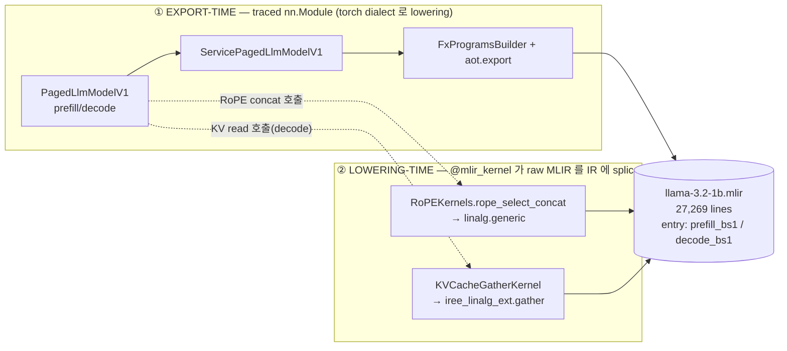

**읽는 법**: 왼쪽 박스의 `nn.Module` 들은 `torch.export` 가 FX 그래프로 추적해 `torch.aten.*` 로 내린다. 오른쪽 `@mlir_kernel` 두 개는 추적 대상이 아니라, 모델이 그 함수를 *호출하는 지점*에 **사람이 쓴 `util.func` 템플릿**을 그대로 IR 에 박는다. 그래서 최종 IR 은 `torch.aten.*`(좌) + 커스텀 `util.func`(우) 의 혼합이다. → 자세히: [Fig 1](#fig-1).

---

### Fig 1. export-time vs lowering-time 클래스 전체도  (drawio p.1)

> 좌측 = "무엇이 lowering 되나" (모델 정의). 우측 = "어떻게 lowering 되나" (커널 삽입). 색: 🟦표준 aten · 🟨@mlir_kernel 커스텀 · 🟥decode 전용 · 🟪SDPA 불투명.

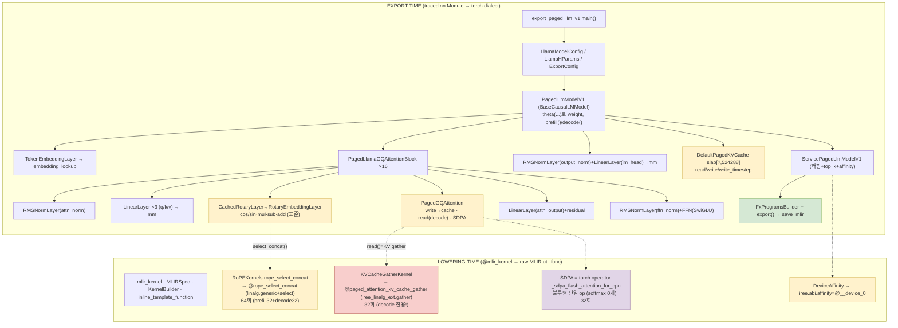

**핵심 메시지**
- NPU 컴파일러가 막히는 지점은 거의 **우측 4개**: `@rope_select_concat`(🟨), `@paged_attention_kv_cache_gather`(🟥, decode), `iree.abi.affinity`(🟨), `_sdpa_flash_attention_for_cpu`(🟪).
- 좌측 표준 `nn.Module` (embedding/rmsnorm/linear/ffn/표준 rope 수식) 은 전부 `torch.aten.*` 로 깔끔히 내려간다 — 우리 `LlamaOnDevice` 와 같은 종류의 op.

---

### Fig 2. prefill_bs1 그래프를 클래스에 1:1 매핑  (drawio p.2)

> `@prefill_bs1` (line 151) 의 입력 → 블록 → logits 까지, 각 IR op 가 **어느 클래스에서 나왔는지** 실측 line 번호와 count 로 박아둔 표. count 가 `16층 × 함수수` 산술로 딱 떨어진다.

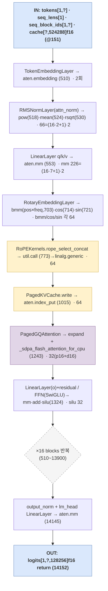

**count 가 클래스 구조를 증명한다** (prefill+decode 합):

| op | 실측 | 분해 | 출처 클래스 |
|---|---:|---|---|
| `aten.embedding` | 2 | 1×2함수 | `TokenEmbeddingLayer` |
| `pow/mean/rsqrt` | 66 | (16블록×2norm + 1) ×2함수 | `RMSNormLayer` |
| `aten.mm` | 226 | (16블록×7 + 1 lm_head) ×2함수 | `LinearLayer`/`FFN` |
| `aten.bmm` | 64 | (16블록×2(q,k)) ×2함수 | RoPE sincos 외적 |
| `cos`/`sin` | 64/64 | 〃 | `RotaryEmbeddingLayer` |
| `util.call @rope_select_concat` | 64 | 32+32 | `RoPEKernels` (🟨) |
| `aten.index_put` | 64 | 32+32 | KV write (🟨) |
| `_sdpa_flash_attention_for_cpu` | 32 | 16+16 | `PagedGQAttention` (🟪) |
| `util.call @paged_attention_kv_cache_gather` | 32 | **0+32** | KV read = **decode 전용** (🟥) |
| `silu` | 32 | 16×2함수 | `FFN` |
| `util.global` (weights) | 147 | — | `Theta`/IRPA |

> 가장 중요한 비대칭: **gather(KV read)는 prefill 에 0, decode 에 32**. prefill 은 K/V 를 *새로 계산해 write 만* 하고, decode 만 cache 에서 *읽어온다(custom gather)*. → easy3 가 한 덩어리로 본 "PagedAttention" 이 실은 *write(표준 index_put) + read(커스텀 gather, decode 전용) + SDPA(불투명)* 세 조각.

---

### Fig 3. 커스터마이징 5 레버  (drawio p.3)

> "어디를 잡고 흔들면 NPU 친화로 가는가". ⑤ 로 갈수록 근본적·고비용.

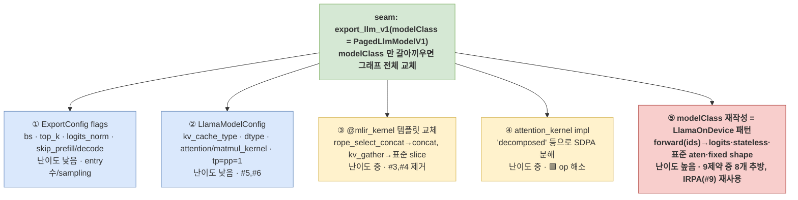

**제약(easy3 §5) ↔ 레버 매핑**

| 제약 | 한 줄 | 푸는 레버 |
|---|---|---|
| #1 KV cache state arg | cache 가 함수 인자 | ⑤ |
| #2 prefill/decode 분리 | entry 2개 | ①(skip)/⑤ |
| #3 paged gather custom op | `iree_linalg_ext.gather` | ③ / ⑤ |
| #4 RoPE concat custom op | `@rope_select_concat` | ③ / ⑤ |
| #5 device affinity | `iree.abi.affinity` | ②(tp=pp=1) |
| #6 fp16 mixed | dtype 정책 | ② |
| #7 dynamic dim `?` | 가변 seq_len | ⑤(fixed)+aot |
| #8 multi-args contract | 4~5 인자 | ⑤ |
| #9 weight 외부참조 | `util.global` | IRPA 그대로 ✅ |

> **결론**: ①②④ 는 빠른 옵션 튜닝(부분 개선), ③ 은 커널 수술, **⑤ (modelClass 재작성)** 가 근본 해소. 우리 `LlamaOnDevice` 가 정확히 ⑤ 다 — `PagedLlmModelV1` 의 재구현.

---

### 부록 — 그림 재생성/검증 명령

```bash
M=/tmp/llama32-irpa/llama-3.2-1b.mlir
## Fig 2 의 count 재현
grep -c "torch.aten.mm" $M                              # 226
grep -c "torch.aten.embedding" $M                       # 2
grep -c "_scaled_dot_product_flash_attention_for_cpu" $M # 32
grep -nF "util.call @paged_attention_kv_cache_gather" $M | awk -F: '$1<14154{p++}$1>=14154{d++}END{print p+0,d+0}'  # 0 32
grep -nF "util.call @rope_select_concat" $M             | awk -F: '$1<14154{p++}$1>=14154{d++}END{print p+0,d+0}'  # 32 32
```

### 관련
- 정밀 본문: [easy4-detail.md](easy4-detail.md)
- 짝 문서: [easy4.md](easy4.md) (클래스 27종 카탈로그), [easy3.md](easy3.md) (제약 9종), [easy.md](easy.md)/[easy2.md](easy2.md)
- 원본 도식: [`../diagrams/export-vs-lowering.drawio`](../diagrams/export-vs-lowering.drawio)
</content>


---

<a id="sec-easy6"></a>

## Easy Guide 6 — input dim(dynamic/static)은 *어느 클래스*가 만드나 + lowering kernel 제약 카탈로그 + "aten만이면 lowering 되나?" 충분조건

> [easy3.md](easy3.md)(제약 9종)·[easy4-detail.md](easy4-detail.md)(export-time vs lowering-time 두 계층)의 후속.
> 이 노트는 그 두 문서를 **코드 레벨로 더 좁혀서 두 질문에 정확히 답**한다.
>
> 1. **input dimension(dynamic / static) 타입은 어느 클래스에서, 어떤 형태로 나오나? "dynamic이라 NPU에 못 쓴다"가 맞나?** → §1
> 2. **lowering 단계에서 제약되는 kernel은 뭐가 있나(RoPE 같은 거)? export 단계의 `nn.Module`은 `torch.aten.*`만 하면 lowering 되나? 제약은 없나?** → §2
>
> ground truth: `/tmp/llama32-irpa/llama-3.2-1b.mlir`(27,269 lines) + amdsharktank 소스 직접 grep
> (`/home/bohyun/amd-shark-ai/amdsharktank/amdsharktank/`, 읽기만).

---

### 1. input dim (dynamic / static) — "모델 클래스"가 아니라 **export 드라이버**가 만든다

#### 1.1 핵심 — dim은 모델이 모른다

`PagedLlmModelV1`(모델 nn.Module) 자체는 seq_len이 dynamic인지 static인지 *모른다*. dynamic dim은 **그 위 export 단계**에서 `dynamic_shapes=` 인자로 주입된다. 그래서 "dynamic type이 어느 클래스냐"의 답은 모델 레이어가 아니라 **export 드라이버 + cache 셋업 메서드** 두 군데다.

| dynamic 축 | 만드는 곳 (클래스/함수) | 구문 | IR 흔적 |
|---|---|---|---|
| **seq_len** (`tokens[1]`, `seq_block_ids[1]`) | `examples/export_paged_llm_v1.py:65` `generate_batch_prefill` (드라이버 *함수*, 클래스 아님) | `torch.export.Dim("seq_len_blocks_dim", min=2, max=…)` → `* block_seq_stride` | `vtensor<[1,?],si64>` |
| **page count** (KV slab `[?,524288]`의 0축) | `ServicePagedLlmModelV1.setup_cache()` (`models/llm/export.py:151`) → 내부 `PagedKVCache.allocate()` | `torch.export.Dim("page")` | `tensor<[?,524288],f16>` |

두 `Dim`은 모두 `@fxb.export_program(dynamic_shapes={...})`(`iree.turbine.aot.FxProgramsBuilder`)의 `dynamic_shapes=` kwarg로 전달된다 (export_paged_llm_v1.py:74, 118/141/193).

```python
## export_paged_llm_v1.py:65 — seq_len dynamic dim 생성 (드라이버)
seq_len_blocks_dim = torch.export.Dim("seq_len_blocks_dim", min=2, max=block_dim_max)
seq_len_dim        = seq_len_blocks_dim * llama_config.block_seq_stride
cache, cache_dynamic_shapes, _ = model.setup_cache()    # ← page dim 은 여기서
dynamic_shapes = {
    "tokens":        {1: seq_len_dim},          # axis 1 dynamic
    "seq_lens":      {},                        # static
    "seq_block_ids": {1: seq_len_blocks_dim},   # axis 1 dynamic
    "cs":            cache_dynamic_shapes,       # page dim dynamic
}
```

```python
## models/llm/export.py:151 — ServicePagedLlmModelV1.setup_cache (page dim)
page_dim       = torch.export.Dim("page")
cache_state    = self.model.cache.allocate(page_count=device_block_count)  # PagedKVCache.allocate
dynamic_shapes = [{0: page_dim} for _ in range(len(cache_state.allocation))]
```

#### 1.2 타입의 정체 + 형태

- **타입 = `torch.export.Dim`** — PyTorch 표준 심볼릭 dim. NPU가 모르는 *이상한 타입이 아니다*. (특별한 amdsharktank 클래스도 아님.)
- export 시 `import_symbolic_shape_expressions=True`(export_paged_llm_v1.py)로 심볼 식까지 IR에 박힌다 → 함수에 `torch.assume_strict_symbolic_shapes` attribute, 텐서에 `?` 축.
- **dynamic 형태**: `!torch.vtensor<[1,?],si64>`, `!torch.tensor<[?,524288],f16>` — IR 전체 `?` 4,530회.
- **static 형태**: `dynamic_shapes`를 *주지 않고* concrete `example_args`로 trace → `[1,32,…]`처럼 숫자로 고정. (= 우리 `LlamaOnDevice`가 한 것.)

```mlir
// dynamic (amdsharktank export) — ? 가 심볼 축
func.func @prefill_bs1(%arg0: !torch.vtensor<[1,?],si64> ...) -> !torch.vtensor<[1,?,128256],f16>
  attributes {torch.assume_strict_symbolic_shapes}

// static (LlamaOnDevice, fixed example_args) — 숫자로 고정
func.func @main(%arg0: !torch.vtensor<[1,32],si64>) -> !torch.vtensor<[1,32,128256],f16>
```

#### 1.3 "dynamic이라 NPU에 못 쓴다"는 *절반만* 맞음

- ❌ `torch.export.Dim`이 NPU가 못 받는 exotic 타입이라서가 **아니다**.
- ✅ **IR이 `?` 심볼 축을 들고 있으면**, static shape를 전제로 DMA/타일링/버퍼 크기를 잡는 NPU 백엔드가 스케줄을 못 짠다 → **specialize(고정) 필요**.
- 그래서 이건 *불가능*이 아니라 **제일 싼 제약**: easy3 #7 / [easy-sum](easy-sum.md) 표에서 ✅ "드라이버 레벨" — `Dim`을 빼고 fixed `example_args`로 trace하면 끝. 백엔드가 dynamic shape를 받으면 그대로도 통과.

> **한 줄**: dynamic dim = export 드라이버(`generate_batch_*`)와 `setup_cache()`가 만든 `torch.export.Dim` → IR의 `?`. 모델 클래스 책임 아님. "dynamic이라 못 쓴다"가 아니라 "static을 요구하는 백엔드면 specialize하라"가 정확. 고치는 비용 최저(설정 1줄).

---

### 2. lowering 단계의 제약 kernel + "aten만이면 lowering 되나?"

#### 2.1 제약 kernel = `@mlir_kernel` / `CustomOp.register` (trace 안 되고 raw MLIR splice)

이 함수들은 모델 forward에서 *호출*되지만 FX가 내부를 추적하지 않고 **손으로 짠 MLIR `util.func`를 IR에 그대로 박는다**(easy4-detail §3). 인프라: `kernels/mlir_kernel.py`. 소스 전체 grep으로 모은 **제약 kernel 카탈로그**:

| 그룹 | kernel (정의 위치) | 박히는 IR | default Llama-3.2-1B fp16 export에 등장? |
|---|---|---|---|
| **RoPE** | `RoPEKernels.rope_select_concat` (`layers/rotary_embedding_hf.py:29` `@mlir_kernel`) | `linalg.generic`+`arith.select` (interleave concat) | ✅ **64회** |
| **KV read** | `KVCacheGatherKernel` (`layers/paged_attention.py:68` `@mlir_kernel`) | `iree_linalg_ext.gather` | ✅ **decode 전용 32회** |
| *(불투명, kernel은 아님)* | `aten._scaled_dot_product_flash_attention_for_cpu` | 단일 블랙박스 op (softmax/bmm 안 보임) | ✅ 32회 |
| **quant matmul** | `mmt_block_scaled_q8` · `mmt_block_scaled_offset_q4` · `mmt_super_block_scaled_offset_q4` · `einsum_2args_q4` · `mmtfp` · `batch_matmul_transpose_b` · `gemm_fp4` · `gemm_fp4_asm` (`kernels/`) | custom util.func / asm | ❌ INT8/INT4 켤 때만 |
| **sampling** | `iree_topk` (`kernels/topk.py`) | `iree_linalg_ext.topk` | ❌ `--top-k` 켤 때만 |
| **attention 변종** | `kernels/attention.py`(×2 `@mlir_kernel`), `kernels/wave/attention.py`, `wave/extend_attention.py`, `wave/mxfp4_gemm.py` | wave/asm 커널 | ❌ 해당 kernel flag |
| **vision/기타** | `conv_2d_nchw_fchw` · `pooling_nchw_sum` · `bitcast_to_complex/real` · `kernels/rotary.py::apply_rotary_embedding`(비-HF rope 경로) | custom util.func | ❌ 경로별 |

> **쉽게**: 기본 Llama 경로에서 실제로 NPU를 막는 lowering kernel은 딱 **RoPE concat + KV-gather 2개**(+ SDPA 블랙박스). 나머지(quant·topk·wave·conv·bitcast)는 *해당 기능을 켤 때만* 추가로 튀어나오는 **예비 제약 풀**이다. easy3는 #3(paged gather)·#4(rope) 둘로 요약했는데, 그게 곧 이 2개.

#### 2.2 export 단계 `nn.Module`은 `torch.aten.*`만 하면 lowering 되나? — *거의* 맞지만 충분조건 아님

`nn.Module`이 전부 `torch.aten.*`(+`torch_c`,`util.global`)로 trace되면 torch-mlir 표준 파이프라인이 내린다. 그게 `LlamaOnDevice`의 원리. **하지만 "nn.Module이다"만으론 부족** — 세 가지 누수:

| # | 누수 | 무엇이 문제 | 회피 |
|---|---|---|---|
| 1 | **불투명 composite aten** | `F.scaled_dot_product_attention` → `aten._scaled_dot_product_flash_attention_for_cpu` 한 덩어리. `torch.aten.*`이긴 하나 softmax/bmm로 *분해 안 됨* → NPU가 이 op을 알아야 통과 | `attn_implementation="eager"` 또는 decomposed SDPA로 풀어 씀 (easy4-detail 레버 ④) |
| 2 | **forward가 custom op 호출** | RoPE `select_concat`, `kv_cache_gather`, quant matmul 등 `@mlir_kernel`/`CustomOp`를 부르면 trace가 아니라 util.func splice → aten 아님 | forward가 *부르는 op이 전부 순수 aten*이어야 함 (custom kernel 회피) |
| 3 | **aten 밖으로 새는 패턴** | data-dependent shape(`.item()`, page_ids gather) · python 제어흐름 · external mutable buffer in-place(`index_put_` on cache arg) · `iree.abi.affinity` 메타 | stateless 재계산 forward + single device + static-ish shape |

```
"nn.Module이면 lowering" 의 정확한 충분조건 =
   (a) 순수 표준 aten으로만 구성        ← custom kernel 회피(2)
 + (b) 불투명 composite(SDPA) 분해       ← (1)
 + (c) data-dependent/external-state 없음 ← (3)
 + (d) static-ish shape (§1)
```

> **한 줄**: "nn.Module → aten → lowering"은 맞는 방향이지만, **불투명 SDPA 분해 + custom kernel 회피 + 비-aten 누수 제거 + (가능하면) static shape**가 같이 모여야 실제로 NPU까지 내려간다. 이 4개를 한 번에 만족시킨 게 `LlamaOnDevice`(IR `server_side_op_hits = {}`).

---

### 3. cheat sheet (재현)

```bash
ASK=/home/bohyun/amd-shark-ai/amdsharktank/amdsharktank
M=/tmp/llama32-irpa/llama-3.2-1b.mlir

## Q1 — dynamic dim 을 만드는 곳 (모델 아님, 드라이버/cache)
grep -n "torch.export.Dim\|dynamic_shapes\|setup_cache" $ASK/examples/export_paged_llm_v1.py
sed -n '151,165p' $ASK/models/llm/export.py        # ServicePagedLlmModelV1.setup_cache → page_dim
grep -c "vtensor<\[1,\?" $M                          # ? 심볼 축 등장

## Q2 — 제약 lowering kernel 전체 카탈로그
grep -rn "@mlir_kernel\|CustomOp.register" $ASK | grep -v test
## default Llama 경로에서 실제 박힌 2개 + SDPA 블랙박스:
grep -c "util.call @rope_select_concat" $M                       # 64
grep -nF "util.call @paged_attention_kv_cache_gather" $M | \
  awk -F: '$1<14154{p++}$1>=14154{d++}END{print "gather p/d:",p+0,d+0}'  # 0 32 (decode 전용)
grep -c "_scaled_dot_product_flash_attention_for_cpu" $M          # 32 (그리고 _softmax 0)
```

---

### 4. 참고

- 짝 문서: [easy3.md](easy3.md)(제약 9종 → 1 근본원인) · [easy4-detail.md](easy4-detail.md)(export-time vs lowering-time 2계층 + IR 1:1) · [easy-sum.md](easy-sum.md)(한 장 요약)
- 우리 정답 경로: [`../../src/torch_mlir_zoo/models/llama_on_device.py`](../../src/torch_mlir_zoo/models/llama_on_device.py) (§1.3·§2.2의 4조건을 모두 만족), 검증 [`../../src/torch_mlir_zoo/analysis/ir_summary.py`](../../src/torch_mlir_zoo/analysis/ir_summary.py)
- amdsharktank 소스(읽기만): `examples/export_paged_llm_v1.py`(dynamic_shapes), `models/llm/export.py`(setup_cache), `layers/rotary_embedding_hf.py`·`layers/paged_attention.py`(2개 kernel), `kernels/`(예비 제약 풀)


---

<a id="sec-easy6-sum"></a>

## Easy Guide 6-sum — Llama-3.2-1B lowering 종합: *어느 클래스가 어떻게 쓰이고, 어느 커널단에서 막히나*

> easy series 전권(easy / easy2 / easy3 / easy4 / easy4-detail / easy5-fig / easy6 / easy7)을 **Llama-3.2-1B 한 모델 기준**으로 압축한 종합표.
> 대상 경로: 순수 `meta-llama/Llama-3.2-1B-Instruct` → `import_hf_dataset`(IRPA) → `export_paged_llm_v1`(amdsharktank server-side export).
> ground truth: `/tmp/llama32-irpa/llama-3.2-1b.mlir` (27,269 lines) — 모든 count 는 여기서 실측.
> 도식은 [easy5-fig.md](easy5-fig.md)(Fig 0~3) + [`../diagrams/export-vs-lowering.drawio`](../diagrams/export-vs-lowering.drawio)와 **§4에서 1:1 연동**.

---

### 0. 한 장 결론

> Llama-3.2-1B를 amdsharktank server 경로로 내리면, **클래스는 두 계층**(① trace되는 `nn.Module` → 표준 `torch.aten.*` / ② `@mlir_kernel`·`CustomOp` → 손수 짠 `util.func` splice)으로 갈리고, **NPU가 막히는 건 거의 ② + ①의 불투명 SDPA 4곳뿐**이다. 나머지 모델 수학(embedding/RMSNorm/Linear/FFN/표준 RoPE 수식)은 전부 깨끗이 lowering된다. → on-device는 ②를 표준 aten으로 갈아끼운 `LlamaOnDevice`(레버 ⑤)로 `server_side_op_hits={}` 달성.

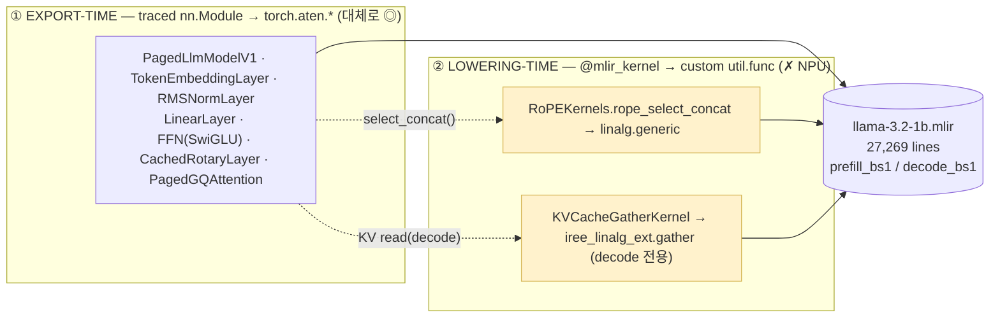

---

### 1. 표 A — *클래스가 어떻게 쓰이나* (export 호출 순서 = Stage A→E, 27종)

각 클래스가 Llama-3.2-1B lowering에서 *무슨 일을 하고 IR에 무엇을 남기는지*. 판정 범례: **◎ 표준 aten(통과)** · **🟨 @mlir_kernel 커스텀(막힘)** · **🟥 decode 전용 커스텀** · **🟪 불투명 SDPA** · **⚙ 설정/메타** · **📦 weight 외부화**. `#n` = [easy3 §5](easy3.md) 제약 번호.

| # | Stage | 클래스 / 함수 | 어떻게 쓰이나 (역할) | IR에 남기는 것 | 판정 |
|---|---|---|---|---|---|
| 1 | A | `import_hf_dataset` | HF safetensors+config → IRPA 변환 | — | ⚙ |
| 2 | A | `Theta` | weight를 *이름경로*(`theta("blk",0,"attn_q")`)로 접근 | `@__auto.*` symbol | 📦 |
| 3 | A | `Dataset` | IRPA `save`/`load` I/O | IRPA 파일 | 📦 |
| 4 | A | `DatasetMetadata` | IRPA key 스킴 = "fixed IRPA"의 실체 | properties | 📦 |
| 5 | A′ | `DefaultPrimitiveTensor` | tied embedding(`output.weight`) 복제 수선 | `output.weight` | 📦 #9 |
| 6 | B | `LlamaHParams` | 아키텍처 상수(block16/head32/kv8/ffn8192) | — | ⚙ |
| 7 | B | `LlamaModelConfig` | hp + **lowering 정책**(dtype·kv_cache_type·kernel) | #6,#7 default 결정 | ⚙ #6 |
| 8 | B | `ExportConfig` | export 행위(bs·top_k·logits_norm) | top_k시 topk op | ⚙ |
| 9 | B | `ParallelismConfig` | tp/pp 병렬도(=1 single device) | device map | ⚙ #5 |
| 10 | C | **`PagedLlmModelV1`** | 메인 모델. `forward` 아닌 **`prefill()`/`decode()` 2메서드** | 4-args 2-entry | **#2,#8** |
| 11 | C | **`DefaultPagedKVCache`** | KV slab `[?,524288]` allocate/read/write | cache arg | **#1** |
| 12 | C | `TokenEmbeddingLayer` | 토큰 → hidden | `aten.embedding` ×2 | ◎ |
| 13 | C | `CachedRotaryLayer`→`RotaryEmbeddingLayer` | RoPE: sincos table + cos/sin·mul·sub·add | `bmm/cos/sin` 각64 | ◎(수식) |
| 14 | C | `RMSNormLayer` | RMS norm (f32 cast) | `pow/mean/rsqrt` 66 | ◎ |
| 15 | C | `LinearLayer` | q/k/v/o proj + lm_head | `aten.mm` 226 | ◎ |
| 16 | C | `AttentionFFNBlock` ×16 | attn+ffn 묶음 | — | ◎ |
| 17 | C | **`PagedGQAttention`** | GQA(32/8) → write·read·SDPA | (아래 3조각) | 🟥🟪 #3 |
| 18 | C | `FFN` | SwiGLU `down(silu(gate)*up)` | `aten.silu` 32 | ◎ |
| 19 | C | `ThetaLayer`(base) | weight-by-name nn.Module 추상 | — | ◎ |
| 20 | D | `ServicePagedLlmModelV1` | export 래퍼 + sampling + affinity | — | ⚙ #5 |
| 21 | D | `CacheAllocation` | slab + DeviceAffinity 묶음 | — | #1,#5 |
| 22 | D | `DeviceAffinity` | "이 인자는 `@__device_0`" | `iree.abi.affinity` | 🟨 #5 |
| 23 | E | `FxProgramsBuilder` | 한 모듈에 **여러 entry** 등록 | 2 entry | #2 |
| 24 | E | `@fxb.export_program` / `torch.export.Dim` | FX trace + **dynamic dim 선언** | `vtensor<[1,?]>` | #7,#8 |
| 25 | E | `aot.export`/`save_mlir` | FX → MLIR 텍스트 | 27,269 lines | — |
| **26** | C내부 | **`KVCacheGatherKernel`**(`@mlir_kernel`) | decode KV read를 IREE op로 inject | `iree_linalg_ext.gather` | **🟥 #3** |
| **27** | C내부 | **`apply_rotary_embedding`/`RoPEKernels`**(`CustomOp`) | RoPE interleave-pack을 손수 MLIR로 | `@rope_select_concat`(linalg.generic) | **🟨 #4** |

> 핵심: 표 A에서 **막히는 건 #17(🟥🟪)·#22(🟨)·#26(🟥)·#27(🟨) 4줄**뿐. 나머지 23줄은 표준 aten(◎) 또는 설정/weight(⚙📦)라 NPU가 그대로 받는다.

---

### 1.5 export layer vs lowering layer 제약 (2-layer 재배열)

> 위 제약 9종 + SDPA를 **층(layer)** 축으로 다시 가른다. 모두 **Llama-3.2-1B server 경로 실측**(`llama-3.2-1b.mlir`, block16/kv-head8/head_dim64/vocab128256).
> 경계: **export layer** = trace되는 `nn.Module` → `torch.aten.*` 수준(graph 모양·구조·시그니처·dtype·불투명 composite). **lowering layer** = `@mlir_kernel`/`CustomOp`가 trace를 우회해 raw `util.func`(IREE/linalg) splice.

#### (A) Export layer 제약 — traced nn.Module → `torch.export` → `torch.aten.*`

| # | 제약 | IR 흔적 | 출처 클래스 | 종류 | 고치는 법 |
|---|---|---|---|---|---|
| E1 (#1) | KV cache state가 **함수 인자** | mutable `tensor<[?,524288]>` arg | `DefaultPagedKVCache`·`CacheAllocation` | ❌ 구조 | forward stateless 재계산 |
| E2 (#2) | prefill/decode **2-entry 분리** | `@prefill_bs1`+`@decode_bs1` | `PagedLlmModelV1.prefill/decode`·`FxProgramsBuilder` | ❌ 구조 | 단일 entry 통합 |
| E3 (#8) | **multi-args** contract | 인자 4개(tokens/seq_lens/seq_block_ids/cache) | `PagedLlmModelV1` 시그니처 | ❌ 구조 | `(input_ids,)` 하나 |
| E4 (#7) | **dynamic dim** `?` | `vtensor<[1,?]>`·`[?,524288]` | `torch.export.Dim`(드라이버)·`setup_cache` | ✅ 드라이버 | fixed `example_args` |
| E5 (#6) | fp16 **mixed dtype** | activation/attn f16, norm f32 | `LlamaModelConfig` | ✅ 설정 | dtype 통일 |
| E6 (#5) | **device affinity** | `iree.abi.affinity=@__device_0` | `ServicePagedLlmModelV1`·`DeviceAffinity` | ✅ 설정 | `arg_device=` 제거 / tp=pp=1 |
| E7 | **SDPA 불투명 composite** | `aten._scaled_dot_product_flash_attention_for_cpu` (블랙박스, `_softmax` 0) | `PagedGQAttention.attention` | ⚠ 분해 | `attention_kernel="decomposed"` / eager |
| E8 (#9) | weight 외부참조 | `util.global @__auto.*` | `Theta`/`Dataset`/IRPA | 🟢 유지(이득) | IRPA 그대로 |

#### (B) Lowering layer 제약 — `@mlir_kernel`/`CustomOp` → custom `util.func` (trace 안 됨)

| # | 제약 | IR 흔적 | 출처 클래스 | 왜 막나 | count | 고치는 법 |
|---|---|---|---|---|---:|---|
| L1 (#3) | paged **KV gather** | `@paged_attention_kv_cache_gather` → `iree_linalg_ext.gather` | `KVCacheGatherKernel`(`@mlir_kernel`) | IREE 확장 dialect + page_ids **data-dependent** | **32** (decode 전용) | 표준 `index_select` / 재계산 |
| L2 (#4) | **RoPE concat** | `@rope_select_concat` → `linalg.generic`+`arith.select` | `RoPEKernels.rope_select_concat`(`@mlir_kernel`) | 외부 register `util.func`, 표준 패스에 rule 없음 | **64** | 표준 `cos/sin·mul·cat` |
| 예비 | quant matmul | `mmt_block_scaled_q8` 등 | `CustomOp` | INT8/INT4 켤 때만 | — | 양자화는 마지막 |
| 예비 | topk sampling | `iree_linalg_ext.topk` | `iree_topk` | `--top-k` 켤 때만 | — | `argmax`/외부 sampling |
| 예비 | wave/conv/bitcast | custom `util.func` | 각 kernel | 해당 flag | — | 표준 op |

#### 두 layer의 경계 인사이트

- **같은 KV cache 클래스가 두 layer로 쪼개짐**: `write`(`aten.index_put`)는 **export layer 표준 ◎**, `read`(gather)만 **lowering layer 커스텀 🟥**. → "PagedAttention" = *write(export 표준) + read(lowering 커스텀, decode) + SDPA(export 불투명)* 세 조각.
- **실질 막힘 4곳** = export layer 2 (E6 affinity · E7 SDPA) + lowering layer 2 (L1 gather · L2 RoPE). 나머지 export 제약은 compile reject가 아니라 *재작성/옵션* 문제.
- **해소 비용**: export layer = forward 재작성(구조 ❌) 또는 config(설정 ✅). lowering layer = 템플릿 교체(중) 또는 modelClass 재작성. **둘 다 `LlamaOnDevice`(레버 ⑤)가 한 번에 추방** → `server_side_op_hits={}`.

---

### 2. 표 B — *어느 커널단에서 문제가 생기나* (NPU가 막는 4곳)

표 A의 4줄을 **커널단**으로 모은 정밀표. easy6 §2.1 카탈로그의 Llama 기본 경로 실현분.

| 막히는 커널 | 출처 클래스 | IR 표현 | 왜 NPU가 막나 | count(실측) | 푸는 레버 |
|---|---|---|---|---:|---|
| **① RoPE concat** | `RoPEKernels.rope_select_concat`(`@mlir_kernel`, rotary_embedding_hf.py:29) | `@rope_select_concat` → `linalg.generic`+`arith.select` | amdsharktank가 register한 **외부 util.func** → 표준 torch-mlir 패스에 lowering rule 없음 | **64** (p32+d32) | ③ 템플릿 교체 / ⑤ |
| **② KV gather** | `KVCacheGatherKernel`(`@mlir_kernel`, paged_attention.py:68) | `@paged_attention_kv_cache_gather` → `iree_linalg_ext.gather` | **IREE 전용 extension dialect** + page_ids **data-dependent gather**(정적 분석 비친화) | **32** (p0+**d32**, decode 전용) | ③ / ⑤ |
| **③ SDPA 불투명** | `PagedGQAttention.attention`(paged_attention.py:949) | `torch.operator aten._scaled_dot_product_flash_attention_for_cpu` | softmax/bmm로 **분해 안 된 블랙박스**(전 모듈 `_softmax` 0개) → NPU가 이 op 의미를 알아야 함 | **32** (p16+d16) | ④ `attention_kernel="decomposed"` / ⑤ |
| **④ device affinity** | `DeviceAffinity`/`setup_arg_devices`(export.py:137) | 모든 arg/result에 `iree.abi.affinity=#hal.device.promise<@__device_0>` | single-NPU엔 무의미한 device 라우팅 메타 | 전 arg | ② `tp=pp=1` |

> **비대칭 2가지(가장 중요)** —
> ⓐ **KV gather(②)는 decode 전용**(prefill 0 / decode 32): prefill은 K/V를 새로 계산해 *write만*, decode만 cache에서 *읽음(custom gather)*. → "PagedAttention"은 한 덩어리가 아니라 *write(표준 `index_put`) + read(커스텀 gather, decode) + SDPA(불투명)* 세 조각.
> ⓑ **SDPA(③)는 분해 안 된 블랙박스**: `bmm` 64개는 전부 RoPE 외적(attention 아님), attention의 softmax/matmul은 IR에 안 보임.

---

### 3. 표 C — 제약 9종 ↔ 클래스 ↔ 고칠 코드 ↔ 레버 (cross-link)

[easy-sum §3](easy-sum.md) + [easy4 §9](easy4.md) + [easy5-fig Fig 3](easy5-fig.md) 통합.

| 제약 | 운반 클래스 | 고칠 위치 | 종류 | 레버 |
|---|---|---|---|---|
| #1 KV cache state arg | `DefaultPagedKVCache`,`CacheAllocation` | llm.py:127/182 forward 재작성 | ❌ 구조 | ⑤ |
| #2 prefill/decode 분리 | `PagedLlmModelV1`,`FxProgramsBuilder` | export_paged_llm_v1.py:56/152 단일 entry | ❌ 구조 | ①/⑤ |
| #3 paged gather | `KVCacheGatherKernel`,`PagedGQAttention` | paged_attention.py:68 표준 slice | ⚠ 커널 | ③/⑤ |
| #4 RoPE concat | `apply_rotary_embedding`/`RoPEKernels` | rotary_embedding_hf.py:29 표준 concat | ⚠ 커널 | ③/⑤ |
| #5 device affinity | `DeviceAffinity`,`ParallelismConfig` | `arg_device=` 제거, tp=pp=1 | ✅ 설정 | ② |
| #6 fp16 mixed | `LlamaModelConfig` | llm_configs.py:562 dtype 통일 | ✅ 설정 | ② |
| #7 dynamic dim `?` | `torch.export.Dim`(드라이버) | example_args fixed shape | ✅ 드라이버 | ⑤+aot |
| #8 multi-args | `PagedLlmModelV1` 시그니처 | `(input_ids,)` 하나 | ❌ 구조 | ⑤ |
| #9 weight 외부참조 | `Theta`/`Dataset`/IRPA | — (유지가 이득) | 🟢 유지 | IRPA ✅ |

> #5·#6·#7(설정·드라이버) 3개는 옵션으로, #3·#4(커널) 2개는 템플릿 교체로 부분 해소되지만, **#1·#2·#8은 `PagedLlmModelV1` 구조 자체**라 modelClass 재작성(⑤)이 답. #9(IRPA)는 그대로 재사용.

---

### 4. easy5-fig 매핑 연동 — *count = 16블록 × 함수수* 가 클래스 구조를 증명

[easy5-fig Fig 2](easy5-fig.md)(prefill_bs1 1:1 매핑)와 **이 표가 같은 실측**이다. 각 IR op이 표 A의 어느 클래스에서 나왔는지 + 산술 분해(검증: §5 cheat sheet).

| IR op | 실측 합 | 분해 (prefill+decode) | 출처 클래스 (표 A #) | 판정 |
|---|---:|---|---|---|
| `aten.embedding` | 2 | 1×2함수 | `TokenEmbeddingLayer`(#12) | ◎ |
| `pow`/`mean`/`rsqrt` | 66 | (16×2+1)×2 | `RMSNormLayer`(#14) | ◎ |
| `aten.mm` | 226 | (16×7+1)×2 | `LinearLayer`/`FFN`(#15) | ◎ |
| `aten.bmm` | 64 | (16×2)×2 | RoPE 외적 `RotaryEmbeddingLayer`(#13) | ◎ |
| `cos`/`sin` | 64/64 | 〃 | `RotaryEmbeddingLayer`(#13) | ◎ |
| `util.call @rope_select_concat` | 64 | 32+32 | **`RoPEKernels`(#27)** | 🟨 |
| `aten.index_put` (KV write) | 64 | 32+32 | `DefaultPagedKVCache.write`(#11) | ◎(표준!) |
| `_sdpa_flash_attention_for_cpu` | 32 | 16+16 | **`PagedGQAttention`(#17)** | 🟪 |
| `util.call @paged_attention_kv_cache_gather` | 32 | **0+32** | **`KVCacheGatherKernel`(#26)** | 🟥 |
| `aten.silu` | 32 | 16×2 | `FFN`(#18) | ◎ |
| `util.global` (weights) | 147 | 16×9 + embed/norm | `Theta`/IRPA(#2~4) | 📦 |

> **연동 포인트**: 위 표의 🟨🟪🟥 3행(rope_select_concat 64 · SDPA 32 · gather 32)이 곧 §2 표 B의 막히는 커널 ①②③이고, easy5-fig **Fig 1의 우측 LOWERING-TIME 박스 + Fig 2의 색칠 노드**와 1:1 대응한다. `index_put`(KV write)이 ◎ 표준인 점이 핵심 — 같은 cache 클래스라도 **write는 표준, read만 커스텀 gather**.

→ 그림으로: [easy5-fig Fig 0](easy5-fig.md)(두 계층 한 장) · [Fig 1](easy5-fig.md)(클래스 전체도) · [Fig 2](easy5-fig.md)(이 count 표) · [Fig 3](easy5-fig.md)(레버 5종). 원본 [`../diagrams/export-vs-lowering.drawio`](../diagrams/export-vs-lowering.drawio).

---

### 5. 결론 — 성공시킨 클래스 = `LlamaOnDevice`(레버 ⑤)

표 A의 막히는 4줄을 *표준 aten으로 갈아끼운* 재구현이 [`../../src/torch_mlir_zoo/models/llama_on_device.py`](../../src/torch_mlir_zoo/models/llama_on_device.py):

| 표 A의 막힘 | LlamaOnDevice의 대체 |
|---|---|
| `PagedLlmModelV1.prefill/decode`(#10) | `forward(input_ids)->logits` 단일 entry |
| `DefaultPagedKVCache`(#11) | KV cache 제거(매 forward 재계산) |
| `KVCacheGatherKernel`(#26) | gather 자체 없음 |
| `RoPEKernels.rope_select_concat`(#27) | precomputed cos/sin + 표준 `mul/add/cat` |
| `PagedGQAttention` SDPA(#17) | 표준 분해 attention(`softmax` 16 보임) |
| `torch.export.Dim`(#24) | example_args fixed shape |
| `DeviceAffinity`(#22) | 없음 |

→ 결과 IR: `server_side_op_hits={}`, `has_dynamic_dim=false` (검증 [`../../src/torch_mlir_zoo/analysis/ir_summary.py`](../../src/torch_mlir_zoo/analysis/ir_summary.py)). **#9 IRPA만 그대로 재사용**(weight 외부화는 NPU에도 이득). cf. Whisper는 RoPE/gather가 아예 없어 wrapper 4-가드만으로 통과([easy7.md](easy7.md)).

---

### 6. cheat sheet (표 재현)

```bash
M=/tmp/llama32-irpa/llama-3.2-1b.mlir
ASK=/home/bohyun/amd-shark-ai/amdsharktank/amdsharktank

## §4 count 재현 (클래스↔IR)
grep -c "torch.aten.mm" $M                                # 226  LinearLayer/FFN
grep -c "torch.aten.embedding" $M                         # 2    TokenEmbeddingLayer
grep -c "torch.aten.silu" $M                              # 32   FFN(SwiGLU)
grep -c "_scaled_dot_product_flash_attention_for_cpu" $M  # 32   PagedGQAttention (🟪) + _softmax 0
grep -nF "util.call @rope_select_concat" $M | awk -F: '$1<14154{p++}$1>=14154{d++}END{print "rope p/d:",p+0,d+0}'   # 32 32  (🟨)
grep -nF "util.call @paged_attention_kv_cache_gather" $M | awk -F: '$1<14154{p++}$1>=14154{d++}END{print "gather p/d:",p+0,d+0}' # 0 32 (🟥 decode 전용)

## §2 막히는 커널 4곳
grep -c "iree_linalg_ext" $M          # ② gather (IREE 확장)
grep -c "hal.device.promise" $M       # ④ affinity
grep -nE "func.func.*@(prefill|decode)" $M   # #2 두 entry

## 클래스 정의 (sibling clone, 읽기만)
sed -n '33,180p' $ASK/models/llm/llm.py            # PagedLlmModelV1 (#10)
sed -n '54,135p' $ASK/layers/paged_attention.py    # KVCacheGatherKernel (#26)
sed -n '1,70p'   $ASK/kernels/rotary.py            # apply_rotary_embedding (#27)
```

---

### 7. 문서 지도

| 보고 싶은 것 | 문서 |
|---|---|
| 왜 막히나 (제약 9종 → 1 원인) | [easy3.md](easy3.md) |
| 어떤 클래스 27종 (호출 순서) | [easy4.md](easy4.md) |
| 2계층 + 실측 IR 1:1 | [easy4-detail.md](easy4-detail.md) |
| **그림 (Fig 0~3)** | [easy5-fig.md](easy5-fig.md) ← **§1·§4가 연동** |
| dim 클래스 출처 + aten 충분조건 | [easy6.md](easy6.md) |
| Whisper 확장 (encoder-decoder) | [easy7.md](easy7.md) |
| 우리 성공 경로 (LlamaOnDevice) | [easy.md](easy.md) / [easy2.md](easy2.md) |
| **이 문서 (Llama 종합표)** | **easy6-sum.md** |


---

<a id="sec-easy7"></a>

## Easy Guide 7 — Whisper-tiny export/lowering: 어떤 kernel이 막히고, 어떤 클래스로 성공했나 (encoder-decoder 확장)

> [PDF Step 6](../../torch_mlir_model_zoo.pdf)의 Model Zoo 확장 타깃 `Whisper-tiny-INT8`을, Llama easy-series와 **똑같은 방법**(eager attention + forward-only wrapper + `export_via_iree_turbine` + `summarize`)으로 돌려 *문제 kernel*과 *성공 클래스*를 실측한 노트.
>
> ground truth (재현됨): `logs/whisper/whisper-tiny.mlir` (3,762 lines) — [`../../scripts/run_whisper_export.py`](../../scripts/run_whisper_export.py)로 생성.
> Whisper = **encoder-decoder** → Llama(decoder-only)에 없던 surface(Conv1d 프런트엔드 · cross-attention)를 처음 본다.

---

### TL;DR

1. **PDF가 가리킨 `rhasspy/faster-whisper-tiny-int8`은 torch-MLIR에 *못 넣는다*** — CTranslate2 `WhisperSpec` 바이너리(42MB, int8)라 PyTorch nn.Module 그래프가 없음(§1). → 아키텍처가 같은 PyTorch `openai/whisper-tiny`(FP32)로 lowering. (양자화는 마지막 단계.)
2. **whisper-tiny FP32는 wrapper 하나로 깨끗하게 성공** — `server_side_op_hits = {}` (0), dynamic dim 0, custom util.call 0, 전부 표준 `torch.aten.*` (§2).
3. **문제가 될 뻔한 kernel은 딱 1개 = opaque SDPA** — Llama와 *동일*. default attention이면 12개 attention 블록이 전부 `aten._scaled_dot_product_flash_attention_for_cpu` 블랙박스로 붕괴. `attn_implementation="eager"`가 그걸 `bmm`+`_softmax`로 분해(§3, 대조 실측).
4. **Whisper 고유 surface(Conv1d·cross-attention)는 안 막힌다** — conv는 `torch.aten.convolution` ×2, cross-attn은 표준 bmm/softmax. 게다가 **RoPE가 없어**(learned positional embedding) Llama의 RoPE custom-kernel 문제 자체가 *없다* — Whisper가 이 점에선 더 단순(§3).
5. **성공시킨 클래스 = `WhisperForwardOnly`** — `WhisperForConditionalGeneration`을 단일 forward로 감싼 4-가드 wrapper(§4). LlamaOnDevice / CausalLMWrapper의 encoder-decoder 판.

---

### 그림 — lowering 성공 경로

📐 **저장본**: [`../diagrams/whisper-lowering.svg`](../diagrams/whisper-lowering.svg) (브라우저/VS Code/GitHub 에서 렌더). 아래 Mermaid 는 같은 내용의 미리보기.

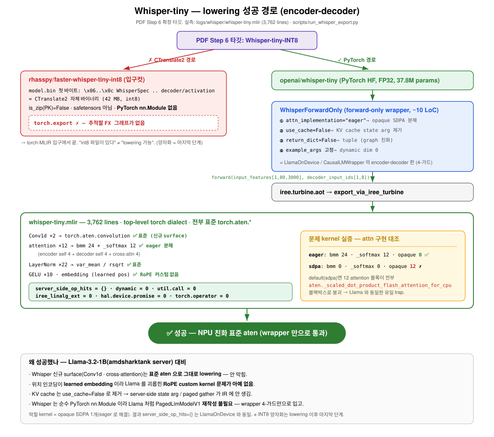

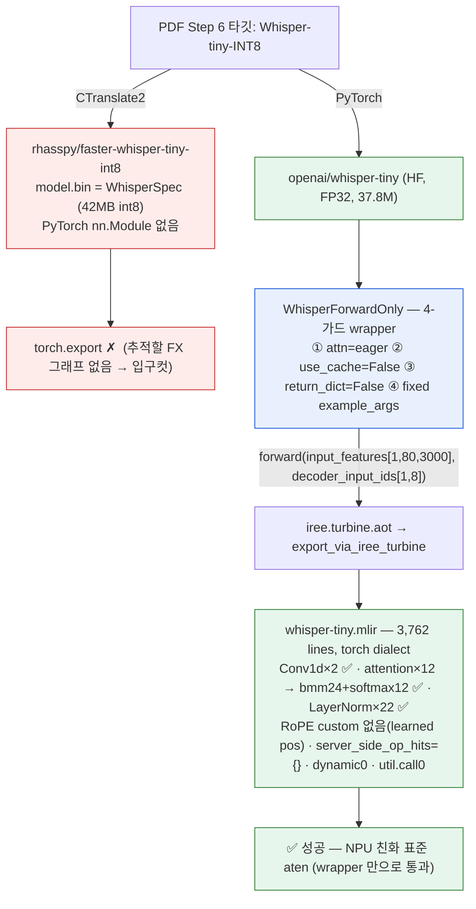

> **문제 kernel 실증(attn 대조)**: `eager` → bmm 24·softmax 12·opaque **0** ✅ / `sdpa`(default) → bmm 0·softmax 0·opaque **12** ✗ (12 attention 블록이 전부 `aten._scaled_dot_product_flash_attention_for_cpu` 블랙박스로 붕괴 — Llama 와 동일한 유일 trap).

---

### 0. 셋업 (재현)

```bash
source /home/bohyun/venv-shark/bin/activate    # torch 2.5.1, transformers 4.52.1, iree-turbine 3.10
python scripts/run_whisper_export.py           # openai/whisper-tiny → logs/whisper/whisper-tiny.mlir
```

- export 엔진: `torch_mlir_zoo.exporters.export_via_iree_turbine` (Llama·HF-zoo와 동일 경로, `iree.turbine.aot`)
- 분석: `torch_mlir_zoo.analysis.ir_summary.summarize`
- `torch_mlir` 패키지는 미설치 — iree-turbine의 fx importer가 torch→MLIR 담당.

---

### 1. faster-whisper-tiny-int8 시도 → **CTranslate2 벽** (입고 입구컷)

PDF Step 6 링크 `rhasspy/faster-whisper-tiny-int8`을 실제로 받아 정체를 확인:

```
model.bin  첫 48바이트:
  b'\x06\x00\x00\x00\x0c\x00WhisperSpec\x00\x03\x00\x00\x00\xc0\x00\x00\x00\x13\x00decoder/activation...'
  size 42,120,343 bytes | is_zip(PK)=False | looks_like_pytorch=False
```

→ **CTranslate2 자체 바이너리 직렬화 포맷**(`WhisperSpec` model-spec + `decoder/activation` 같은 named variable). PyTorch `.bin`(zip/pickle)도 safetensors도 아님. faster-whisper는 CTranslate2(C++ 추론 엔진) 런타임으로만 돌고 **PyTorch `nn.Module`이 존재하지 않는다** → `torch.export`가 추적할 FX 그래프가 없음 → torch-MLIR 입구에서 끝.

> easy3의 "fixed IRPA는 만능키가 아니다"와 같은 결의 발견: **"int8 모델 파일이 있다"≠"lowering 가능"**. 양자화 포맷(CTranslate2/GGUF/CT2)은 *추론 엔진 전용 산출물*이고, torch-MLIR은 *PyTorch 소스*를 요구한다. INT8은 PyTorch lowering을 끝낸 *뒤* 마지막에 적용할 단계.

→ 그래서 아키텍처가 동일한 PyTorch `openai/whisper-tiny`(FP32)로 진행. (CTranslate2 int8 weight를 PyTorch Whisper에 재주입하는 건 별도 변환 작업이고, 방법론상 마지막.)

---

### 2. PyTorch whisper-tiny FP32 export — **깨끗하게 성공**

entry 시그니처 (`logs/whisper/whisper-tiny.mlir:79`):
```mlir
func.func @forward(
    %arg0: !torch.vtensor<[1,80,3000],f32>,     // input_features (mel: 80 bins × 3000 frames = 30s)
    %arg1: !torch.vtensor<[1,8],si64>           // decoder_input_ids
) -> !torch.vtensor<[1,8,51865],f32>            // logits
  attributes {torch.assume_strict_symbolic_shapes}
```

| 지표 | 값 | 의미 |
|---|---|---|
| MLIR lines | 3,762 | whisper-tiny 37.8M params |
| aten ops | 1,033 (unique 30+) | 전부 표준 torch dialect |
| **server_side_op_hits** | **0** | paged_attention/kv_cache/flash/affinity 흔적 없음 (LlamaOnDevice와 동일) |
| **dynamic dim** | **0** | `?` 없음 — fixed shape |
| util.call (custom kernel) | 0 | @mlir_kernel splice 없음 |
| iree_linalg_ext | 0 | IREE extension dialect 없음 |
| torch.operator (non-aten) | 0 | aten 밖 escape 없음 |
| hal.device.promise | 0 | affinity 없음 |

→ **단일 entry + static shape + 순수 aten = NPU 친화.** easy6 §2.2의 "충분조건 4개"(순수 aten · opaque 분해 · custom 회피 · static)를 그대로 만족.

---

### 3. 어떤 kernel이 문제가 되나 — Whisper판 (실측 대조)

#### 3.1 유일한 실제 trap = opaque SDPA (Llama와 동일)

`attn_implementation`만 바꿔 같은 모델을 두 번 export한 대조:

| attn_implementation | bmm | _softmax | **opaque `_sdpa_flash_..._for_cpu`** | srv_hits | 판정 |
|---|---:|---:|---:|---:|---|
| `"eager"` | 24 | 12 | **0** | 0 | ✅ 표준 분해 |
| `"sdpa"` (default) | 0 | 0 | **12** | 12 | ✗ 12블록 전부 블랙박스 |

→ default면 **12개 attention 블록**(enc self 4 + dec self 4 + dec **cross** 4)이 전부 `torch.aten._scaled_dot_product_flash_attention_for_cpu` 한 덩어리로 붕괴(softmax/bmm 안 보임). NPU가 이 op 의미를 모르면 reject. **`eager`가 레버** → `bmm`(QKᵀ, ·V) + `_softmax`로 분해. (easy4-detail 레버 ④ / easy6 §2.2-(1)과 동일.)

count 검산: attention 블록 12개 → `_softmax` 12 ✓, `bmm` 24(블록당 2) ✓. LayerNorm은 `var_mean`/`rsqrt` 각 22 = enc(4×2+1) + dec(4×3+1) ✓. (easy4-detail의 "count = 블록 × 함수수" 검증과 동일 방식.)

#### 3.2 Whisper 고유 surface는 *안* 막힌다

| surface | Llama엔? | Whisper 결과 | 막히나? |
|---|---|---|---|
| **Conv1d 프런트엔드 ×2** (mel→hidden, 2번째가 stride2 다운샘플) | 없음(신규) | `torch.aten.convolution` ×2 (`[1,80,3000]→[1,384,3000]→[1,384,1500]`) | ❌ 표준 op, 통과 |
| **cross-attention** (decoder↔encoder) | 없음(신규) | 표준 bmm/softmax (위 12블록 중 4개) | ❌ eager면 통과 |
| **위치 인코딩** | RoPE custom kernel(easy3 #4) | learned `nn.Embedding`(`aten.embedding`+`add`) | ✅ **RoPE 문제 자체가 없음** — 더 단순 |
| **KV cache** | paged gather(easy3 #1/#3) | `use_cache=False`로 제거(인자/gather 없음) | ✅ 제거됨 |
| **정규화/활성** | RMSNorm/SwiGLU | LayerNorm(`var_mean`)/GELU(`aten.gelu`) | ❌ 둘 다 표준 |

> **한 줄**: Whisper에서 *새로 등장*한 conv·cross-attn은 표준 aten으로 잘 내려간다. Llama를 괴롭힌 RoPE custom kernel은 Whisper엔 **아예 없다**(learned pos). 그래서 Whisper의 막힐 kernel은 사실상 **opaque SDPA 하나**뿐 — 그것도 `eager` 한 줄로 해결.

---

### 4. 어떤 클래스로 성공했나 — `WhisperForwardOnly`

[`../../scripts/run_whisper_export.py`](../../scripts/run_whisper_export.py)의 wrapper. `WhisperForConditionalGeneration`(HF)을 단일 forward로 감싼 **4-가드**:

```python
class WhisperForwardOnly(nn.Module):
    def __init__(self, hf_model):
        super().__init__(); self.model = hf_model
    def forward(self, input_features, decoder_input_ids):
        return self.model(
            input_features=input_features,
            decoder_input_ids=decoder_input_ids,
            use_cache=False,        # ← KV cache state arg / paged 분기 제거
            return_dict=False,      # ← tuple 반환(graph 친화)
        )[0]                        # ← [0] = logits
## + 로드 시 attn_implementation="eager"  ← opaque SDPA 분해
## + example_args = (zeros[1,80,3000], zeros[1,8])  ← fixed shape (dynamic 0)
```

4-가드 = **eager attention · use_cache=False · return_dict=False · fixed example_args.** 이게 LlamaOnDevice / `CausalLMWrapper`(HF-zoo)의 **encoder-decoder 판**이다. encoder-decoder라 입력이 `(input_features, decoder_input_ids)` 2개인 것만 다르고 원리는 동일.

> 즉 "성공시킨 클래스" = 모델을 다시 짠 게 아니라(Whisper는 이미 순수 PyTorch nn.Module이라 Llama처럼 `PagedLlmModelV1` 재작성이 불필요), **HF 모델을 forward-only로 감싸 4-가드만 건 wrapper**. Whisper가 Llama보다 입고가 *훨씬 싸다*(server runtime invariant 침투가 처음부터 없음).

---

### 5. Llama-3.2-1B vs Whisper-tiny 대조

| | Llama-3.2-1B (amdsharktank server) | Whisper-tiny (HF, this note) |
|---|---|---|
| 구조 | decoder-only | encoder-decoder |
| 입력 | `input_ids` | `input_features`(mel) + `decoder_input_ids` |
| 막히는 custom kernel | RoPE `select_concat`, KV `gather`(easy3 #3/#4) | **없음** |
| opaque op | SDPA flash (server 경로) | SDPA flash (default attn일 때만) |
| 위치 인코딩 | RoPE (custom) | learned embedding (표준) |
| conv | 없음 | Conv1d ×2 (표준) |
| 입고 작업량 | `PagedLlmModelV1` 완전 재작성(LlamaOnDevice, ~170 LoC) | **forward-only wrapper(~10 LoC)** |
| 결과 | `server_side_op_hits={}` | `server_side_op_hits={}` |

→ amdsharktank Llama가 어려웠던 건 *server runtime invariant 침투*(easy3 §6) 때문이지 "transformer라서"가 아니다. **순수 PyTorch HF 모델(Whisper)은 wrapper 4-가드만으로 통과** — easy2의 "잘 짜인 raw nn.Module은 입고 비용 ≈ 0"을 encoder-decoder에서 재확인.

---

### 6. cheat sheet

```bash
M=logs/whisper/whisper-tiny.mlir
grep -c "torch.aten.convolution" $M                          # 2  (Conv1d ×2)
grep -c "_scaled_dot_product_flash_attention_for_cpu" $M     # 0  (eager)  / sdpa면 12
grep -cE "util.call|iree_linalg_ext|hal.device.promise|torch.operator" $M  # 0 0 0 0
grep -nE "func.func @forward" $M                             # static 2-arg entry

## faster-whisper-int8 이 CTranslate2 임을 확인(매직바이트)
python -c "from huggingface_hub import hf_hub_download as d; print(open(d('rhasspy/faster-whisper-tiny-int8','model.bin'),'rb').read(20))"
## → b'\x06\x00\x00\x00\x0c\x00WhisperSpec...'  (PyTorch 아님)
```

---

### 7. 참고

- 짝: [easy6.md](easy6.md)(aten 충분조건 4개 — Whisper가 그대로 만족) · [easy3.md](easy3.md)(Llama server 제약 9종) · [easy2.md](easy2.md)(raw nn.Module 입고 비용 ≈ 0)
- 스크립트: [`../../scripts/run_whisper_export.py`](../../scripts/run_whisper_export.py), HF-zoo 패턴: [`../../scripts/run_hf_models_export.py`](../../scripts/run_hf_models_export.py)
- 산출물: `logs/whisper/whisper-tiny.mlir` (3,762 lines), `logs/whisper/results.json`
- 다음: INT8 양자화(마지막 단계) — PyTorch whisper-tiny에 torch quant 적용 후 재-lowering, 또는 CT2 int8 weight 재주입 변환.


---

<a id="sec-easy8"></a>

## Easy Guide 8 — amdsharktank는 *왜·어떻게* 커널을 우회했나 (RoPE concat · KV gather · q8 matmul · flash attention)

> [easy6.md](easy6.md) §2.1 lowering kernel 카탈로그의 후속 — 그중 **핵심 4개**를 amdsharktank 실소스(주석·MLIR 템플릿 포함)로 *왜 표준 경로를 안 쓰고 손수 짠 커널로 우회했는지* 분석.
> 소스: `/home/bohyun/amd-shark-ai/amdsharktank/amdsharktank/` (sibling clone, **읽기만**).
>
> 대상 4종: ① `RoPEKernels.rope_select_concat` ② `KVCacheGatherKernel` ③ `mmt_block_scaled_q8`(⭐INT8 핵심) ④ `kernels/attention.py` flash_attention.

---

### 0. 한 줄 결론

> **네 우회 모두 동기가 하나로 수렴한다: fusion / 중간 텐서 materialize 회피.** 표준 `torch→aten→linalg` 경로는 "정직하지만 fusion 비친화적"인 IR(concat 차단벽 · 별도 dequant weight · O(seq²) score matrix · generic gather)을 만든다. amdsharktank는 같은 수학을 **IREE codegen이 fuse·tile하기 좋은 형태**로 직접 박았다. 대가 = `iree_linalg_ext.*` 같은 **IREE 전용 dialect** → 비-IREE NPU엔 portability 빚.

---

### 그림 — 한눈에 보기

> 편집본: [../diagrams/kernel-bypass.drawio](../diagrams/kernel-bypass.drawio) (draw.io / VS Code draw.io 확장)
> — **Page 1** 전체 우회 한눈에 · **Page 2** ③ q8 INT8 dataflow.
> 아래는 Mermaid 미리보기(GitHub/VS Code 인라인 렌더).

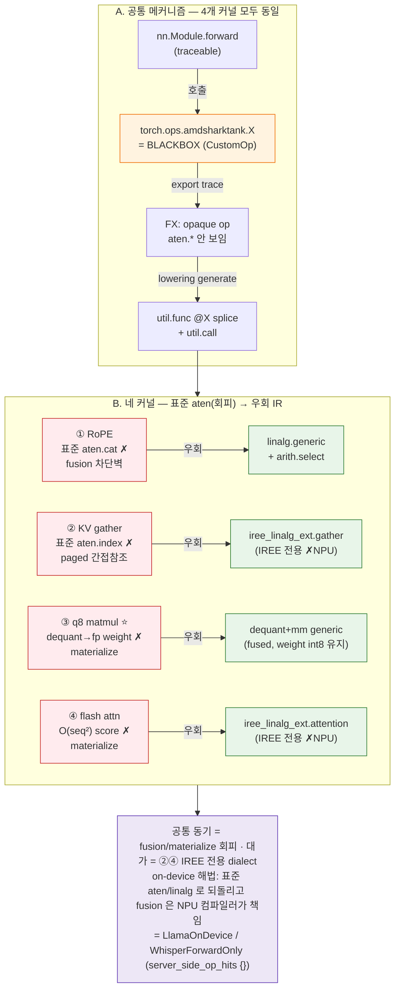

---

### 1. 공통 메커니즘 — "어떻게" splice 되나

`@mlir_kernel`(신형, `MLIRSpec` 인라인 문자열, `kernels/mlir_kernel.py:163`) / `CustomOp.register`(구형, `.mlir` 템플릿 파일 + `inline_template_function`)는 **둘 다 Torch custom op으로 등록**된다. 그래서:

1. `torch.export`가 그 내부를 `aten.*`으로 **추적하지 않음** → 단일 opaque op.
2. `aot.export` 중 op의 `generate()`(mlir_kernel.py:295)가 Jinja2로 템플릿을 **static dim·dtype에 specialize**(dynamic dim은 안 함, :237).
3. `iree.turbine...Merger`로 `util.func private @<name>` 을 메인 모듈에 splice, 호출부를 `util.call @<name>` 로 치환.

→ **"우회" = 표준 lowering을 건너뛰고 목표 linalg/IREE MLIR을 사람이 직접 써넣는 것.** 표준 경로가 만들 IR보다 *fusion 친화적*인 형태를 손으로 박는 게 목적.

---

### 2. 네 커널 — 왜(동기) ↔ 어떻게(수법) 요약

| 커널 | 표준 경로(naive)의 문제 = **왜** | 우회 수법 = **어떻게** | 박히는 IR |
|---|---|---|---|
| ① **RoPE `rope_select_concat`** (`@mlir_kernel`) | `aten.cat`(concat) = **fusion 차단벽**. RoPE→KV write→attn fusion이 끊기고 중간 버퍼 materialize | concat을 **data-movement이 아닌 elementwise**로: `linalg.generic`+`arith.select`("idx 0이면 x1, 1이면 x2") | `linalg.generic` (fusable) |
| ② **`KVCacheGatherKernel`** (`@mlir_kernel`) | paged KV = **data-dependent indirect lookup**(page_ids). torch `index_select` 체인은 6D paged slab에 안 맞고 indirect DMA 스케줄 불가 | `extract_slice`(동적 t/p_id로 블록/파티션 선택) + **`iree_linalg_ext.gather`** | `iree_linalg_ext.gather` |
| ③ **`mmt_block_scaled_q8`** (`CustomOp`) ⭐ | dequant→`aten.mm` 2단계면 **weight를 통째로 fp로 풀어 양자화 메모리 이득을 날림** + 미fusion | **dequant을 matmul 타일 안으로 fuse**: 한 `util.func`에 dequant generic + grouped-mm generic | `linalg.generic` ×2 (fused) |
| ④ **`flash_attention`/`masked_`** (`@mlir_kernel` ×2) | softmax-attn naive = **O(seq²) score matrix materialize** + 다중 패스 | flash(online-softmax)를 **`iree_linalg_ext.attention`** 한 op으로 (score matrix 안 만듦) | `iree_linalg_ext.attention` |

---

### 3. 커널별 상세

#### ① RoPE `rope_select_concat` — *concat을 fusable select로* (rotary_embedding_hf.py:20–87)

소스 주석이 동기를 그대로 적어둠:
> *"IREE doesn't have a good concat op yet which can also do fusion. The alternatives are tensor.concat or tensor.insert_slice, but both would block fusions for RoPE. We use a linalg.generic with arith.select on the concat dimension to do the concat instead."*

- **왜**: 회전된 두 반쪽 x1·x2를 `[bs,sl,heads,2,halfdim]`로 interleave-pack해야 하는데, `aten.cat`/`tensor.concat`/`insert_slice`는 IREE fusion을 끊는 **메모리 글루**라 RoPE 연산 사슬이 중간 버퍼로 끊긴다.
- **어떻게**: size-2 축을 *iteration 축*으로 만들어 `linalg.index 3` + `arith.cmpi eq …%c0` + `arith.select`로 elementwise 선택. data-movement op이 없어 cos/sin·mul과 **fuse 가능**.
  ```mlir
  %two_dim = linalg.index 3 : index
  %is_x1 = arith.cmpi eq, %two_dim, %c0 : index
  %val = arith.select %is_x1, %xs1, %xs2 : !dtype   // concat-without-concat
  ```
  주석대로 size-2 축이 unroll되면 select는 no-op로 접힘 → 오버헤드 0.

📄 **실소스 verbatim** (rotary_embedding_hf.py):
```python
## :29-42  — @mlir_kernel 데코레이터 시그니처 + 동기 주석(verbatim)
@mlir_kernel(
    inputs=(
        MLIRTensor[BS, SL, HEADS, HALFDIM, TY],
        MLIRTensor[BS, SL, HEADS, HALFDIM, TY],
    ),
    results=(MLIRTensor[BS, SL, HEADS, TWO, HALFDIM, TY],),   # ← 끝에 size-2 'two' 축
)
def rope_select_concat(x1, x2, out=None):
    """
    IREE doesn't have a good concat op yet which can also do fusion. The
    alternatives are tensor.concat or tensor.insert_slice, but both would
    block fusions for RoPE. We use a linalg.generic with arith.select
    on the concat dimension to do the concat instead.
    """
    ...

## :387-392  — 호출부 (forward → apply_rotary): cat 대신 select_concat
x1 = x_real * cos - x_imag * sin
x2 = x_imag * cos + x_real * sin
cated = select_concat(x1, x2)                       # ← @mlir_kernel custom op (blackbox)
cated = cated.flatten(start_dim=-2, end_dim=-1)     # [bs,sl,heads,2,half] → [..,head_dim]
```
```mlir
// :68-79  — splice 되는 util.func 본문 (concat-without-concat)
%out = linalg.generic #trait ins(%x1, %x2) outs(%empty) {
  ^bb0(%xs1 : !dtype, %xs2 : !dtype, %o : !dtype):
    %two_dim = linalg.index 3 : index
    %is_x1 = arith.cmpi eq, %two_dim, %c0 : index
    %val = arith.select %is_x1, %xs1, %xs2 : !dtype
    linalg.yield %val : !dtype
} -> !out
```

#### ② `KVCacheGatherKernel` — *index 체인을 IREE 네이티브 gather로* (paged_attention.py:68–135)

- **왜**: PagedAttention 캐시는 물리적으로 흩어진 페이지를 **런타임 텐서 `page_ids`로 간접 참조**(data-dependent gather). 표준 torch `index_select`/`index` 체인은 (a) 6D paged slab의 "블록·파티션 슬라이스 후 페이지 gather" 구조에 안 맞고, (b) IREE가 indirect DMA로 타일·스케줄하기 어렵다.
- **어떻게**: `tensor.extract`+`index_cast`로 스칼라 텐서 `transformer_idx`/`partition_idx`에서 동적 인덱스를 뽑아 `tensor.extract_slice`로 현재 블록/파티션을 자르고, **`iree_linalg_ext.gather dimension_map=[0]`** 로 page_ids를 따라 gather.
  ```mlir
  %cache_slice = tensor.extract_slice %cache[0,%t_id,%p_id,0,0,0][%cs,1,1,KV,STRIDE,DIM][1,..]
  %result = iree_linalg_ext.gather dimension_map=[0] ins(%cache_slice,%page_ids) outs(%empty)
  ```
- → **decode 전용**: prefill은 K/V를 새로 써넣기만, decode만 캐시에서 이 gather로 읽음.

📄 **실소스 verbatim** (paged_attention.py):
```python
## :68-88  — @mlir_kernel 시그니처: 6D paged slab + page_ids(간접) + 스칼라 인덱스 2개
@mlir_kernel(
    inputs=(
        MLIRTensor[CACHE_SIZE, T_BLOCK, PART, HEAD_COUNT_KV,
                   BLOCK_SEQ_STRIDE, ATTN_HEAD_DIM, CACHE_TY],   # 6D 캐시 slab
        MLIRTensor[BATCH, PAGES, I64],                          # page_ids (data-dependent)
        MLIRTensor[I64],                                        # transformer_idx (스칼라)
        MLIRTensor[I64],                                        # partition_idx  (스칼라)
    ),
    results=(MLIRTensor[BATCH, PAGES, HEAD_COUNT_KV,
                        BLOCK_SEQ_STRIDE, ATTN_HEAD_DIM, CACHE_TY],),
)
def paged_attention_kv_cache_gather(cache, page_ids, transformer_idx, partition_idx, result):
    ...
```
```mlir
// :104-127  — 스칼라에서 인덱스 추출 → 블록/파티션 슬라이스 → page_ids gather
%t_id64 = tensor.extract %transformer_idx[] : !transformer_idx
%p_id64 = tensor.extract %partition_idx[]   : !partition_idx
%t_id   = arith.index_cast %t_id64 : !transformer_idx_dtype to index
%p_id   = arith.index_cast %p_id64 : !partition_idx_dtype  to index
%cache_slice = tensor.extract_slice %cache
  [0, %t_id, %p_id, 0, 0, 0]
  [%cache_size, 1, 1, {{HEAD_COUNT_KV}}, {{BLOCK_SEQ_STRIDE}}, {{ATTN_HEAD_DIM}}]
  [1, 1, 1, 1, 1, 1] : !cache to !cache_slice
%result = iree_linalg_ext.gather
          dimension_map = [0]
          ins(%cache_slice, %page_ids : !cache_slice, !page_ids)
          outs(%empty : !result) -> !result
```

#### ③ `mmt_block_scaled_q8` — *dequant을 matmul에 fuse* (⭐INT8 핵심, mmt_block_scaled_q8.py:16 + templates/mmt_block_scaled_q8_3d.mlir)

INT8(GGUF Q8_0) weight = int8 `qs[N,K//32,32]` + per-block fp scale `d[N,K//32,1]`.
- **왜**: 순진하게 `dequant(qs,d)`로 fp weight를 만든 뒤 `aten.mm`하면 **fp weight 전체를 메모리에 펼쳐 양자화의 메모리 이득을 통째로 날린다**(애초에 양자화한 이유 소멸) + dequant·mm 미fusion.
- **어떻게**: 한 `util.func`에 두 `linalg.generic`을 이어 붙임 —
  1. **dequant generic**: `qs` i8 → `arith.extsi`(i32) → `arith.sitofp`(fp) → per-block scale `d` `arith.mulf`
  2. **grouped-mm generic**: `a`를 `[B,M,group0,bs]`로 `tensor.expand_shape`, (group0,block) reduction으로 f32 누적(`mulf`+`addf`) 후 cast
  - 둘이 한 함수라 IREE가 **dequant을 matmul 타일 안으로 fuse** → weight는 DRAM에 int8로 남고 타일 단위로만 레지스터에서 dequant. **이게 INT8이 실제로 메모리를 아끼게 만드는 핵심.**

📄 **실소스 verbatim** — `@mlir_kernel` 인라인이 아니라 `CustomOp` + 외부 템플릿 변종:
```python
## mmt_block_scaled_q8.py:16-30  — CustomOp 등록 + 블록 레이아웃 docstring
@CustomOp.register(library=LIBRARY)
class mmt_block_scaled_q8(CustomOp):
    """Generic block scaled matmul with transposed RHS.
    * `d`:  [N, K // 32, 1]      (per-block scale)
    * `qs`: [N, K // 32, 32]     (int8 weight)
    The LHS is expected to be a 3d tensor of shape [B, M, K]."""
    signature = "mmt_block_scaled_q8(Tensor a, Tensor d, Tensor qs) -> (Tensor)"

    def select(self, ksel):     # :32-68  블록 shape 검증 + N/K/BS 특수화
        ...  torch._check((qs_group0 * qs_bs) == a_k, ...)   # K = G*BS 일치
        a_desc.specialize_dims(-1); qs_desc.specialize_all_dims(); d_desc.specialize_all_dims()

    def generate(self, ksel, kb):   # :71-101  템플릿 채워 splice
        target = inline_template_function(kb, "mmt_block_scaled_q8_3d.mlir",
                    f"amdsharktank_mmt_block_scaled_q8_3d_{n}_{k}_{bs}_{a_type}",
                    n=n, k=k, bs=bs, group0=group0, a_type=..., scale_type=...)
        kb.yield_results(*call_function(target, *kb.arg_bindings))
```
```mlir
// templates/mmt_block_scaled_q8_3d.mlir:34-78  — 한 util.func 안의 두 generic
// (1) dequant: i8 → i32 → fp → ×scale
%b_grouped_dequant = linalg.generic {...} ins(%d, %qs) outs(%b_grouped) {
  ^bb0(%d_element, %q_element, %out):
    %q_ext    = arith.extsi  %q_element : i8 to i32
    %q_fp     = arith.sitofp %q_ext     : i32 to !a_type
    %q_scaled = arith.mulf   %q_fp, %d_element : !a_type      // dequant
    linalg.yield %q_scaled : !a_type } -> !b_grouped_tensor_type
%aexp = tensor.expand_shape %a [[0],[1],[2,3]] ...           // a → [B,M,G,BS]
// (2) grouped batch-mm: (group0, block) reduction, f32 accum  ← (1)을 타일 안으로 fuse
%result = linalg.generic {iterator_types=[...,"reduction","reduction"]}
  ins(%aexp, %b_grouped_dequant) outs(%result_fill) {
  ^bb0(%a_element, %b_element, %out):
    %mul = arith.mulf %a_element, %b_element : !a_type
    %acc = arith.addf %mul, %out : !accum_type
    linalg.yield %acc : !accum_type } -> !accum_tensor_type
```

#### ④ `kernels/attention.py` `flash_attention` — *softmax-attn을 fused flash op으로* (attention.py:30, :78)

- **왜**: `QKᵀ→scale→(mask)→softmax→·V`를 aten으로 풀면 **O(M×K2) score matrix를 materialize**(긴 seq에서 메모리 폭발) + 여러 패스.
- **어떻게**: flash(online-softmax, running max/sum)를 **`iree_linalg_ext.attention`** 단일 op으로 박음 — 5개 indexing_map(Q/K/V/scale/out), masked는 mask map 1개 추가. score matrix를 안 만들고 IREE backend가 tiled flash로 lower.
- **층위 주의**: default Llama-3.2-1B export에 보인 건 이게 아니라 PyTorch 자체 CPU fallback `aten._scaled_dot_product_flash_attention_for_cpu`(불투명 aten, export layer). `kernels/attention.py`는 `attention_kernel` 플래그로 선택되는 **AMD의 *의도된* fused attention**(lowering layer). 둘 다 "naive softmax-attn 회피"지만 층이 다름 ([easy6-sum §1.5](easy6-sum.md) E7 vs L계열).

📄 **실소스 verbatim** (attention.py):
```python
## :30-39  — @mlir_kernel 시그니처: Q/K/V + scale, 전체 attention 이 결과 1개
@mlir_kernel(
    inputs=(
        MLIRTensor[BATCH, NUM_HEADS, M, K1, I_DTYPE],   # Q
        MLIRTensor[BATCH, NUM_HEADS, K2, K1, I_DTYPE],  # K
        MLIRTensor[BATCH, NUM_HEADS, K2, N, I_DTYPE],   # V
        MLIRTensor[S_DTYPE],                            # scale (스칼라)
    ),
    results=(MLIRTensor[BATCH, NUM_HEADS, M, N, O_DTYPE],),
)
def flash_attention(q, k, v, scale, result=None):
    ...
```
```mlir
// :56-69  — softmax(QK^T)@V 전체를 단일 op 으로 (score matrix 안 만듦)
%result = iree_linalg_ext.attention {
  indexing_maps = [ /* Q */ ..., /* K */ ..., /* V */ ..., /* scale */ ..., /* out */ ... ]
}
ins(%q, %k, %v, %s_c : !q, !k, !v, !scale_dtype)
outs(%empty : !result) {
  ^bb0(%score : f32):
    iree_linalg_ext.yield %score : f32     // body 비어있음 = backend 가 tiled flash 로 codegen
} -> !result
// masked_flash_attention(:88-125): 위와 동일 + indexing_maps 에 mask map (M,K2) 1개 추가
```

---

### 4. 관통 동기 + 우리 NPU에 남는 빚

| 커널 | 회피한 materialize | 우회로 얻은 것 | 우리가 받는 IR | 비-IREE NPU |
|---|---|---|---|---|
| RoPE concat | concat 중간버퍼 | fusion 유지 | `linalg.generic`+select | 표준 linalg면 가능, 외부 util.func면 unknown |
| KV gather | (indirect 표준화) | schedulable indirect DMA | `iree_linalg_ext.gather` | ✗ IREE 확장 dialect |
| q8 matmul | fp weight 전체 | weight int8 유지 | `linalg.generic` ×2 | 표준 linalg면 가능 |
| flash attn | O(seq²) score | flash 1-pass | `iree_linalg_ext.attention` | ✗ IREE 확장 dialect |

> **AMD의 우회 = IREE에 최적, 우리에겐 portability 빚.** on-device는 이걸 표준 aten/linalg로 *되돌리되*(RoPE concat→표준 `cat`, gather→재계산/`index_select`, q8→직접 block dequant-mm, flash→분해 또는 NPU 네이티브 attention) **fusion 이득은 NPU 컴파일러가 다시 책임지는** 구조. = 우리 `LlamaOnDevice`/`WhisperForwardOnly`가 한 일.

---

### 5. INT8 가는 길 — `mmt_block_scaled_q8` 표준 재표현 스케치

양자화는 마지막 단계지만, 갈 때 이 커널이 핵심. NPU가 `iree_linalg_ext`/외부 util.func를 못 받으면 **block-scaled dequant-fused-matmul을 직접 표현**해야 함.

```python
## (a) 기능적으로 맞고 순수 aten으로 lowering되는 표현 — 단, fusion은 backend 책임
## qs:[N,G,BS] int8, d:[N,G,1] fp, a:[B,M,K=G*BS] fp
def mmt_block_scaled_q8(a, d, qs):
    N, G, BS = qs.shape
    w = (qs.to(a.dtype) * d).reshape(N, G * BS)   # dequant → [N,K]  (aten.mul/cast/view)
    return a @ w.transpose(-1, -2)                # [B,M,N]          (aten.mm)
```

- **장점**: 전부 `torch.aten.*`(mul/cast/view/mm) → 표준 torch-mlir로 깨끗이 lowering, `server_side_op_hits` 0.
- **함정**: `(qs.to(fp)*d)`가 **fp weight를 통째로 materialize**하면 양자화 메모리 이득 소멸. → 이득을 지키려면 (i) NPU 컴파일러가 dequant→mm을 *타일 안으로 fuse*하거나, (ii) NPU의 block-quant matmul intrinsic을 쓰거나, (iii) 위를 `linalg.generic` 한 덩어리(amdsharktank 템플릿과 동형)로 직접 써서 fusion을 강제. **즉 INT8 porting의 진짜 일감 = "정확한 dequant"가 아니라 "dequant을 mm에 fuse해 weight를 int8로 유지"**.

---

### 6. cheat sheet (소스 직접 열기)

```bash
ASK=/home/bohyun/amd-shark-ai/amdsharktank/amdsharktank

## ① RoPE concat — 주석에 '왜'가 그대로
sed -n '20,90p'  $ASK/layers/rotary_embedding_hf.py     # rope_select_concat (@mlir_kernel)
## ② KV gather
sed -n '54,135p' $ASK/layers/paged_attention.py         # KVCacheGatherKernel → iree_linalg_ext.gather
## ③ q8 matmul (INT8)
cat $ASK/kernels/mmt_block_scaled_q8.py                  # CustomOp (select/generate)
cat $ASK/kernels/templates/mmt_block_scaled_q8_3d.mlir   # dequant generic + grouped-mm generic
## ④ flash attention
sed -n '30,130p'  $ASK/kernels/attention.py              # flash/masked → iree_linalg_ext.attention
## 공통 인프라 (splice 방식)
sed -n '143,300p' $ASK/kernels/mlir_kernel.py            # MLIRSpec · mlir_kernel · select/generate
```

---

### 7. 참고

- 카탈로그: [easy6.md](easy6.md) §2.1 (제약 kernel 전체) · 종합표 [easy6-sum.md](easy6-sum.md) (§2 막히는 커널 4곳 + §1.5 layer 구분)
- 2계층(export-time vs lowering-time): [easy4-detail.md](easy4-detail.md) §3 · 그림 [easy5-fig.md](easy5-fig.md) Fig 1
- on-device 해소: [`../../src/torch_mlir_zoo/models/llama_on_device.py`](../../src/torch_mlir_zoo/models/llama_on_device.py)
- amdsharktank source: [layers/rotary_embedding_hf.py](https://github.com/nod-ai/amd-shark-ai/blob/main/amdsharktank/amdsharktank/layers/rotary_embedding_hf.py) · [layers/paged_attention.py](https://github.com/nod-ai/amd-shark-ai/blob/main/amdsharktank/amdsharktank/layers/paged_attention.py) · [kernels/mmt_block_scaled_q8.py](https://github.com/nod-ai/amd-shark-ai/blob/main/amdsharktank/amdsharktank/kernels/mmt_block_scaled_q8.py) · [kernels/attention.py](https://github.com/nod-ai/amd-shark-ai/blob/main/amdsharktank/amdsharktank/kernels/attention.py)


---

<a id="sec-easy8-detail"></a>

## easy8-detail — AMD는 왜 커널을 *손으로* 짰을까

> easy8이 요약·표였다면, 이건 amdsharktank 소스를 실제로 열어 한 줄씩 따라가며 적은 정독 노트다.
> 대상은 네 개: RoPE의 `rope_select_concat`, paged KV cache의 `KVCacheGatherKernel`,
> 블록 양자화 행렬곱 `mmt_block_scaled_q8`(INT8 갈 때 핵심), 그리고 `kernels/attention.py`의 flash attention.
> 소스는 `/home/bohyun/amd-shark-ai/amdsharktank/amdsharktank/` 클론에서 읽기만 했다.

### 시작은 사소한 의문이었다

torch-mlir/turbine 파이프라인을 정리하다 보면 "`nn.Module`을 `torch.export`로 추적하면 전부 `torch.aten.*`으로 떨어진다"는 게 머릿속 기본 가정이 된다. 그런데 amdsharktank로 Llama를 뽑은 IR을 들여다보면 `aten`이 아닌 게 섞여 있다. `iree_linalg_ext.attention`, `iree_linalg_ext.gather`, 그리고 정체불명의 `linalg.generic` 덩어리들. 처음엔 "torch가 이건 lowering을 못 해서 fallback이 박힌 건가?" 싶었다.

소스를 열고 나서야 그게 거꾸로라는 걸 알았다. 이건 torch가 *못 한* 게 아니라, AMD가 *일부러 torch한테 안 보여준* 연산이다. 표준 경로로 두면 분명히 동작은 하는데, 그렇게 나온 IR이 IREE 입장에서 fusion이 안 되거나 중간 텐서를 메모리에 통째로 풀어버린다. 그래서 같은 수학을 IREE가 좋아하는 모양으로 손수 MLIR로 써서 끼워 넣은 것이다. 네 커널이 다 그렇다. 동기가 하나로 모인다 — **fusion / 중간 텐서 materialize를 피하려고.**

### 잠깐, fusion이 뭔데

이 문서 전체가 "fusion 회피"라는 말 위에 서 있으니, 그것부터 짚고 가자. 아주 단순한 예 `A * B + C`를 생각해보자. fusion이 없으면(naive) 칩은 이렇게 움직인다. DRAM에서 A, B를 읽어 칩 안에서 곱하고, 그 곱셈 결과(중간텐서)를 *다시 DRAM에 내려놓는다*. 그 다음 덧셈을 하려고 방금 내려놓은 중간텐서와 C를 *또 DRAM에서 읽어* 올려서 더하고, 최종 결과를 DRAM에 쓴다. 칩과 DRAM 사이를 굳이 두 번 더 왕복하는 것이다. DRAM은 크지만 느리고, 이 왕복이 메모리 대역폭 병목을 만든다.

fusion은 이 왕복을 없앤다. A, B, C를 한 번에 읽어와서, `A*B`를 한 결과를 *칩 밖으로 빼지 않고 레지스터에 둔 채로* 곧바로 `+C`까지 끝낸 뒤, 최종 결과만 DRAM에 딱 한 번 쓴다. 중간텐서가 DRAM에 존재한 적이 없다. DRAM 접근이 naive 6번(read 4 + write 2)에서 fusion 4번(read 3 + write 1)으로 줄고, 시퀀스가 길거나 텐서가 클수록 이 차이가 추론 속도를 몇 배로 벌리고 전력도 아낀다.

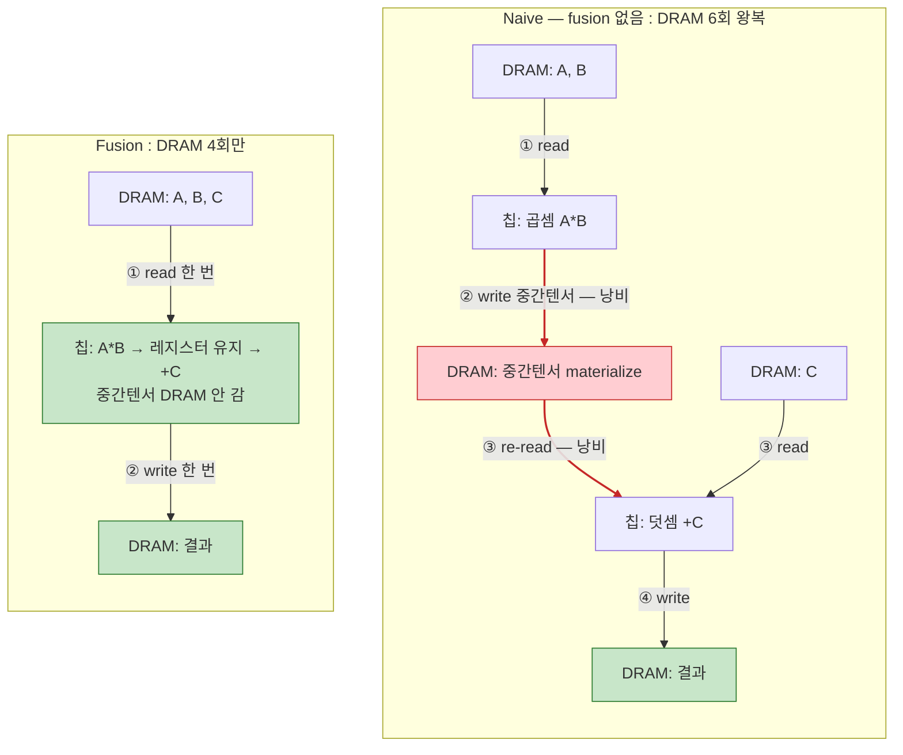

여기서 핵심은, 뒤에 나올 네 커널이 없애려는 "중간텐서"가 바로 이 그림의 빨간 박스라는 점이다. RoPE에선 그게 concat 버퍼고, q8에선 dequant된 fp weight 전체고, attention에선 O(seq²) score matrix다. AMD의 손 커널은 결국 *이 중간텐서를 DRAM에 안 내리려는* 시도다. (그림 원본·A\*B+C 상세: [../diagrams/fusion-concept.drawio](../diagrams/fusion-concept.drawio) Page 1)

### fusion은 *누가* 하나 — AOTInductor와 우리 경로

그럼 이 fusion은 누가 해주는 걸까? `torch.export`로 모델을 그래프(ExportedProgram)로 뽑고 나면, 그걸 실제 배포 가능한 바이너리로 바꾸는 "AOT 컴파일러"가 갈래가 갈린다. 이걸 정리하다 AOTInductor라는 게 나왔는데, 우리 경로와 비교해보면 그림이 깔끔해진다.

**AOTInductor**는 PyTorch가 자체적으로 가진 ahead-of-time 컴파일러다. `torch.compile`이 런타임에 JIT로 쓰는 백엔드가 TorchInductor인데, 그 AOT 버전이라고 보면 된다. `torch._inductor.aoti_compile_and_package(ep)` 같은 식으로 export된 그래프를 받아서, Inductor가 **fusion**(pointwise/reduction 융합)을 한 다음 Triton(GPU)·C++(CPU) 커널을 생성하고, 그걸 `.so` 하나로 묶는다. 그러면 Python 런타임 없이 C++에서 바로 돌릴 수 있다. 즉 위에서 그린 "중간텐서 안 내리기"를 *PyTorch가 직접* 해서 바이너리로 떨궈주는 길이다.

**우리 경로**(iree-turbine / torch-mlir)는 같은 `torch.export` 결과에서 출발하지만 코드 생성을 PyTorch가 아니라 IREE에 맡긴다. `aot.export`로 torch dialect → linalg → IREE로 내리고, fusion과 codegen을 IREE가 한다. AMD가 `@mlir_kernel`로 손 fusion을 박은 것도 정확히 이 IREE 경로 *안에서* 일어나는 일이다.

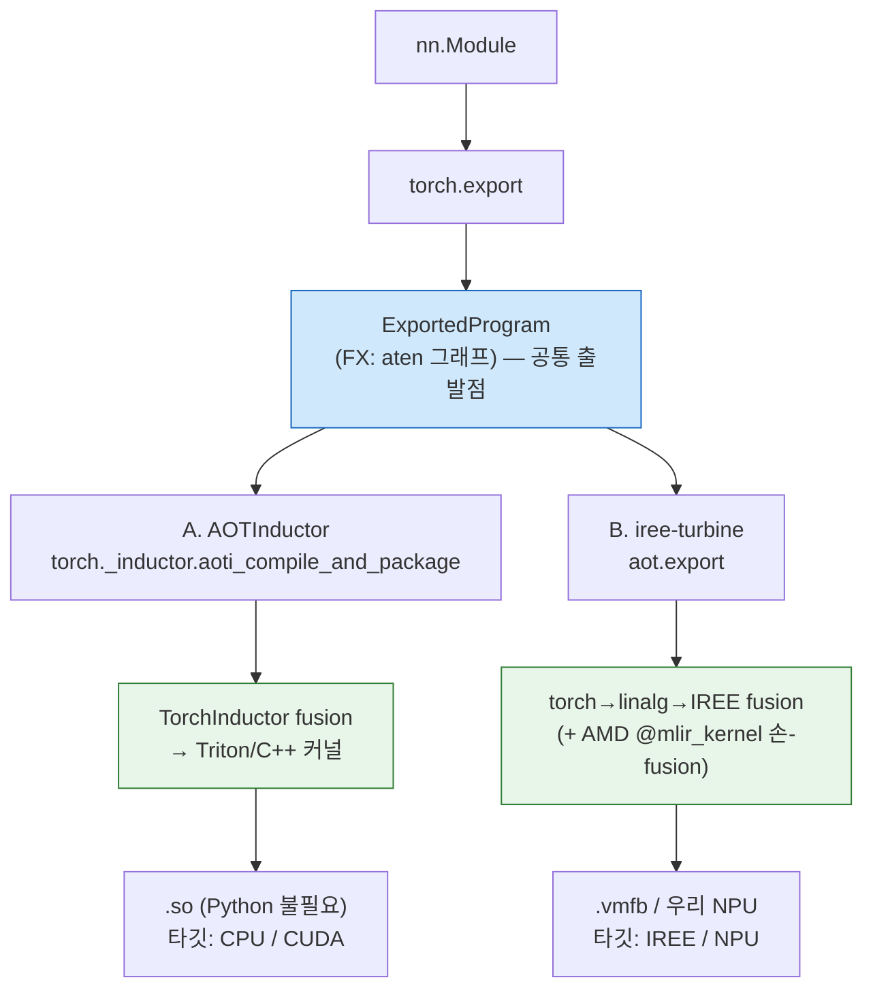

두 길의 공통점은 분명하다. 둘 다 `torch.export`에서 갈라지고, 둘 다 핵심 최적화가 fusion이다 — 위 A\*B+C 그림의 그 fusion. 차이는 *누가* fusion하고 *어디로* codegen하느냐다. AOTInductor는 Triton/C++로 떨어지니 CPU/CUDA가 타깃이고, 임의의 NPU를 직접 노리진 못한다. 우리는 IREE(또는 우리 NPU 컴파일러)로 내리니 NPU 경로가 열리지만, 대신 IREE 전용 op(`iree_linalg_ext.*` 같은)가 IR에 박히면 비-IREE NPU엔 그게 빚이 된다 — 이게 easy8 네 커널 얘기로 돌아온다.

그래서 우리 입장에서 결론은, NPU가 IREE 비호환이면 B 경로로 가되 AMD의 IREE 전용 손 커널은 표준 aten/linalg로 되돌리고, 정작 그들이 손으로 챙겼던 fusion 이득은 우리 NPU 컴파일러가 다시 책임지게 한다는 것이다. (이 비교 그림: [../diagrams/fusion-concept.drawio](../diagrams/fusion-concept.drawio) Page 2)

### 우회의 공통 트릭부터 — torch한테 어떻게 숨기나

네 커널은 등록 방식이 두 가지로 보이지만(`@mlir_kernel` 데코레이터, 그리고 `@CustomOp.register` + 외부 `.mlir` 템플릿) 사실 한 뿌리다. `kernels/mlir_kernel.py`를 보면 `@mlir_kernel` 안에서 결국 `CustomOp`를 만들어 등록한다:

```python
## kernels/mlir_kernel.py:229 — mlir_kernel 데코레이터 내부
@CustomOp.register(library=LIBRARY)
class kernel(CustomOp):
    def select(self, sel): ...     # trace 때 결과 shape/dtype 결정, static dim 특수화
    def generate(self, ksel, kb):  # lowering 때 손으로 쓴 MLIR을 모듈에 splice
```

핵심은 이 `CustomOp`가 torch custom op이라는 점이다. 그래서 흐름이 이렇게 두 단계로 갈린다.

- **trace(export) 때:** 모델 코드는 그냥 `torch.ops.amdsharktank.<이름>(...)`을 부른다. `torch.export` 입장에선 이게 블랙박스다. 내부를 `aten`으로 풀어 헤치지 않는다. 그래서 FX 그래프엔 불투명한 custom op 하나만 남는다 — concat도, softmax도, gather도 안 보인다.
- **lowering(aot.export) 때:** 그 op의 `generate()`가 호출된다. Jinja2로 미리 써둔 MLIR 템플릿을 static dim·dtype에 맞게 채워 `util.func private @<이름>`을 만들고, turbine의 Merger가 그걸 메인 모듈에 끼워 넣은 뒤 호출부를 `util.call`로 바꾼다.

정리하면, "우회"란 표준 lowering을 건너뛰고 *내가 원하는 linalg/IREE MLIR을 사람이 직접 써서 박는 것*이다. 표준 경로가 만들어낼 IR보다 fusion 친화적인 형태를 손으로 보장하는 게 목적이고, 대가는 IREE 전용 방언이 IR에 박힌다는 것. 이 대가가 나중에 우리 NPU 얘기로 돌아온다.

### ① RoPE — concat이 fusion을 끊어서

가장 먼저 연 게 `layers/rotary_embedding_hf.py`였는데, 운 좋게도 동기가 소스 주석에 그대로 적혀 있었다. `rope_select_concat`이라는 `@mlir_kernel` 함수의 docstring이다:

```python
## layers/rotary_embedding_hf.py:29
@mlir_kernel(
    inputs=(
        MLIRTensor[BS, SL, HEADS, HALFDIM, TY],
        MLIRTensor[BS, SL, HEADS, HALFDIM, TY],
    ),
    results=(MLIRTensor[BS, SL, HEADS, TWO, HALFDIM, TY],),   # 끝에 크기 2짜리 'two' 축
)
def rope_select_concat(x1, x2, out=None):
    """
    IREE doesn't have a good concat op yet which can also do fusion. The
    alternatives are tensor.concat or tensor.insert_slice, but both would
    block fusions for RoPE. We use a linalg.generic with arith.select
    on the concat dimension to do the concat instead.
    """
```

RoPE는 회전시킨 두 반쪽 `x1`, `x2`를 다시 하나로 붙여야 한다. 보통 `torch.cat([x1, x2], dim=-1)`로 끝낼 일이다. 그런데 cat은 본질적으로 "데이터를 새 버퍼로 옮기는" 연산이라, IREE가 RoPE 앞뒤(cos/sin 곱, 그 다음 KV write, attention)를 하나로 묶으려 할 때 그 사슬을 끊어버린다. 중간 결과가 메모리로 한 번 내려갔다 올라오는 것이다.

그래서 택한 게 "concat을 concat 안 하고 흉내내기"다. 결과 텐서 끝에 크기 2짜리 축(`two`)을 하나 만들고, 그 축을 *반복 축*으로 삼아 `linalg.generic` 한 방으로 채운다. 인덱스가 0이면 `x1`, 1이면 `x2`를 고르는 식이다:

```mlir
// layers/rotary_embedding_hf.py:68 — splice되는 util.func 본문 일부
%out = linalg.generic #trait ins(%x1, %x2) outs(%empty) {
  ^bb0(%xs1 : !dtype, %xs2 : !dtype, %o : !dtype):
    %two_dim = linalg.index 3 : index
    %is_x1 = arith.cmpi eq, %two_dim, %c0 : index
    %val = arith.select %is_x1, %xs1, %xs2 : !dtype   // 데이터 이동 없는 concat
    linalg.yield %val : !dtype
} -> !out
```

이러면 concat이 데이터 이동 연산이 아니라 elementwise select가 되어 앞뒤 곱셈과 그대로 fuse된다. 주석에 슬쩍 적힌 디테일이 좋은데, 저 크기 2 축이 나중에 unroll되면 `select` 조건이 상수로 접혀 사라진다 — 즉 추가 비용이 0으로 수렴한다는 계산까지 깔고 만든 것이다.

호출부는 평범하다. `forward` 안의 `apply_rotary`에서 회전을 계산한 뒤 이 커스텀 op를 부르고 마지막 두 축을 합친다:

```python
## layers/rotary_embedding_hf.py:387
x1 = x_real * cos - x_imag * sin
x2 = x_imag * cos + x_real * sin
cated = select_concat(x1, x2)                    # @mlir_kernel custom op (torch엔 블랙박스)
cated = cated.flatten(start_dim=-2, end_dim=-1)  # [bs,sl,heads,2,half] → [.., head_dim]
```

여담인데, 같은 파일에서 interleaved 슬라이싱(`x[..., 0::2]`) 부분은 우회를 *못 했다*고 솔직하게 적어둔 게 인상적이었다. "이건 codegen에서 `slow_memcpy`로 떨어진다, 세 가지 대안이 있는데 각각 이런 단점이 있어서, 일단은 누가 불평할 때까지 느린 채로 둔다"고 주석에 써놨다(`:362-385`). 사람이 짠 코드라는 게 이런 데서 보인다. 다 최적화한 게 아니라, 아픈 데를 알면서 우선순위에 밀어둔 흔적.

### ② KV cache gather — 페이지가 메모리에 흩어져 있어서

다음은 `layers/paged_attention.py`의 `KVCacheGatherKernel`. 이건 주석이 친절하진 않아서 시그니처를 보고 역추적했다. 입력 캐시가 6차원이다:

```python
## layers/paged_attention.py:68
@mlir_kernel(
    inputs=(
        MLIRTensor[CACHE_SIZE, T_BLOCK, PART, HEAD_COUNT_KV,
                   BLOCK_SEQ_STRIDE, ATTN_HEAD_DIM, CACHE_TY],   # 6D 캐시 slab
        MLIRTensor[BATCH, PAGES, I64],                          # page_ids (런타임 값)
        MLIRTensor[I64],                                        # transformer_idx (스칼라)
        MLIRTensor[I64],                                        # partition_idx  (스칼라)
    ),
    results=(MLIRTensor[BATCH, PAGES, HEAD_COUNT_KV,
                        BLOCK_SEQ_STRIDE, ATTN_HEAD_DIM, CACHE_TY],),
)
def paged_attention_kv_cache_gather(cache, page_ids, transformer_idx, partition_idx, result):
```

paged attention의 KV 캐시는 연속된 한 덩어리가 아니라 페이지 단위로 흩어져 있고, 어느 페이지를 읽을지는 런타임 텐서 `page_ids`가 정한다. 즉 data-dependent indirect lookup이다. 이걸 torch의 `index_select`/`index` 체인으로 흉내내려 하면 두 가지가 거슬린다. 하나는 6차원 slab에서 "현재 transformer 블록과 partition을 먼저 잘라낸 뒤, 거기서 페이지를 gather"하는 구조가 표준 인덱싱과 잘 안 맞는다는 것. 다른 하나는 그렇게 나온 IR을 IREE가 indirect DMA로 타일링·스케줄하기 어렵다는 것.

그래서 두 단계로 직접 썼다. 먼저 스칼라 텐서에서 인덱스를 꺼내 동적 슬라이스로 현재 블록/partition만 자르고, 그 다음 IREE 네이티브 gather를 쓴다:

```mlir
// layers/paged_attention.py:104 — 스칼라에서 인덱스 추출 → 슬라이스 → gather
%t_id64 = tensor.extract %transformer_idx[] : !transformer_idx
%p_id64 = tensor.extract %partition_idx[]   : !partition_idx
%t_id   = arith.index_cast %t_id64 : !transformer_idx_dtype to index
%p_id   = arith.index_cast %p_id64 : !partition_idx_dtype  to index
%cache_slice = tensor.extract_slice %cache
  [0, %t_id, %p_id, 0, 0, 0]
  [%cache_size, 1, 1, {{HEAD_COUNT_KV}}, {{BLOCK_SEQ_STRIDE}}, {{ATTN_HEAD_DIM}}]
  [1, 1, 1, 1, 1, 1] : !cache to !cache_slice
%result = iree_linalg_ext.gather
          dimension_map = [0]
          ins(%cache_slice, %page_ids : !cache_slice, !page_ids)
          outs(%empty : !result) -> !result
```

한 가지 비대칭이 있는데, 이 gather는 **decode 전용**이다. prefill 단계에선 K/V를 새로 계산해서 캐시에 *쓰기*만 하고, decode 단계에서만 캐시에서 이 gather로 *읽는다*. 그래서 IR을 prefill/decode로 나눠 뽑아보면 gather 개수가 0과 32로 갈린다. 처음에 이 숫자 차이를 보고 "왜 한쪽엔 gather가 없지?" 했는데, 캐시 읽기 자체가 decode에만 있으니 당연했다.

### ③ mmt_block_scaled_q8 — INT8로 갈 거면 여기가 진짜 핵심

개인적으로 제일 오래 본 건 `kernels/mmt_block_scaled_q8.py`다. 양자화는 우리 로드맵상 마지막 단계지만, 막상 갈 때 이 커널의 아이디어를 이해 못 하면 양자화의 의미 자체가 날아간다.

INT8 weight는 보통 두 텐서로 저장된다. 정수 부분 `qs`(블록당 32개씩 묶인 int8)와, 블록마다 하나씩 붙는 실수 스케일 `d`. 순진하게 쓰면 이렇다 — `qs`에 `d`를 곱해 fp weight를 복원(dequant)한 다음 그걸로 행렬곱. 문제는 이 dequant 결과다. weight를 통째로 fp로 풀어 메모리에 올리는 순간, 애초에 int8로 저장해서 아낀 메모리·대역폭이 그대로 증발한다. 양자화한 이유가 사라지는 것이다.

이 클래스는 그래서 dequant과 matmul을 *한 함수 안의 두 `linalg.generic`*으로 붙여서, IREE가 dequant을 matmul 타일 안으로 fuse하게 만든다. 그러면 weight는 DRAM에 int8로 남고, dequant은 타일이 레지스터로 올라온 그 순간에만 일어난다. fp weight 전체가 메모리에 존재하는 일이 없다.

먼저 Python 쪽. `@mlir_kernel` 인라인이 아니라 `CustomOp`를 직접 상속하고, MLIR은 외부 템플릿 파일로 뺀 변종이다:

```python
## kernels/mmt_block_scaled_q8.py:16
@CustomOp.register(library=LIBRARY)
class mmt_block_scaled_q8(CustomOp):
    """Generic block scaled matmul with transposed RHS.
    * d:  [N, K // 32, 1]      (per-block scale)
    * qs: [N, K // 32, 32]     (int8 weight)
    The LHS is expected to be a 3d tensor of shape [B, M, K]."""
    signature = "mmt_block_scaled_q8(Tensor a, Tensor d, Tensor qs) -> (Tensor)"

    def select(self, ksel):          # :32 — 블록 레이아웃 검증 + N/K/BS 특수화
        ...
        torch._check((qs_group0 * qs_bs) == a_k, ...)   # K == group0 * block_size 확인
        a_desc.specialize_dims(-1)
        qs_desc.specialize_all_dims()
        d_desc.specialize_all_dims()

    def generate(self, ksel, kb):    # :71 — 템플릿을 채워 util.func로 splice
        target = inline_template_function(
            kb, "mmt_block_scaled_q8_3d.mlir",
            f"amdsharktank_mmt_block_scaled_q8_3d_{n}_{k}_{bs}_{a_type}",
            n=n, k=k, bs=bs, group0=group0, a_type=..., scale_type=...)
        kb.yield_results(*call_function(target, *kb.arg_bindings))
```

`select`는 trace 때 불려서 shape이 블록 규약(`K = group0 × block_size`)에 맞는지 확인하고 N/K/BS를 static으로 박는다. `generate`는 lowering 때 템플릿 `mmt_block_scaled_q8_3d.mlir`을 그 값들로 채워 함수를 만들고 호출로 연결한다.

진짜 알맹이는 그 템플릿이다. 한 `util.func` 안에 generic이 둘 있는데, 첫째가 dequant, 둘째가 그룹화된 행렬곱이고, 둘이 같은 함수라 fuse된다:

```mlir
// kernels/templates/mmt_block_scaled_q8_3d.mlir:34 — (1) dequant generic
%b_grouped_dequant = linalg.generic {...} ins(%d, %qs) outs(%b_grouped) {
  ^bb0(%d_element: !scale_type, %q_element: !lowp_type, %out: !a_type):
    %q_ext    = arith.extsi  %q_element : i8 to i32      // int8 → int32
    %q_fp     = arith.sitofp %q_ext     : i32 to !a_type // → float
    %q_scaled = arith.mulf   %q_fp, %d_element : !a_type // × 블록 스케일 = dequant
    linalg.yield %q_scaled : !a_type
} -> !b_grouped_tensor_type

// a를 블록 reduction 구조에 맞게 [B, M, group0, block]으로 펼친다
%aexp = tensor.expand_shape %a [[0],[1],[2,3]] ...

// (2) grouped batch-mm generic — (group0, block) 두 축이 reduction, f32로 누적
%result = linalg.generic {iterator_types = [..., "reduction", "reduction"]}
  ins(%aexp, %b_grouped_dequant) outs(%result_fill) {
  ^bb0(%a_element: !a_type, %b_element: !a_type, %out: !accum_type):
    %mul = arith.mulf %a_element, %b_element : !a_type
    %acc = arith.addf %mul, %out : !accum_type
    linalg.yield %acc : !accum_type
} -> !accum_tensor_type
```

여기서 깨달은 게 하나 있다. 우리가 나중에 양자화를 NPU로 가져갈 때 진짜 할 일은 "dequant 수식을 정확히 옮기는 것"이 아니다. 정확한 dequant은 사실 쉽다 — `(qs.to(fp) * d) @ aᵀ` 한 줄이면 기능적으로는 맞고 전부 깔끔한 `aten`으로 lowering된다. 어려운 건 그 `qs.to(fp) * d`가 fp weight를 통째로 materialize하지 않게 하는 것이다. 즉 dequant을 matmul에 fuse해서 weight를 int8로 유지하는 게 일감의 본질이다. NPU 컴파일러가 이 fusion을 해주거나, NPU에 block-quant matmul intrinsic이 있거나, 아니면 이 템플릿처럼 우리가 `linalg.generic` 한 덩어리로 직접 묶어서 fusion을 강제하거나 — 셋 중 하나여야 한다.

### ④ flash attention — score 행렬을 안 만들려고

마지막은 `kernels/attention.py`. 여기엔 `flash_attention`과 `masked_flash_attention` 두 개가 있는데 구조는 같다. 시그니처를 보면 Q·K·V·scale을 받아 결과 하나를 낸다. attention 전체가 한 op이다:

```python
## kernels/attention.py:30
@mlir_kernel(
    inputs=(
        MLIRTensor[BATCH, NUM_HEADS, M, K1, I_DTYPE],   # Q
        MLIRTensor[BATCH, NUM_HEADS, K2, K1, I_DTYPE],  # K
        MLIRTensor[BATCH, NUM_HEADS, K2, N, I_DTYPE],   # V
        MLIRTensor[S_DTYPE],                            # scale (스칼라)
    ),
    results=(MLIRTensor[BATCH, NUM_HEADS, M, N, O_DTYPE],),
)
def flash_attention(q, k, v, scale, result=None):
```

`softmax(QKᵀ · scale) @ V`를 그대로 aten으로 풀면 중간에 `M × K2` 크기의 score 행렬이 메모리에 잡힌다. 시퀀스가 길어지면 이게 제곱으로 커져서 메모리가 터진다. flash attention은 online-softmax(돌면서 max/sum을 갱신)로 이 score 행렬을 만들지 않고 한 번에 흘려보내는 기법이고, AMD는 그걸 IREE의 단일 op으로 박았다:

```mlir
// kernels/attention.py:56
%result = iree_linalg_ext.attention {
  indexing_maps = [ /* Q */, /* K */, /* V */, /* scale */, /* out */ ]
}
ins(%q, %k, %v, %s_c : !q, !k, !v, !scale_dtype)
outs(%empty : !result) {
  ^bb0(%score : f32):
    iree_linalg_ext.yield %score : f32   // body가 비어 있음 = backend가 tiled flash로 codegen
} -> !result
```

body가 `yield %score` 하나뿐인 게 포인트다. 실제 타일링·online-softmax는 IREE backend가 채운다. masked 버전은 여기에 `(M, K2)` 모양 mask map 하나만 더 붙는다(`:88-125`).

한 가지 헷갈렸던 걸 적어둔다. 정작 default Llama-3.2-1B를 export해서 나온 IR에 보였던 attention은 이 커널이 *아니었다*. 거기 박힌 건 PyTorch 자신의 CPU fallback인 `aten._scaled_dot_product_flash_attention_for_cpu`라는 불투명 aten op이었다. 이건 export 층의 얘기고, `kernels/attention.py`의 flash는 `attention_kernel` 플래그로 선택되는 AMD의 *의도된* lowering 층 커널이다. 둘 다 "naive softmax-attn을 피한다"는 목적은 같은데 층이 다르다. 이 구분은 easy6-sum의 §1.5(E7 vs L 계열)에 따로 정리해뒀다.

### 그림으로 한 번에

네 개를 따로 보면 제각각 같지만, 한 장으로 펼치면 같은 골격이 반복된다는 게 보인다. 위쪽은 trace→lowering splice 메커니즘, 가운데는 네 커널이 각각 "표준 aten(회피) → 우회 IR"로 가는 모습, 아래는 그래서 우리한테 남는 결론.

편집 가능한 원본은 [../diagrams/kernel-bypass.drawio](../diagrams/kernel-bypass.drawio)에 있다(VS Code draw.io 확장으로 열면 Page 1은 전체, Page 2는 q8 INT8 dataflow). 아래는 Mermaid 미리보기:

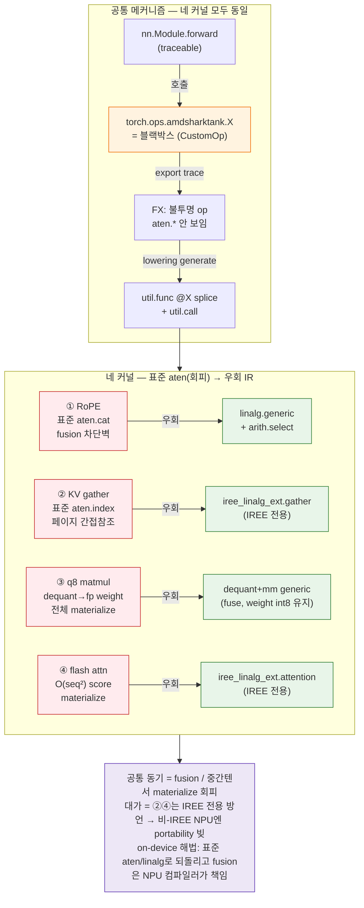

### 그래서 우리한테 남는 것

소스를 다 읽고 나서 든 생각은, AMD의 이 우회들이 *잘못된 게 아니라 IREE에 최적화된 것*이라는 거다. IREE 위에서는 이게 정답에 가깝다. 문제는 우리 타깃이 IREE가 아닐 때다. RoPE의 select-concat과 q8의 dequant-generic은 결국 표준 `linalg`이라 운이 좋으면 그대로 받을 수도 있지만, KV gather의 `iree_linalg_ext.gather`와 flash의 `iree_linalg_ext.attention`은 IREE 확장 방언이라 비-IREE NPU 컴파일러엔 그냥 모르는 op로 떨어진다. 이게 "portability 빚"이다.

그래서 on-device로 갈 때 방향은 명확하다. 이 우회들을 표준 aten/linalg로 *되돌리되*, AMD가 손으로 챙겼던 fusion 이득은 NPU 컴파일러가 다시 책임지게 하는 것. RoPE는 표준 concat으로, gather는 재계산이나 `index_select`로, q8는 직접 block dequant-mm으로, flash는 분해하거나 NPU 네이티브 attention으로. 우리 `LlamaOnDevice`와 `WhisperForwardOnly`가 정확히 이 일을 한 결과가 IR에서 `server_side_op_hits = {}`로 나오는 것이고. 결국 이번 정독의 결론은 한 줄이다 — **AMD가 손으로 한 fusion을, 우리는 컴파일러한테 떠넘기는 구조로 바꾼다.**

### 더 볼 것

- 요약본: [easy8.md](easy8.md) (왜·어떻게 표 + cheat sheet)
- 제약 카탈로그: [easy6.md](easy6.md) §2.1 · 종합표 [easy6-sum.md](easy6-sum.md) (§2 막히는 커널 4곳, §1.5 export 층 vs lowering 층)
- 2계층(export-time vs lowering-time) 정밀: [easy4-detail.md](easy4-detail.md) §3 · 그림 [easy5-fig.md](easy5-fig.md)
- on-device 구현: [`../../src/torch_mlir_zoo/models/llama_on_device.py`](../../src/torch_mlir_zoo/models/llama_on_device.py)
- amdsharktank 원본(GitHub): [rotary_embedding_hf.py](https://github.com/nod-ai/amd-shark-ai/blob/main/amdsharktank/amdsharktank/layers/rotary_embedding_hf.py) · [paged_attention.py](https://github.com/nod-ai/amd-shark-ai/blob/main/amdsharktank/amdsharktank/layers/paged_attention.py) · [mmt_block_scaled_q8.py](https://github.com/nod-ai/amd-shark-ai/blob/main/amdsharktank/amdsharktank/kernels/mmt_block_scaled_q8.py) · [attention.py](https://github.com/nod-ai/amd-shark-ai/blob/main/amdsharktank/amdsharktank/kernels/attention.py)


---

<a id="sec-easy8-qna"></a>

## easy8-qna — easy8 후속 질문 모음

> [easy8.md](easy8.md) / [easy8-detail.md](easy8-detail.md) 를 보다 나온 실제 질문들을 정리한 노트.
> ④ flash attention 의 softmax 교체 가능성, ③ `mmt_block_scaled_q8` 의 CustomOp 동작 원리 두 갈래.
> 소스 근거: `/home/bohyun/amd-shark-ai/amdsharktank/amdsharktank/` (읽기 전용) + iree.turbine `op_reg`.

---

### Q1. ④ flash attention 에서 softmax 대신 경량화를 위해 LayerNorm 을 쓰면 안 되나?

결론부터: **그대로 대체는 안 된다.** softmax 와 LayerNorm 은 "둘 다 정규화"라는 점만 같을 뿐, *무엇을 어느 축으로 정규화하는지*와 *출력의 의미*가 완전히 다르다. 게다가 우리 lowering 맥락에선 softmax 가 NPU 를 막는 원인이 아니라서, 바꿔도 경량화 효과가 사실상 없다.

#### 둘은 같은 자리에 들어갈 연산이 아니다

attention 의 `softmax(QKᵀ·scale) @ V` 에서 softmax 가 하는 일은 "이 query 가 각 key 에 **얼마씩 주목할지**"를 정하는 것이다. 핵심은 출력이 **확률분포**라는 점.

| | Softmax (attention 안) | LayerNorm |
|---|---|---|
| 정규화 축 | **key 축** (K2, 시퀀스 길이) — query 마다 key 들에 대해 | **feature 축** (고정 길이) |
| 출력 성질 | 전부 ≥ 0, **합 = 1** | 부호 있음(음수 가능), 합 ≠ 1 |
| 의미 | V 들의 **볼록결합**(가중평균) | 벡터 표준화 후 γ·z+β |
| 학습 파라미터 | 없음 | γ, β 있음 |

softmax 를 LayerNorm 으로 바꾸면 "attention 가중치"가 음수도 되고 합도 1이 아니게 된다. 그러면 `weights @ V` 가 더 이상 V 들의 가중평균이 아니라 **아무 선형결합**이 되어, attention 을 작동하게 만든 핵심 inductive bias(볼록결합)가 깨진다. 같은 모델이 아니라 *다른 연산*이 되는 것이고, 당연히 재학습해야 하며 보통 불안정해진다.

특히 **마스킹**에서 바로 티가 난다. ④ 에 `masked_flash_attention` 이 따로 있는데, softmax 는 마스크 위치에 `-inf` 를 넣으면 `exp(-inf)=0` 으로 **깔끔하게 0 기여**가 된다. LayerNorm 은 평균·분산을 그 길이 전체로 계산하므로 마스크 위치를 빼는 것도 어색하고 0 기여를 보장할 방법이 없다 — causal LM 에선 치명적.

#### 우리 맥락에선 softmax 가 "막는 원인"이 아니다

이게 더 중요하다. easy8 에서 ④ 가 문제 커널인 이유는 **softmax 가 무거워서가 아니라**, AMD 가 attention 전체를 `iree_linalg_ext.attention` 이라는 IREE 전용 op 으로 감싸 O(seq²) score matrix 를 안 만들게(fusion) 했기 때문이다. 막는 건 그 **fused flash op / IREE 전용 방언**이지 softmax 자체가 아니다.

on-device 에서 우리가 하려는 건 이 fused op 를 **표준 op 로 분해**하는 것이고, 그러면 softmax 는 그냥 `aten.softmax → aten._softmax` 로 표준 lowering 된다. NPU 가 막지 않는다. 즉 **softmax 를 LayerNorm 으로 바꿔도 lowering 문제는 그대로** — 둘 다 표준 op 로 잘 내려가니까.

#### exp() 제거가 진짜 목적이면

목적이 softmax 의 `exp()` 를 없애 더 싼 커널을 쓰는 거라면, 실제 후보는 **LayerNorm 이 아니라** 이쪽이다.

- **ReLU attention** — Google "Replacing softmax with ReLU"(2023, ViT)는 `ReLU(QKᵀ)/seq_len` 으로 softmax 근사. Primer 는 squared ReLU.
- **Linear attention** (Performer, cosFormer, linear transformer) — softmax 를 feature map φ 로 바꿔 `φ(Q)(φ(K)ᵀV)` 로 결합법칙을 써서 O(N²)→O(N). 단 계산 구조 자체가 바뀐다.

이것들은 전부 **재학습이 필요**하고, exp() 는 보통 NPU activation 유닛에 이미 있어서 경량화 이득도 생각보다 작다. softmax(max+exp+sum+div)나 LayerNorm(mean+var+norm+affine)이나 둘 다 O(n) reduction 이라 비용 차이도 크지 않다.

#### LayerNorm 이 attention 에서 정당하게 쓰이는 자리

대체가 아니라 **보완**으로는 쓴다.

- **QK-norm**: Q, K 를 내적 전에 정규화(ViT-22B 등 학습 안정화) — softmax 는 그대로 두고 *앞에* 추가.
- **pre/post-LN**: attention 블록 바깥의 표준 LayerNorm.

> 요약: softmax↔LayerNorm 은 축·의미가 달라 그대로 못 바꾸고(마스킹·확률분포·볼록결합이 깨짐), 우리 NPU 문제는 softmax 가 아니라 fused flash op 이라 바꿔도 소용없다. exp() 제거가 목적이면 ReLU/linear attention 이 정답이지만 재학습이 든다.

---

### Q2. ③ `mmt_block_scaled_q8` — CustomOp 는 실제로 어떻게 동작하나

```python
@CustomOp.register(library=LIBRARY)
class mmt_block_scaled_q8(CustomOp):
    """Generic block scaled matmul with transposed RHS.
    * d:  [N, K // 32, 1]      (per-block scale)
    * qs: [N, K // 32, 32]     (int8 weight)"""
    signature = "mmt_block_scaled_q8(Tensor a, Tensor d, Tensor qs) -> (Tensor)"
```

핵심 사실 하나부터. `CustomOp` 은 amdsharktank 게 아니라 **iree.turbine** (shark 런타임) 인프라다(kernels/base.py:29 에서 `from iree.turbine.runtime.op_reg import CustomOp`). 그리고 이 클래스의 Python 은 **런타임 커널이 아니라 "컴파일 시점에 MLIR 을 만들어내는 메타코드"** 다. 이 구분이 아래 6문답 전부의 답을 가른다.

#### 먼저: 한 op 에 "두 종류"가 들어있다

```
mmt_block_scaled_q8 클래스
├─ signature / select  ← Python, 트레이스·컴파일 시점 실행 (shape·dtype 계산, 특수화)
├─ generate            ← Python, lowering 시점 실행 (.mlir 템플릿을 채워 emit)
└─ templates/mmt_block_scaled_q8_3d.mlir  ← 진짜 계산(마이크로커널). IREE 가 컴파일해 device 에서 돈다
```

`select`/`generate` 의 Python 은 **숫자를 계산하지 않는다.** 숫자를 계산하는 건 `.mlir` 이고, Python 은 "어떤 MLIR 을 어떤 모양으로 찍어낼지"만 정한다. (turbine op_reg/base.py 의 `generate` docstring: *"This method should generate IR into the given KernelBuilder"* — IR 을 만드는 거지 실행하는 게 아님.)

#### 1) 커스텀 커널에서 Python 코드를 그대로 쓸 수 있나?

**부분적으로만.** `select`/`generate` 안의 Python 은 그대로 쓰이지만 그건 **컴파일 시점 오케스트레이션**이다. device 에서 도는 커널 본체는 반드시 MLIR 이어야 한다. 임의의 Python 수식을 커널 몸통으로 넣어 NPU/GPU 에서 돌릴 수는 없다.

예외가 하나 — `eager_execute(*args)` (op_reg/base.py:221). 여기에 순수 Python 구현을 넣으면 **eager 모드에서만** Python 으로 돌 수 있다. 하지만 (a) AOT/export 모드에선 호출 안 되고, (b) `mmt_block_scaled_q8` 은 이걸 override 안 했다(기본 `return NotImplemented`). 그래서 이 커널은 eager 에서도 Python 이 아니라 **MLIR 을 즉석 컴파일해서** 돈다.

#### 2) 나중에 커스텀할 때 저 Class 만 바꾸면 되나?

바꾸려는 게 뭐냐에 따라 다르다.

| 바꾸려는 것 | 손볼 곳 |
|---|---|
| 계산 알고리즘 (같은 입출력 shape) | **`.mlir` 템플릿만** (class 는 템플릿 이름·Jinja 변수만) |
| 입출력 signature·shape·특수화 | `signature` + `select` + `generate` (class) |
| 어떤 모델이 이걸 쓰게 | 디스패치 배선(`@matmul.override`) 또는 명시적 호출 |

class 는 "인터페이스 + shape 계약 + 어떤 MLIR 찍을지"이고, **실제 무거운 수학은 `.mlir` 에 있다.** class 만 바꿔선 계산 내용이 안 바뀌고, class 를 안 바꾸면 op 등록·shape 추론이 없어 트레이스가 안 된다. 보통 둘 다 건드리되 비중은 `.mlir` 이 크다.

#### 3) 그대로 갖다 쓰는 사례가 있나?

**amdsharktank 자기 자신이 이미 그렇게 쓴다.** ops/custom_impls.py:77-94 에서:

```python
@matmul.override(Tensor, QuantizedTensor, impl_name="amdsharktank")
def matmul_generic_tensor_block_scaled(lhs, rhs, *, transpose_rhs):
    ...
    rhs_unpacked = rhs.unpack()
    return mmt_block_scaled_q8(lhs, rhs_unpacked.d, rhs_unpacked.qs)   # ← 그대로 호출
```

모델이 `ops.matmul(x, weight)` 를 부를 때 weight 가 `BlockScaledLayout`(int8 블록 양자화)이면 **자동으로** 이 구현으로 디스패치되어 호출된다. "갖다 쓰기" = (a) weight 를 그 레이아웃으로 두고 (b) `ops.matmul`/linear 를 부르면 끝.

#### 4) CustomOp 가 어느 단에서 made 되나?

세 단계로 나눠 일어난다 (op_reg/base.py:100-168).

1. **import 시점 — 정의/등록**: `@CustomOp.register(library=LIBRARY)` 실행 →
   - torch.library 에 op 정의 → `torch.ops.amdsharktank.mmt_block_scaled_q8` 생성
   - `register_meta=True` 로 **Meta impl**(트레이스용 shape 추론) 등록
   - 실제 디스패치 키(CPU/CUDA)에 **impl 트램펄린** 등록
   - 데코레이터가 **클래스를 호출 가능한 op 으로 치환** (`return instance.op`, :138) — 그래서 `mmt_block_scaled_q8` 은 이제 클래스가 아니라 호출가능 함수
2. **호출(trace/meta) 시점 — 선택**: 매 호출마다 `select()` 실행 → 인자 shape 에서 결과 shape/dtype 산출, 특수화 결정
3. **lowering/실행 시점 — 생성**: `generate()` 가 `.mlir` 을 KernelBuilder 에 emit. eager 면 standalone 커널로 IREE JIT 컴파일·실행, AOT export 면 `util.func` 로 모듈에 splice

#### 5) `.mlir` 만 바꾸면 되나? 등록하고 Python class 쓰면 되나?

**계약(입출력 shape/signature)이 그대로면 → `.mlir` 만 바꾸면 된다.** `generate` 가 이미 "템플릿 → call_function" 배선을 해두므로, class 는 템플릿 이름·Jinja 치환값만 맞으면 된다.

다만 class 는 **반드시 있어야** 한다 — op 을 torch.library 에 등록하고(없으면 `torch.ops.*` 가 안 생김), `select` 로 트레이스용 shape 를 계산하니까. 정리하면 `.mlir` = 계산 본체(여길 바꿔 새 마이크로커널), class = 등록 + shape 계약 + 어떤 템플릿 쓸지(유지/조정).

#### 6) 함수 정의해놓고 호출만 하면 되나? 모델 호출이 실제로 일어나나?

**네, 실제로 일어난다.** 등록 후엔 `mmt_block_scaled_q8(a, d, qs)` 처럼 평범한 함수로 부르면 된다(데코레이터가 callable op 으로 치환했으니).

- **eager(PyTorch 런타임)**: `eager_execute` 가 기본 `NotImplemented` 라서 → `generate` 가 만든 **MLIR 마이크로커널을 IREE 로 즉석 컴파일해 진짜로 실행**한다. 계산이 실제로 돈다.
- **export(AOT)**: eager 실행 대신, 트레이스엔 op 노드로 남고 lowering 때 그 MLIR 이 모듈에 splice 된다.
- 모델 코드에선 보통 직접 안 부르고 `ops.matmul` 이 weight 타입을 보고 **자동 디스패치**로 부른다(3번).

#### 한 줄 요약 + 우리 NPU 로의 함의

> Python class = **op 등록 + shape 계약 + 어떤 MLIR 을 찍을지**(컴파일 시점). `.mlir` = **실제 계산**(IREE 가 컴파일해 device 에서 실행). 계산만 바꾸려면 `.mlir`, 인터페이스/모양 바꾸려면 class. 모델에선 `ops.matmul` 자동 디스패치로 실제 호출이 일어나고, eager 든 export 든 MLIR 이 진짜로 컴파일·실행/splice 된다.

우리 NPU 로 가져갈 때 핵심도 여기서 나온다 — IREE 마이크로커널(`.mlir`)을 그대로 못 받으면, **class 의 등록·shape 계약은 재사용하되 `.mlir` 을 우리 backend 가 받는 형태(표준 linalg 나 NPU intrinsic)로 갈아끼우는** 게 일이다.

---

### 더 볼 것

- [easy8.md](easy8.md) — 4커널 우회 왜·어떻게 요약 · [easy8-detail.md](easy8-detail.md) — 소스 정독 + fusion/AOTInductor 그림
- ③ q8 dataflow 그림: [../diagrams/kernel-bypass.drawio](../diagrams/kernel-bypass.drawio) Page 2
- amdsharktank: kernels/mmt_block_scaled_q8.py · kernels/templates/mmt_block_scaled_q8_3d.mlir · ops/custom_impls.py · iree.turbine runtime/op_reg/base.py
