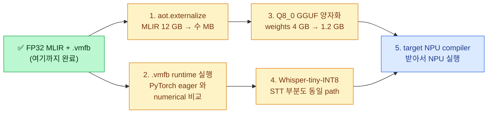

# Easy Guide — AMD-SHARK-AI 로 HF Llama-3.2-1B MLIR 뽑기

> 본인 학습용 노트. 풀어쓴 톤으로, 한 번 보면 흐름을 다시 떠올릴 수 있게.

---

## TL;DR (한 줄 요약)

> HuggingFace 의 Llama-3.2-1B 모델 (가중치 ~2.5 GB) 을 가져와서, **AMD-SHARK-AI 가 만든 export 도구** (`iree.turbine.aot.export`) 로 PyTorch → MLIR 텍스트 (~12 GB, 6 218 라인) 를 뽑고, 다시 `iree-compile` 로 `.vmfb` 라는 IREE 실행 파일 (~6 GB) 까지 만들었다. **36.86 초 만에 완료**, 도중에 paged-attention 같은 서버 전용 op 가 하나도 안 섞였다 (`server_side_op_hits = ∅`).

---

## 1. 큰 그림 — 왜 이걸 했나?

### 1.1 풀어야 할 문제

작은 임베디드 NPU (예: 우리가 만들 target NPU) 에 LLM 을 올리려면 단계가 이렇다:

```
PyTorch 모델 (HF transformers)
      ↓  (?)
  MLIR (compiler 가 이해하는 중간 형식)
      ↓  (iree-compile 또는 우리 자체 compiler)
  실행 가능한 binary (.vmfb)
      ↓  (NPU runtime)
  실제 NPU 위에서 추론
```

문제는 첫 화살표(↓ (?)). PyTorch 모델을 *그대로* MLIR 로 뽑는 건 어렵다:

1. **HuggingFace transformers** 는 PyTorch 외에 자체 캐시·sampling·assist 로직이 섞여 있어서 `torch.export` 가 통과 못 한다.
2. **amdsharktank** 의 `PagedLlmModelV1` 는 `PagedAttention`/`KVCache`/`ThetaLayer` 같은 **서버 전용 primitives** 가 필수라서 그대로 가져오면 *우리 임베디드 NPU 에 못 들어가는* op 가 MLIR 안에 박힌다.

→ 그래서 *우리만의 PyTorch 모델* 을 직접 작성하고, *AMD-SHARK-AI 의 export 부분만* 빌려쓴다.

### 1.2 AMD-SHARK-AI 가 무엇?

[`nod-ai/amd-shark-ai`](https://github.com/nod-ai/amd-shark-ai). AMD 의 오픈소스 ML 컴파일러 stack. 두 부분으로 나뉜다:

| 부분 | 역할 | 우리 사용? |
|---|---|:---:|
| `amdsharktank.layers/models/*` (PyTorch transformer 정의들) | server-side LLM 코드 | ❌ (안 씀 — Paged*/ThetaLayer 가 박힘) |
| `iree.turbine.aot.export` (PyTorch → MLIR export pipeline) | nn.Module 을 트레이싱해서 MLIR 텍스트로 dump | ✅ (이것만 활용) |

→ "amd-shark 의 transformer 는 안 쓰고, export pipeline 만 활용한다" — 이게 우리 프로젝트 가드.

### 1.3 HF Llama-3.2-1B 는 무엇?

Meta 가 공개한 16-layer transformer LLM. ~1.24 B 파라미터, FP32 기준 ~4 GB. HuggingFace 의 [`meta-llama/Llama-3.2-1B-Instruct`](https://huggingface.co/meta-llama/Llama-3.2-1B-Instruct) 에서 받는다 (**gated** — access 요청 후 token 으로 다운로드).

### 1.4 MLIR 이 무엇?

LLVM 프로젝트의 **중간 표현**. 컴파일러가 "Python 코드 모르고 CPU 명령어도 아닌, 그 중간 단계" 를 표현하는 텍스트.

PyTorch `model.forward()` 가 한 번 실행되면, 그 그래프가 MLIR 안에서는 이런 식으로 표현된다:

```mlir
module @module {
  util.global private @__auto.constant_128256_2048_torch.float32 =
      dense_resource<__auto.constant_128256_2048_torch.float32> : tensor<128256x2048xf32>
  ...
  func.func @main(%arg0: !torch.vtensor<[1,32],si64>) -> ... {
    %0 = torch.aten.embedding %weight, %arg0, ...   // 토크나이저 결과를 임베딩
    %1 = torch.aten.pow %0, %two                    // RMSNorm 의 x^2
    %2 = torch.aten.mean %1, ...                    // RMSNorm 의 평균
    ...
    %1234 = torch.aten.softmax %scores, ...         // Attention 의 softmax
    ...
    return %final : !torch.vtensor<[1,32,128256],f32>
  }
}
```

→ 사람이 읽을 수 있는 텍스트, 컴파일러가 다음 단계로 lower 할 수 있는 형식.

---

## 2. 어떻게 했나? — 한 번 따라하면 재현되는 절차

### 2.1 환경 준비 (한 번만)

```bash
# Python 3.11 + 격리 가상환경
uv venv --python 3.11 ~/venv-shark
source ~/venv-shark/bin/activate

# 본 repo + [shark] extras (iree.turbine + iree-base-compiler/runtime)
uv pip install -e .[shark] --find-links https://iree.dev/pip-release-links.html

# HuggingFace gated 모델 accept (web 에서) + 토큰 캐시
huggingface-cli login   # 또는 이미 캐시된 토큰 사용
```

### 2.2 PyTorch 자체 모델 (`LlamaOnDevice`)

[`src/torch_mlir_zoo/models/llama_on_device.py`](../../src/torch_mlir_zoo/models/llama_on_device.py) — 171 줄. Llama 의 핵심 4개 블록을 순수 PyTorch `nn.Module` 로 다시 짰다:

| 블록 | 의미 | 코드 위치 |
|---|---|---|
| **RMSNorm** | 정규화 (LayerNorm 의 variant) | `ops/rmsnorm.py` |
| **GQA (Grouped Query Attention)** | Self-attention with grouped KV heads | `ops/attention.py` |
| **SwiGLU** | Gated MLP, FFN block | `ops/mlp.py` |
| **RoPE** | Rotary position embedding (precomputed cos/sin) | `llama_on_device.py` 안 |

추가로 `load_hf_weights()` 함수가 HuggingFace `from_pretrained()` 의 state_dict 를 우리 모델 키에 맞게 매핑한다 (`model.layers.0.self_attn.q_proj.weight` → `layers.0.attn.q_proj.weight` 같은 prefix 정리).

**의도된 부재** (서버용 primitive 절대 안 박힘):
- ❌ KV cache (forward-only)
- ❌ paged attention
- ❌ sampling (그건 호출자 책임)
- ❌ batched generate
- ❌ vllm / flash-attn 의존

### 2.3 Export 실행 (한 번 run)

```bash
mkdir -p artifacts logs
HF_TOKEN=$(cat ~/.cache/huggingface/token) \
  python scripts/run_llama_export.py \
    --config configs/zoo/llama_on_device_iree_turbine.yaml
```

이 한 줄이 다음 4 단계를 자동 실행한다:

```
stage 1: tokenize    → HuggingFace tokenizer 가 "Hello..." 같은 dummy 텍스트를
                       input_ids tensor (shape: (1, 32)) 로 변환
stage 2: load_model  → LlamaOnDevice 빌드 + HF 가중치 다운로드 + load_state_dict
                       (~2.5 GB safetensors 가 ~/.cache/huggingface 에 저장)
stage 3: export      → iree.turbine.aot.export(model, args) 호출
                       → MLIR 텍스트 생성 + artifacts/...mlir 에 저장
stage 4: analyze     → MLIR 안의 op_counts, dtypes, server_side_op_hits 계산
                       → ...summary.json 저장
```

소요: **~2 분** (네트워크 캐시 hit 시).

### 2.4 IREE 컴파일 (또 한 줄)

```bash
iree-compile artifacts/llama-3.2-1b-on-device-iree-turbine.mlir \
    --iree-hal-target-backends=llvm-cpu \
    -o artifacts/llama-3.2-1b-on-device-iree-turbine.vmfb
```

소요: **36.86 초**, peak RAM ~18 GB. 결과는 `.vmfb` (IREE 의 bytecode 포맷, Zip 형식).

---

## 3. 입력 → 출력 — 실제로 무엇이 들어가고 무엇이 나오나

### 3.1 데이터 흐름 (한 그림)

```
┌─────────────────────────────────────────────────────────────────────┐
│  INPUT                                                              │
│  ─────                                                              │
│  meta-llama/Llama-3.2-1B-Instruct                                   │
│  └── safetensors (~2.5 GB, bf16/fp16 혼합)                          │
│  └── tokenizer (~5 MB)                                              │
└─────────────────────────────────────────────────────────────────────┘
                 │
                 ▼  python scripts/run_llama_export.py
┌─────────────────────────────────────────────────────────────────────┐
│  STAGE 1 — tokenize                                                 │
│  더미 문장 "Hello, how are you?" → input_ids tensor (1, 32) int64    │
└─────────────────────────────────────────────────────────────────────┘
                 │
                 ▼
┌─────────────────────────────────────────────────────────────────────┐
│  STAGE 2 — load_model                                               │
│  LlamaOnDevice 인스턴스 + load_hf_weights(weight 다운로드/매핑)      │
│  메모리: ~4 GB (FP32 로 cast)                                       │
└─────────────────────────────────────────────────────────────────────┘
                 │
                 ▼
┌─────────────────────────────────────────────────────────────────────┐
│  STAGE 3 — export (iree.turbine.aot.export)                          │
│  FxProgramsBuilder 가 forward() 를 한 번 트레이싱                    │
│  → torch.fx.GraphModule                                              │
│  → MLIR (텍스트) 으로 직렬화                                          │
│  peak RAM 12.3 GB (그래프 + weights 복제)                            │
└─────────────────────────────────────────────────────────────────────┘
                 │
                 ▼
┌─────────────────────────────────────────────────────────────────────┐
│  OUTPUT 1 — .mlir (텍스트)                                           │
│  artifacts/llama-3.2-1b-on-device-iree-turbine.mlir                  │
│  ▸ 크기: 12.0 GB (12 021 952 245 bytes)                              │
│  ▸ 라인 수: 6 218                                                    │
│  ▸ 첫 줄: "module @module {"                                         │
│  ▸ 끝 줄: "} } #-}"  ← truncate 안 됨                                │
│  ▸ 안에 무엇:                                                        │
│    - util.global × 113 (weights 가 inline tensor literal 로 박힘)     │
│    - func.func @main (실제 forward 그래프)                            │
│    - torch.aten.* op 약 1 800 개 (16 layer 분해된 형태)               │
│                                                                     │
│  OUTPUT 2 — summary.json (메타데이터)                                │
│  artifacts/llama-3.2-1b-on-device-iree-turbine.summary.json          │
│  {                                                                  │
│    "n_lines": 6218,                                                 │
│    "op_counts": {                                                   │
│      "embedding": 1, "pow": 33, "mean": 33, "rsqrt": 33,            │
│      "transpose": 193, "view": 402, "mm": 113, "bmm": 32,           │
│      "softmax": 16, "silu": 16, ...                                 │
│    },                                                               │
│    "dtypes": { "f32": 3954, "si64": 2, "i1": 64 },                  │
│    "has_dynamic_dim": false,                                        │
│    "server_side_op_hits": {}     ← ★ 핵심: 서버 전용 op 0건            │
│  }                                                                  │
└─────────────────────────────────────────────────────────────────────┘
                 │
                 ▼  iree-compile --iree-hal-target-backends=llvm-cpu
┌─────────────────────────────────────────────────────────────────────┐
│  OUTPUT 3 — .vmfb (IREE bytecode)                                    │
│  artifacts/llama-3.2-1b-on-device-iree-turbine.vmfb                  │
│  ▸ 크기: 6.0 GB (6 010 785 023 bytes)                                │
│  ▸ 포맷: Zip archive v4.5 (file 명령으로 확인 가능)                   │
│  ▸ 안에 무엇:                                                        │
│    - 컴파일된 머신 코드 (CPU target)                                  │
│    - weights 가 raw FP32 binary 로 packed                             │
│    - IREE VM bytecode (제어 흐름)                                     │
│  ▸ 의미: 이 파일을 IREE Runtime API 로 load 하면 PyTorch 없이도        │
│         CPU 에서 Llama forward 한 번 실행 가능 (다음 turn 작업)       │
└─────────────────────────────────────────────────────────────────────┘
```

### 3.2 사이즈가 왜 이렇게?

| 단계 | 크기 | 이유 |
|---|---|---|
| HF safetensors | 2.5 GB | bf16/fp16 혼합 압축 |
| PyTorch in-memory | 12 GB | FP32 로 캐스팅 + 그래프 트레이싱 시 중간 텐서 |
| MLIR 텍스트 | 12 GB | tensor literal 이 ASCII 십진수로 직렬화 → 매우 inflate |
| .vmfb | 6 GB | raw FP32 binary 로 packed → 자연 압축 |

> **포인트**: MLIR 텍스트의 12 GB 는 *대부분 weights 의 ASCII 표현* 이다. `aot.externalize_module_parameters` 를 적용하면 weights 를 별도 `.irpa` 파일로 분리하고 MLIR 은 수 MB 로 줄어든다. (다음 turn 후보)

---

## 4. 결과 해석 — MLIR 안에 뭐가 들어있나

### 4.1 op count 정합성 (16-layer Llama 분해)

`summary.json` 의 op_counts 를 보면 transformer 구조가 그대로 보인다:

| op | 횟수 | 어디서 나왔나? |
|---|---:|---|
| `pow` / `mean` / `rsqrt` | 각 33 | RMSNorm × (16 layer × 2 + final) = **33** ✓ |
| `bmm` (batched matmul) | 32 | Attention 의 QK^T + AV = **16 × 2 = 32** ✓ |
| `softmax` | 16 | Attention 의 softmax = **16 layer ✓** |
| `silu` | 16 | SwiGLU 의 활성화 = **16 layer ✓** |
| `mm` (matmul) | 113 | Q/K/V/O × 4 + gate/up/down × 3 = layer 당 7개 × 16 + final lm_head 1 = **113** ✓ |
| `embedding` | 1 | 입구의 token embedding | ✓ |

→ **Llama 의 그래프가 1:1 로 ATen op 에 매핑됐다**. 누락 0건.

### 4.2 `server_side_op_hits = ∅` 의 의미

`summary.json` 의 핵심 metric. analyzer 가 MLIR 텍스트에서 다음 서버 전용 패턴을 grep 한다:

- `paged_attention*`
- `kv_cache*`
- `vllm.*`
- `flash_attn*`

**0건**. 즉 우리 MLIR 은 *임베디드 NPU 가 직접 받을 수 있는 형식* — 서버 dependency 가 새지 않았다.

비교 대상: amdsharktank 의 `PagedLlmModelV1` 의 toy 3-layer 모델은 같은 export 거치면 4 859 라인 + `paged_attention_kv_cache_gather_*` 7회 출현. 우리는 16-layer 가 6 218 라인 + 0회. **on-device 친화 입증**.

### 4.3 `has_dynamic_dim = false`

shape 가 모두 정적 — `(1, 32)` 같은 고정 차원. **컴파일러가 메모리 할당을 정확히 알 수 있어서 더 적극적으로 최적화 가능**. 동적 shape 면 IREE 가 fallback path 를 추가해서 코드가 커진다.

---

## 5. 장점 (이 방식의 좋은 점)

| 장점 | 설명 |
|---|---|
| **transformer 차용 0** | amdsharktank 의 PagedLlmModelV1 같은 서버 전용 코드를 import 안 했으니, 라이선스/dependency/잠재 보안 이슈 모두 회피 |
| **on-device 친화 IR** | `server_side_op_hits = ∅` 정량 입증. 우리 target NPU compiler 가 받아들일 수 있는 형식 |
| **두 backend 공존** | `torch_mlir.compile` (직접 path) + `iree.turbine.aot.export` (IREE-compile-ready) 둘 다 등록되어 있어 비교/검증 가능 |
| **정적 shape** | 컴파일러 최적화에 유리 |
| **재현 가능** | config + script 한 줄로 한 번에 재현. branch 의 framework core 는 1 byte도 안 건드림 (Design D4) |
| **iree-compile 가 통과** | `.vmfb` 가 진짜 생성됨 → 단순히 IR dump 가 아니라 *실행 가능한 binary* 까지 도달 |

---

## 6. 단점 / 한계 (솔직하게)

| 단점 | 설명 | 해소 plan |
|---|---|---|
| **MLIR 12 GB 거대** | tensor literal 이 ASCII 직렬화로 inflate. git 관리 불가, 협업 어려움. | `aot.externalize_module_parameters` → 별도 `.irpa` 파일, MLIR 본체는 수 MB |
| **FP32 라 budget 초과** | peak RAM 12.3 GB ≫ 임베디드 2 GB 한계 | Step 6 의 Q8_0 GGUF 양자화 (1.24 B × 1 byte ≈ 1.2 GB) |
| **KV cache 없음** | 매 token 마다 전체 sequence 재계산 → autoregressive 추론 느림 | Phase 3 (NPU runtime) 단계에서 KV cache 추가 — *지금은 의도된 부재* |
| **gated repo** | HF token 필요, accept 받아야 함 | unsloth 의 mirror (Q8_0) 가 자동 alternative |
| **.vmfb 실행 미검증** | binary 생성은 됐지만 실제로 IREE Runtime 으로 load 해서 forward 한 적 없음 | 다음 turn 의 numerical 비교 작업 |
| **generic CPU 경고** | `iree-compile` 가 "어떤 CPU 인지 명시 안 됨" 경고 (성능만 영향, 컴파일 자체는 성공) | `--iree-llvmcpu-target-cpu=host` 추가 |
| **sm_120 비호환** | RTX PRO 6000 Blackwell 이 현 PyTorch 와 안 맞아서 CPU fallback | export 시점에는 영향 없음 (어차피 단일 trace) |

---

## 7. 그래서 다음에 뭘 할 수 있나?



가장 가까운 거: **(1) MLIR 슬림화** (5 분 코드 추가) → **(2) numerical 검증** (~30 분) → **(3) Q8_0** (1-2 day).

---

## 8. 한 번에 따라하기 (cheat sheet)

```bash
# 1. 환경 (한 번만)
source ~/venv-shark/bin/activate

# 2. 실행
mkdir -p artifacts logs
HF_TOKEN=$(cat ~/.cache/huggingface/token) \
  python scripts/run_llama_export.py \
    --config configs/zoo/llama_on_device_iree_turbine.yaml

# 3. IREE 컴파일
iree-compile artifacts/llama-3.2-1b-on-device-iree-turbine.mlir \
    --iree-hal-target-backends=llvm-cpu \
    -o artifacts/llama-3.2-1b-on-device-iree-turbine.vmfb

# 4. 결과 확인
ls -la artifacts/llama-3.2-1b-on-device-iree-turbine.*
cat artifacts/llama-3.2-1b-on-device-iree-turbine.summary.json | python -m json.tool
file artifacts/llama-3.2-1b-on-device-iree-turbine.vmfb
```

소요: 다운로드 캐시 hit 시 **~3 분**, 첫 다운로드 시 **~10 분 + 모델 크기**.

---

## 9. 참고 문서 (더 깊이)

- 정량 결과 보고서 — (내부 문서)
- 전체 status board — [`development.md`](../../development.md)
- 다른 lowering recipe — [`docs/RECIPES-zoo.md`](../RECIPES-zoo.md)
- AMD-SHARK-AI 분석 — [`docs/SHARK_AI_ANALYSIS.md`](../SHARK_AI_ANALYSIS.md)
- 통합 보고서 — (내부 문서)

---

## 10. 한 줄 mental model (다음에 까먹었을 때 떠올리는 그림)

> **"HF Llama 가중치를 다운로드 → 우리가 짠 PyTorch Llama 에 끼워 넣기 → AMD-SHARK 의 export 도구가 한 번 forward 트레이싱 → 결과를 MLIR 텍스트로 dump → iree-compile 이 그 MLIR 을 받아서 CPU 용 .vmfb 로 컴파일."**
>
> 핵심 검증: MLIR 안에 `paged_attention` 같은 서버 전용 op 가 하나도 안 박혀 있어야 한다 (`server_side_op_hits = ∅`).
