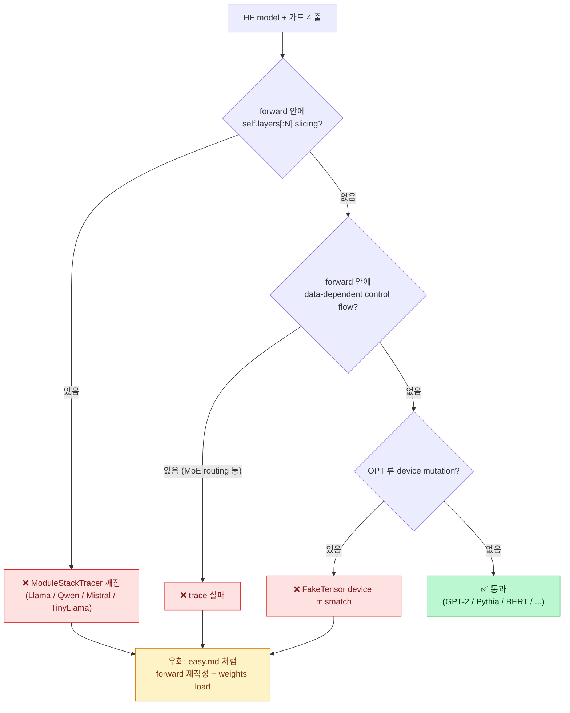

# Easy Guide 2 — Llama 가 아닌 다른 유명 HF 모델도 MLIR 로 뽑을 수 있나?

> 본인 학습용 노트 — [`easy.md`](easy.md) 의 후속편. easy.md 가 *"우리가 직접 짠 LlamaOnDevice 를 MLIR 로 뽑았다"* 면, 이 문서는 *"그럼 HuggingFace 에서 가져온 다른 모델들도 똑같이 되는가?"* 의 실험 보고서다.

---

## TL;DR (한 줄 요약)

> 7개 유명 HF/PyTorch 모델 (distilgpt2 / gpt2 / opt-125m / pythia-160m / qwen2.5-0.5b / tinyllama-1.1b / bert-base) 을 같은 `iree.turbine.aot.export` pipeline 으로 돌렸더니, **4 개는 그대로 통과, 3 개는 export 실패**. 통과한 모델은 전부 `server_side_op_hits = 0` (paged_attention 같은 opaque op 0 개) — clean. **실패의 근본 원인은 두 가지** — (1) HF Llama 계열이 forward 에서 `self.layers[:N]` slicing 하는 부분이 torch.fx ModuleStackTracer 와 충돌, (2) HF OPT 가 LayerNorm 에서 FakeTensor device mismatch. **결론: "임의 HF 모델 = 곧바로 통과" 는 거짓**. 그래서 easy.md 의 *우리가 직접 짠 LlamaOnDevice* 가 필요한 거였다.

---

## 0. 이게 PDF 의 어느 박스 이야기인가? — "PyTorch Model Zoo" (보라색 점선 최상단)

이 문서는 PDF ((내부 문서)) 다이어그램에서 **보라색 점선으로 묶인 최상단 영역**, 그중에서도 맨 위의 **`PyTorch Model Zoo` 박스** 한 칸에 대한 이야기다.

```
┌─ 보라색 점선 (compiler stack 최상단 frontend) ────────────────────┐
│  ┌────────────────────────────────────────────────────────┐     │
│  │  📦 PyTorch Model Zoo   ← 이 문서 (빨강: To Implement)   │     │  ← 최상단
│  └────────────────────────────────────────────────────────┘     │
│  ┌──────────────┐                                                │
│  │  Torch-MLIR  │           (파랑: To Modify)                    │
│  └──────────────┘                                                │
│  ┌────────────────────────────────────────────────────────┐     │
│  │  Torch-MLIR Compiler    (파랑: To Modify)                │     │
│  └────────────────────────────────────────────────────────┘     │
└──────────────────────────────────────────────────────────────────┘
            ↓  (여기부터는 외부 / 프로젝트 리드 담당)
   IREE Compiler → Runtime → HAL → target NPU HW
```

### 0.1 이 박스의 임무 (PDF "목적 / 개요" 그대로)

> - "Torch-MLIR 의 **Input (PyTorch) Model Zoo** 구축"
> - "PyTorch Model Zoo 를 구축함으로써 **구현한 모델에 대한 MLIR 생성을 자동화**"
> - "Model Zoo 를 확장해가며 **여러 LLM 아키텍처에 대한 구현·수정을 용이**하게"

세 줄을 한 문장으로: **"여러 PyTorch 모델을 모아두고, 각각을 버튼 한 번에 MLIR 로 떨궈주는 입력 창고(zoo)를 만든다."**

- `Torch-MLIR` / `Torch-MLIR Compiler` (아래 두 파랑 박스) 는 *남이 만든 것을 우리가 약간 고쳐 쓰는* 부분.
- `PyTorch Model Zoo` (맨 위 빨강 박스) 는 *우리가 처음부터 만드는* 부분 — 그래서 "To Implement".

→ easy.md 가 이 박스에 **모델 1개 (Llama)** 를 넣어본 것이고, **이 문서 (easy2) 는 "이 창고에 아무 PyTorch 모델이나 넣을 수 있나? 제약이 뭔가?" 를 실측한 것**이다.

### 0.2 핵심 질문 = "창고 입고 기준"

PDF 는 "Model Zoo 를 확장" 한다고만 적혀 있지, *어떤 모델이 들어갈 수 있는지* 입고 기준은 안 적혀 있다. 그 기준을 실험으로 채우는 게 이 문서의 목적:

| 질문 | 답 (이 문서) |
|---|---|
| 아무 PyTorch 모델이나 zoo 에 넣으면 MLIR 가 자동 생성되나? | **아니다.** 모델 forward 코드의 *작성 방식* 에 따라 통과/실패가 갈린다 (§5). |
| 그럼 무엇이 통과하나? | "가드 4 줄 + forward 가 깨끗한 모델" (§7.3). GPT-2 / Pythia / BERT 류 (§4). |
| 무엇이 막히나? | HF Llama 계열 (slicing 한 줄), OPT (device mismatch), MoE (routing) (§7.2). |
| 막히면 어떻게 zoo 에 넣나? | easy.md 처럼 *forward-only 사본* 을 직접 써서 넣는다 (§5.1). |

→ **즉 "PyTorch Model Zoo 박스" 의 제약 조건 = 이 문서 §5 (왜 막히나) + §7 (입고 기준)** 이다.

---

## 1. 큰 그림 — 무엇을 확인하려 했나?

easy.md 1.1 에서 본 문제: HuggingFace 의 Llama 를 *그대로* MLIR 로 뽑는 건 어렵다고 했다. 그래서 우리는 *우리만의 PyTorch 모델* (`LlamaOnDevice`) 을 짰다.

자연스러운 후속 질문:

> *"HF Llama 가 어려운 건 알겠는데, 다른 모델들 (GPT-2, BERT, OPT…) 은? 그건 그대로 들어가나? 아니면 모든 HF 모델마다 우리가 직접 다시 써야 하나?"*

이 문서는 그 질문에 대한 **실험 답변**.

### 1.1 가설 (실험 전)

| 가설 | 예상 |
|---|---|
| 모든 HF 모델은 그대로 통과한다 | 통과 — `attn_implementation="eager"` 만 주면 OK |
| 일부만 통과한다 | 통과 — 어떤 게 막히고 어떤 게 되는지 자체가 정보 |
| 다 막힌다 | 통과 — 그럼 LlamaOnDevice 같은 hand-write 가 항상 필요 |

→ 결과는 가운데 가설이 맞았다. 단순한 transformer (GPT-2 / BERT / Pythia) 는 통과, Llama 가족 모델들은 막힘.

---

## 2. 후보 — 어떤 모델들로 비교했나?

전부 small + ungated (HF_TOKEN 없이 다운로드 가능). 비교 목적상 *분류군마다* 한두 개씩 골랐다.

| 별명 | HF id | 패밀리 | 파라미터 | 비고 |
|---|---|---|---:|---|
| `distilgpt2` | `distilgpt2` | gpt2 | 82 M | 가장 작은 decoder, distillation |
| `gpt2-small` | `gpt2` | gpt2 | 124 M | 고전 decoder (LayerNorm + GELU) |
| `opt-125m` | `facebook/opt-125m` | opt | 125 M | Meta pre-Llama, learned positional emb |
| `pythia-160m` | `EleutherAI/pythia-160m` | gpt-neox | 162 M | RoPE, parallel attention/MLP |
| `qwen2.5-0.5b` | `Qwen/Qwen2.5-0.5B-Instruct` | **llama** | 494 M | Llama-family (RMSNorm/SwiGLU/RoPE/GQA) |
| `tinyllama-1.1b` | `TinyLlama/TinyLlama-1.1B-Chat-v1.0` | **llama** | 1.1 B | Llama-arch 22-layer |
| `bert-base` | `bert-base-uncased` | bert | 110 M | encoder-only 대조군 |

reference: 본 zoo 의 [`LlamaOnDevice`](../../src/torch_mlir_zoo/models/llama_on_device.py) (Llama-3.2-1B-Instruct 가중치 로드) — easy.md 에서 export 완료된 것 (~1.24 B 파라미터).

---

## 3. 실험 절차 — 한 번 따라하면 재현됨

전부 [`scripts/run_hf_models_export.py`](../../scripts/run_hf_models_export.py) 한 스크립트로 묶었다. 모델별 절차는 동일:

```python
# 1) load — eager attention 강제 (SDPA fused op 차단)
m = AutoModelForCausalLM.from_pretrained(
    hf_id, torch_dtype=torch.float32, attn_implementation="eager"
).eval()

# 2) wrap — forward(input_ids) -> tensor 로 정형화 (HF 의 ModelOutput dict 제거)
class CausalLMWrapper(nn.Module):
    def __init__(self, m): super().__init__(); self.model = m
    def forward(self, input_ids):
        return self.model(input_ids, use_cache=False, return_dict=False)[0]
wrapped = CausalLMWrapper(m)

# 3) export — easy.md 와 같은 진입점
mlir_text = export_via_iree_turbine(
    wrapped, (torch.zeros(1, 32, dtype=torch.long),), func_name="forward"
)

# 4) analyze — 우리 ir_summary
summary = summarize(mlir_text)
```

세 가지 핵심 가드:

- **`attn_implementation="eager"`** — 없으면 transformers 가 `F.scaled_dot_product_attention` 으로 내려가서 `_scaled_dot_product_flash_attention_for_cpu` opaque op 가 박힌다 (이전 turn `arbitrary_model` 실험에서 확인됨).
- **`use_cache=False` + `return_dict=False`** — KV cache 분기 / 사전 객체 unwrap 제거.
- **fixed-shape input** — `(1, 32)` int64. dynamic dim 비활성.

실행:
```bash
source ~/venv-shark/bin/activate
HF_TOKEN=$(cat ~/.cache/huggingface/token) \
  python scripts/run_hf_models_export.py
```

각 모델은 별도 subprocess 가 아니라 같은 프로세스에서 순차 실행 — 캐시 hit 이후엔 한 모델당 5-15 초.

---

## 4. 결과 — 4 통과 / 3 실패

전체 표 (`logs/hf-zoo/results.json` 와 동일):

| 모델 | 패밀리 | 상태 | params | MLIR lines | n_ops | unique | srv_hits | export |
|---|---|:---:|---:|---:|---:|---:|---:|---:|
| `distilgpt2` | gpt2 | ✅ ok | 81.9 M | 2,255 | 596 | 26 | **0** | 4.7 s |
| `gpt2-small` | gpt2 | ✅ ok | 124.4 M | 4,397 | 1,166 | 26 | **0** | 6.1 s |
| `opt-125m` | opt | ❌ **fail** | 125.2 M | — | — | — | — | — |
| `pythia-160m` | gpt-neox | ✅ ok | 162.3 M | 4,488 | 1,256 | 26 | **0** | 6.2 s |
| `qwen2.5-0.5b` | **llama** | ❌ **fail** | 494.0 M | — | — | — | — | — |
| `tinyllama-1.1b` | **llama** | ❌ **fail** | 1.1 B | — | — | — | — | — |
| `bert-base` | bert | ✅ ok | 109.5 M | 3,995 | 1,069 | 20 | **0** | 4.1 s |
| `LlamaOnDevice` (ref) | llama-hand | ✅ ok | 1.24 B | 6,218 | (n/a) | (n/a) | **0** | 5.3 s |

**Pattern**:
- ✅ 통과: GPT-2 계열, Pythia (GPT-NeoX), BERT
- ❌ 실패: **HF Llama 계열 두 개** (Qwen2.5, TinyLlama) — 같은 root cause
- ❌ 실패: OPT — 다른 root cause
- ✅ Llama 도 **우리가 직접 짜면** 통과 (reference)

`server_side_op_hits = 0` 가 통과 모델 전부에서 확인. 즉 통과한 4 개는 NPU 친화적인 깨끗한 IR. easy.md 의 가드(`paged_attention` 같은 게 박히면 NG)가 4 개 모두에서 충족.

---

## 5. 왜 실패하나? — 근본 원인 분석

### 5.1 HF Llama 계열 (Qwen2.5, TinyLlama)

에러:
```
TypeError: _ModuleStackTracer.__init__.<locals>.AttrProxy.__init__()
           missing 1 required positional argument: 'path'

  File ".../transformers/models/llama/modeling_llama.py", in forward
    for decoder_layer in self.layers[: self.config.num_hidden_layers]:
                         ~~~~~~~~~~~^^^^^^^^^^^^^^^^^^^^^^^^^^^^^^^^^
  File ".../torch/nn/modules/container.py", in __getitem__
    return self.__class__(list(self._modules.values())[idx])
```

**원인**: HF Llama (그리고 Qwen 등 같은 modeling_llama 를 재사용하는 모델) 가 forward 안에서 `self.layers[: self.config.num_hidden_layers]` 식 slicing 을 한다. 이 slicing 은 `nn.ModuleList.__getitem__` 을 호출하고, slicing 결과는 **새로운 ModuleList 인스턴스** 를 만든다.

torch.fx 의 `ModuleStackTracer` 는 추적 도중 module 의 attribute access 를 `AttrProxy` 로 hook 하는데, 이 hook 은 *static module hierarchy* 를 가정한다. *forward 안에서 새로 생성된 ModuleList* 는 hierarchy 에 없으므로 `AttrProxy` 생성자 시그니처 (`path` 인자 필수) 가 어긋난다.

**우리 `LlamaOnDevice` 는 왜 통과하는가?**
[src/torch_mlir_zoo/models/llama_on_device.py](../../src/torch_mlir_zoo/models/llama_on_device.py):
```python
def forward(self, input_ids):
    x = self.embed_tokens(input_ids)
    for layer in self.layers:                # ← 그냥 iterate. slicing 없음.
        x = layer(x)
    return self.lm_head(self.norm(x))
```

→ **딱 한 줄 차이**. HF 는 `self.layers[: N]`, 우리는 `self.layers` 그대로 iterate. 이 한 줄이 export 통과/실패를 가른다.

**우회 방법** (HF 모델을 그대로 쓰고 싶다면):
- monkey-patch `LlamaModel.forward` 로 `self.layers[:N]` 을 `self.layers` (혹은 `list(self.layers)[:N]`) 로 교체
- 또는 `torch.export.export(..., strict=False)` — 일부 케이스에서 우회 (검증 안 함)
- 가장 안전: easy.md 처럼 **forward-only 사본을 직접 작성하고 HF 가중치만 load** (우리 zoo 의 길)

### 5.2 OPT-125M

에러:
```
RuntimeError: Unhandled FakeTensor Device Propagation for
              aten.native_layer_norm.default,
              found two different devices meta, cpu
```

**원인**: torch.export 트레이싱은 `FakeTensor` (meta device) 로 dry-run 을 한다. OPT 의 LayerNorm 구현이 어디선가 *real cpu tensor* 와 *meta tensor* 를 같이 받는 path 를 만든다. `aten.native_layer_norm` 의 device propagation 이 `(meta, cpu)` 둘을 합쳐야 하는데 합치는 규칙이 정의 안 되어 reject.

이건 transformers 의 OPT 구현이 model attributes 를 forward 안에서 `to(device)` 하는 패턴 때문일 가능성 높음. transformers >= 4.50 에서 흔히 보고된 이슈.

**우회 방법**:
- 모델 전체를 명시적으로 `.to("meta")` 로 옮긴 뒤 export (실험 필요)
- 또는 위와 같이 forward 를 우리가 다시 작성 (시간 비용 큼)
- 또는 OPT 구버전 transformers (≤ 4.44) 로 다운그레이드

### 5.3 통과 모델들은 왜 통과했나?

[modeling_gpt2.py](https://github.com/huggingface/transformers/blob/main/src/transformers/models/gpt2/modeling_gpt2.py), [modeling_bert.py](https://github.com/huggingface/transformers/blob/main/src/transformers/models/bert/modeling_bert.py), [modeling_gpt_neox.py](https://github.com/huggingface/transformers/blob/main/src/transformers/models/gpt_neox/modeling_gpt_neox.py) 모두:

```python
for i, block in enumerate(self.h):           # GPT-2
for layer_module in self.layer:              # BERT
for i, layer in enumerate(self.layers):      # GPT-NeoX (Pythia)
    ...
```

→ 전부 plain iteration. ModuleList slicing 없음. attribute mutation 없음. 그래서 ModuleStackTracer 가 깨끗하게 통과.

---

## 6. 통과한 모델들의 op 비교

ir_summary 가 dump 한 top-12 ops (각 모델별):

### BERT-base (encoder)
```
264 view  · 195 mul · 160 add · 84 transpose · 72 mm · 49 expand · 49 clone
48 permute · 25 var_mean · 25 sub · 25 rsqrt · 24 bmm
```
- attention 은 `bmm` 으로 (`batch matmul`) — 한 줄
- `var_mean + rsqrt + sub` 트리플 = LayerNorm 의 fused 분해 (`aten.native_layer_norm` 단일 op 가 *아님*)

### GPT-2 small (decoder)
```
209 view · 195 mul · 159 add · 120 slice · 61 transpose · 60 expand · 49 mm
49 clone · 25 var_mean · 25 unsqueeze · 25 sub · 25 rsqrt
```
- BERT 와 거의 같은 op set + `slice` (causal mask)
- `var_mean+rsqrt+sub` LayerNorm 동일

### Pythia-160M (GPT-NeoX, RoPE)
```
209 mul · 198 view · 174 slice · 158 add · 86 transpose · 63 expand
52 unsqueeze · 49 mm · 49 clone · 49 cat · 25 var_mean · 25 sub
```
- `cat` 49 개 → RoPE 의 rotate-half (`cat([-x2, x1])`)
- `cos / sin` 도 IR 에 보임 (이전 cell 출력)
- 결국 RoPE 가 들어가도 *전부 표준 `aten.*` 로 분해됨* — easy.md 의 LlamaOnDevice RoPE 와 동등

### distilGPT-2
```
107 view · 99 mul · 81 add · 60 slice · 31 transpose · 30 expand · 25 mm
25 clone · 13 var_mean · 13 unsqueeze · 13 sub · 13 rsqrt
```
- GPT-2 small 의 정확한 *반쪽* (layer 수가 6 vs 12) — 비례 일치, 좋은 sanity check.

### 4 개 모델 공통 op set (서버 전용 0)
```
view · mul · add · transpose · mm · expand · clone · slice
var_mean · sub · rsqrt · embedding · softmax · permute · bmm
```
→ easy.md 의 Llama 통과 op set 과 거의 동일 (Llama 추가: `silu` / `repeat_interleave` / `triu`). **새로 등장한 server-side op 0 개**.

→ NPU 컴파일러가 이 17~20 개 op 만 lower 할 줄 알면 통과 4 + Llama(hand) = 5 개 모델 동시 커버.

---

## 7. 그래서 — 임의 HF 모델을 다 올릴 수 있나? ("PyTorch Model Zoo" 입고 기준)

**아니오, 그대로는 못 올린다.** 하지만 모든 모델이 망가지는 것도 아니다. 패턴이 명확하다. 아래가 §0 에서 말한 *"Model Zoo 박스의 입고 기준"* 의 실측 버전이다.

### 7.1 통과하는 부류 (그대로 됨)

`transformers/models/<arch>/modeling_*.py` 의 forward 가:
- ModuleList 를 plain iterate (no slicing)
- module attribute mutation 없음 (`.to(device)`, `register_buffer` 등 forward 내 호출 없음)
- 외부 cuda 동기화 없음
- 자체 fused op (`F.scaled_dot_product_attention` 자동 사용 안 함; `attn_implementation="eager"` 로 가드 가능)

→ 해당하는 패밀리: **GPT-2 / GPT-NeoX(Pythia) / BERT / DistilBERT / RoBERTa (추정) / GPT-J (추정)**.

### 7.2 막히는 부류 (수동 작업 필요)

- **Llama 계열** (Llama / Qwen / Mistral / TinyLlama / Yi / DeepSeek-V2) — 전부 modeling_llama 의 slicing 패턴 때문. 우회: easy.md 의 `LlamaOnDevice` 처럼 forward 만 다시 쓰고 weights 만 load.
- **OPT** — FakeTensor device mismatch (transformers ≥ 4.50). 우회: 다운그레이드 or 직접 작성.
- **MoE 모델** (Mixtral, Qwen-MoE, DeepSeek-MoE) — *expert routing 자체가 data-dependent control flow*. 추적 자체가 어려움 — 별도 연구.
- **vLLM 친화 모델** (paged attention 변종) — easy.md 1.1 에서 다룬 case.

### 7.3 *항상* 적용해야 할 가드 4 줄

지금 통과 4 모델 모두에 들어간 boilerplate:

```python
from_pretrained(..., torch_dtype=torch.float32,
                     attn_implementation="eager")  # ① 흐름1: SDPA fused op 차단
m.eval()                                           # ② 흐름2: dropout 비활성, BN running stat 고정
class W(nn.Module):
    def __init__(self, m): super().__init__(); self.model = m
    def forward(self, x):
        return self.model(x, use_cache=False,      # ③ 흐름3: KV cache 분기 제거
                          return_dict=False)[0]    # ④ 흐름4: ModelOutput dict unwrap
```

4 줄 모두 lowering 통과 여부에 직접 영향. 누락 시 발생하는 증상:

| 빠진 가드 | 증상 |
|---|---|
| ① `attn_implementation="eager"` | `_scaled_dot_product_flash_attention_for_cpu` opaque op 등장, srv_hits ≥ 1 |
| ② `m.eval()` | dropout `aten.dropout` random branch 추적 실패 가능 |
| ③ `use_cache=False` | `past_key_values` Optional 분기로 인한 conditional, dynamic shape |
| ④ `return_dict=False` | `ModelOutput` dataclass 가 trace 결과 tuple 이 아니라 dict → wrapper layer 출력 형식 깨짐 |

---

## 8. 단순 mental model



---

## 9. 다음 단계 (이 문서 범위 밖)

1. **Llama HF monkey-patch PoC** — `modeling_llama.LlamaModel.forward` 의 slicing 한 줄만 교체해서 그대로 export 되는지 확인. 성공하면 weights 재사용성 ↑.
2. **safetensors-only loader** — easy.md §1.1 에서 본 *transformers 의존성 제거* 와 연계. 통과 4 모델은 전부 `safetensors` 만으로 load 가능 (HF cache `model.safetensors` 사용).
3. **iree-compile → .vmfb** — 통과 4 모델 IR 을 easy.md 의 ${iree-compile}$ 단계로 실제 binary 생성. NPU backend 도착 가능성 검증.
4. **Pythia/BERT 의 IR 슬림화** (`aot.externalize_module_parameters`) — easy.md §7 의 12 GB → 수 MB 와 같은 작업.

---

## 10. 한 번에 따라하기 (cheat sheet)

```bash
# 1. 환경 (한 번만; easy.md 와 같은 venv)
source ~/venv-shark/bin/activate
pip install transformers              # tokenizer 없이도 OK; AutoModel*는 필요

# 2. 실험 실행
cd <torch-mlir-zoo worktree>
mkdir -p logs/hf-zoo
HF_TOKEN=$(cat ~/.cache/huggingface/token) \
  python scripts/run_hf_models_export.py

# 3. 결과 확인
cat logs/hf-zoo/results.json | python -m json.tool | head -120
ls -la logs/hf-zoo/*.mlir
# 통과 4 모델: distilgpt2 / gpt2-small / pythia-160m / bert-base
# 실패 3 모델: opt-125m / qwen2.5-0.5b / tinyllama-1.1b

# 4. 단일 모델만 다시
python scripts/run_hf_models_export.py gpt2-small
```

총 소요 (캐시 hit 후): 통과 4 + 실패 3 = **~ 1.5 분** (TinyLlama 다운로드 첫 회는 + 45 초).

---

## 11. 한 줄 요약 (다음에 까먹었을 때)

> **"HF 모델을 그대로 MLIR 로 뽑는 건 *가족에 따라* 된다 / 안 된다 — GPT-2 / Pythia / BERT 류는 가드 4 줄 (`eager attn` / `eval` / `use_cache=False` / `return_dict=False`) 만 채우면 통과, Llama 계열은 modeling_llama 의 `self.layers[:N]` slicing 한 줄 때문에 막힌다. 그래서 easy.md 의 LlamaOnDevice 같은 *forward-only 사본 + HF weights load* 패턴이 유지된다."**

→ "임의 HF 모델 = 자동 통과" 는 거짓. **"가드 4 줄 + forward 가 깨끗한 모델 = 자동 통과"** 가 맞다.

---

## 참고 문서

- [`easy.md`](easy.md) — Llama 직접 export (전편)
- [`my.md`](../../my.md) — transformer vs KV cache 해석
- (내부 문서) — Step 5 .vmfb 완료 보고
- [`docs/SHARK_AI_ANALYSIS.md`](../SHARK_AI_ANALYSIS.md) — amd-shark-ai 사용 가드
- [`scripts/run_hf_models_export.py`](../../scripts/run_hf_models_export.py) — 본 실험 스크립트
