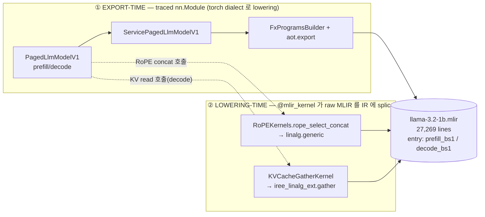
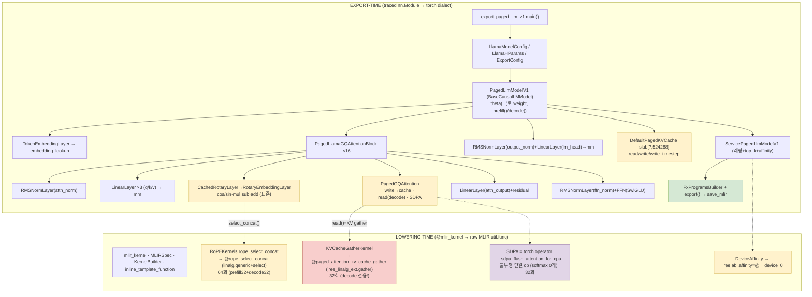
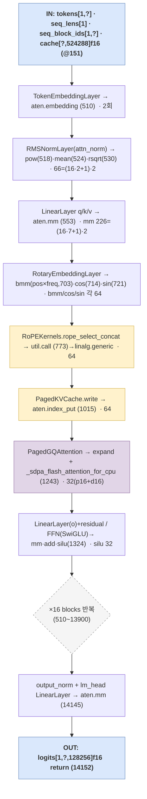
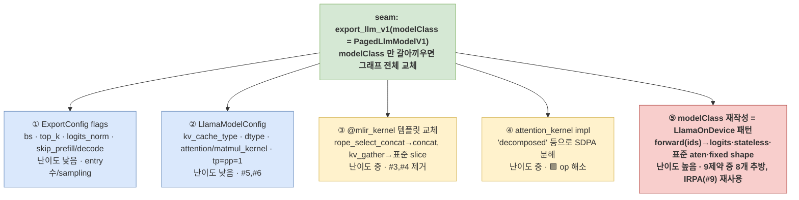

# Easy Guide 5 (그림판) — amdsharktank Llama-3.2-1B export/lowering 을 *그림으로*

> 그림 위주 노트. 정밀 본문은 [easy4-detail.md](easy4-detail.md) 에 있고, 이 문서는 **그 내용을 한눈에 보는 도식 모음**이다.
> 모든 수치는 실측 (`/tmp/llama32-irpa/llama-3.2-1b.mlir`, 27,269 lines) 에서 직접 셈.
>
> 📐 **원본 draw.io**: [`../diagrams/export-vs-lowering.drawio`](../diagrams/export-vs-lowering.drawio) (3페이지). VS Code draw.io 확장 또는 app.diagrams.net 에서 열기. 아래 Mermaid/ASCII 는 그 미리보기.

---

## Fig 0. 한 장 요약 — 두 종류의 클래스가 IR 한 파일을 만든다

> export 에서 쓰는 클래스는 두 부류다. ① **trace 되는 nn.Module** (그래프가 됨) 과 ② **trace 안 되고 손수 짠 MLIR 를 끼워넣는 `@mlir_kernel`** (커널이 됨).



**읽는 법**: 왼쪽 박스의 `nn.Module` 들은 `torch.export` 가 FX 그래프로 추적해 `torch.aten.*` 로 내린다. 오른쪽 `@mlir_kernel` 두 개는 추적 대상이 아니라, 모델이 그 함수를 *호출하는 지점*에 **사람이 쓴 `util.func` 템플릿**을 그대로 IR 에 박는다. 그래서 최종 IR 은 `torch.aten.*`(좌) + 커스텀 `util.func`(우) 의 혼합이다. → 자세히: [Fig 1](#fig-1).

---

## Fig 1. export-time vs lowering-time 클래스 전체도  (drawio p.1)

> 좌측 = "무엇이 lowering 되나" (모델 정의). 우측 = "어떻게 lowering 되나" (커널 삽입). 색: 🟦표준 aten · 🟨@mlir_kernel 커스텀 · 🟥decode 전용 · 🟪SDPA 불투명.



**핵심 메시지**
- NPU 컴파일러가 막히는 지점은 거의 **우측 4개**: `@rope_select_concat`(🟨), `@paged_attention_kv_cache_gather`(🟥, decode), `iree.abi.affinity`(🟨), `_sdpa_flash_attention_for_cpu`(🟪).
- 좌측 표준 `nn.Module` (embedding/rmsnorm/linear/ffn/표준 rope 수식) 은 전부 `torch.aten.*` 로 깔끔히 내려간다 — 우리 `LlamaOnDevice` 와 같은 종류의 op.

---

## Fig 2. prefill_bs1 그래프를 클래스에 1:1 매핑  (drawio p.2)

> `@prefill_bs1` (line 151) 의 입력 → 블록 → logits 까지, 각 IR op 가 **어느 클래스에서 나왔는지** 실측 line 번호와 count 로 박아둔 표. count 가 `16층 × 함수수` 산술로 딱 떨어진다.



**count 가 클래스 구조를 증명한다** (prefill+decode 합):

| op | 실측 | 분해 | 출처 클래스 |
|---|---:|---|---|
| `aten.embedding` | 2 | 1×2함수 | `TokenEmbeddingLayer` |
| `pow/mean/rsqrt` | 66 | (16블록×2norm + 1) ×2함수 | `RMSNormLayer` |
| `aten.mm` | 226 | (16블록×7 + 1 lm_head) ×2함수 | `LinearLayer`/`FFN` |
| `aten.bmm` | 64 | (16블록×2(q,k)) ×2함수 | RoPE sincos 외적 |
| `cos`/`sin` | 64/64 | 〃 | `RotaryEmbeddingLayer` |
| `util.call @rope_select_concat` | 64 | 32+32 | `RoPEKernels` (🟨) |
| `aten.index_put` | 64 | 32+32 | KV write (🟨) |
| `_sdpa_flash_attention_for_cpu` | 32 | 16+16 | `PagedGQAttention` (🟪) |
| `util.call @paged_attention_kv_cache_gather` | 32 | **0+32** | KV read = **decode 전용** (🟥) |
| `silu` | 32 | 16×2함수 | `FFN` |
| `util.global` (weights) | 147 | — | `Theta`/IRPA |

> 가장 중요한 비대칭: **gather(KV read)는 prefill 에 0, decode 에 32**. prefill 은 K/V 를 *새로 계산해 write 만* 하고, decode 만 cache 에서 *읽어온다(custom gather)*. → easy3 가 한 덩어리로 본 "PagedAttention" 이 실은 *write(표준 index_put) + read(커스텀 gather, decode 전용) + SDPA(불투명)* 세 조각.

---

## Fig 3. 커스터마이징 5 레버  (drawio p.3)

> "어디를 잡고 흔들면 NPU 친화로 가는가". ⑤ 로 갈수록 근본적·고비용.



**제약(easy3 §5) ↔ 레버 매핑**

| 제약 | 한 줄 | 푸는 레버 |
|---|---|---|
| #1 KV cache state arg | cache 가 함수 인자 | ⑤ |
| #2 prefill/decode 분리 | entry 2개 | ①(skip)/⑤ |
| #3 paged gather custom op | `iree_linalg_ext.gather` | ③ / ⑤ |
| #4 RoPE concat custom op | `@rope_select_concat` | ③ / ⑤ |
| #5 device affinity | `iree.abi.affinity` | ②(tp=pp=1) |
| #6 fp16 mixed | dtype 정책 | ② |
| #7 dynamic dim `?` | 가변 seq_len | ⑤(fixed)+aot |
| #8 multi-args contract | 4~5 인자 | ⑤ |
| #9 weight 외부참조 | `util.global` | IRPA 그대로 ✅ |

> **결론**: ①②④ 는 빠른 옵션 튜닝(부분 개선), ③ 은 커널 수술, **⑤ (modelClass 재작성)** 가 근본 해소. 우리 `LlamaOnDevice` 가 정확히 ⑤ 다 — `PagedLlmModelV1` 의 재구현.

---

## 부록 — 그림 재생성/검증 명령

```bash
M=/tmp/llama32-irpa/llama-3.2-1b.mlir
# Fig 2 의 count 재현
grep -c "torch.aten.mm" $M                              # 226
grep -c "torch.aten.embedding" $M                       # 2
grep -c "_scaled_dot_product_flash_attention_for_cpu" $M # 32
grep -nF "util.call @paged_attention_kv_cache_gather" $M | awk -F: '$1<14154{p++}$1>=14154{d++}END{print p+0,d+0}'  # 0 32
grep -nF "util.call @rope_select_concat" $M             | awk -F: '$1<14154{p++}$1>=14154{d++}END{print p+0,d+0}'  # 32 32
```

## 관련
- 정밀 본문: [easy4-detail.md](easy4-detail.md)
- 짝 문서: [easy4.md](easy4.md) (클래스 27종 카탈로그), [easy3.md](easy3.md) (제약 9종), [easy.md](easy.md)/[easy2.md](easy2.md)
- 원본 도식: [`../diagrams/export-vs-lowering.drawio`](../diagrams/export-vs-lowering.drawio)
</content>
