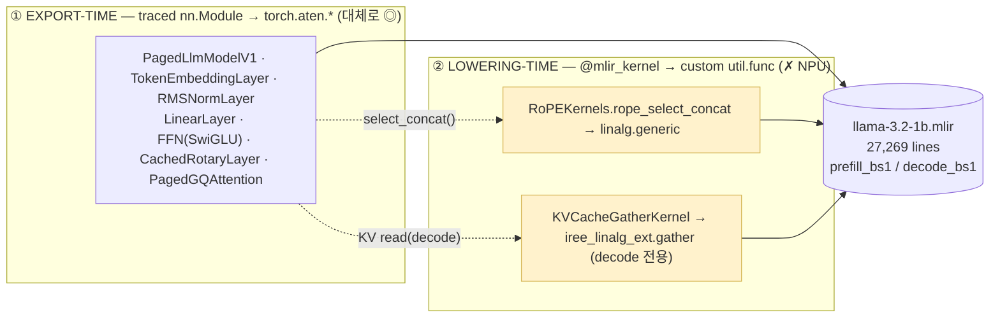

# Easy Guide 6-sum — Llama-3.2-1B lowering 종합: *어느 클래스가 어떻게 쓰이고, 어느 커널단에서 막히나*

> easy series 전권(easy / easy2 / easy3 / easy4 / easy4-detail / easy5-fig / easy6 / easy7)을 **Llama-3.2-1B 한 모델 기준**으로 압축한 종합표.
> 대상 경로: 순수 `meta-llama/Llama-3.2-1B-Instruct` → `import_hf_dataset`(IRPA) → `export_paged_llm_v1`(amdsharktank server-side export).
> ground truth: `/tmp/llama32-irpa/llama-3.2-1b.mlir` (27,269 lines) — 모든 count 는 여기서 실측.
> 도식은 [easy5-fig.md](easy5-fig.md)(Fig 0~3) + [`../diagrams/export-vs-lowering.drawio`](../diagrams/export-vs-lowering.drawio)와 **§4에서 1:1 연동**.

---

## 0. 한 장 결론

> Llama-3.2-1B를 amdsharktank server 경로로 내리면, **클래스는 두 계층**(① trace되는 `nn.Module` → 표준 `torch.aten.*` / ② `@mlir_kernel`·`CustomOp` → 손수 짠 `util.func` splice)으로 갈리고, **NPU가 막히는 건 거의 ② + ①의 불투명 SDPA 4곳뿐**이다. 나머지 모델 수학(embedding/RMSNorm/Linear/FFN/표준 RoPE 수식)은 전부 깨끗이 lowering된다. → on-device는 ②를 표준 aten으로 갈아끼운 `LlamaOnDevice`(레버 ⑤)로 `server_side_op_hits={}` 달성.



---

## 1. 표 A — *클래스가 어떻게 쓰이나* (export 호출 순서 = Stage A→E, 27종)

각 클래스가 Llama-3.2-1B lowering에서 *무슨 일을 하고 IR에 무엇을 남기는지*. 판정 범례: **◎ 표준 aten(통과)** · **🟨 @mlir_kernel 커스텀(막힘)** · **🟥 decode 전용 커스텀** · **🟪 불투명 SDPA** · **⚙ 설정/메타** · **📦 weight 외부화**. `#n` = [easy3 §5](easy3.md) 제약 번호.

| # | Stage | 클래스 / 함수 | 어떻게 쓰이나 (역할) | IR에 남기는 것 | 판정 |
|---|---|---|---|---|---|
| 1 | A | `import_hf_dataset` | HF safetensors+config → IRPA 변환 | — | ⚙ |
| 2 | A | `Theta` | weight를 *이름경로*(`theta("blk",0,"attn_q")`)로 접근 | `@__auto.*` symbol | 📦 |
| 3 | A | `Dataset` | IRPA `save`/`load` I/O | IRPA 파일 | 📦 |
| 4 | A | `DatasetMetadata` | IRPA key 스킴 = "fixed IRPA"의 실체 | properties | 📦 |
| 5 | A′ | `DefaultPrimitiveTensor` | tied embedding(`output.weight`) 복제 수선 | `output.weight` | 📦 #9 |
| 6 | B | `LlamaHParams` | 아키텍처 상수(block16/head32/kv8/ffn8192) | — | ⚙ |
| 7 | B | `LlamaModelConfig` | hp + **lowering 정책**(dtype·kv_cache_type·kernel) | #6,#7 default 결정 | ⚙ #6 |
| 8 | B | `ExportConfig` | export 행위(bs·top_k·logits_norm) | top_k시 topk op | ⚙ |
| 9 | B | `ParallelismConfig` | tp/pp 병렬도(=1 single device) | device map | ⚙ #5 |
| 10 | C | **`PagedLlmModelV1`** | 메인 모델. `forward` 아닌 **`prefill()`/`decode()` 2메서드** | 4-args 2-entry | **#2,#8** |
| 11 | C | **`DefaultPagedKVCache`** | KV slab `[?,524288]` allocate/read/write | cache arg | **#1** |
| 12 | C | `TokenEmbeddingLayer` | 토큰 → hidden | `aten.embedding` ×2 | ◎ |
| 13 | C | `CachedRotaryLayer`→`RotaryEmbeddingLayer` | RoPE: sincos table + cos/sin·mul·sub·add | `bmm/cos/sin` 각64 | ◎(수식) |
| 14 | C | `RMSNormLayer` | RMS norm (f32 cast) | `pow/mean/rsqrt` 66 | ◎ |
| 15 | C | `LinearLayer` | q/k/v/o proj + lm_head | `aten.mm` 226 | ◎ |
| 16 | C | `AttentionFFNBlock` ×16 | attn+ffn 묶음 | — | ◎ |
| 17 | C | **`PagedGQAttention`** | GQA(32/8) → write·read·SDPA | (아래 3조각) | 🟥🟪 #3 |
| 18 | C | `FFN` | SwiGLU `down(silu(gate)*up)` | `aten.silu` 32 | ◎ |
| 19 | C | `ThetaLayer`(base) | weight-by-name nn.Module 추상 | — | ◎ |
| 20 | D | `ServicePagedLlmModelV1` | export 래퍼 + sampling + affinity | — | ⚙ #5 |
| 21 | D | `CacheAllocation` | slab + DeviceAffinity 묶음 | — | #1,#5 |
| 22 | D | `DeviceAffinity` | "이 인자는 `@__device_0`" | `iree.abi.affinity` | 🟨 #5 |
| 23 | E | `FxProgramsBuilder` | 한 모듈에 **여러 entry** 등록 | 2 entry | #2 |
| 24 | E | `@fxb.export_program` / `torch.export.Dim` | FX trace + **dynamic dim 선언** | `vtensor<[1,?]>` | #7,#8 |
| 25 | E | `aot.export`/`save_mlir` | FX → MLIR 텍스트 | 27,269 lines | — |
| **26** | C내부 | **`KVCacheGatherKernel`**(`@mlir_kernel`) | decode KV read를 IREE op로 inject | `iree_linalg_ext.gather` | **🟥 #3** |
| **27** | C내부 | **`apply_rotary_embedding`/`RoPEKernels`**(`CustomOp`) | RoPE interleave-pack을 손수 MLIR로 | `@rope_select_concat`(linalg.generic) | **🟨 #4** |

> 핵심: 표 A에서 **막히는 건 #17(🟥🟪)·#22(🟨)·#26(🟥)·#27(🟨) 4줄**뿐. 나머지 23줄은 표준 aten(◎) 또는 설정/weight(⚙📦)라 NPU가 그대로 받는다.

---

## 1.5 export layer vs lowering layer 제약 (2-layer 재배열)

> 위 제약 9종 + SDPA를 **층(layer)** 축으로 다시 가른다. 모두 **Llama-3.2-1B server 경로 실측**(`llama-3.2-1b.mlir`, block16/kv-head8/head_dim64/vocab128256).
> 경계: **export layer** = trace되는 `nn.Module` → `torch.aten.*` 수준(graph 모양·구조·시그니처·dtype·불투명 composite). **lowering layer** = `@mlir_kernel`/`CustomOp`가 trace를 우회해 raw `util.func`(IREE/linalg) splice.

### (A) Export layer 제약 — traced nn.Module → `torch.export` → `torch.aten.*`

| # | 제약 | IR 흔적 | 출처 클래스 | 종류 | 고치는 법 |
|---|---|---|---|---|---|
| E1 (#1) | KV cache state가 **함수 인자** | mutable `tensor<[?,524288]>` arg | `DefaultPagedKVCache`·`CacheAllocation` | ❌ 구조 | forward stateless 재계산 |
| E2 (#2) | prefill/decode **2-entry 분리** | `@prefill_bs1`+`@decode_bs1` | `PagedLlmModelV1.prefill/decode`·`FxProgramsBuilder` | ❌ 구조 | 단일 entry 통합 |
| E3 (#8) | **multi-args** contract | 인자 4개(tokens/seq_lens/seq_block_ids/cache) | `PagedLlmModelV1` 시그니처 | ❌ 구조 | `(input_ids,)` 하나 |
| E4 (#7) | **dynamic dim** `?` | `vtensor<[1,?]>`·`[?,524288]` | `torch.export.Dim`(드라이버)·`setup_cache` | ✅ 드라이버 | fixed `example_args` |
| E5 (#6) | fp16 **mixed dtype** | activation/attn f16, norm f32 | `LlamaModelConfig` | ✅ 설정 | dtype 통일 |
| E6 (#5) | **device affinity** | `iree.abi.affinity=@__device_0` | `ServicePagedLlmModelV1`·`DeviceAffinity` | ✅ 설정 | `arg_device=` 제거 / tp=pp=1 |
| E7 | **SDPA 불투명 composite** | `aten._scaled_dot_product_flash_attention_for_cpu` (블랙박스, `_softmax` 0) | `PagedGQAttention.attention` | ⚠ 분해 | `attention_kernel="decomposed"` / eager |
| E8 (#9) | weight 외부참조 | `util.global @__auto.*` | `Theta`/`Dataset`/IRPA | 🟢 유지(이득) | IRPA 그대로 |

### (B) Lowering layer 제약 — `@mlir_kernel`/`CustomOp` → custom `util.func` (trace 안 됨)

| # | 제약 | IR 흔적 | 출처 클래스 | 왜 막나 | count | 고치는 법 |
|---|---|---|---|---|---:|---|
| L1 (#3) | paged **KV gather** | `@paged_attention_kv_cache_gather` → `iree_linalg_ext.gather` | `KVCacheGatherKernel`(`@mlir_kernel`) | IREE 확장 dialect + page_ids **data-dependent** | **32** (decode 전용) | 표준 `index_select` / 재계산 |
| L2 (#4) | **RoPE concat** | `@rope_select_concat` → `linalg.generic`+`arith.select` | `RoPEKernels.rope_select_concat`(`@mlir_kernel`) | 외부 register `util.func`, 표준 패스에 rule 없음 | **64** | 표준 `cos/sin·mul·cat` |
| 예비 | quant matmul | `mmt_block_scaled_q8` 등 | `CustomOp` | INT8/INT4 켤 때만 | — | 양자화는 마지막 |
| 예비 | topk sampling | `iree_linalg_ext.topk` | `iree_topk` | `--top-k` 켤 때만 | — | `argmax`/외부 sampling |
| 예비 | wave/conv/bitcast | custom `util.func` | 각 kernel | 해당 flag | — | 표준 op |

### 두 layer의 경계 인사이트

- **같은 KV cache 클래스가 두 layer로 쪼개짐**: `write`(`aten.index_put`)는 **export layer 표준 ◎**, `read`(gather)만 **lowering layer 커스텀 🟥**. → "PagedAttention" = *write(export 표준) + read(lowering 커스텀, decode) + SDPA(export 불투명)* 세 조각.
- **실질 막힘 4곳** = export layer 2 (E6 affinity · E7 SDPA) + lowering layer 2 (L1 gather · L2 RoPE). 나머지 export 제약은 compile reject가 아니라 *재작성/옵션* 문제.
- **해소 비용**: export layer = forward 재작성(구조 ❌) 또는 config(설정 ✅). lowering layer = 템플릿 교체(중) 또는 modelClass 재작성. **둘 다 `LlamaOnDevice`(레버 ⑤)가 한 번에 추방** → `server_side_op_hits={}`.

---

## 2. 표 B — *어느 커널단에서 문제가 생기나* (NPU가 막는 4곳)

표 A의 4줄을 **커널단**으로 모은 정밀표. easy6 §2.1 카탈로그의 Llama 기본 경로 실현분.

| 막히는 커널 | 출처 클래스 | IR 표현 | 왜 NPU가 막나 | count(실측) | 푸는 레버 |
|---|---|---|---|---:|---|
| **① RoPE concat** | `RoPEKernels.rope_select_concat`(`@mlir_kernel`, rotary_embedding_hf.py:29) | `@rope_select_concat` → `linalg.generic`+`arith.select` | amdsharktank가 register한 **외부 util.func** → 표준 torch-mlir 패스에 lowering rule 없음 | **64** (p32+d32) | ③ 템플릿 교체 / ⑤ |
| **② KV gather** | `KVCacheGatherKernel`(`@mlir_kernel`, paged_attention.py:68) | `@paged_attention_kv_cache_gather` → `iree_linalg_ext.gather` | **IREE 전용 extension dialect** + page_ids **data-dependent gather**(정적 분석 비친화) | **32** (p0+**d32**, decode 전용) | ③ / ⑤ |
| **③ SDPA 불투명** | `PagedGQAttention.attention`(paged_attention.py:949) | `torch.operator aten._scaled_dot_product_flash_attention_for_cpu` | softmax/bmm로 **분해 안 된 블랙박스**(전 모듈 `_softmax` 0개) → NPU가 이 op 의미를 알아야 함 | **32** (p16+d16) | ④ `attention_kernel="decomposed"` / ⑤ |
| **④ device affinity** | `DeviceAffinity`/`setup_arg_devices`(export.py:137) | 모든 arg/result에 `iree.abi.affinity=#hal.device.promise<@__device_0>` | single-NPU엔 무의미한 device 라우팅 메타 | 전 arg | ② `tp=pp=1` |

> **비대칭 2가지(가장 중요)** —
> ⓐ **KV gather(②)는 decode 전용**(prefill 0 / decode 32): prefill은 K/V를 새로 계산해 *write만*, decode만 cache에서 *읽음(custom gather)*. → "PagedAttention"은 한 덩어리가 아니라 *write(표준 `index_put`) + read(커스텀 gather, decode) + SDPA(불투명)* 세 조각.
> ⓑ **SDPA(③)는 분해 안 된 블랙박스**: `bmm` 64개는 전부 RoPE 외적(attention 아님), attention의 softmax/matmul은 IR에 안 보임.

---

## 3. 표 C — 제약 9종 ↔ 클래스 ↔ 고칠 코드 ↔ 레버 (cross-link)

[easy-sum §3](easy-sum.md) + [easy4 §9](easy4.md) + [easy5-fig Fig 3](easy5-fig.md) 통합.

| 제약 | 운반 클래스 | 고칠 위치 | 종류 | 레버 |
|---|---|---|---|---|
| #1 KV cache state arg | `DefaultPagedKVCache`,`CacheAllocation` | llm.py:127/182 forward 재작성 | ❌ 구조 | ⑤ |
| #2 prefill/decode 분리 | `PagedLlmModelV1`,`FxProgramsBuilder` | export_paged_llm_v1.py:56/152 단일 entry | ❌ 구조 | ①/⑤ |
| #3 paged gather | `KVCacheGatherKernel`,`PagedGQAttention` | paged_attention.py:68 표준 slice | ⚠ 커널 | ③/⑤ |
| #4 RoPE concat | `apply_rotary_embedding`/`RoPEKernels` | rotary_embedding_hf.py:29 표준 concat | ⚠ 커널 | ③/⑤ |
| #5 device affinity | `DeviceAffinity`,`ParallelismConfig` | `arg_device=` 제거, tp=pp=1 | ✅ 설정 | ② |
| #6 fp16 mixed | `LlamaModelConfig` | llm_configs.py:562 dtype 통일 | ✅ 설정 | ② |
| #7 dynamic dim `?` | `torch.export.Dim`(드라이버) | example_args fixed shape | ✅ 드라이버 | ⑤+aot |
| #8 multi-args | `PagedLlmModelV1` 시그니처 | `(input_ids,)` 하나 | ❌ 구조 | ⑤ |
| #9 weight 외부참조 | `Theta`/`Dataset`/IRPA | — (유지가 이득) | 🟢 유지 | IRPA ✅ |

> #5·#6·#7(설정·드라이버) 3개는 옵션으로, #3·#4(커널) 2개는 템플릿 교체로 부분 해소되지만, **#1·#2·#8은 `PagedLlmModelV1` 구조 자체**라 modelClass 재작성(⑤)이 답. #9(IRPA)는 그대로 재사용.

---

## 4. easy5-fig 매핑 연동 — *count = 16블록 × 함수수* 가 클래스 구조를 증명

[easy5-fig Fig 2](easy5-fig.md)(prefill_bs1 1:1 매핑)와 **이 표가 같은 실측**이다. 각 IR op이 표 A의 어느 클래스에서 나왔는지 + 산술 분해(검증: §5 cheat sheet).

| IR op | 실측 합 | 분해 (prefill+decode) | 출처 클래스 (표 A #) | 판정 |
|---|---:|---|---|---|
| `aten.embedding` | 2 | 1×2함수 | `TokenEmbeddingLayer`(#12) | ◎ |
| `pow`/`mean`/`rsqrt` | 66 | (16×2+1)×2 | `RMSNormLayer`(#14) | ◎ |
| `aten.mm` | 226 | (16×7+1)×2 | `LinearLayer`/`FFN`(#15) | ◎ |
| `aten.bmm` | 64 | (16×2)×2 | RoPE 외적 `RotaryEmbeddingLayer`(#13) | ◎ |
| `cos`/`sin` | 64/64 | 〃 | `RotaryEmbeddingLayer`(#13) | ◎ |
| `util.call @rope_select_concat` | 64 | 32+32 | **`RoPEKernels`(#27)** | 🟨 |
| `aten.index_put` (KV write) | 64 | 32+32 | `DefaultPagedKVCache.write`(#11) | ◎(표준!) |
| `_sdpa_flash_attention_for_cpu` | 32 | 16+16 | **`PagedGQAttention`(#17)** | 🟪 |
| `util.call @paged_attention_kv_cache_gather` | 32 | **0+32** | **`KVCacheGatherKernel`(#26)** | 🟥 |
| `aten.silu` | 32 | 16×2 | `FFN`(#18) | ◎ |
| `util.global` (weights) | 147 | 16×9 + embed/norm | `Theta`/IRPA(#2~4) | 📦 |

> **연동 포인트**: 위 표의 🟨🟪🟥 3행(rope_select_concat 64 · SDPA 32 · gather 32)이 곧 §2 표 B의 막히는 커널 ①②③이고, easy5-fig **Fig 1의 우측 LOWERING-TIME 박스 + Fig 2의 색칠 노드**와 1:1 대응한다. `index_put`(KV write)이 ◎ 표준인 점이 핵심 — 같은 cache 클래스라도 **write는 표준, read만 커스텀 gather**.

→ 그림으로: [easy5-fig Fig 0](easy5-fig.md)(두 계층 한 장) · [Fig 1](easy5-fig.md)(클래스 전체도) · [Fig 2](easy5-fig.md)(이 count 표) · [Fig 3](easy5-fig.md)(레버 5종). 원본 [`../diagrams/export-vs-lowering.drawio`](../diagrams/export-vs-lowering.drawio).

---

## 5. 결론 — 성공시킨 클래스 = `LlamaOnDevice`(레버 ⑤)

표 A의 막히는 4줄을 *표준 aten으로 갈아끼운* 재구현이 [`../../src/torch_mlir_zoo/models/llama_on_device.py`](../../src/torch_mlir_zoo/models/llama_on_device.py):

| 표 A의 막힘 | LlamaOnDevice의 대체 |
|---|---|
| `PagedLlmModelV1.prefill/decode`(#10) | `forward(input_ids)->logits` 단일 entry |
| `DefaultPagedKVCache`(#11) | KV cache 제거(매 forward 재계산) |
| `KVCacheGatherKernel`(#26) | gather 자체 없음 |
| `RoPEKernels.rope_select_concat`(#27) | precomputed cos/sin + 표준 `mul/add/cat` |
| `PagedGQAttention` SDPA(#17) | 표준 분해 attention(`softmax` 16 보임) |
| `torch.export.Dim`(#24) | example_args fixed shape |
| `DeviceAffinity`(#22) | 없음 |

→ 결과 IR: `server_side_op_hits={}`, `has_dynamic_dim=false` (검증 [`../../src/torch_mlir_zoo/analysis/ir_summary.py`](../../src/torch_mlir_zoo/analysis/ir_summary.py)). **#9 IRPA만 그대로 재사용**(weight 외부화는 NPU에도 이득). cf. Whisper는 RoPE/gather가 아예 없어 wrapper 4-가드만으로 통과([easy7.md](easy7.md)).

---

## 6. cheat sheet (표 재현)

```bash
M=/tmp/llama32-irpa/llama-3.2-1b.mlir
ASK=/home/bohyun/amd-shark-ai/amdsharktank/amdsharktank

# §4 count 재현 (클래스↔IR)
grep -c "torch.aten.mm" $M                                # 226  LinearLayer/FFN
grep -c "torch.aten.embedding" $M                         # 2    TokenEmbeddingLayer
grep -c "torch.aten.silu" $M                              # 32   FFN(SwiGLU)
grep -c "_scaled_dot_product_flash_attention_for_cpu" $M  # 32   PagedGQAttention (🟪) + _softmax 0
grep -nF "util.call @rope_select_concat" $M | awk -F: '$1<14154{p++}$1>=14154{d++}END{print "rope p/d:",p+0,d+0}'   # 32 32  (🟨)
grep -nF "util.call @paged_attention_kv_cache_gather" $M | awk -F: '$1<14154{p++}$1>=14154{d++}END{print "gather p/d:",p+0,d+0}' # 0 32 (🟥 decode 전용)

# §2 막히는 커널 4곳
grep -c "iree_linalg_ext" $M          # ② gather (IREE 확장)
grep -c "hal.device.promise" $M       # ④ affinity
grep -nE "func.func.*@(prefill|decode)" $M   # #2 두 entry

# 클래스 정의 (sibling clone, 읽기만)
sed -n '33,180p' $ASK/models/llm/llm.py            # PagedLlmModelV1 (#10)
sed -n '54,135p' $ASK/layers/paged_attention.py    # KVCacheGatherKernel (#26)
sed -n '1,70p'   $ASK/kernels/rotary.py            # apply_rotary_embedding (#27)
```

---

## 7. 문서 지도

| 보고 싶은 것 | 문서 |
|---|---|
| 왜 막히나 (제약 9종 → 1 원인) | [easy3.md](easy3.md) |
| 어떤 클래스 27종 (호출 순서) | [easy4.md](easy4.md) |
| 2계층 + 실측 IR 1:1 | [easy4-detail.md](easy4-detail.md) |
| **그림 (Fig 0~3)** | [easy5-fig.md](easy5-fig.md) ← **§1·§4가 연동** |
| dim 클래스 출처 + aten 충분조건 | [easy6.md](easy6.md) |
| Whisper 확장 (encoder-decoder) | [easy7.md](easy7.md) |
| 우리 성공 경로 (LlamaOnDevice) | [easy.md](easy.md) / [easy2.md](easy2.md) |
| **이 문서 (Llama 종합표)** | **easy6-sum.md** |
