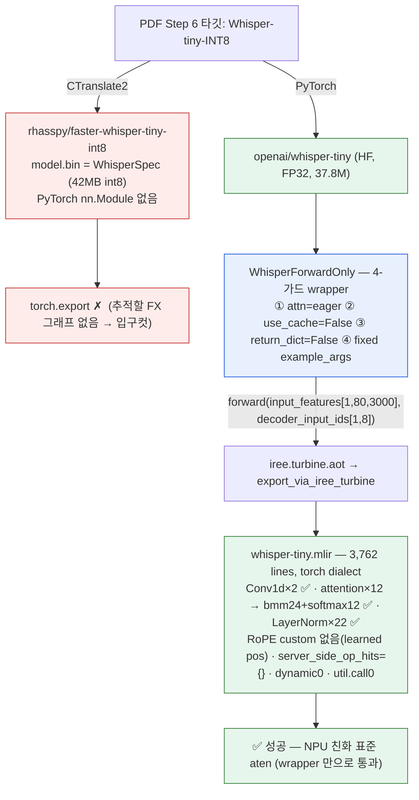

# Easy Guide 7 — Whisper-tiny export/lowering: 어떤 kernel이 막히고, 어떤 클래스로 성공했나 (encoder-decoder 확장)

> [PDF Step 6](../../torch_mlir_model_zoo.pdf)의 Model Zoo 확장 타깃 `Whisper-tiny-INT8`을, Llama easy-series와 **똑같은 방법**(eager attention + forward-only wrapper + `export_via_iree_turbine` + `summarize`)으로 돌려 *문제 kernel*과 *성공 클래스*를 실측한 노트.
>
> ground truth (재현됨): `logs/whisper/whisper-tiny.mlir` (3,762 lines) — [`../../scripts/run_whisper_export.py`](../../scripts/run_whisper_export.py)로 생성.
> Whisper = **encoder-decoder** → Llama(decoder-only)에 없던 surface(Conv1d 프런트엔드 · cross-attention)를 처음 본다.

---

## TL;DR

1. **PDF가 가리킨 `rhasspy/faster-whisper-tiny-int8`은 torch-MLIR에 *못 넣는다*** — CTranslate2 `WhisperSpec` 바이너리(42MB, int8)라 PyTorch nn.Module 그래프가 없음(§1). → 아키텍처가 같은 PyTorch `openai/whisper-tiny`(FP32)로 lowering. (양자화는 마지막 단계.)
2. **whisper-tiny FP32는 wrapper 하나로 깨끗하게 성공** — `server_side_op_hits = {}` (0), dynamic dim 0, custom util.call 0, 전부 표준 `torch.aten.*` (§2).
3. **문제가 될 뻔한 kernel은 딱 1개 = opaque SDPA** — Llama와 *동일*. default attention이면 12개 attention 블록이 전부 `aten._scaled_dot_product_flash_attention_for_cpu` 블랙박스로 붕괴. `attn_implementation="eager"`가 그걸 `bmm`+`_softmax`로 분해(§3, 대조 실측).
4. **Whisper 고유 surface(Conv1d·cross-attention)는 안 막힌다** — conv는 `torch.aten.convolution` ×2, cross-attn은 표준 bmm/softmax. 게다가 **RoPE가 없어**(learned positional embedding) Llama의 RoPE custom-kernel 문제 자체가 *없다* — Whisper가 이 점에선 더 단순(§3).
5. **성공시킨 클래스 = `WhisperForwardOnly`** — `WhisperForConditionalGeneration`을 단일 forward로 감싼 4-가드 wrapper(§4). LlamaOnDevice / CausalLMWrapper의 encoder-decoder 판.

---

## 그림 — lowering 성공 경로

📐 **저장본**: [`../diagrams/whisper-lowering.svg`](../diagrams/whisper-lowering.svg) (브라우저/VS Code/GitHub 에서 렌더). 아래 Mermaid 는 같은 내용의 미리보기.




> **문제 kernel 실증(attn 대조)**: `eager` → bmm 24·softmax 12·opaque **0** ✅ / `sdpa`(default) → bmm 0·softmax 0·opaque **12** ✗ (12 attention 블록이 전부 `aten._scaled_dot_product_flash_attention_for_cpu` 블랙박스로 붕괴 — Llama 와 동일한 유일 trap).

---

## 0. 셋업 (재현)

```bash
source /home/bohyun/venv-shark/bin/activate    # torch 2.5.1, transformers 4.52.1, iree-turbine 3.10
python scripts/run_whisper_export.py           # openai/whisper-tiny → logs/whisper/whisper-tiny.mlir
```

- export 엔진: `torch_mlir_zoo.exporters.export_via_iree_turbine` (Llama·HF-zoo와 동일 경로, `iree.turbine.aot`)
- 분석: `torch_mlir_zoo.analysis.ir_summary.summarize`
- `torch_mlir` 패키지는 미설치 — iree-turbine의 fx importer가 torch→MLIR 담당.

---

## 1. faster-whisper-tiny-int8 시도 → **CTranslate2 벽** (입고 입구컷)

PDF Step 6 링크 `rhasspy/faster-whisper-tiny-int8`을 실제로 받아 정체를 확인:

```
model.bin  첫 48바이트:
  b'\x06\x00\x00\x00\x0c\x00WhisperSpec\x00\x03\x00\x00\x00\xc0\x00\x00\x00\x13\x00decoder/activation...'
  size 42,120,343 bytes | is_zip(PK)=False | looks_like_pytorch=False
```

→ **CTranslate2 자체 바이너리 직렬화 포맷**(`WhisperSpec` model-spec + `decoder/activation` 같은 named variable). PyTorch `.bin`(zip/pickle)도 safetensors도 아님. faster-whisper는 CTranslate2(C++ 추론 엔진) 런타임으로만 돌고 **PyTorch `nn.Module`이 존재하지 않는다** → `torch.export`가 추적할 FX 그래프가 없음 → torch-MLIR 입구에서 끝.

> easy3의 "fixed IRPA는 만능키가 아니다"와 같은 결의 발견: **"int8 모델 파일이 있다"≠"lowering 가능"**. 양자화 포맷(CTranslate2/GGUF/CT2)은 *추론 엔진 전용 산출물*이고, torch-MLIR은 *PyTorch 소스*를 요구한다. INT8은 PyTorch lowering을 끝낸 *뒤* 마지막에 적용할 단계.

→ 그래서 아키텍처가 동일한 PyTorch `openai/whisper-tiny`(FP32)로 진행. (CTranslate2 int8 weight를 PyTorch Whisper에 재주입하는 건 별도 변환 작업이고, 방법론상 마지막.)

---

## 2. PyTorch whisper-tiny FP32 export — **깨끗하게 성공**

entry 시그니처 (`logs/whisper/whisper-tiny.mlir:79`):
```mlir
func.func @forward(
    %arg0: !torch.vtensor<[1,80,3000],f32>,     // input_features (mel: 80 bins × 3000 frames = 30s)
    %arg1: !torch.vtensor<[1,8],si64>           // decoder_input_ids
) -> !torch.vtensor<[1,8,51865],f32>            // logits
  attributes {torch.assume_strict_symbolic_shapes}
```

| 지표 | 값 | 의미 |
|---|---|---|
| MLIR lines | 3,762 | whisper-tiny 37.8M params |
| aten ops | 1,033 (unique 30+) | 전부 표준 torch dialect |
| **server_side_op_hits** | **0** | paged_attention/kv_cache/flash/affinity 흔적 없음 (LlamaOnDevice와 동일) |
| **dynamic dim** | **0** | `?` 없음 — fixed shape |
| util.call (custom kernel) | 0 | @mlir_kernel splice 없음 |
| iree_linalg_ext | 0 | IREE extension dialect 없음 |
| torch.operator (non-aten) | 0 | aten 밖 escape 없음 |
| hal.device.promise | 0 | affinity 없음 |

→ **단일 entry + static shape + 순수 aten = NPU 친화.** easy6 §2.2의 "충분조건 4개"(순수 aten · opaque 분해 · custom 회피 · static)를 그대로 만족.

---

## 3. 어떤 kernel이 문제가 되나 — Whisper판 (실측 대조)

### 3.1 유일한 실제 trap = opaque SDPA (Llama와 동일)

`attn_implementation`만 바꿔 같은 모델을 두 번 export한 대조:

| attn_implementation | bmm | _softmax | **opaque `_sdpa_flash_..._for_cpu`** | srv_hits | 판정 |
|---|---:|---:|---:|---:|---|
| `"eager"` | 24 | 12 | **0** | 0 | ✅ 표준 분해 |
| `"sdpa"` (default) | 0 | 0 | **12** | 12 | ✗ 12블록 전부 블랙박스 |

→ default면 **12개 attention 블록**(enc self 4 + dec self 4 + dec **cross** 4)이 전부 `torch.aten._scaled_dot_product_flash_attention_for_cpu` 한 덩어리로 붕괴(softmax/bmm 안 보임). NPU가 이 op 의미를 모르면 reject. **`eager`가 레버** → `bmm`(QKᵀ, ·V) + `_softmax`로 분해. (easy4-detail 레버 ④ / easy6 §2.2-(1)과 동일.)

count 검산: attention 블록 12개 → `_softmax` 12 ✓, `bmm` 24(블록당 2) ✓. LayerNorm은 `var_mean`/`rsqrt` 각 22 = enc(4×2+1) + dec(4×3+1) ✓. (easy4-detail의 "count = 블록 × 함수수" 검증과 동일 방식.)

### 3.2 Whisper 고유 surface는 *안* 막힌다

| surface | Llama엔? | Whisper 결과 | 막히나? |
|---|---|---|---|
| **Conv1d 프런트엔드 ×2** (mel→hidden, 2번째가 stride2 다운샘플) | 없음(신규) | `torch.aten.convolution` ×2 (`[1,80,3000]→[1,384,3000]→[1,384,1500]`) | ❌ 표준 op, 통과 |
| **cross-attention** (decoder↔encoder) | 없음(신규) | 표준 bmm/softmax (위 12블록 중 4개) | ❌ eager면 통과 |
| **위치 인코딩** | RoPE custom kernel(easy3 #4) | learned `nn.Embedding`(`aten.embedding`+`add`) | ✅ **RoPE 문제 자체가 없음** — 더 단순 |
| **KV cache** | paged gather(easy3 #1/#3) | `use_cache=False`로 제거(인자/gather 없음) | ✅ 제거됨 |
| **정규화/활성** | RMSNorm/SwiGLU | LayerNorm(`var_mean`)/GELU(`aten.gelu`) | ❌ 둘 다 표준 |

> **한 줄**: Whisper에서 *새로 등장*한 conv·cross-attn은 표준 aten으로 잘 내려간다. Llama를 괴롭힌 RoPE custom kernel은 Whisper엔 **아예 없다**(learned pos). 그래서 Whisper의 막힐 kernel은 사실상 **opaque SDPA 하나**뿐 — 그것도 `eager` 한 줄로 해결.

---

## 4. 어떤 클래스로 성공했나 — `WhisperForwardOnly`

[`../../scripts/run_whisper_export.py`](../../scripts/run_whisper_export.py)의 wrapper. `WhisperForConditionalGeneration`(HF)을 단일 forward로 감싼 **4-가드**:

```python
class WhisperForwardOnly(nn.Module):
    def __init__(self, hf_model):
        super().__init__(); self.model = hf_model
    def forward(self, input_features, decoder_input_ids):
        return self.model(
            input_features=input_features,
            decoder_input_ids=decoder_input_ids,
            use_cache=False,        # ← KV cache state arg / paged 분기 제거
            return_dict=False,      # ← tuple 반환(graph 친화)
        )[0]                        # ← [0] = logits
# + 로드 시 attn_implementation="eager"  ← opaque SDPA 분해
# + example_args = (zeros[1,80,3000], zeros[1,8])  ← fixed shape (dynamic 0)
```

4-가드 = **eager attention · use_cache=False · return_dict=False · fixed example_args.** 이게 LlamaOnDevice / `CausalLMWrapper`(HF-zoo)의 **encoder-decoder 판**이다. encoder-decoder라 입력이 `(input_features, decoder_input_ids)` 2개인 것만 다르고 원리는 동일.

> 즉 "성공시킨 클래스" = 모델을 다시 짠 게 아니라(Whisper는 이미 순수 PyTorch nn.Module이라 Llama처럼 `PagedLlmModelV1` 재작성이 불필요), **HF 모델을 forward-only로 감싸 4-가드만 건 wrapper**. Whisper가 Llama보다 입고가 *훨씬 싸다*(server runtime invariant 침투가 처음부터 없음).

---

## 5. Llama-3.2-1B vs Whisper-tiny 대조

| | Llama-3.2-1B (amdsharktank server) | Whisper-tiny (HF, this note) |
|---|---|---|
| 구조 | decoder-only | encoder-decoder |
| 입력 | `input_ids` | `input_features`(mel) + `decoder_input_ids` |
| 막히는 custom kernel | RoPE `select_concat`, KV `gather`(easy3 #3/#4) | **없음** |
| opaque op | SDPA flash (server 경로) | SDPA flash (default attn일 때만) |
| 위치 인코딩 | RoPE (custom) | learned embedding (표준) |
| conv | 없음 | Conv1d ×2 (표준) |
| 입고 작업량 | `PagedLlmModelV1` 완전 재작성(LlamaOnDevice, ~170 LoC) | **forward-only wrapper(~10 LoC)** |
| 결과 | `server_side_op_hits={}` | `server_side_op_hits={}` |

→ amdsharktank Llama가 어려웠던 건 *server runtime invariant 침투*(easy3 §6) 때문이지 "transformer라서"가 아니다. **순수 PyTorch HF 모델(Whisper)은 wrapper 4-가드만으로 통과** — easy2의 "잘 짜인 raw nn.Module은 입고 비용 ≈ 0"을 encoder-decoder에서 재확인.

---

## 6. cheat sheet

```bash
M=logs/whisper/whisper-tiny.mlir
grep -c "torch.aten.convolution" $M                          # 2  (Conv1d ×2)
grep -c "_scaled_dot_product_flash_attention_for_cpu" $M     # 0  (eager)  / sdpa면 12
grep -cE "util.call|iree_linalg_ext|hal.device.promise|torch.operator" $M  # 0 0 0 0
grep -nE "func.func @forward" $M                             # static 2-arg entry

# faster-whisper-int8 이 CTranslate2 임을 확인(매직바이트)
python -c "from huggingface_hub import hf_hub_download as d; print(open(d('rhasspy/faster-whisper-tiny-int8','model.bin'),'rb').read(20))"
# → b'\x06\x00\x00\x00\x0c\x00WhisperSpec...'  (PyTorch 아님)
```

---

## 7. 참고

- 짝: [easy6.md](easy6.md)(aten 충분조건 4개 — Whisper가 그대로 만족) · [easy3.md](easy3.md)(Llama server 제약 9종) · [easy2.md](easy2.md)(raw nn.Module 입고 비용 ≈ 0)
- 스크립트: [`../../scripts/run_whisper_export.py`](../../scripts/run_whisper_export.py), HF-zoo 패턴: [`../../scripts/run_hf_models_export.py`](../../scripts/run_hf_models_export.py)
- 산출물: `logs/whisper/whisper-tiny.mlir` (3,762 lines), `logs/whisper/results.json`
- 다음: INT8 양자화(마지막 단계) — PyTorch whisper-tiny에 torch quant 적용 후 재-lowering, 또는 CT2 int8 weight 재주입 변환.
