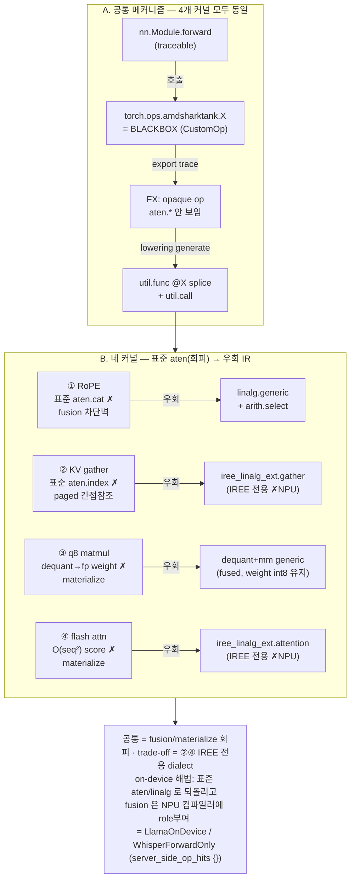
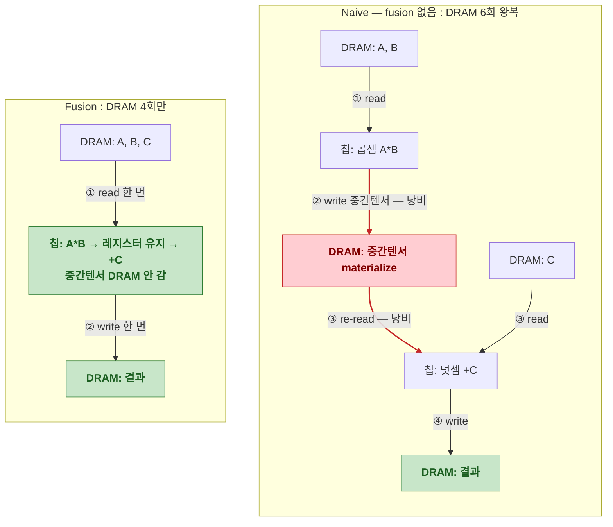
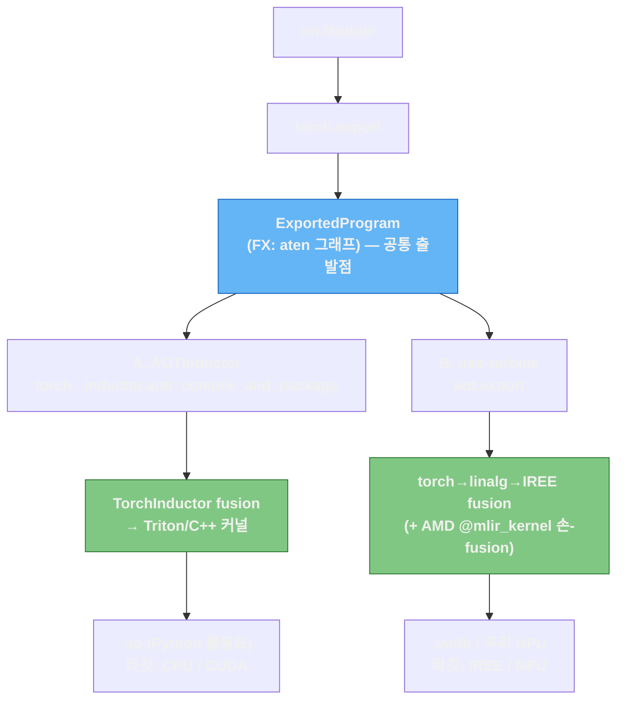
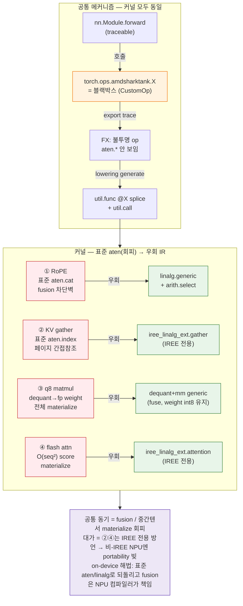

# easy8-detail — AMD가 커널을 직접 짠 이유..

> easy8이 요약, 이번 섹션은 amdsharktank 소스를 실제로 열어 한 줄씩 따라가며 적은 정독 노트
> 대상은 네 개: RoPE의 `rope_select_concat`, paged KV cache의 `KVCacheGatherKernel`,
> 블록 양자화 행렬곱 `mmt_block_scaled_q8`, 그리고 `kernels/attention.py`의 flash attention.

## Overview

torch-mlir/turbine 파이프라인을 정리하다 보면 "`nn.Module`을 `torch.export`로 추적하면 전부 `torch.aten.*`으로 떨어진다"는 게 머릿속 기본 가정이 된다. 그런데 amdsharktank로 Llama를 뽑은 IR을 들여다보면 `aten`이 아닌 게 섞여 있다. `iree_linalg_ext.attention`, `iree_linalg_ext.gather`, 그리고 정체불명의 `linalg.generic` 덩어리들이 있다. 처음엔 "torch가 이건 lowering을 못 해서 fallback이 박힌 건가?" 싶었다.

torch가 *못 한* 게 아니라, AMD가 *일부러 torch한테 안 보여준 (BlackBox 처리)* 연산이다. 표준 경로로 두면 분명히 동작은 하는데, 그렇게 나온 IR이 IREE 입장에서 fusion이 안 되거나 중간 텐서를 메모리에 통째로 풀어버린다. 그래서 같은 수학을 IREE가 좋아하는 모양으로 커스터마이징하여 MLIR로 써서 끼워 넣은 것이다. 네 커널이 다 그렇다. 동기가 하나로 모인다 — **fusion / 중간 텐서 materialize를 피하려고.**



## Fusion

아주 단순한 예 `A * B + C`를 생각해보자. fusion이 없으면(naive) 칩은 이렇게 움직인다. DRAM에서 A, B를 읽어 칩 안에서 곱하고, 그 곱셈 결과(중간텐서)를 *다시 DRAM에 내려놓는다*. 그 다음 덧셈을 하려고 방금 내려놓은 중간텐서와 C를 *또 DRAM에서 읽어* 올려서 더하고, 최종 결과를 DRAM에 쓴다. 칩과 DRAM 사이를 굳이 두 번 더 왕복하는 것이다. DRAM은 크지만 느리고, 이 왕복이 메모리 대역폭 병목을 만든다.

fusion은 이 왕복을 없앤다. A, B, C를 한 번에 읽어와서, `A*B`를 한 결과를 *칩 밖으로 빼지 않고 레지스터에 둔 채로* 곧바로 `+C`까지 끝낸 뒤, 최종 결과만 DRAM에 딱 한 번 쓴다. 중간텐서가 DRAM에 존재한 적이 없다. DRAM 접근이 naive 6번(read 4 + write 2)에서 fusion 4번(read 3 + write 1)으로 줄고, 시퀀스가 길거나 텐서가 클수록 이 차이가 추론 속도를 몇 배로 벌리고 전력도 아낀다.



여기서 핵심은, 뒤에 나올 커널이 없애려는 "중간텐서"가 바로 이 그림의 빨간 박스라는 점이다. RoPE에선 그게 concat 버퍼고, q8에선 dequant된 fp weight 전체고, attention에선 O(seq²) score matrix다. AMD의 커스텀 커널은 결국 *이 중간텐서를 DRAM에 안 내리려는* 시도다.

## fusion은 *누가* 함? — AOTInductor와 우리 경로

fusion은 `torch.export`로 모델을 그래프(ExportedProgram)로 뽑고 나면, 그걸 실제 배포 가능한 바이너리로 바꾸는 "AOT 컴파일러". 이걸 정리하다 AOTInductor라는 게 나왔는데, 우리 경로와 비교해보면 그림이 깔끔해진다.

**AOTInductor**는 PyTorch가 자체적으로 가진 ahead-of-time 컴파일러다. `torch.compile`이 런타임에 JIT로 쓰는 백엔드가 TorchInductor인데, 그 AOT 버전이라고 보면 된다. `torch._inductor.aoti_compile_and_package(ep)` 같은 식으로 export된 그래프를 받아서, Inductor가 **fusion**(pointwise/reduction fusion)을 한 다음 Triton(GPU)·C++(CPU) 커널을 생성하고, 그걸 `.so` 하나로 묶는다. 그러면 Python 런타임 없이 C++에서 바로 돌릴 수 있다. 즉, 위에서 그린 "중간텐서 안 내리기"를 *PyTorch가 직접* 해서 바이너리로 떨궈주는 방법이다.

**ssl-npu 경로**(iree-turbine / torch-mlir)는 같은 `torch.export` 결과에서 출발하지만 코드 생성을 PyTorch가 아니라 IREE에 맡긴다. `aot.export`로 torch dialect → linalg → IREE로 내리고, fusion과 codegen을 IREE가 한다. AMD가 `@mlir_kernel`로 custom fusion을 박은 것도 정확히 이 IREE 경로 *안에서* 일어나는 일이다.



두 방법의 공통점, 둘 다 `torch.export`에서 갈라지고, 둘 다 핵심 최적화가 fusion이다 — 위 A\*B+C 그림의 그 fusion. 차이는 *누가* fusion하고 *어디로* codegen하느냐다. AOTInductor는 Triton/C++로 떨어지니 CPU/CUDA가 타깃이고, 임의의 NPU를 직접 노리진 못한다. 우리는 IREE(또는 ssl NPU 컴파일러)로 내리니 NPU 경로가 열리지만, 대신 IREE 전용 op(`iree_linalg_ext.*` 같은)가 IR에 박히면 비-IREE NPU엔 그게 문제가 된다 — 이게 easy8 커널 얘기로 돌아온다.

그래서 결론은, ssl NPU가 IREE 비호환이면 B 경로로 가되 AMD의 IREE 전용 커스텀 커널은 표준 aten/linalg로 되돌리고, AMD가 커스텀으로 만들었던 fusion 이득은 우리 NPU 컴파일러가 다시 role을 부여하면 되는 것이다.

## common커널에서의 우회 트릭 — AMD는 torch한테 어떻게 BlackBox 처리 하나?

네 커널은 등록 방식이 두 가지로 보이지만(`@mlir_kernel` 데코레이터, 그리고 `@CustomOp.register` + 외부 `.mlir` 템플릿) 사실 한 뿌리다. `kernels/mlir_kernel.py`를 보면 `@mlir_kernel` 안에서 결국 `CustomOp`를 만들어 등록한다:

```python
# kernels/mlir_kernel.py:229 — mlir_kernel 데코레이터 내부
@CustomOp.register(library=LIBRARY)
class kernel(CustomOp):
    def select(self, sel): ...     # trace 때 결과 shape/dtype 결정, static dim 특수화
    def generate(self, ksel, kb):  # lowering 때 손으로 쓴 MLIR을 모듈에 splice
```

핵심은 이 `CustomOp`가 torch custom op이라는 점이다. 그래서 흐름이 이렇게 두 단계로 갈린다.

- **trace(export) 때:** 모델 코드는 그냥 `torch.ops.amdsharktank.<이름>(...)`을 부른다. `torch.export` 입장에선 이게 블랙박스다. 내부를 `aten`으로 풀어 헤치지 않는다. 그래서 FX 그래프엔 불투명한 custom op 하나만 남는다 — concat도, softmax도, gather도 안 보인다.
- **lowering(aot.export) 때:** 그 op의 `generate()`가 호출된다. Jinja2로 미리 써둔 MLIR 템플릿을 static dim·dtype에 맞게 채워 `util.func private @<이름>`을 만들고, turbine의 Merger가 그걸 메인 모듈에 끼워 넣은 뒤 호출부를 `util.call`로 바꾼다.

정리하면, "우회"란 표준 lowering을 건너뛰고 *내가 원하는 linalg/IREE MLIR을 사람이 직접 써서 박는 것*이다. 표준 경로가 만들어낼 IR보다 fusion 친화적인 형태를 유지하는게 목적이고, 대가는 IREE 전용 방언이 IR에 박힌다는 것. 대신 Trade-off 가 나중에 ssl NPU 요약 때 설명.

## ① RoPE — concat이 fusion을 끊어서

가장 먼저 연 게 `layers/rotary_embedding_hf.py`였는데, 소스 주석에 그대로 적혀 있었다. `rope_select_concat`이라는 `@mlir_kernel` 함수의 docstring이다:

```python
# layers/rotary_embedding_hf.py:29
@mlir_kernel(
    inputs=(
        MLIRTensor[BS, SL, HEADS, HALFDIM, TY],
        MLIRTensor[BS, SL, HEADS, HALFDIM, TY],
    ),
    results=(MLIRTensor[BS, SL, HEADS, TWO, HALFDIM, TY],),   # 끝에 크기 2짜리 'two' 축
    # 엄밀히 말해 맨 마지막 차원을 뜻한다기보다, "텐서 형상의 끝부분(마지막 두 차원 연산부)에 크기 2짜리 차원(TWO)을 새로 끼워 넣었다"는 의미로 작성, 실제위치는 HALFDIM 바로 앞.
    # 즉, 실제 텐서의 형태(Shape)는 [BS, SL, HEADS, 2, HALFDIM]이 됩니다.
)
def rope_select_concat(x1, x2, out=None):
    """
    IREE doesn't have a good concat op yet which can also do fusion. The
    alternatives are tensor.concat or tensor.insert_slice, but both would
    block fusions for RoPE. We use a linalg.generic with arith.select
    on the concat dimension to do the concat instead.
    """
```

RoPE는 회전시킨 두 반쪽 `x1`, `x2`를 다시 하나로 붙여야 한다. 보통 `torch.cat([x1, x2], dim=-1)`로 끝낼 일이다. 그런데 cat은 본질적으로 "데이터를 새 버퍼로 옮기는" 연산이라, IREE가 RoPE 앞뒤(cos/sin 곱, 그 다음 KV write, attention)를 하나로 묶으려 할 때 그 chain을 끊어버린다. 중간 결과가 메모리로 한 번 내려갔다 올라오는 것이다.

그래서 택한 게 "concat을 concat 안 하고 흉내내기"다. 결과 텐서 끝에 크기 2짜리 축(`two`)을 하나 만들고, 그 축을 *iteration 축*으로 삼아 `linalg.generic` 한 번에 채운다. 인덱스가 0이면 `x1`, 1이면 `x2`를 고르는 식이다:

```mlir
// layers/rotary_embedding_hf.py:68 — splice되는 util.func 본문 일부
%out = linalg.generic #trait ins(%x1, %x2) outs(%empty) {
  ^bb0(%xs1 : !dtype, %xs2 : !dtype, %o : !dtype):
    %two_dim = linalg.index 3 : index
    %is_x1 = arith.cmpi eq, %two_dim, %c0 : index
    %val = arith.select %is_x1, %xs1, %xs2 : !dtype   // 데이터 이동 없는 concat
    linalg.yield %val : !dtype
} -> !out
```

이러면 concat이 데이터 이동 연산이 아니라 elementwise select가 되어 앞뒤 곱셈과 그대로 fuse된다. 저 크기 2 축이 나중에 unroll되면 `select` 조건이 상수로 접혀 사라진다 — 즉 추가 비용이 0으로 수렴한다는 계산까지 깔고 만든 것이다.

호출부는 평범하다. `forward` 안의 `apply_rotary`에서 회전을 계산한 뒤 이 커스텀 op를 부르고 마지막 두 축을 합친다:

```python
# layers/rotary_embedding_hf.py:387
x1 = x_real * cos - x_imag * sin
x2 = x_imag * cos + x_real * sin
cated = select_concat(x1, x2)                    # @mlir_kernel custom op (torch엔 블랙박스)
cated = cated.flatten(start_dim=-2, end_dim=-1)  # [bs,sl,heads,2,half] → [.., head_dim]
  # =>start_dim=-2(크기가 2인 TWO 축)부터 end_dim=-1(크기가 원래 차원의 절반인 HALFDIM 축)까지 하나로 평탄화(flatten)하여 원래의 head_dim으로 복구
```

같은 파일에서 interleaved 슬라이싱(`x[..., 0::2]`) 부분은 우회를 *못 했다*고 적어둠. "이건 codegen에서 `slow_memcpy`로 떨어진다, 세 가지 대안이 있는데 각각 이런 단점이 있어서, 일단은 누가 불평할 때까지 느린 채로 둔다"고 주석에 써놨다(`:362-385`). amd가 짠 코드라는 게 이런 데서 보인다. 다 최적화한 게 아니라, 못 고치는 곳을 알면서 우선순위에 밀어둔 흔적.

## ② KV cache gather — 페이지가 메모리에 흩어져 있어서

`layers/paged_attention.py`의 `KVCacheGatherKernel`. 이건 주석이 친절하진 않아서 시그니처를 보고 역추적했다. 입력 캐시가 6차원이다:

```python
# layers/paged_attention.py:68
@mlir_kernel(
    inputs=(
        MLIRTensor[CACHE_SIZE, T_BLOCK, PART, HEAD_COUNT_KV,
                   BLOCK_SEQ_STRIDE, ATTN_HEAD_DIM, CACHE_TY],   # 6D 캐시 slab
        MLIRTensor[BATCH, PAGES, I64],                          # page_ids (런타임 값)
        MLIRTensor[I64],                                        # transformer_idx (스칼라)
        MLIRTensor[I64],                                        # partition_idx  (스칼라)
    ),
    results=(MLIRTensor[BATCH, PAGES, HEAD_COUNT_KV,
                        BLOCK_SEQ_STRIDE, ATTN_HEAD_DIM, CACHE_TY],),
)
def paged_attention_kv_cache_gather(cache, page_ids, transformer_idx, partition_idx, result):
```

paged attention의 KV 캐시는 연속된 한 덩어리가 아니라 페이지 단위로 흩어져 있고, 어느 페이지를 읽을지는 런타임 텐서 `page_ids`가 정한다. 즉 data-dependent indirect lookup이다. 이걸 torch의 `index_select`/`index` 체인으로 흉내내려 하면 두 가지가 문제가 된다. 하나는 6차원 slab에서 "현재 transformer 블록과 partition을 먼저 잘라낸 뒤, 거기서 페이지를 gather"하는 구조가 표준 인덱싱과 잘 안 맞는다는 것. 다른 하나는 그렇게 나온 IR을 IREE가 indirect DMA로 타일링·스케줄하기 어렵다는 것.

그래서 두 단계로 직접 썼다. 먼저 스칼라 텐서에서 인덱스를 꺼내 동적 슬라이스로 현재 블록/partition만 자르고, 그 다음 IREE 네이티브 gather를 쓴다:

```mlir
// layers/paged_attention.py:104 — 스칼라에서 인덱스 추출 → 슬라이스 → gather
%t_id64 = tensor.extract %transformer_idx[] : !transformer_idx
%p_id64 = tensor.extract %partition_idx[]   : !partition_idx
%t_id   = arith.index_cast %t_id64 : !transformer_idx_dtype to index
%p_id   = arith.index_cast %p_id64 : !partition_idx_dtype  to index
%cache_slice = tensor.extract_slice %cache
  [0, %t_id, %p_id, 0, 0, 0]
  [%cache_size, 1, 1, {{HEAD_COUNT_KV}}, {{BLOCK_SEQ_STRIDE}}, {{ATTN_HEAD_DIM}}]
  [1, 1, 1, 1, 1, 1] : !cache to !cache_slice
%result = iree_linalg_ext.gather
          dimension_map = [0]
          ins(%cache_slice, %page_ids : !cache_slice, !page_ids)
          outs(%empty : !result) -> !result
```

한 가지 비대칭이 있는데, 이 gather는 **decode 전용**이다. prefill 단계에선 K/V를 새로 계산해서 캐시에 *쓰기*만 하고, decode 단계에서만 캐시에서 이 gather로 *읽는다*. 그래서 IR을 prefill/decode로 나눠 뽑아보면 gather 개수가 0과 32로 갈린다. 처음에 이 숫자 차이를 보고 "왜 한쪽엔 gather가 없지?" 했는데, 캐시 읽기 자체가 decode에만 있으니 당연했다.

## ③ mmt_block_scaled_q8

개인적으로 제일 오래 본 건 `kernels/mmt_block_scaled_q8.py`다. 양자화는 우리 로드맵상 마지막 단계지만, 막상 갈 때 이 커널의 아이디어를 이해 못 하면 양자화의 의미 자체가 날아간다.

INT8 weight는 보통 두 텐서로 저장된다. 정수 부분 `qs`(블록당 32개씩 묶인 int8)와, 블록마다 하나씩 붙는 실수 스케일 `d`. 단순하게 쓰면 이렇다 — `qs`에 `d`를 곱해 fp weight를 복원(dequant)한 다음 그걸로 행렬곱. 문제는 이 dequant 결과다. weight를 통째로 fp로 풀어 메모리에 올리는 순간, 애초에 int8로 저장해서 아낀 메모리·대역폭이 그대로 증발한다. 양자화한 이유가 사라지는 것이다.

이 클래스는 그래서 dequant과 matmul을 *한 함수 안의 두 `linalg.generic`*으로 붙여서, IREE가 dequant을 matmul 타일 안으로 fuse하게 만든다. 그러면 weight는 DRAM에 int8로 남고, dequant은 타일이 레지스터로 올라온 그 순간에만 일어난다. fp weight 전체가 메모리에 존재하는 일이 없다.

먼저 Python 쪽. `@mlir_kernel` 인라인이 아니라 `CustomOp`를 직접 상속하고, MLIR은 외부 템플릿 파일로 뺀 것:

```python
# kernels/mmt_block_scaled_q8.py:16
@CustomOp.register(library=LIBRARY)
class mmt_block_scaled_q8(CustomOp):
    """Generic block scaled matmul with transposed RHS.
    * d:  [N, K // 32, 1]      (per-block scale)
    * qs: [N, K // 32, 32]     (int8 weight)
    The LHS is expected to be a 3d tensor of shape [B, M, K]."""
    signature = "mmt_block_scaled_q8(Tensor a, Tensor d, Tensor qs) -> (Tensor)"

    def select(self, ksel):          # :32 — 블록 레이아웃 검증 + N/K/BS 특수화
        ...
        torch._check((qs_group0 * qs_bs) == a_k, ...)   # K == group0 * block_size 확인
        a_desc.specialize_dims(-1)
        qs_desc.specialize_all_dims()
        d_desc.specialize_all_dims()

    def generate(self, ksel, kb):    # :71 — 템플릿을 채워 util.func로 splice
        target = inline_template_function(
            kb, "mmt_block_scaled_q8_3d.mlir",
            f"amdsharktank_mmt_block_scaled_q8_3d_{n}_{k}_{bs}_{a_type}",
            n=n, k=k, bs=bs, group0=group0, a_type=..., scale_type=...)
        kb.yield_results(*call_function(target, *kb.arg_bindings))
```

`select`는 trace 때 불려서 shape이 블록 rule(`K = group0 × block_size`)에 맞는지 확인하고 N/K/BS를 static으로 박는다. `generate`는 lowering 때 템플릿 `mmt_block_scaled_q8_3d.mlir`을 그 값들로 채워 함수를 만들고 호출로 연결한다.

진짜 알맹이는 그 템플릿이다. 한 `util.func` 안에 generic이 둘 있는데, 첫째가 dequant, 둘째가 그룹화된 행렬곱이고, 둘이 같은 함수라 fuse된다:

```mlir
// kernels/templates/mmt_block_scaled_q8_3d.mlir:34 — (1) dequant generic
%b_grouped_dequant = linalg.generic {...} ins(%d, %qs) outs(%b_grouped) {
  ^bb0(%d_element: !scale_type, %q_element: !lowp_type, %out: !a_type):
    %q_ext    = arith.extsi  %q_element : i8 to i32      // int8 → int32
    %q_fp     = arith.sitofp %q_ext     : i32 to !a_type // → float
    %q_scaled = arith.mulf   %q_fp, %d_element : !a_type // × 블록 스케일 = dequant
    linalg.yield %q_scaled : !a_type
} -> !b_grouped_tensor_type

// a를 블록 reduction 구조에 맞게 [B, M, group0, block]으로 펼친다
%aexp = tensor.expand_shape %a [[0],[1],[2,3]] ...

// (2) grouped batch-mm generic — (group0, block) 두 축이 reduction, f32로 누적
%result = linalg.generic {iterator_types = [..., "reduction", "reduction"]}
  ins(%aexp, %b_grouped_dequant) outs(%result_fill) {
  ^bb0(%a_element: !a_type, %b_element: !a_type, %out: !accum_type):
    %mul = arith.mulf %a_element, %b_element : !a_type
    %acc = arith.addf %mul, %out : !accum_type
    linalg.yield %acc : !accum_type
} -> !accum_tensor_type
```

여기서 깨달은 게 하나 있다. 나중에 양자화를 NPU로 가져갈 때 진짜 할 일은 "dequant 수식을 정확히 옮기는 것"이 아니다. 정확한 dequant은 사실 쉽다 — `(qs.to(fp) * d) @ aᵀ` 한 줄이면 기능적으로는 맞고 전부 깔끔한 `aten`으로 lowering된다. 어려운 건 그 `qs.to(fp) * d`가 fp weight를 통째로 materialize하지 않게 하는 것이다. 즉 dequant을 matmul에 fuse해서 weight를 int8로 유지하는 게 본래 의도. NPU 컴파일러가 이 fusion을 해주거나, NPU에 block-quant matmul intrinsic이 있거나, 아니면 이 템플릿처럼 우리가 `linalg.generic` 한 덩어리로 직접 묶어서 fusion을 강제하거나 — 셋 중 하나여야 한다.

## ④ flash attention — score 행렬을 안 만들려고

`kernels/attention.py`. 여기엔 `flash_attention`과 `masked_flash_attention` 두 개가 있는데 구조는 같다. 시그니처를 보면 Q·K·V·scale을 받아 결과 하나를 낸다. attention 전체가 한 op이다:

```python
# kernels/attention.py:30
@mlir_kernel(
    inputs=(
        MLIRTensor[BATCH, NUM_HEADS, M, K1, I_DTYPE],   # Q
        MLIRTensor[BATCH, NUM_HEADS, K2, K1, I_DTYPE],  # K
        MLIRTensor[BATCH, NUM_HEADS, K2, N, I_DTYPE],   # V
        MLIRTensor[S_DTYPE],                            # scale (스칼라)
    ),
    results=(MLIRTensor[BATCH, NUM_HEADS, M, N, O_DTYPE],),
)
def flash_attention(q, k, v, scale, result=None):
```

`softmax(QKᵀ · scale) @ V`를 그대로 aten으로 풀면 중간에 `M × K2` 크기의 score 행렬이 메모리에 잡힌다. 시퀀스가 길어지면 이게 제곱으로 커져서 메모리가 터진다. flash attention은 online-softmax(돌면서 max/sum을 갱신)로 이 score 행렬을 만들지 않고 한 번에 흘려보내는 기법이고, AMD는 그걸 IREE의 단일 op으로 박았다:

```mlir
// kernels/attention.py:56
%result = iree_linalg_ext.attention {
  indexing_maps = [ /* Q */, /* K */, /* V */, /* scale */, /* out */ ]
}
ins(%q, %k, %v, %s_c : !q, !k, !v, !scale_dtype)
outs(%empty : !result) {
  ^bb0(%score : f32):
    iree_linalg_ext.yield %score : f32   // body가 비어 있음 = backend가 tiled flash로 codegen
} -> !result
```

body가 `yield %score` 하나뿐인 게 포인트다. 실제 타일링·online-softmax는 IREE backend가 채운다. masked 버전은 여기에 `(M, K2)` 모양 mask map 하나만 더 붙는다(`:88-125`).

한 가지 헷갈렸던 걸 적어둔다. 정작 default Llama-3.2-1B를 export해서 나온 IR에 보였던 attention은 이 커널이 *아니었다*. 거기 박힌 건 PyTorch 자신의 CPU fallback인 `aten._scaled_dot_product_flash_attention_for_cpu`라는 불투명 aten op이었다. 이건 export 층의 얘기고, `kernels/attention.py`의 flash는 `attention_kernel` 플래그로 선택되는 AMD의 *의도된* lowering 층 커널이다. 둘 다 "naive softmax-attn을 피한다"는 목적은 같은데 층이 다르다.

## 그림으로 한 번에

네 개를 따로 보면 제각각 같지만, 한 장으로 펼치면 같은 골격이 반복된다는 게 보인다. 위쪽은 trace→lowering splice 메커니즘, 가운데는 커널이 각각 "표준 aten(회피) → 우회 IR"로 가는 모습, 아래는 그래서 우리한테 남는 결론.



## 결론

소스를 다 읽고 나서 든 생각은, AMD의 이 우회들이 *잘못된 게 아니라 IREE에 최적화된 것*이라는 거다. IREE 위에서는 이게 정답에 가깝다. 문제는 우리 타깃이 IREE가 아닐 때다. RoPE의 select-concat과 q8의 dequant-generic은 결국 표준 `linalg`이라 운이 좋으면 그대로 받을 수도 있지만, KV gather의 `iree_linalg_ext.gather`와 flash의 `iree_linalg_ext.attention`은 IREE 확장어 개념이라 비-IREE NPU 컴파일러엔 그냥 모르는 op로 떨어진다. 이게 "portability budget"이다.

그래서 on-device로 갈 때 방향은 명확하다. 이 우회들을 표준 aten/linalg로 *되돌리되*, AMD가 커스텀으로 챙겼던 fusion 이득은 NPU 컴파일러가 다시 ROLE을 부여하는 것. RoPE는 표준 concat으로, gather는 재계산이나 `index_select`로, q8는 직접 block dequant-mm으로, flash는 분해하거나 NPU 네이티브 attention으로. ssl `LlamaOnDevice`와 `WhisperForwardOnly`가 정확히 이 task를 한 결과가 IR에서 `server_side_op_hits = {}`로 나오는 것이디. 결론은 한 줄이다 — **AMD가 커스텀으로 짠 fusion을, 우리는 컴파일러한테 떠넘기는 구조로 바꾼다.**
