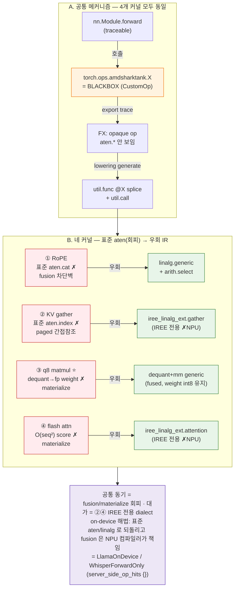

# Easy Guide 8 — amdsharktank는 *왜·어떻게* 커널을 우회했나 (RoPE concat · KV gather · q8 matmul · flash attention)

> [easy6.md](easy6.md) §2.1 lowering kernel 카탈로그의 후속 — 그중 **핵심 4개**를 amdsharktank 실소스(주석·MLIR 템플릿 포함)로 *왜 표준 경로를 안 쓰고 손수 짠 커널로 우회했는지* 분석.
> 소스: `/home/bohyun/amd-shark-ai/amdsharktank/amdsharktank/` (sibling clone, **읽기만**).
>
> 대상 4종: ① `RoPEKernels.rope_select_concat` ② `KVCacheGatherKernel` ③ `mmt_block_scaled_q8`(⭐INT8 핵심) ④ `kernels/attention.py` flash_attention.

---

## 0. 한 줄 결론

> **네 우회 모두 동기가 하나로 수렴한다: fusion / 중간 텐서 materialize 회피.** 표준 `torch→aten→linalg` 경로는 "정직하지만 fusion 비친화적"인 IR(concat 차단벽 · 별도 dequant weight · O(seq²) score matrix · generic gather)을 만든다. amdsharktank는 같은 수학을 **IREE codegen이 fuse·tile하기 좋은 형태**로 직접 박았다. 대가 = `iree_linalg_ext.*` 같은 **IREE 전용 dialect** → 비-IREE NPU엔 portability 빚.

---

## 그림 — 한눈에 보기

> 편집본: [../diagrams/kernel-bypass.drawio](../diagrams/kernel-bypass.drawio) (draw.io / VS Code draw.io 확장)
> — **Page 1** 전체 우회 한눈에 · **Page 2** ③ q8 INT8 dataflow.
> 아래는 Mermaid 미리보기(GitHub/VS Code 인라인 렌더).



---

## 1. 공통 메커니즘 — "어떻게" splice 되나

`@mlir_kernel`(신형, `MLIRSpec` 인라인 문자열, `kernels/mlir_kernel.py:163`) / `CustomOp.register`(구형, `.mlir` 템플릿 파일 + `inline_template_function`)는 **둘 다 Torch custom op으로 등록**된다. 그래서:

1. `torch.export`가 그 내부를 `aten.*`으로 **추적하지 않음** → 단일 opaque op.
2. `aot.export` 중 op의 `generate()`(mlir_kernel.py:295)가 Jinja2로 템플릿을 **static dim·dtype에 specialize**(dynamic dim은 안 함, :237).
3. `iree.turbine...Merger`로 `util.func private @<name>` 을 메인 모듈에 splice, 호출부를 `util.call @<name>` 로 치환.

→ **"우회" = 표준 lowering을 건너뛰고 목표 linalg/IREE MLIR을 사람이 직접 써넣는 것.** 표준 경로가 만들 IR보다 *fusion 친화적*인 형태를 손으로 박는 게 목적.

---

## 2. 네 커널 — 왜(동기) ↔ 어떻게(수법) 요약

| 커널 | 표준 경로(naive)의 문제 = **왜** | 우회 수법 = **어떻게** | 박히는 IR |
|---|---|---|---|
| ① **RoPE `rope_select_concat`** (`@mlir_kernel`) | `aten.cat`(concat) = **fusion 차단벽**. RoPE→KV write→attn fusion이 끊기고 중간 버퍼 materialize | concat을 **data-movement이 아닌 elementwise**로: `linalg.generic`+`arith.select`("idx 0이면 x1, 1이면 x2") | `linalg.generic` (fusable) |
| ② **`KVCacheGatherKernel`** (`@mlir_kernel`) | paged KV = **data-dependent indirect lookup**(page_ids). torch `index_select` 체인은 6D paged slab에 안 맞고 indirect DMA 스케줄 불가 | `extract_slice`(동적 t/p_id로 블록/파티션 선택) + **`iree_linalg_ext.gather`** | `iree_linalg_ext.gather` |
| ③ **`mmt_block_scaled_q8`** (`CustomOp`) ⭐ | dequant→`aten.mm` 2단계면 **weight를 통째로 fp로 풀어 양자화 메모리 이득을 날림** + 미fusion | **dequant을 matmul 타일 안으로 fuse**: 한 `util.func`에 dequant generic + grouped-mm generic | `linalg.generic` ×2 (fused) |
| ④ **`flash_attention`/`masked_`** (`@mlir_kernel` ×2) | softmax-attn naive = **O(seq²) score matrix materialize** + 다중 패스 | flash(online-softmax)를 **`iree_linalg_ext.attention`** 한 op으로 (score matrix 안 만듦) | `iree_linalg_ext.attention` |

---

## 3. 커널별 상세

### ① RoPE `rope_select_concat` — *concat을 fusable select로* (rotary_embedding_hf.py:20–87)

소스 주석이 동기를 그대로 적어둠:
> *"IREE doesn't have a good concat op yet which can also do fusion. The alternatives are tensor.concat or tensor.insert_slice, but both would block fusions for RoPE. We use a linalg.generic with arith.select on the concat dimension to do the concat instead."*

- **왜**: 회전된 두 반쪽 x1·x2를 `[bs,sl,heads,2,halfdim]`로 interleave-pack해야 하는데, `aten.cat`/`tensor.concat`/`insert_slice`는 IREE fusion을 끊는 **메모리 글루**라 RoPE 연산 사슬이 중간 버퍼로 끊긴다.
- **어떻게**: size-2 축을 *iteration 축*으로 만들어 `linalg.index 3` + `arith.cmpi eq …%c0` + `arith.select`로 elementwise 선택. data-movement op이 없어 cos/sin·mul과 **fuse 가능**.
  ```mlir
  %two_dim = linalg.index 3 : index
  %is_x1 = arith.cmpi eq, %two_dim, %c0 : index
  %val = arith.select %is_x1, %xs1, %xs2 : !dtype   // concat-without-concat
  ```
  주석대로 size-2 축이 unroll되면 select는 no-op로 접힘 → 오버헤드 0.

📄 **실소스 verbatim** (rotary_embedding_hf.py):
```python
# :29-42  — @mlir_kernel 데코레이터 시그니처 + 동기 주석(verbatim)
@mlir_kernel(
    inputs=(
        MLIRTensor[BS, SL, HEADS, HALFDIM, TY],
        MLIRTensor[BS, SL, HEADS, HALFDIM, TY],
    ),
    results=(MLIRTensor[BS, SL, HEADS, TWO, HALFDIM, TY],),   # ← 끝에 size-2 'two' 축
)
def rope_select_concat(x1, x2, out=None):
    """
    IREE doesn't have a good concat op yet which can also do fusion. The
    alternatives are tensor.concat or tensor.insert_slice, but both would
    block fusions for RoPE. We use a linalg.generic with arith.select
    on the concat dimension to do the concat instead.
    """
    ...

# :387-392  — 호출부 (forward → apply_rotary): cat 대신 select_concat
x1 = x_real * cos - x_imag * sin
x2 = x_imag * cos + x_real * sin
cated = select_concat(x1, x2)                       # ← @mlir_kernel custom op (blackbox)
cated = cated.flatten(start_dim=-2, end_dim=-1)     # [bs,sl,heads,2,half] → [..,head_dim]
```
```mlir
// :68-79  — splice 되는 util.func 본문 (concat-without-concat)
%out = linalg.generic #trait ins(%x1, %x2) outs(%empty) {
  ^bb0(%xs1 : !dtype, %xs2 : !dtype, %o : !dtype):
    %two_dim = linalg.index 3 : index
    %is_x1 = arith.cmpi eq, %two_dim, %c0 : index
    %val = arith.select %is_x1, %xs1, %xs2 : !dtype
    linalg.yield %val : !dtype
} -> !out
```

### ② `KVCacheGatherKernel` — *index 체인을 IREE 네이티브 gather로* (paged_attention.py:68–135)

- **왜**: PagedAttention 캐시는 물리적으로 흩어진 페이지를 **런타임 텐서 `page_ids`로 간접 참조**(data-dependent gather). 표준 torch `index_select`/`index` 체인은 (a) 6D paged slab의 "블록·파티션 슬라이스 후 페이지 gather" 구조에 안 맞고, (b) IREE가 indirect DMA로 타일·스케줄하기 어렵다.
- **어떻게**: `tensor.extract`+`index_cast`로 스칼라 텐서 `transformer_idx`/`partition_idx`에서 동적 인덱스를 뽑아 `tensor.extract_slice`로 현재 블록/파티션을 자르고, **`iree_linalg_ext.gather dimension_map=[0]`** 로 page_ids를 따라 gather.
  ```mlir
  %cache_slice = tensor.extract_slice %cache[0,%t_id,%p_id,0,0,0][%cs,1,1,KV,STRIDE,DIM][1,..]
  %result = iree_linalg_ext.gather dimension_map=[0] ins(%cache_slice,%page_ids) outs(%empty)
  ```
- → **decode 전용**: prefill은 K/V를 새로 써넣기만, decode만 캐시에서 이 gather로 읽음.

📄 **실소스 verbatim** (paged_attention.py):
```python
# :68-88  — @mlir_kernel 시그니처: 6D paged slab + page_ids(간접) + 스칼라 인덱스 2개
@mlir_kernel(
    inputs=(
        MLIRTensor[CACHE_SIZE, T_BLOCK, PART, HEAD_COUNT_KV,
                   BLOCK_SEQ_STRIDE, ATTN_HEAD_DIM, CACHE_TY],   # 6D 캐시 slab
        MLIRTensor[BATCH, PAGES, I64],                          # page_ids (data-dependent)
        MLIRTensor[I64],                                        # transformer_idx (스칼라)
        MLIRTensor[I64],                                        # partition_idx  (스칼라)
    ),
    results=(MLIRTensor[BATCH, PAGES, HEAD_COUNT_KV,
                        BLOCK_SEQ_STRIDE, ATTN_HEAD_DIM, CACHE_TY],),
)
def paged_attention_kv_cache_gather(cache, page_ids, transformer_idx, partition_idx, result):
    ...
```
```mlir
// :104-127  — 스칼라에서 인덱스 추출 → 블록/파티션 슬라이스 → page_ids gather
%t_id64 = tensor.extract %transformer_idx[] : !transformer_idx
%p_id64 = tensor.extract %partition_idx[]   : !partition_idx
%t_id   = arith.index_cast %t_id64 : !transformer_idx_dtype to index
%p_id   = arith.index_cast %p_id64 : !partition_idx_dtype  to index
%cache_slice = tensor.extract_slice %cache
  [0, %t_id, %p_id, 0, 0, 0]
  [%cache_size, 1, 1, {{HEAD_COUNT_KV}}, {{BLOCK_SEQ_STRIDE}}, {{ATTN_HEAD_DIM}}]
  [1, 1, 1, 1, 1, 1] : !cache to !cache_slice
%result = iree_linalg_ext.gather
          dimension_map = [0]
          ins(%cache_slice, %page_ids : !cache_slice, !page_ids)
          outs(%empty : !result) -> !result
```

### ③ `mmt_block_scaled_q8` — *dequant을 matmul에 fuse* (⭐INT8 핵심, mmt_block_scaled_q8.py:16 + templates/mmt_block_scaled_q8_3d.mlir)

INT8(GGUF Q8_0) weight = int8 `qs[N,K//32,32]` + per-block fp scale `d[N,K//32,1]`.
- **왜**: 순진하게 `dequant(qs,d)`로 fp weight를 만든 뒤 `aten.mm`하면 **fp weight 전체를 메모리에 펼쳐 양자화의 메모리 이득을 통째로 날린다**(애초에 양자화한 이유 소멸) + dequant·mm 미fusion.
- **어떻게**: 한 `util.func`에 두 `linalg.generic`을 이어 붙임 —
  1. **dequant generic**: `qs` i8 → `arith.extsi`(i32) → `arith.sitofp`(fp) → per-block scale `d` `arith.mulf`
  2. **grouped-mm generic**: `a`를 `[B,M,group0,bs]`로 `tensor.expand_shape`, (group0,block) reduction으로 f32 누적(`mulf`+`addf`) 후 cast
  - 둘이 한 함수라 IREE가 **dequant을 matmul 타일 안으로 fuse** → weight는 DRAM에 int8로 남고 타일 단위로만 레지스터에서 dequant. **이게 INT8이 실제로 메모리를 아끼게 만드는 핵심.**

📄 **실소스 verbatim** — `@mlir_kernel` 인라인이 아니라 `CustomOp` + 외부 템플릿 변종:
```python
# mmt_block_scaled_q8.py:16-30  — CustomOp 등록 + 블록 레이아웃 docstring
@CustomOp.register(library=LIBRARY)
class mmt_block_scaled_q8(CustomOp):
    """Generic block scaled matmul with transposed RHS.
    * `d`:  [N, K // 32, 1]      (per-block scale)
    * `qs`: [N, K // 32, 32]     (int8 weight)
    The LHS is expected to be a 3d tensor of shape [B, M, K]."""
    signature = "mmt_block_scaled_q8(Tensor a, Tensor d, Tensor qs) -> (Tensor)"

    def select(self, ksel):     # :32-68  블록 shape 검증 + N/K/BS 특수화
        ...  torch._check((qs_group0 * qs_bs) == a_k, ...)   # K = G*BS 일치
        a_desc.specialize_dims(-1); qs_desc.specialize_all_dims(); d_desc.specialize_all_dims()

    def generate(self, ksel, kb):   # :71-101  템플릿 채워 splice
        target = inline_template_function(kb, "mmt_block_scaled_q8_3d.mlir",
                    f"amdsharktank_mmt_block_scaled_q8_3d_{n}_{k}_{bs}_{a_type}",
                    n=n, k=k, bs=bs, group0=group0, a_type=..., scale_type=...)
        kb.yield_results(*call_function(target, *kb.arg_bindings))
```
```mlir
// templates/mmt_block_scaled_q8_3d.mlir:34-78  — 한 util.func 안의 두 generic
// (1) dequant: i8 → i32 → fp → ×scale
%b_grouped_dequant = linalg.generic {...} ins(%d, %qs) outs(%b_grouped) {
  ^bb0(%d_element, %q_element, %out):
    %q_ext    = arith.extsi  %q_element : i8 to i32
    %q_fp     = arith.sitofp %q_ext     : i32 to !a_type
    %q_scaled = arith.mulf   %q_fp, %d_element : !a_type      // dequant
    linalg.yield %q_scaled : !a_type } -> !b_grouped_tensor_type
%aexp = tensor.expand_shape %a [[0],[1],[2,3]] ...           // a → [B,M,G,BS]
// (2) grouped batch-mm: (group0, block) reduction, f32 accum  ← (1)을 타일 안으로 fuse
%result = linalg.generic {iterator_types=[...,"reduction","reduction"]}
  ins(%aexp, %b_grouped_dequant) outs(%result_fill) {
  ^bb0(%a_element, %b_element, %out):
    %mul = arith.mulf %a_element, %b_element : !a_type
    %acc = arith.addf %mul, %out : !accum_type
    linalg.yield %acc : !accum_type } -> !accum_tensor_type
```

### ④ `kernels/attention.py` `flash_attention` — *softmax-attn을 fused flash op으로* (attention.py:30, :78)

- **왜**: `QKᵀ→scale→(mask)→softmax→·V`를 aten으로 풀면 **O(M×K2) score matrix를 materialize**(긴 seq에서 메모리 폭발) + 여러 패스.
- **어떻게**: flash(online-softmax, running max/sum)를 **`iree_linalg_ext.attention`** 단일 op으로 박음 — 5개 indexing_map(Q/K/V/scale/out), masked는 mask map 1개 추가. score matrix를 안 만들고 IREE backend가 tiled flash로 lower.
- **층위 주의**: default Llama-3.2-1B export에 보인 건 이게 아니라 PyTorch 자체 CPU fallback `aten._scaled_dot_product_flash_attention_for_cpu`(불투명 aten, export layer). `kernels/attention.py`는 `attention_kernel` 플래그로 선택되는 **AMD의 *의도된* fused attention**(lowering layer). 둘 다 "naive softmax-attn 회피"지만 층이 다름 ([easy6-sum §1.5](easy6-sum.md) E7 vs L계열).

📄 **실소스 verbatim** (attention.py):
```python
# :30-39  — @mlir_kernel 시그니처: Q/K/V + scale, 전체 attention 이 결과 1개
@mlir_kernel(
    inputs=(
        MLIRTensor[BATCH, NUM_HEADS, M, K1, I_DTYPE],   # Q
        MLIRTensor[BATCH, NUM_HEADS, K2, K1, I_DTYPE],  # K
        MLIRTensor[BATCH, NUM_HEADS, K2, N, I_DTYPE],   # V
        MLIRTensor[S_DTYPE],                            # scale (스칼라)
    ),
    results=(MLIRTensor[BATCH, NUM_HEADS, M, N, O_DTYPE],),
)
def flash_attention(q, k, v, scale, result=None):
    ...
```
```mlir
// :56-69  — softmax(QK^T)@V 전체를 단일 op 으로 (score matrix 안 만듦)
%result = iree_linalg_ext.attention {
  indexing_maps = [ /* Q */ ..., /* K */ ..., /* V */ ..., /* scale */ ..., /* out */ ... ]
}
ins(%q, %k, %v, %s_c : !q, !k, !v, !scale_dtype)
outs(%empty : !result) {
  ^bb0(%score : f32):
    iree_linalg_ext.yield %score : f32     // body 비어있음 = backend 가 tiled flash 로 codegen
} -> !result
// masked_flash_attention(:88-125): 위와 동일 + indexing_maps 에 mask map (M,K2) 1개 추가
```

---

## 4. 관통 동기 + 우리 NPU에 남는 빚

| 커널 | 회피한 materialize | 우회로 얻은 것 | 우리가 받는 IR | 비-IREE NPU |
|---|---|---|---|---|
| RoPE concat | concat 중간버퍼 | fusion 유지 | `linalg.generic`+select | 표준 linalg면 가능, 외부 util.func면 unknown |
| KV gather | (indirect 표준화) | schedulable indirect DMA | `iree_linalg_ext.gather` | ✗ IREE 확장 dialect |
| q8 matmul | fp weight 전체 | weight int8 유지 | `linalg.generic` ×2 | 표준 linalg면 가능 |
| flash attn | O(seq²) score | flash 1-pass | `iree_linalg_ext.attention` | ✗ IREE 확장 dialect |

> **AMD의 우회 = IREE에 최적, 우리에겐 portability 빚.** on-device는 이걸 표준 aten/linalg로 *되돌리되*(RoPE concat→표준 `cat`, gather→재계산/`index_select`, q8→직접 block dequant-mm, flash→분해 또는 NPU 네이티브 attention) **fusion 이득은 NPU 컴파일러가 다시 책임지는** 구조. = 우리 `LlamaOnDevice`/`WhisperForwardOnly`가 한 일.

---

## 5. INT8 가는 길 — `mmt_block_scaled_q8` 표준 재표현 스케치

양자화는 마지막 단계지만, 갈 때 이 커널이 핵심. NPU가 `iree_linalg_ext`/외부 util.func를 못 받으면 **block-scaled dequant-fused-matmul을 직접 표현**해야 함.

```python
# (a) 기능적으로 맞고 순수 aten으로 lowering되는 표현 — 단, fusion은 backend 책임
# qs:[N,G,BS] int8, d:[N,G,1] fp, a:[B,M,K=G*BS] fp
def mmt_block_scaled_q8(a, d, qs):
    N, G, BS = qs.shape
    w = (qs.to(a.dtype) * d).reshape(N, G * BS)   # dequant → [N,K]  (aten.mul/cast/view)
    return a @ w.transpose(-1, -2)                # [B,M,N]          (aten.mm)
```

- **장점**: 전부 `torch.aten.*`(mul/cast/view/mm) → 표준 torch-mlir로 깨끗이 lowering, `server_side_op_hits` 0.
- **함정**: `(qs.to(fp)*d)`가 **fp weight를 통째로 materialize**하면 양자화 메모리 이득 소멸. → 이득을 지키려면 (i) NPU 컴파일러가 dequant→mm을 *타일 안으로 fuse*하거나, (ii) NPU의 block-quant matmul intrinsic을 쓰거나, (iii) 위를 `linalg.generic` 한 덩어리(amdsharktank 템플릿과 동형)로 직접 써서 fusion을 강제. **즉 INT8 porting의 진짜 일감 = "정확한 dequant"가 아니라 "dequant을 mm에 fuse해 weight를 int8로 유지"**.

---

## 6. cheat sheet (소스 직접 열기)

```bash
ASK=/home/bohyun/amd-shark-ai/amdsharktank/amdsharktank

# ① RoPE concat — 주석에 '왜'가 그대로
sed -n '20,90p'  $ASK/layers/rotary_embedding_hf.py     # rope_select_concat (@mlir_kernel)
# ② KV gather
sed -n '54,135p' $ASK/layers/paged_attention.py         # KVCacheGatherKernel → iree_linalg_ext.gather
# ③ q8 matmul (INT8)
cat $ASK/kernels/mmt_block_scaled_q8.py                  # CustomOp (select/generate)
cat $ASK/kernels/templates/mmt_block_scaled_q8_3d.mlir   # dequant generic + grouped-mm generic
# ④ flash attention
sed -n '30,130p'  $ASK/kernels/attention.py              # flash/masked → iree_linalg_ext.attention
# 공통 인프라 (splice 방식)
sed -n '143,300p' $ASK/kernels/mlir_kernel.py            # MLIRSpec · mlir_kernel · select/generate
```

---

## 7. 참고

- 카탈로그: [easy6.md](easy6.md) §2.1 (제약 kernel 전체) · 종합표 [easy6-sum.md](easy6-sum.md) (§2 막히는 커널 4곳 + §1.5 layer 구분)
- 2계층(export-time vs lowering-time): [easy4-detail.md](easy4-detail.md) §3 · 그림 [easy5-fig.md](easy5-fig.md) Fig 1
- on-device 해소: [`../../src/torch_mlir_zoo/models/llama_on_device.py`](../../src/torch_mlir_zoo/models/llama_on_device.py)
- amdsharktank source: [layers/rotary_embedding_hf.py](https://github.com/nod-ai/amd-shark-ai/blob/main/amdsharktank/amdsharktank/layers/rotary_embedding_hf.py) · [layers/paged_attention.py](https://github.com/nod-ai/amd-shark-ai/blob/main/amdsharktank/amdsharktank/layers/paged_attention.py) · [kernels/mmt_block_scaled_q8.py](https://github.com/nod-ai/amd-shark-ai/blob/main/amdsharktank/amdsharktank/kernels/mmt_block_scaled_q8.py) · [kernels/attention.py](https://github.com/nod-ai/amd-shark-ai/blob/main/amdsharktank/amdsharktank/kernels/attention.py)
