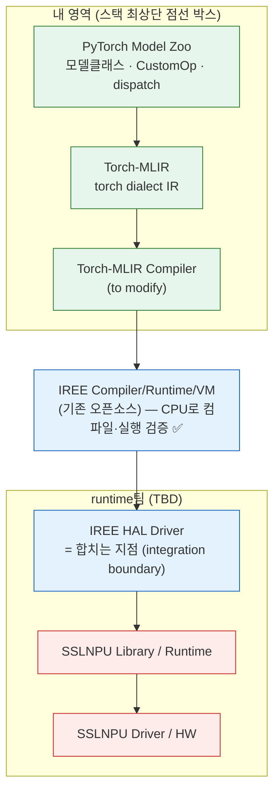
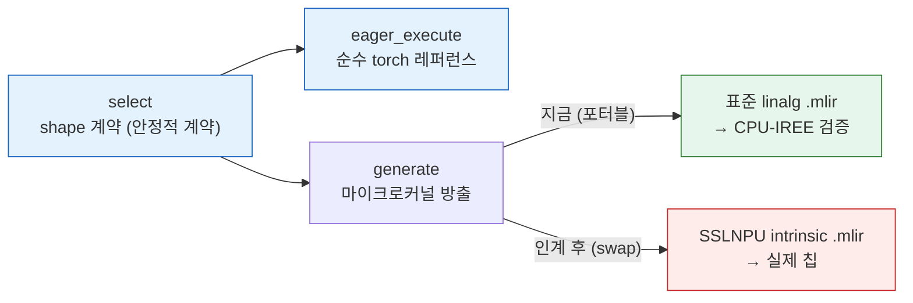

# SSLNPU CustomOp 커널 설계 — 가이드라인 + 작업 계획

> Torch-MLIR Model Zoo 학습 노트(`../easy-series/`)의 커널 우회 분석을 받아, 이제 *우리가* SSLNPU용 커널을 **직접 저작**하는 단계의 가이드라인과 계획을 정리한 설계 문서. (이 폴더 `docs/kernel-design/`는 SSLNPU 커널 설계 문서를 모은다.)
> 설계 요구사항 4가지: ①커널 구성 가이드라인 ②SSLNPU에 맞는 커널 ③호출 함수(모델 백엔드) ④torch에 등록되는 CustomOp(모델 클래스) + 마이크로커널 Class 설계, 그리고 핵심 질문 "마이크로커널(.mlir)은 SSLNPU Runtime·Compiler를 인계받고 나서 진행해야 하나?".
> 근거: easy8/easy8-detail/easy8-qna(커널 우회·CustomOp 동작) + `torch_mlir_model_zoo.pdf`(스택) + amdsharktank 실소스.

---

## 0. 한눈에 (TL;DR)

- **핵심 결론(④의 답)**: CustomOp의 **Python class(등록 + `select` shape 계약 + dispatch + 모델 클래스)는 백엔드와 무관 → 지금 전부 설계·검증 가능**. **마이크로커널 *본체*만** SSLNPU IR 인계 후 채운다. 인터페이스(`select`)는 고정, `generate`의 방출 타깃만 **표준 linalg(지금, 포터블) → SSLNPU intrinsic(나중)** swap.
- **내가 혼자 갈 수 있는 끝** = **CPU-via-IREE에서 end-to-end 컴파일 + 실행 + 수치 검증**. 그 위에서 IREE를 접점으로 runtime팀과 합쳐지면 실제 칩 실행이 완성.
- **첫 예시 커널** = INT8 block-scaled matmul(easy8-qna ③ `mmt_block_scaled_q8`의 SSLNPU판, PDF Step 6 Q8_0 목표 직결).
- **시간 임계경로**는 우리 class가 아니라 그 아래 **SSLNPU 백엔드 bring-up**.

---

## 1. 어디에 서 있나 — 스택과 담당 경계

PDF 스택에서 우리 영역은 **최상단 점선 박스**(PyTorch Model Zoo + Torch-MLIR + Torch-MLIR Compiler)다. 그 아래 IREE는 *이미 있는 오픈소스*라 기다리는 대상이 아니고, 우리가 최종적으로 기다리는 건 IREE 아래의 **SSLNPU 전용 부분**(빨강=미구현)이다.

| 레이어 | 담당 | PDF 표시 | 지금 가능? |
|---|---|---|---|
| **PyTorch Model Zoo** | **나** | 점선 · 구현(빨강) | ✅ 전부 |
| **Torch-MLIR** | **나**(통과) | 점선 | ✅ IR 생성 |
| **Torch-MLIR Compiler** | **나** | 점선 · 수정(파랑) | ✅ 패스 수정 |
| ── IREE Compiler/Runtime/VM | 기존 오픈소스 | 그대로 사용 | ✅ **CPU로 컴파일·실행 검증** |
| IREE HAL Driver | runtime팀 | 수정(파랑 — SSLNPU 타깃 추가) | ⏳ 대기 |
| SSLNPU Library / Runtime | runtime팀 | 구현(빨강) | ⏳ 대기 |
| SSLNPU Driver / HW | runtime·HW팀 | 구현(빨강) | ⏳ 대기 |

**합치는 지점(integration boundary) = IREE HAL Driver.** 내 IR(torch dialect + 포터블 표준 linalg 마이크로커널)이 IREE로 들어가고, runtime팀의 SSLNPU HAL driver가 IREE 밑에 꽂힌다. 내가 넘기는 **안정적 계약 = CustomOp의 `select`(shape/dtype 인터페이스)**, runtime팀이 그 밑의 **마이크로커널 본체(SSLNPU intrinsic)** 를 채운다.

> **내 천장**: SSLNPU 백엔드 없이도 *CPU-via-IREE에서 실제로 돌려 PyTorch 출력과 수치를 맞추는* 데까지 혼자 간다. 못 하는 건 실제 SSLNPU HW 실행 · SSLNPU intrinsic 정확성/성능 — runtime팀과 합쳐야 한다.

---

## 2. 커널 구성 가이드라인 (요구사항 ①)

CustomOp 한 개는 **두 종류**가 한 몸이다. 이 구분이 모든 설계의 출발점이다.

```
CustomOp 클래스 (iree.turbine.runtime.op_reg.CustomOp 상속)
├─ signature / select  ← Python, 트레이스·컴파일 시점 실행 (shape·dtype 계약, 특수화)
├─ eager_execute       ← Python, eager 레퍼런스(선택). 기본 NotImplemented → IREE JIT 실행
├─ generate            ← Python, lowering 시점 실행 (.mlir 템플릿을 채워 emit)
└─ *.mlir 마이크로커널  ← 진짜 계산. IREE가 컴파일해 device에서 돈다
```

- **Python(`select`/`generate`)은 숫자를 계산하지 않는다.** "어떤 MLIR을 어떤 모양으로 찍을지"만 정하는 **컴파일 시점 메타코드**다. 실제 계산은 `.mlir`.
- **4-파트 역할**: `signature`(torch schema) / `select`(매 호출, 인자 shape→결과 shape·dtype, 특수화) / `eager_execute`(eager에서 순수 PyTorch 레퍼런스 제공 가능) / `generate`(MLIR emit; eager면 standalone 컴파일·실행, AOT면 `util.func` splice).
- **생애주기**: import 때 `@CustomOp.register`로 `torch.ops.<lib>.<name>` 정의 + Meta impl + dispatch 등록(데코레이터가 class→callable op 치환) → 호출 때 `select` → lowering 때 `generate`.

### 언제 custom 커널을 짜고, 언제 표준 op로 분해하나

easy 시리즈의 결론을 규칙으로:

| 상황 | 선택 | 이유 |
|---|---|---|
| fusion/메모리 이득이 분명(중간텐서 materialize 회피) | **custom 커널 저작** | 양자화 weight int8 유지, O(seq²) score 회피 등 (easy8) |
| 표준 op로도 백엔드가 알아서 fuse | **표준 op 분해** | 단순·포터블, 컴파일러가 책임 (on-device 전략) |
| 백엔드 전용 op가 IR에 박혀 비-IREE NPU가 막힘 | **표준으로 되돌림** | portability 빚 회피 (easy8 §4) |

> 기본값은 "표준 op 분해"(LlamaOnDevice·WhisperForwardOnly가 한 일). custom 커널은 **fusion 이득이 측정될 때만**.

---

## 3. SSLNPU에 맞는 커널 (요구사항 ②)

설계 원칙은 하나다 — **백엔드 독립 class를 먼저, 마이크로커널은 나중.**

- `generate`가 방출하는 마이크로커널을 **지금은 표준 linalg**(포터블, IREE가 CPU로 lowering)로 쓰고, 상단에 `# TODO(SSLNPU): SSLNPU Library/Runtime IR 인계 후 방출 타깃을 SSLNPU intrinsic으로 교체. select(인터페이스)는 불변.` 을 박는다.
- 이러면 **지금 CPU-IREE로 검증되고**, 백엔드가 오면 `generate`만 갈아끼우면 된다. `select`(shape 계약)는 그대로.

**워크드 예시 — INT8 block-scaled matmul** (easy8-qna ③의 SSLNPU판):

- 입력: `a[B,M,K]`(fp), `qs[N,K//BS,BS]`(int8 weight), `d[N,K//BS,1]`(per-block scale) → `out[B,M,N]`.
- 핵심: dequant을 matmul 타일 안으로 **fuse해 weight를 DRAM에 int8로 유지**(정확한 dequant이 아니라 fusion이 일감).
- shape 계약은 amdsharktank `kernels/mmt_block_scaled_q8.py:32-68`(`select`)을 미러 — **백엔드 독립**이라 그대로 재사용.

---

## 4. 호출 함수 — 모델 백엔드 (요구사항 ③)

모델이 커널을 부르는 방식 3형태:

1. **직접 호출** — `ssl_mmt_block_scaled_q8(a, d, qs)`. 등록 후엔 평범한 함수.
2. **디스패치 override** — `ops.matmul(x, weight)`가 weight 타입(block-scaled)을 보고 자동 라우팅(amdsharktank `@matmul.override(Tensor, QuantizedTensor)` 패턴, `ops/custom_impls.py:77-94`).
3. **모델 클래스** — `BlockScaledQ8Linear(nn.Module)`이 weight를 `(qs, d)` 버퍼로 들고 `forward`에서 커널 호출. `nn.Linear` 드롭인.

> 실제 모델은 보통 ③(모델 클래스) 또는 ②(디스패치)로 부른다. ①은 단위 테스트·디버깅용.

---

## 5. CustomOp + 마이크로커널 분리 + #4의 답 (요구사항 ④)

> "마이크로커널(.mlir)은 SSLNPU Runtime·Compiler 설계를 인계받고 나서 진행해야 하나?"

**class는 지금, 마이크로커널 본체는 인계 후.** 분리해서 보면:

| | 지금 가능 (백엔드 독립) | SSLNPU 인계 후 |
|---|---|---|
| `signature` / `select` (shape 계약) | ✅ | (불변) |
| `eager_execute` (순수 torch 레퍼런스) | ✅ | (불변) |
| `generate` 방출 타깃 | ✅ **표준 linalg**(포터블) | → **SSLNPU intrinsic** swap |
| 모델 클래스 / dispatch / wrapper | ✅ | (불변) |
| CPU-via-IREE 컴파일·실행·수치 검증 | ✅ | — |
| 실제 SSLNPU HW 실행 · 성능 | — | ✅ |

인터페이스(`select`)가 **안정적 계약**이라 백엔드가 바뀌어도 그대로다. 그래서 지금 class 계층을 백엔드 독립으로 미리 못박아두면, 인계 시점에 `generate` 한 곳만 바꾸면 된다 — 임계경로를 안 늘리는 최선.

---

## 6. 작업 계획 (Phase 1 → 3)

**Phase 1 — 코드 스캐폴드** (`src/torch_mlir_zoo/kernels/`, 신규)
- `block_scaled_q8.py` — `BlockScaledQ8Matmul(CustomOp)` 4-파트(eager=순수 torch 레퍼런스, generate=표준 linalg + `# TODO(SSLNPU)`)
- `quantized_linear.py` — `quantized_matmul()` + `BlockScaledQ8Linear(nn.Module)`
- `templates/block_scaled_q8_standard.mlir` — 표준 linalg 마이크로커널(easy8-qna §5 구체화)
- `__init__.py` — 노출

**Phase 2 — 검증** (venv-shark)
- `tests/test_block_scaled_q8.py`: (a) `eager_execute` == torch dequant+matmul `allclose` (b) export smoke → `summarize`로 `util.call` 존재 · `iree_linalg_ext` 0 · out shape `[B,M,N]` · `server_side_op_hits == {}`
- `scripts/run_block_scaled_q8_export.py` — MLIR + summary.json 덤프
- (확장) IREE CPU 컴파일·실행 + 수치 검증 = "내 천장"까지 밀기

**Phase 3 — 문서** : 이 easy9 + 다이어그램 + README/easy-sum 갱신(완료分부터)

> 주 구현 리스크 = 손으로 쓴 표준-linalg 템플릿이 iree-turbine KernelBuilder로 실제 컴파일되는지. export smoke가 게이트.

---

## 7. 시간 임계경로 — 어디서 오래 걸리나

오래 걸리는 건 우리 class가 아니라 **그 아래 백엔드**다.

1. **SSLNPU 백엔드 bring-up** (Library/Runtime/HAL driver, 통제 밖·인계 대기) — 가장 큼. 마이크로커널·E2E·양자화를 전부 기다리게 함.
2. **백엔드별 마이크로커널 저작·튜닝** — 커널마다 fusion/타일링/intrinsic 매핑 반복.
3. **INT8 양자화 수치 정합성 검증** — 레이어·모델별 누적오차, 마지막 단계.
4. **Torch-MLIR Compiler 수정** — 컴파일러 패스 내부 작업.
5. **모델 커버리지 확장** — 모델마다 wrapper·엣지케이스 반복.

빠른 것: class 계층 + 포터블 표준-linalg 마이크로커널 + 테스트(며칠), 순수 nn.Module 입고(wrapper ~10줄, easy7).

---

## 8. 그림

편집본: [../diagrams/sslnpu-kernel-anatomy.drawio](../diagrams/sslnpu-kernel-anatomy.drawio) (Page 1 스택·담당 경계 / Page 2 CustomOp 4-파트 + swap). 아래는 Mermaid 미리보기.





---

## 9. 참고

- 커널 우회 분석: [easy8.md](../easy-series/easy8.md) / [easy8-detail.md](../easy-series/easy8-detail.md) · CustomOp 동작 6문답: [easy8-qna.md](../easy-series/easy8-qna.md)
- fusion 개념·AOTInductor 비교: [../diagrams/fusion-concept.drawio](../diagrams/fusion-concept.drawio)
- on-device 구현: [`../../src/torch_mlir_zoo/models/llama_on_device.py`](../../src/torch_mlir_zoo/models/llama_on_device.py) · 표준 op 계층: [`../../src/torch_mlir_zoo/ops/`](../../src/torch_mlir_zoo/ops/)
- Whisper lowering(IR 생성+분석까지 도달): [easy7.md](../easy-series/easy7.md)
