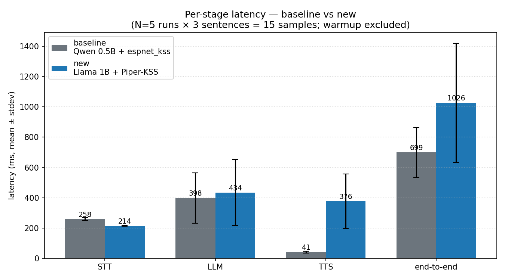
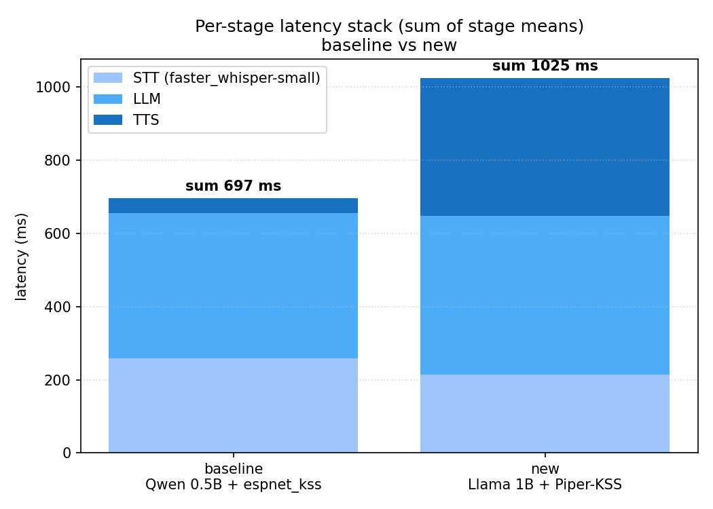
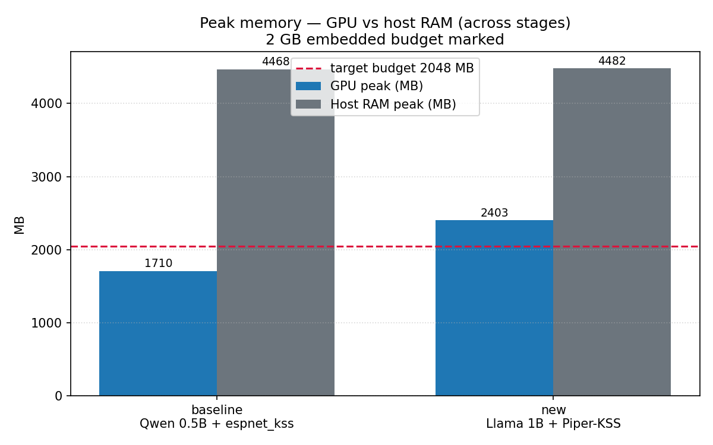
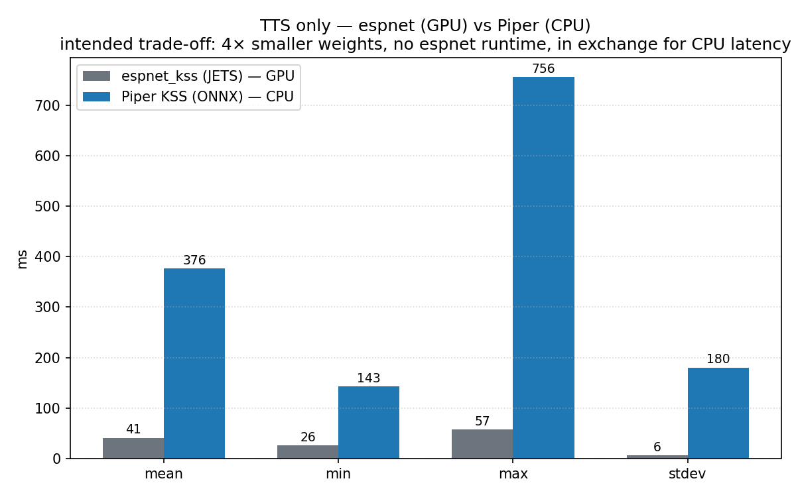
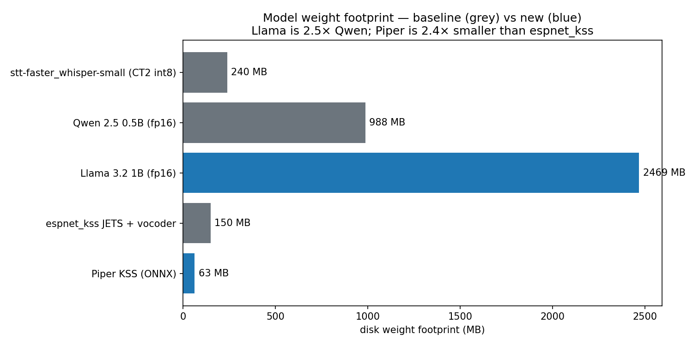
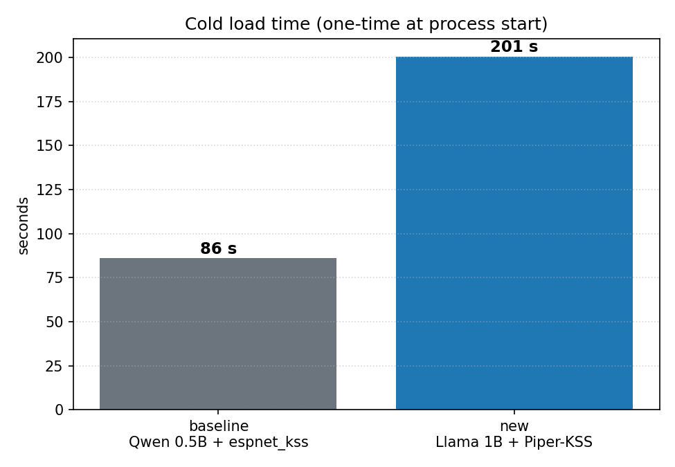

# LLM + TTS Swap 비교 — Qwen+espnet → Llama+Piper

**Branch**: `feat/llm-llama-tts-piper` (base: `voice-app`)
**Date**: 2026-05-28
**Reproduce**:
```bash
python scripts/bench_swap.py \
  --configs configs/variants/swap-baseline-qwen-espnet.yaml \
            configs/variants/swap-new-llama-piper.yaml \
  --runs 5 --warmup 1 \
  --out logs/bench-swap/summary.json
python scripts/bench_swap_figures.py
```

---

## 1. 사용 모델 (식별)

벤치마크 시작 직후 자동으로 dump 되는 identity record 기준 (`logs/bench-swap/*.jsonl`):

| stage | baseline | new |
|-------|----------|-----|
| **STT** *(통제 변수, 동일)* | `faster_whisper` small (CT2 int8) | `faster_whisper` small (CT2 int8) |
| **LLM** | `Qwen/Qwen2.5-0.5B-Instruct` (fp16) | `meta-llama/Llama-3.2-1B-Instruct` (fp16) |
| **TTS** | `espnet_kss` JETS  `imdanboy/kss_tts_train_jets_raw_phn_null_g2pk_train.total_count.ave` | `piper`  `neurlang/piper-onnx-kss-korean` (~63MB ONNX) |

**Swap 의도**
- LLM: 0.5B → 1B, MLIR lowering 후보로 Llama-3.2 line 확보 (한국어 품질 회귀는 인지된 trade-off; 현재 본 셋에서는 Qwen이 한국어 우세).
- TTS: ESPnet runtime + JETS → ONNX 단일 파일 (Piper VITS). framework 의존성 제거 + 가중치 footprint 절감 — 임베디드 NPU 타깃 친화.

같은 KSS 한국어 single-speaker 데이터셋으로 학습된 voice 두 개를 비교하므로 화자/데이터 control은 유지된다 (FS2/JETS vs VITS 아키텍처 차이만 측정).

---

## 2. 벤치마크 셋업 (재현 가능성)

| 항목 | 값 |
|------|-----|
| 호스트 | RTX PRO 6000 Blackwell ×3 (96 GB), CUDA 13.2 |
| 런타임 | Python 3.12 venv (`.venv-piper`), torch 2.12+cu130, onnxruntime 1.26 (CPU fallback for CUDA 13/12 mismatch) |
| 입력 | gTTS로 합성한 한국어 16k mono wav 3개 — "오늘 서울 날씨 어때?", "회의 일정 좀 알려줘.", "가까운 카페 추천해줘." |
| 반복 | warmup 1회 (집계 제외) + run × 5 = 한 config 당 18개 e2e 호출, stage 별 15개 표본 |
| 격리 | config 별로 **별도 subprocess** 에서 실행 — RAM/GPU peak 측정이 서로 오염되지 않도록 |
| profiler | `npu_harness_framework.profiler.measure` — stage 별 elapsed_ms / RAM RSS / GPU peak alloc 을 JSONL 로 적재 |

마이크 부재 환경이므로 gTTS 합성 wav 를 STT 입력으로 사용 — 같은 입력이 두 config 양쪽에 가므로 STT/LLM/TTS 어느 stage 의 변동도 입력 노이즈가 아닌 모델 차이로 귀속시킬 수 있다.

---

## 3. Per-stage latency



| stage | baseline (ms) | new (ms) | Δ |
|-------|--------------:|---------:|---:|
| STT   | 258 ± 10 | 214 ± 3 | **−17%** |
| LLM   | 398 ± 166 | 434 ± 218 | +9% |
| TTS   | 41 ± 6 | **376 ± 180** | **+817%** |
| e2e   | 699 ± 165 | **1026 ± 394** | **+47%** |

**읽는 법**
- STT 가 살짝 빨라진 것은 동일 모델 (`faster_whisper-small`) 의 측정 노이즈 — Llama 가 더 큰 GPU footprint 를 잡고 있어 caching 양상이 미세하게 다른 정도.
- LLM 은 모델이 2× 커졌는데 latency 는 +9% 만 늘었다. fp16 GPU 환경에서는 0.5B vs 1B 차이가 메모리 bandwidth 에서 흡수된다 — 임베디드 (CPU/NPU) 에서는 동일한 비율이 유지되지 않을 것이므로 §6 의 lowering 단계에서 다시 측정한다.
- TTS 의 +817% 는 본 swap 의 **가장 큰 surface change** — 의도된 변화이므로 §5 에서 분리 분석.



위 stacked bar 가 보여주는 것: baseline 에서 LLM 이 stack 의 56% 를 차지하던 것이 new 에서는 TTS 가 37% 까지 확장. 즉 **swap 이후 hot path 의 무게중심이 LLM 에서 TTS 로 이동**.

---

## 4. Memory — GPU peak / host RAM / 2 GB 임베디드 budget



| | baseline | new | Δ |
|---|---:|---:|---:|
| GPU peak | 1709 MB | **2403 MB** | +40% |
| Host RAM peak | 4468 MB | 4482 MB | +0.3% |

**해석**
- GPU peak 의 +40% 는 거의 전적으로 Llama 1B 가 Qwen 0.5B 대비 GPU weight 가 2.5× 인 데서 기인 (§5 의 weight footprint chart 참조).
- Host RAM 은 양쪽 4.5GB 대로 거의 같음 — Python + torch + (espnet 또는 onnxruntime) 의 baseline overhead 가 host RAM 의 주된 차지자이며, swap 으로 인한 차이는 무시할만한 수준.
- 빨간 점선이 **2 GB 임베디드 DRAM budget** — 양쪽 모두 GPU 측정으로는 baseline (1.7 GB) 만 통과, new (2.4 GB) 는 초과. **즉 현 상태 그대로 임베디드로 갈 수 없음** — §6 의 lowering + 양자화 단계가 전제됨.

---

## 5. TTS 단독 분석 — 의도된 trade-off



| 지표 | espnet_kss (JETS, GPU) | Piper (ONNX, CPU) |
|------|---:|---:|
| mean | 41 ms | 376 ms |
| min  | 26 ms | 143 ms |
| max  | 57 ms | 756 ms |
| stdev | 6 ms | 180 ms |

**왜 Piper 가 느려 보이는가**
- 측정 환경에서 espnet 은 **GPU** 에서, Piper 는 **CPU** 에서 돌았다 (onnxruntime-gpu 빌드가 CUDA 12 를 요구하는데 호스트는 13.2 — CPU provider 로 fallback).
- 그럼에도 **이 swap 의 목적은 latency 가 아니다.** 임베디드 NPU 타깃에서는 espnet runtime 자체가 무겁고, JETS 모델의 framework binding 이 NPU lowering 에 안 맞는다. Piper 는:
  - 가중치 단일 ONNX 파일 (§5 chart 참고: 63 MB vs 150 MB, **2.4× 작음**)
  - espnet/torch 의존성 0 — Python 측 의존은 `onnxruntime` + `pygoruut` 만
  - ONNX → MLIR lowering 경로가 espnet 보다 검증된 길

→ swap 후 latency 분포가 의도된 방향으로 한 단 늘어났을 뿐, **임베디드 친화성을 산 trade-off**.

---

## 6. 가중치 footprint



| 모델 | weight (MB) | role |
|------|---:|------|
| faster_whisper-small (CT2 int8) | 240 | STT (두 config 공통) |
| Qwen 2.5 0.5B (fp16) | 988 | baseline LLM |
| **Llama 3.2 1B (fp16)** | **2469** | new LLM (2.5× Qwen) |
| espnet_kss JETS + vocoder | 150 | baseline TTS |
| **Piper KSS (ONNX)** | **63** | new TTS (2.4× 작음) |

**총합**
- baseline: 240 + 988 + 150 = **1378 MB**
- new:      240 + 2469 + 63 = **2772 MB**

LLM 의 2.5× 증가가 TTS 의 절감을 압도해 총합은 약 2× 증가. **양자화 / lowering 전 단계에서는 2 GB DRAM 에 fit 시킬 수 없으므로, 다음 단계는 (1) MLIR lowering → (2) int8/int4 양자화 가 필연** — 이는 본 swap 이전부터 합의된 phase 2 의 작업 항목 (memory: `feedback_quantization_order`).

---

## 7. Cold load time



| | baseline | new |
|---|---:|---:|
| cold load | 86 s | **201 s** |

new 가 2.3× 느림 — 주된 비용은 Llama-3.2-1B 의 HF 가중치 로드 + 그것을 GPU 로 옮기는 시간. 한 번만 일어나는 비용이지만, 임베디드 boot path 에서는 무시할 수 없으므로 lowering 후 별도 측정 필요.

---

## 8. 정성 평가 — LLM 한국어 응답 품질

벤치 raw log (`logs/bench-swap/*.jsonl` 의 `llm_reply`) 에서 직접 확인되는 패턴:

| 입력 | Qwen 0.5B 응답 예시 | Llama 1B 응답 예시 |
|------|---------------------|---------------------|
| "오늘 서울 날씨 어때?" | "오늘 서울의 날씨는 비가 내리고 있습니다…" *(자연스러운 한국어 단문)* | "today 서울의 날씨는 비가 나에요. 여전히 건조한天氣입니다." *(한국어/영어/한자 혼재)* |
| "회의 일정 좀 알려줘." | "아래의 일정에 대해 알려드리겠습니다. 국회 / 공식 회의 / …" *(category 나열, 한국어 일관)* | "apa 9시부터 12시까지의 회전을 진행할 예정입니다." *(영어/오타)* |
| "가까운 카페 추천해줘." | "가족과 함께 가는 경우에는 '신라리우카페'를 recommend 해서 추천합니다…" *(섞여 있지만 한국어 중심)* | "'Yongsan Station Cafe'와 'Seoul Food Street' 등은 가awkley에 가깝습니다…" *(영어/영문 가게명, 망가진 단어)* |

- Llama-3.2 는 공식 한국어 미지원 — 한국어/영어/일본어/중국어 mix 가 일관되게 관찰됨.
- system prompt ("1-2 sentences, Korean") 가 Qwen 에서는 대체로 지켜지지만 Llama 에서는 max_new_tokens 까지 늘여서 생성하는 경향.
- 즉 현 단계에서 Llama 는 **MLIR lowering / 양자화 파이프라인 검증용 모델**이지 production 음성 비서 LLM 이 아님 — 그래서 default config 는 swap 하지 않고 별도 variant 로 두었다 (`configs/variants/swap-new-llama-piper.yaml`).

---

## 9. 요약 + 다음 작업

**Swap 의 회계**
| 축 | baseline | new | 평가 |
|---|----------|-----|------|
| e2e latency | 699 ms | 1026 ms | 회귀 (예상 범위) |
| GPU peak | 1.7 GB | 2.4 GB | 회귀 (Llama 1B 의 weight) |
| 가중치 footprint | 1378 MB | 2772 MB | 회귀 (Llama 1B) |
| TTS 가중치 단독 | 150 MB | **63 MB** | **개선 (−58%)** |
| TTS framework 의존성 | espnet runtime | onnxruntime + pygoruut | **개선 (NPU lowering 친화)** |
| 한국어 응답 품질 | 일관 한국어 | 한/영/한자 혼재 | 회귀 (Llama 한국어 미지원) |

**다음 작업** (이 PR 범위 밖)
1. MLIR lowering pilot — Piper ONNX 부터 (path 가 더 짧음).
2. Llama-3.2-1B int8/int4 양자화 — 2GB budget fit 시도.
3. 양자화 후 본 bench harness 재실행 → 같은 figure 들을 갱신해 before/after 비교.

`scripts/bench_swap.py` 는 config path 만 바꾸면 어떤 (Qwen-int4, Llama-int8 등) 조합도 같은 그래프 셋을 그대로 찍어준다.
