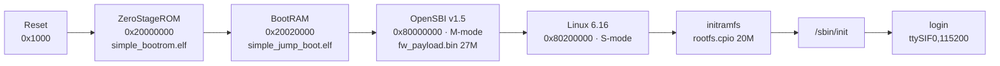

# Recipes — RISC-V64 Virtual Platform (Deliverable ③)

> CPU-only SoC Virtual Platform(Qbox = QEMU+SystemC) 위에 riscv64 네이티브 엔진을 올리고
> 호스트가 오케스트레이션하는 단계의 재현 recipe. riscv64 *컴파일* prep은 [RECIPES-kernels.md §5](kernels.md#5-vp0-prep--riscv64-vmfb-컴파일-가능-여부).
>
> 접속/레이아웃 구체값(IP·docker id)은 **로컬 메모리 `reference_vp_server4`**에 둔다(여기엔 비밀정보·구체 주소 미기재).
> 런타임 아키텍처(호스트 오케스트레이션 + 게스트 엔진, CPU=GGUF/NPU=vmfb 트랙)는 [§0.5](#05-런타임-아키텍처--호스트-오케스트레이션--vp-게스트-엔진), SoC 버스 width/메모리 맵은 [§8](#8-soc-스펙--버스-width--메모리-맵-ssl-soc-gen2-실측).
> Last verified: **2026-06-10** (ssl-soc-gen2 부팅 + 게스트 llama-cli 실행; SoC 스펙 소스 실측).

---

## 0. 원칙

- **엔진 고정 + 모델 볼륨 + 호스트 오케스트레이션**: riscv64 네이티브 엔진은 rootfs에 고정, 모델은 swap 가능한 볼륨(sdcard.img), 오케스트레이션(audio→STT→LLM→TTS)은 호스트 harness가 콘솔로.
- **빌드는 격리 docker(server5)** → 바이너리만 server4로. server4의 공유 컨테이너 기존 종속성을 **건드리지 않는다**(읽기·부팅 검증만).
- CPU-only · 합 ≤2GB · per-stage latency 기록.

---

## 0.5 런타임 아키텍처 — 호스트 오케스트레이션 + VP 게스트 엔진

harness는 **두 평면(plane)**으로 갈라진다. VP의 에뮬레이트된 riscv64 Linux엔 Python+torch를 못 올리므로(2GB·휠 부재·에뮬 속도), **프레임워크 코어(BaseStage/registry/pipeline/profiler)는 호스트에 남고**, 각 stage가 "VP 엔진 어댑터"가 된다(모델 swap 철학 유지).

```
[호스트 (server4, x86)]                          [VP 게스트 (riscv64 Linux, 2GB)]
 WebUI push-to-talk (실제 마이크)
   │ wav
 Python harness ─ BaseStage/registry ───┐
   ├ STT = vp_whisper 어댑터 ───────────┼─ 콘솔(제어) ─→ whisper.cpp (tiny INT8)
   ├ LLM = vp_llama 어댑터 ─────────────┼─ 콘솔(제어) ─→ llama-cli (Llama-3.2-1B Q8)
   ├ TTS = vp_tts 어댑터 ───────────────┼─ 콘솔(제어) ─→ TTS 엔진 (선정 후)
   └ profiler → per-stage latency JSONL └─ sdcard.img 볼륨(데이터: wav·모델·출력)
```

- **제어 평면 = 콘솔**: 호스트 harness가 stdin 주입(§3)으로 게스트 명령 실행·출력 파싱. YAML `type:` 한 줄 → 로컬 모델 ↔ VP 엔진 어댑터 전환(코어 불변).
- **데이터 평면 = 모델 볼륨**: 오디오·모델·출력 wav를 sdcard.img로 게스트에 노출. **모델 교체 = 볼륨 내용 교체**(엔진은 rootfs 고정).
- **CPU 트랙(지금) vs NPU 트랙(미래)**: VP는 CPU-only라 게스트 추론은 **GGUF/ggml + llama.cpp/whisper.cpp**로 돈다. 우리 IREE **vmfb(②)는 NPU 트랙** — IREE HAL→SSLNPU 인계 후 합쳐짐. 즉 "5번 서버 모델이 VP에 올라간다" = **양자화 GGUF/ggml 가중치 + riscv64 엔진**.
- **계측**: 호스트 profiler가 stage 단위 latency를 JSONL로, 게스트 RSS는 명령 wrapping으로 캡처(deliverable ③ 검증 조건: 합 ≤2GB · per-stage latency).
- **작업 위치**: 개발·git은 **server5(canonical)**. server4엔 **격리 워크스페이스 dir**(우리 소유)만 두고 배포 산출물 + 얇은 orchestrator를 둔다. 공유 컨테이너의 기존 repo(ssl-virtual-platform 등)에 **branch를 파지 않는다**(우리 repo는 거기 없고 git 신원·deps가 다름). 필요 시 우리 repo를 그 dir에 새로 clone.

---

## 1. 접속 (server4)

```bash
# tailscale 노드 [runtime-host], 포트22 키 인증. 비밀번호는 채팅/문서에 쓰지 않는다.
ssh -o BatchMode=yes -o ConnectTimeout=12 bohyun@<[runtime-host]>   # 구체 IP는 로컬 메모리
# 원격 출력 잡음(post-quantum/docker emulate)은 grep 필터:
#   ... | grep -v -E "post-quantum|store now|server may need|Emulate Docker|nodocker"
```

- 호스트: x86_64, **podman**(docker alias). passwordless sudo 아님 → root 작업은 사용자가.
- VP 워크스페이스: 공유 컨테이너 안 `/projects/ssl-npu/ssl-virtual-platform`.

---

## 2. VP 부팅 — `ssl-soc-gen2`
> 📊 부팅 체인 + 메모리 맵 그림: [../diagrams/vp-boot-chain.drawio](../diagrams/vp-boot-chain.drawio)

> **`ssl-soc-gen2`를 쓴다.** `ssl-soc-qbox`는 부팅 자산(`simple_jump_boot.elf`/`simple_bootrom.elf`/`fw_payload.bin`)이
> 미빌드라 abort한다. gen2는 자산이 prebuilt이고 **DDR3 2GB**다.

```bash
cd /projects/ssl-npu/ssl-virtual-platform
./build/platforms/platforms-vp --gs_luafile platforms/ssl-soc-gen2/conf_ssl-soc-gen2.lua
```

**부팅 체인(실측):**


(편집 소스: [../diagrams/vp-boot-chain.drawio](../diagrams/vp-boot-chain.drawio))
기대 출력: `Welcome to SSL-SoC Linux (RISC-V64)` → `ssl-soc login:`. (자동 로그인 또는 `root`)

---

## 3. 콘솔 자동화 (GUI 없음 → stdin 주입)

호스트 오케스트레이션(VP-D)의 토대. 로그인 후 명령 실행 → 출력 회수:

```bash
{ sleep 150; printf "root\n"; sleep 10; \
  printf "<command>; echo EXIT=\$?\n"; sleep 30; } \
| timeout 220 ./build/platforms/platforms-vp \
    --gs_luafile platforms/ssl-soc-gen2/conf_ssl-soc-gen2.lua
```

**검증(실측):** `llama-cli --version` → `version: 1 (0dedb9e)`, **EXIT=0**.
rootfs.cpio(20M)에 `usr/bin/llama-cli` 이미 포함.

---

## 4. riscv64 엔진 크로스컴파일 (격리 docker, server5)

```bash
# llama.cpp — riscv64 (rv64gc, hard-float lp64d), static
cmake -B build-rv64 \
  -DCMAKE_C_COMPILER=riscv64-linux-gnu-gcc \
  -DCMAKE_CXX_COMPILER=riscv64-linux-gnu-g++ \
  -DCMAKE_C_FLAGS="-march=rv64gc -mabi=lp64d" \
  -DCMAKE_CXX_FLAGS="-march=rv64gc -mabi=lp64d" \
  -DGGML_RV_ZICBOP=OFF -DGGML_RV_ZFH=OFF -DGGML_RV_ZIHINTPAUSE=OFF \
  -DGGML_NATIVE=OFF -DBUILD_SHARED_LIBS=OFF
cmake --build build-rv64 -j   # → llama-cli ~8.3MB (static)
```

- IREE 런타임 riscv64도 같은 triple로 크로스빌드(호스트엔 x86 런타임만 빌드돼 있음).
- 빌드 산출 바이너리만 server4로 복사 → rootfs/볼륨에 배치.

---

## 5. 배포 — 엔진은 rootfs, 모델은 볼륨

| 구성요소 | 위치 | 이유 |
|---|---|---|
| riscv64 엔진(llama.cpp/whisper.cpp) | `rootfs.cpio`에 고정 | 자주 안 바뀜 |
| 모델(.gguf) | swap 가능한 `sdcard.img`/블록 디바이스 | **주기적으로 lowering·경량 모델로 교체** |
| 오케스트레이션 | 호스트 harness(콘솔) | Python+torch는 에뮬 riscv64에서 못 돎 → 네이티브 엔진 + 호스트 제어 |

---

## 6. 마일스톤 + 남은 갭

| 단계 | 상태 |
|---|---|
| **VP-0** 부팅 + 셸 + `llama-cli --version` EXIT=0 | ✅ (2026-06-10) |
| **VP-A** 실제 토큰 생성 | ✅ (2026-06-15) Qwen2.5-0.5B Q8 → `"...is Paris."` `GEN_EXIT=0` |
| **VP-B** whisper.cpp(STT) | ✅ (2026-06-15) ggml-tiny-q8 + jfk.wav → 정확 전사, `STT_EXIT=0`, encode 112s(1스레드) |
| **VP-C** TTS (음성출력) | ✅ (2026-06-16) **하이브리드** — 칩 neural TTS 불가(2GB·riscv64 torch 없음·볼륨 없음) → **호스트 MeloTTS(KR)** 로 전환. WS 1턴 9.96s 실음성(peak 0.73) |
| **VP-D** 풀 음성 루프(WebUI 푸시톡) | ✅ (2026-06-16) 브라우저 동등 WS → **칩** STT+LLM → **호스트** TTS → 음성 반환 |

**VP-A 달성 경로(2026-06-15, 실측).** 콘솔 dump: [`../../logs/vp/2026-06-15-vp-a-first-token.log`](../../logs/vp/2026-06-15-vp-a-first-token.log).

1. **모델**: Qwen2.5-0.5B-Instruct를 **VP 자신의 llama.cpp(commit `0dedb9e`) 변환기**로 q8_0(506MB) 생성.
   ⚠ **producer==consumer 필수**: server5의 신버전(`1e1aca0`) 변환기로 만든 gguf는 VP의 구버전 reader가 `gguf.cpp:143 GGML_ASSERT(!key.empty())`로 abort. VP 트리의 `convert_hf_to_gguf.py` + `gguf-py`를 그대로 써서 변환.
2. **20MB initramfs window 해소(핵심)**: rootfs에 모델을 concat(`cat rootfs.cpio model.cpio`)해도 DTB `/chosen`의 `linux,initrd-end = 0x84400000`(=정확히 20MB)가 fw_payload에 임베드돼 있어 모델이 잘림 → 매직만 정상, 메타데이터에서 빈 key assert.
   - **메모리 오버라이드(패치 DTB를 0x82200000에 load)는 실패** — OpenSBI가 자기 FDT를 런타임에 재배치.
   - **해결 = fw_payload 재빌드**: DTB의 initrd-end를 `0xb0000000`(720MB 창)으로 패치 → `build-opensbi.sh`의 make로 fw_payload 재빌드(`FW_FDT_PATH=패치DTB`). `Freeing initrd memory: 20480K → 737280K`.
3. **호출**: VP의 `llama-cli`는 채팅 전용(`-no-cnv` 거부) → 단발은 `llama-cli -m … -p "…" -st -n 16 --simple-io`(single-turn). 콘솔 자동화는 blind sleep 대신 **로그 watcher**(login:/shell 프롬프트 대기 후 주입)로 느린 551MB 언팩에도 안정.

산출물(전부 server4 `platforms/ssl-soc-gen2/`, 우리 소유 신규 파일·원본 미변경):
`rootfs-vpa.cpio`(551MB, busybox+모델 concat) · `ssl-soc-gen2-vpa.dtb`(initrd 720MB) · `fw_payload-vpa.bin` · `conf_ssl-soc-gen2-vpa.lua`.

```bash
# 재현: server4 컨테이너 안에서
podman exec -d ssl-npu-dev bash /projects/ssl-npu/vpa_boot5.sh   # watcher-pipe 드라이버
# → 게스트 콘솔: "The capital of France is Paris."  GEN_EXIT=0
```

**다음(실모델·풀 파이프라인):** 1.3GB Llama Q8은 initramfs(=RAM 2×)엔 부담 → **모델 볼륨**(sdcard.img, mmc-spi). initrd 창 확장 기법은 중형 모델 bake엔 재사용 가능.

**VP-B 달성 경로(2026-06-15, 실측).** 콘솔 dump: [`../../logs/vp/2026-06-15-vp-b-stt.log`](../../logs/vp/2026-06-15-vp-b-stt.log). whisper.cpp(commit `84bd03a`)를 **server4 gcc 11.4.0으로 riscv64 크로스컴파일** → `whisper-cli`(2MB, dynamic) + `ggml-tiny-q8_0.bin`(43MB) + `jfk.wav`를 rootfs에 concat(`rootfs-vpb.cpio` 66MB, fw_payload-vpa.bin 720MB 창 재사용). 게스트: `whisper-cli -m … -f /opt/audio/jfk.wav -nt` → `"And so my fellow Americans …"` `STT_EXIT=0`.

⚠ **신버전 ggml RVV 크로스컴파일 함정**: ggml은 riscv64에서 `-march`를 **자기가 만들어 덧붙임**(내 `CMAKE_C_FLAGS`의 -march를 덮음). 기본 ON인 `GGML_RVV`(벡터)·`GGML_RV_ZFH`·`GGML_RV_ZVFH`·`GGML_RV_ZICBOP`·`GGML_RV_ZIHINTPAUSE`가 `rv64gc`에 `v/_zvfh/_zicbop/_zihintpause`를 붙여 **binutils 2022(gcc 11.4.0)가 모르는 ISA**를 만들고 abort(`unknown prefixed ISA extension`, RVV 인트린식 `vint8mf2_t` 미정의). → **전부 OFF**:
```bash
cmake -B build-rv64 -DCMAKE_SYSTEM_NAME=Linux -DCMAKE_SYSTEM_PROCESSOR=riscv64 \
  -DCMAKE_C_COMPILER=riscv64-linux-gnu-gcc -DCMAKE_CXX_COMPILER=riscv64-linux-gnu-g++ \
  -DGGML_NATIVE=OFF -DBUILD_SHARED_LIBS=OFF \
  -DGGML_RVV=OFF -DGGML_RV_ZFH=OFF -DGGML_RV_ZVFH=OFF -DGGML_RV_ZICBOP=OFF -DGGML_RV_ZIHINTPAUSE=OFF
cmake --build build-rv64 --target whisper-cli -j   # → -march=rv64gc, dynamic libs 전부 rootfs에 존재
```
(VP-A llama.cpp `0dedb9e`(4월)엔 이 RVV quants 코드가 없어 안 걸렸음. dynamic deps libc/libgcc_s/libgomp/libm/libstdc++는 rootfs `lib/`에 모두 존재.)

**VP-C 보류 사유(2026-06-15).** llama-tts(OuteTTS-0.2-500M Q8 512MB + WavTokenizer F16 124MB)를 riscv64로 빌드(whisper와 동일, libatomic 추가 dep도 rootfs에 존재)하고 x86에서 정상 wav 생성. 그러나 칩에서 추론 중 **결정적 SIGBUS(BUS_ADRERR, flw 로드)** — `-c 2048`·`-b 512 -ub 128`로 compute 버퍼를 841→607MiB로 줄여 여유 600MB가 생겨도 **같은 코드 오프셋(+0x581000)에서 반복** → 단순 OOM 아님. 두 모델 동시 상주(636MB tmpfs) + tmpfs mmap 압박이 의심. VP-A/B는 단일 모델이라 같은 mmap-from-tmpfs로 동작. **해결 방향 = 모델 볼륨(sdcard.img)** 으로 모델을 tmpfs 밖으로(회수 가능 page cache) → 재개. (`--no-warmup`은 llama-tts 미지원 인자.)

**VP-D STT→LLM 달성(2026-06-15, 부분).** 콘솔 dump: [`../../logs/vp/2026-06-15-vp-d-stt-llm.log`](../../logs/vp/2026-06-15-vp-d-stt-llm.log). rootfs-vpd(whisper-cli + 베이스 llama-cli + ggml-tiny-q8 + qwen-q8-vp + jfk.wav, 570MB)에서 **호스트가 STT→LLM 1턴 구동**: `whisper-cli`(jfk.wav)→ `"And so my fellow Americans …"` → 그 텍스트를 `llama-cli`(qwen) 프롬프트로 체이닝 → LLM 응답 생성, `PIPE_RC=0`. STT·LLM은 **순차 실행**이라 peak 954MB(=VP-A), 2GB 안전(llama-tts의 2모델 동시와 대조). 데이터 전달은 게스트 셸 변수(host-driven). 풀 VP-D(WebUI 푸시톡)의 남은 갭은 §6.1에서 모두 해소.

### 6.1 볼륨 불가 발견 + 풀 음성 루프 달성 (2026-06-16, 실측)

**⚠ 모델/데이터 볼륨 불가 (§0.5·§5의 "볼륨" 전제 폐기).** 이 VP엔 **블록디바이스/NIC/virtio가 없다**(lua상 SPI는 stub → mmc-spi 초기화 실패, spi_flash는 gs_memory). 따라서 sdcard.img 모델 볼륨은 불가능하고, 호스트↔게스트 통로는 **부트로더(boot-time) + 시리얼 콘솔(runtime)** 뿐이다. → VP-A/B/C/D의 "볼륨으로 재개" 계획을 **콘솔 전송 + 호스트 하이브리드**로 대체.

- **동적 오디오-IN = 콘솔 base64** (볼륨 대체): 매 턴 브라우저 wav를 heredoc 스트리밍 `base64 -d > /tmp/in.wav` + **`stty -echo`** 로 게스트에 주입(처음 fork-per-line 방식은 UART RX 오버플로로 99% 드롭 → md5 무손실로 수정, 38516B).
- **VP-C 해소 = 호스트 TTS 하이브리드**: 칩은 neural TTS 불가(2GB RAM·riscv64 torch 부재·볼륨 부재로 OuteTTS는 2모델 tmpfs SIGBUS). → TTS를 **호스트(server4)** 로. `tts_server.py`(host py3.11 venv `tts-venv`, **MeloTTS 한국어**, 모델 1회 로드, `0.0.0.0:8770`). web_demo(컨테이너)는 `host.containers.internal:8770`으로 reply 텍스트 POST → 44.1kHz wav 회수. STT+LLM은 그대로 **칩**에서.
- **지속 VP 콘솔 드라이버** `vp_console.sh`(server4): `start`(FIFO stdin + sleep-holder로 EOF 방지, login, `stty -echo`) | `run <cmd>`(marker `MK…_END_` 로 출력 회수, 마커 앞 텍스트 보존 — whisper `-nt`는 trailing newline 없음) | `audio <b64>` | `stop`. `podman exec -d` 로 모든 exec 호출에 걸쳐 생존.
- **어댑터**(speech repo): `vp.py`의 `vp_whisper`/`vp_llama`(칩) + **`host_melotts`**(호스트 HTTP, stdlib urllib만 — web_demo 경량 venv에 의존성 추가 없음) + `configs/vp.yaml`(`tts: host_melotts`).

**풀 음성 루프 (WS 1턴, 실측):** dump [`../../logs/vp/2026-06-16-webui-full-voice-loop.md`](../../logs/vp/2026-06-16-webui-full-voice-loop.md).
```
브라우저 동등 WS → 칩 whisper STT → 칩 qwen LLM → 호스트 MeloTTS → 음성 반환
USER_TEXT="Lemme what?"   REPLY="Sure, I'll do my best..."   TTS_AUDIO=9.96s sr=44100 peak=0.730
```

**접속(데모 사용):** 영구부=컨테이너 web_demo(`:8000`) + 지속 VP(VP_READY)는 상시. 세션부=TTS 서버 + 호스트 브리지는 사용자 ssh 세션에서 `run_demo.sh`가 기동(컨테이너 rootless slirp4netns라 포트 미게시 + 호스트 유저 프로세스가 세션종속 → linger 미사용):
```bash
# 내 PC에서 (쓰는 동안 터미널 유지). :8800 터널 + 호스트 TTS/브리지 기동
ssh -t -L 8800:localhost:8800 bohyun@<[runtime-host]> /home/bohyun/run_demo.sh
# → 브라우저: http://localhost:8800  (마이크 허용 → 푸시톡; 1턴 ≈ 오디오 26s + whisper 112s + llama 30s + TTS ~3s)
```

### 6.2 STT 한국어 수정 + 온칩 LLM 확장 시도 전 과정 (2026-06-16)

브라우저에서 한국어가 영어로 받아써지고("안녕"→"No"), LLM을 Llama-3.2-1B로 키우려다 2GB 부팅 벽에 막힌 전 과정의 실측 기록.

**(a) STT 한국어 = `-l ko` 한 줄.** 증상: "안녕"→"No", "카이스트 알려줘"→"Caste". 원인: `whisper-cli`에 언어 플래그 없어 auto-detect가 짧은 한국어를 영어로 오인. 칩 실측으로 확정 — 동일 클립에 `-l ko` 주니 "카이스트 알려줘"→**"칼스트 알려줘"**(영어 오인 사라짐, "카이스트→칼스트"는 tiny 정확도 한계). `vp_whisper`에 `language`(기본 `ko`)+`-l {lang}` 추가. 풀턴 검증: USER_TEXT 한국어 + 한국어 응답 + MeloTTS 한국어 음성. (speech 브랜치)

**(b) LLM qwen-0.5B → Llama-3.2-1B 시도 → Q2_K만 부팅 → 한국어 깨짐 → 기각.** 전 과정:
1. **양자화 도구(x86 llama-quantize) 빌드.** server4엔 riscv 빌드만(x86 없음)+qemu-user 없음. 로컬 빌드는 commit `1e1aca0`(VP는 `0dedb9e`)이라 **producer==consumer 위반**(VP-A의 `gguf.cpp:143` 재현). → **컨테이너에서 0dedb9e 트리로 `cmake --build build-x86 --target llama-quantize`**(빌드는 격리 원칙이나 사용자 승인). 기존 Q8 gguf는 0dedb9e로 **정상 로드됨**(read 호환 OK).
2. **양자화 사다리(Q8→Q4/Q3/Q2).** `llama-quantize --allow-requantize`(q8_0 재양자화는 기본 차단). 1.24B·128k vocab이라 embed가 커서 크기 큼: Q4_K_M **762MiB**, Q3_K_M 651MiB, Q3_K_S 604MiB, Q2_K **546MiB**.
3. **rootfs bake.** 베이스 `rootfs.cpio`(20MB, busybox+llama-cli+libs) 추출 → `usr/bin/whisper-cli` + `opt/models/{ggml-tiny-q8, llama-1b.gguf}` 오버레이 → `find . | cpio -H newc -o`. (비모델 부피 ~63MB → rootfs = model + 63MB.)
4. **부팅 천장 발견(핵심).** rootfs별 부팅 실측 — **833MB(Q4)·722MB(Q3_K_M)·675MB(Q3_K_S) 전부 `Initramfs unpacking failed: write error` → Kernel panic**, **617MB(Q2_K)만 성공**. 커널 `Memory: 1274412K/2097152K available`(reserved 818MB=initrd창+커널). 패턴이 **"unpack 시 cpio+ramfs 동시 상주 ~2×"** 와 일치(617×2≈1234<available, 675×2≈1350>available) → **2GB 천장 ≈ rootfs 620MB**.
5. **DTB initrd 창은 역효과.** `linux,initrd-end`를 dtc로 720MB→0xb8000000(848MB)→0xc0000000(1GB) 패치 후 `make ... FW_FDT_PATH=패치DTB`로 fw_payload 재빌드 — 그러나 창은 *예약*이라 키울수록 unpack용 available RAM이 줄어 **더 빨리 실패**. 결국 Q2(617MB)는 기존 720MB 창(`fw_payload-vpa`)에 그대로 들어가 재빌드 불필요.
6. **Q2_K 부팅·생성 성공 + 메모리 실측.** "The capital of France is **Paris.**" GEN_RC=0. 메모리 breakdown 960MB(model 546+context 152+compute 262), available 1.3GB → **런타임은 안전**(천장은 부팅 전용).
7. **한국어 품질 = 기각.** "안녕하세요. 카이스트에 대해 알려주세요." → "카이스트는 종합적으로, 유산적으로 … **부stant화**합니다 … "쪊니다"" — **문법만 한국어, 의미는 횡설수설+깨진 토큰**. Q2_K가 1B을 망가뜨림. 게다가 **0.2 t/s**(qwen ~1 t/s). ⇒ **2GB에선 "작은 모델+Q8"(qwen-0.5B-Q8)이 "큰 모델+극단양자화"보다 우월** → qwen 유지.

**미해결 과제(2GB에 큰 모델 올리기).** 부팅 2× 벽 우회가 필요: 압축 initrd(고엔트로피 gguf엔 무효) / **in-place·no-copy initrd 또는 native `-initrd` 적재**(커널이 cpio를 복사하지 않게) / 블록디바이스(이 VP엔 없음). 콘솔로 큰 모델 적재도 비현실(속도). 산출물 보존: `L-q2k.gguf`, `rootfs-vpe.cpio`, `vpe_boot*.sh`, `llama.cpp/build-x86`(0dedb9e quantize).

---

## 7. gotcha

| 증상 | 원인 | 해결 |
|---|---|---|
| `cannot open elf file simple_jump_boot.elf` | `ssl-soc-qbox`는 부팅 자산 미빌드 | **`ssl-soc-gen2`** 사용 |
| 포트 40022 연결 안 됨 | tailscale 인터페이스에서 방화벽 차단 | 포트 22 + 키 인증 |
| llama-cli 실행되나 토큰 생성 0 | 게스트에 runnable 모델 없음 | 작은 GGUF / 모델 볼륨(§6) |
| `gguf.cpp:143 GGML_ASSERT(!key.empty())` abort | gguf 생성기 commit ≠ VP llama.cpp commit (메타데이터 불일치) | **VP 트리(`0dedb9e`)의 convert로 gguf 생성** (producer==consumer) |
| gguf 매직은 정상인데 로드 abort + `free`에 모델 안 보임 | initramfs 20MB cap에서 모델 **truncated** | DTB `initrd-end` 확장 후 **fw_payload 재빌드**(§6) |
| `--no-conversation is not supported by llama-cli` | 신빌드는 llama-cli=채팅 전용 | `-st`(single-turn) 단발 호출, 또는 `llama-completion` |
| 큰 initramfs인데 로그인 주입 타이밍 깨짐 | 551MB 언팩이 느려 blind sleep 빗나감 | 로그 watcher로 `login:`/shell 프롬프트 대기 후 주입 |
| riscv64 빌드 `unknown prefixed ISA extension 'zicbop'/'zvfh'` 또는 `vint8mf2_t` 미정의 | 신ggml이 `rv64gc`에 RVV/zicbop/zihintpause 자동 추가, binutils 2022 미지원 | `GGML_RVV/RV_ZFH/RV_ZVFH/RV_ZICBOP/RV_ZIHINTPAUSE=OFF` (VP-B 노트) |
| 폴링이 생성/전사 완료를 조기 감지 | 주입한 명령 문자열의 `===GEN_END===`가 콘솔에 echo돼 grep 매칭 | 실제 출력 패턴(`GEN_EXIT=[0-9]`/`STT_EXIT=[0-9]`)으로 grep |
| 이전 boot의 VP가 안 죽고 CPU 경쟁 | `timeout`이 길어(예 3000s) stdin EOF 후에도 시뮬 지속 | 다음 boot 전 `pkill -9 -f "[p]latforms-vp"`(self-kill 회피 `[p]` 트릭) |
| llama-tts 칩에서 SIGBUS(BUS_ADRERR, flw) | 두 모델 동시 + 636MB tmpfs mmap 압박(메모리 줄여도 같은 오프셋 반복) | 모델을 **볼륨(sdcard.img)** 으로 tmpfs 밖에; `-c/-b/-ub` 축소는 불충분 |
| llama 기본 batch=8192 → compute 버퍼 폭증 | `-b/-ub` 미지정 시 거대 그래프 버퍼 | TTS/짧은 프롬프트는 `-b 512 -ub 128` 등으로 축소 |
| 2모델 동시 vs 순차 | llama-tts는 STT/LLM과 달리 2모델 동시 상주 → 2GB 초과 | STT→LLM은 순차라 안전(peak=단일 모델); TTS만 볼륨 필요 |
| 공유 컨테이너 deps 깨짐 우려 | server4 컨테이너는 기존 작업과 공유 | 빌드는 server5 격리 docker, server4는 읽기·부팅만 |
| sdcard.img 모델/데이터 볼륨이 안 붙음 | 이 VP엔 블록디바이스/NIC/virtio 없음(SPI는 stub) | 볼륨 포기 → 호스트↔게스트는 **부트로더 + 시리얼 콘솔**만; 오디오-IN=콘솔 base64, TTS=호스트(§6.1) |
| 콘솔로 base64 오디오 넣으면 ~99% 드롭/깨짐 | tty echo + fork-per-line이 UART RX 오버플로 | **`stty -echo`** + heredoc 스트리밍 `base64 -d > /tmp/in.wav`(페이싱) → md5 무손실 |
| neural TTS(OuteTTS) 칩에서 SIGBUS, torch 없음 | 칩 2GB·riscv64 torch 부재·볼륨 부재 | TTS를 **호스트 venv**(MeloTTS KR, `tts_server.py:8770`)로; web_demo가 `host.containers.internal`로 POST(§6.1) |
| whisper가 한국어를 영어로 받아씀("안녕"→"No", "카이스트"→"Caste") | `whisper-cli`에 언어 플래그 없으면 auto-detect가 짧은 한국어 오인 | **`-l ko` 강제**(`vp_whisper` 기본 ko). tiny 정확도 한계는 별개("카이스트"→"칼스트") |
| 큰 rootfs 부팅 `Initramfs unpacking failed: write error` → panic | 2GB 칩 부팅 천장 = **rootfs ~620MB**(언팩 시 cpio+ramfs 동시 + 커널, available ~1.26GB에서 ~640MB free 필요) | 모델/rootfs를 ≤~620MB로. initrd 창은 cpio 직상단으로(너무 크면 가용RAM↓ 역효과) |
| 큰 모델 우겨넣어도 품질↓ | Llama-3.2-1B는 Q2_K(554MB)만 fit → 한국어 깨진 횡설수설, 0.2 t/s | 2GB 온칩 LLM = **작은 모델+Q8**(qwen-0.5B-Q8) > 큰 모델+극단양자화. 한국어↑는 ≤534MB 한국어특화 소형모델로 |

---

## 8. SoC 스펙 — 버스 width / 메모리 맵 (ssl-soc-gen2, 실측)

GreenSocs/Qbox **TLM-2.0** 모델. interconnect는 generic `router`이고 패브릭 폭은 단일 매크로 `DEFAULT_TLM_BUSWIDTH`로 통일된다(per-소켓 C++ 정의).

| 블록 | 버스 width | 근거(소스) |
|---|---|---|
| 패브릭 기본 | **32-bit** | `DEFAULT_TLM_BUSWIDTH = 32` — `systemc-components/common/include/tlm_sockets_buswidth.h:11` (override·CMake 없음) |
| **MC / DRAM (DDR3)** | **32-bit** | `gs_memory<BUSWIDTH=DEFAULT>` + `multi_passthrough_target_socket<…,BUSWIDTH>` — `systemc-components/gs_memory/include/gs_memory.h:54,414` |
| **RV (cpu_riscv64)** | **32-bit** | QEMU RV64 코어(아키텍처 64-bit), TLM 메모리 소켓은 패브릭 기본(별도 override 없음) |
| **NPU (ssl-npu / axi_noc_ctrlr)** | **64-bit AXI** (flit 34-bit) | `simple_target_socket<axi_noc_ctrlr, 8> port0/1_axi` 주석 "64-bit AXI data bus" — `systemc-components/ssl-npu/axi_noc_ctrlr/include/axi_noc_ctrlr.h:14-16`; NoC flit `sc_uint<34>`(19/23) |

- NPU **64-bit AXI ↔ 32-bit 패브릭**은 `tlm_bus_width_bridges<INPUT, OUTPUT>`로 변환(이 컴포넌트의 존재 이유).
- ⚠ TLM-2.0 소켓 `BUSWIDTH`는 관례상 **비트** 단위인데 ssl-npu AXI 소켓은 리터럴 `8`(주석은 8바이트=64-bit)을 넘긴다 → 단위 표기 일관성은 작성자 확인 권장(gs_memory 등은 `32`를 32-bit로 사용).

**메모리 맵(주요, conf_ssl-soc-gen2.lua / device-tree):**

| 영역 | 주소 | 크기 |
|---|---|---|
| Reset vector | 0x00001000 | — |
| CLINT | 0x02000000 | 16KB |
| L2 cache ctrl | 0x02010000 | (캐시라인 64B) |
| PLIC | 0x0C000000 | 64MB |
| SPI/GPIO/UART0 | 0x10010000~0x10013000 | 각 4KB |
| BootROM (ZeroStage) | 0x20000000 | 4KB |
| BootRAM / SRAM | 0x20020000 | 256KB |
| CDMA regs | 0xAF005000 | 4KB |
| **DDR3 메인** | **0x80000000** | **2GB** |

로더: `fw_payload.bin → 0x80000000`, `rootfs.cpio → 0x83000000`, BOOTADDR_REG(0x4000) → BootRAM(0x20020000).
