# My Note — Transformer vs KV Cache, 무엇을 빼고 무엇을 남기는가

> 본인 학습용 메모. 2026-05-28 의 검증 결과를 *내가 다음에 까먹지 않게* 정리.

---

## TL;DR — 결국 내 기억이 맞았다

> **"amdsharktank 의 *transformer 정의* 는 안 쓰고 (제거), *KV cache* 는 남긴다"** — 장기 목표 기준 맞음.
> 단 *현재 Step 5 코드* 는 단순화를 위해 KV cache 까지 일시 제거된 상태. 통합 시점에 다시 추가될 예정.

---

## 1. 헷갈렸던 이유 — paging vs KV cache 의 구분

amdsharktank 의 `PagedKVCache` / `PagedMHAttention` 안에는 **두 개념이 묶여** 있다:

| 개념 | 무엇 | NPU 에 적합? |
|---|---|:---:|
| **paging** | vLLM-style 동적 페이지 할당 (가변 길이 sequence 의 메모리 관리) | ❌ 임베디드 NPU 의 통합 SRAM/DRAM 모델과 충돌 |
| **KV cache** (개념) | 이전 step 의 K, V 를 저장 → 다음 step 에서 재계산 안 함 | ✅ NPU 에서도 유용 (LLM 추론의 핵심) |

분석 문서 (`docs/SHARK_AI_ANALYSIS.md` §2.1) 의 정확한 표현:

> `PagedMHAttention(PagedAttention)`: **paging 자체 제거 → 표준 SDPA**
> `PagedGQAttention(PagedMHAttention)`: **GQA 자체는 유용, paging 만 제거**

→ 즉 *paging* 만 빼고 *KV cache 개념* 자체는 NPU 친화 형식으로 가져갈 수 있다.

내가 처음 들었던 "transformer 안 쓰고 KV cache 만 남긴다" 는 *이 §2.1 의 분리 시각* 을 한 줄로 요약한 표현 — **개념적으로 맞는 말**.

---

## 2. 그런데 현재 코드에는 KV cache 가 0건이다 — 왜?

`src/torch_mlir_zoo/models/llama_on_device.py` 의 첫 줄 docstring:

```python
"""On-device PyTorch-only Llama (forward-only, no KV cache, no sampling)."""
```

이건 영구 결정이 아니라 **Step 5 단계의 의도된 단순화**:

- Step 5 의 목표 = "MLIR + .vmfb 까지 떨어뜨려서 export 경로가 작동함을 입증"
- KV cache 까지 넣으면 *동적 상태 관리* + *prefill/decode 분리* 가 필요 → MLIR 그래프 복잡 + export 시점 위험 증가
- 그래서 *일단* forward-only 로 단순화 → `server_side_op_hits = ∅` 빠르게 달성 → 작동 확인
- §2.4 의 표현: *"**본 PR 의 forward-only scope**"* — 즉 *이 PR 범위에 한정* 된 단순화

문서 §3 의 매핑 표도 명시:
> `PagedMHAttention` / `PagedGQAttention` (paging) → `ops/attention.py::ScaledDotProductAttention` (**no paging, no KV-cache**) — **Step 4 (commit #2)**

→ "no KV-cache" 표현은 *Step 4 의 단위 op* 와 *Step 5 의 모델 통합* 시점의 *scope 한정* 진술이지, 장기 목표 X.

---

## 3. 시간축으로 정리 — KV cache 는 언제 있고 언제 없나

```mermaid
gantt
    title KV cache 의 시간축
    dateFormat X
    axisFormat %s

    section amdsharktank (서버, 참조 only)
    paged KV cache (vLLM-style) : 0, 100

    section 현재 Step 5 (본 PR)
    KV cache 일시 제거 — forward-only : crit, s5, 100, 150

    section Step 6 (다음 turn)
    여전히 KV cache 0 — 양자화 우선 : s6, 150, 250

    section NPU runtime 통합 (다른 연구원과)
    NPU 친화 KV cache 재도입 : milestone, m1, 250, 0
    static-shape ring buffer 등 : npu, 250, 400

    section 최종 (NPU 위 LLM)
    KV cache 가 매 token 호출 : final, 400, 500
```



| 시점 | KV cache | 이유 / 형태 |
|---|:---:|---|
| amdsharktank (서버) | ✅ paged | vLLM-style, 동적 페이지 |
| 분석 문서 §2.1 결론 | "paging 만 제거, 개념 유지" | NPU 친화 형식으로 재구성 가능 |
| **현재 Step 5 (본 PR)** | ❌ 일시 제거 | export 단순화 — re-compute every step |
| Step 6 (Q8_0 / Whisper) | ❌ 여전히 0 | 양자화 우선, KV cache 는 나중 |
| **NPU runtime 통합 시점** | 📋 재도입 예정 | static-shape ring buffer, paged X |
| **최종 NPU 위 LLM** | ✅ 필수 | LLM 효율 추론 = KV cache 가 핵심 |

---

## 4. 두 layer 의 책임 분담 (왜 IREE 연구원과 얘기가 KV cache 로 갔는가)

```
┌──────────────────────────────────────────────────────────┐
│  layer 1 — 우리 (PyTorch model + export 도구)              │
│  ─────────────────────────────────────────                │
│  • 자체 LlamaOnDevice (transformer 정의 — amdsharktank X)  │
│  • 자체 attention/RMSNorm/MLP/TopK                         │
│  • iree.turbine.aot.export 만 차용 (export 도구)            │
│  • Step 5 까지 KV cache 0 (의도된 단순화)                   │
│  • 📋 향후 NPU 친화 KV cache 인터페이스 추가 (다른 연구원과 조율) │
└──────────────────────────────────────────────────────────┘
                          ↓ .mlir / .vmfb
┌──────────────────────────────────────────────────────────┐
│  layer 2 — 다른 연구원 (IREE compiler / runtime / NPU)     │
│  ─────────────────────────────────────────                │
│  • IREE Compiler (MLIR → NPU machine code)                 │
│  • IREE Runtime (KV cache 관리, paging 없는 형태)           │
│  • target NPU chip 위 실제 token-by-token 추론              │
│  • 그쪽 layer 가 KV cache 를 *필요로 함* → 우리에게 요청      │
└──────────────────────────────────────────────────────────┘
```

내 기억의 출처는 layer 2 (IREE 연구원) — *"우리 runtime 에 KV cache 인터페이스가 필요하니, 너희 (PyTorch model 단) 에서 그걸 *유지* 해 달라"* 라는 메시지. 그게 *"transformer 정의 제거하고 KV cache 만 남긴다"* 로 요약된 듯.

→ **layer 1 의 현재 코드** 는 그 요청을 *아직* 반영하지 않은 상태. *Step 5 까지의 export 경로 검증* 이 우선이라 단순화한 것. **layer 1-2 통합 시점** 이 오면 KV cache 인터페이스 추가 필요 — 그게 다음 큰 작업 중 하나.

---

## 5. 그래서 내가 다음에 까먹지 말아야 할 것

1. **"우리만의 AMD-SHARK-AI"** 의 정확한 의미:
   - amdsharktank 의 *transformer 정의 전체* (PagedLlmModelV1, ThetaLayer 등) 는 안 씀
   - amdsharktank 의 *export 도구* (iree.turbine.aot) 만 차용
   - *KV cache 개념* 은 NPU 친화 형식으로 *우리가 직접* 재구성 — paging 만 빼고
   - = AMD-SHARK-AI 가 *서버 + AMD GPU* stack 이라면, 우리는 *임베디드 NPU* stack

2. **"transformer 안 쓰고 KV cache 만 남긴다"** 는 *layer 1 + layer 2 통합 시점* 의 정확한 표현:
   - layer 1: 자체 transformer 정의 작성
   - layer 2: paging 없는 KV cache 형태 요구
   - 두 layer 가 만나는 인터페이스 = static-shape KV cache (paging X)

3. **현재 Step 5 코드의 "no KV cache"** 는 *영구 결정 X, scope 한정*:
   - "본 PR 의 forward-only scope" (§2.4 명시)
   - 다음 단계 (NPU runtime 통합) 에 KV cache 가 다시 추가됨

4. 내가 답변할 때 *"KV cache 제거"* 라고 단언하지 말기:
   - 정확히는 "**현재 Step 5 코드** 에서 *일시 제거* 됨"
   - "**장기 목표** 는 NPU 친화 형식 KV cache **재도입**"
   - 두 시점을 *항상 구분해서* 말하기

5. **다음 작업 계획** (KV cache 가 들어올 시점):
   - Step 6 (Q8_0 / Whisper) → KV cache 추가 X (양자화 우선)
   - `.vmfb` runtime 실행 + numerical → KV cache 추가 X
   - **IREE runtime 통합 시점** → KV cache 인터페이스 정의 + 추가
   - Phase 3 (target NPU 위 실제 동작) → KV cache 활용

---

## 6. 한 줄 mental model (다음에 까먹었을 때)

> **"우리 layer = transformer 정의 자체 작성 + iree.turbine 으로 MLIR export. 다른 연구원 layer = IREE compile + NPU runtime. 두 layer 가 만나는 인터페이스 = static-shape KV cache (paging X). 현재 코드는 그 인터페이스 *전* 단계라서 KV cache 가 0 일 뿐, *장기 목표* 에서는 KV cache 가 핵심."**
>
> 즉 사용자(나)의 처음 기억 **"transformer 빼고 KV cache 남긴다"** 는 *통합 시점의 layer-1 책임 정의* 로서 **정확함**. claude 가 *현재 코드만* 보고 단언한 "KV cache 제거" 는 *scope 좁은* 진술이었음.

---

## 7. 출처 (다음에 다시 확인하고 싶을 때)

| 문서 | 섹션 | 핵심 인용 |
|---|---|---|
| `docs/SHARK_AI_ANALYSIS.md` | §2.1 | "GQA 자체는 유용, **paging 만 제거**" |
| `docs/SHARK_AI_ANALYSIS.md` | §2.4 | "**no KV-cache → re-compute every step**, **본 PR 의 forward-only scope**" |
| `docs/SHARK_AI_ANALYSIS.md` | §3 (매핑 표) | "`PagedMHAttention` → `ScaledDotProductAttention` (no paging, no KV-cache) — **Step 4**" |
| `src/torch_mlir_zoo/models/llama_on_device.py` | line 1, 11-15 | "On-device PyTorch-only Llama (**forward-only, no KV cache**, no sampling)" + "What's intentionally absent: KV cache + paging → forward recomputes every position" |
| internal design transcript ((내부 문서) 디렉토리, push 제외) | 전체 검색 | KV cache 언급 **0건** (grep 결과) — 즉 초기 설계 회의에서 직접 결정 안 됨, 다른 연구원과의 협의 사항 |
| (내부 문서) | 사용자 지시 인용 | "우리만의 amd-shark-tank 를 구축. PyTorch 만 사용. amd-shark 의 transformer 는 안 씀" (KV cache 직접 언급 없음 — *transformer 만* 명시) |

→ **모든 source 가 일관**: *transformer 정의는 안 씀* (확정). *KV cache 는* layer 분담과 시점에 따라 (**현재** 0, **장기** 재도입).
